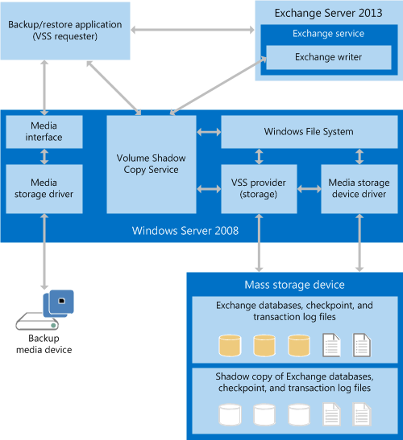

# Exchange 2013 のバックアップと復元アプリケーションの作成Build backup and restore applications for Exchange 2013

Exchange 2013 のバックアップと復元アプリケーションの、コンポーネントとアーキテクチャに関する情報と、バックアップと復元アプリケーションを作成するためのシステム要件に関する情報を確認できます。Find information about the components and architecture of backup and restore applications for Exchange 2013, and the system requirements for creating a backup and restore application.
  
**製品:** Exchange Server 2013**Applies to:** Exchange Server 2013 
  
Windows server 2008 以降のバージョンの Windows Server で[ボリュームシャドウコピーサービス (VSS)](https://msdn.microsoft.com/library/bb968832%28VS.85%29.aspx)を使用して、Exchange server 2013 データをバックアップおよび復元するアプリケーションを作成できます。You can use the [Volume Shadow Copy Service (VSS)](https://msdn.microsoft.com/library/bb968832%28VS.85%29.aspx) in versions of Windows Server starting with Windows Server 2008 to create applications that back up and restore Exchange Server 2013 data. VSS は、サードパーティ製のストレージ管理システム、ビジネス アプリケーション、ハードウェアの間でシャドウ コピーを作成して管理できるようにするインフラストラクチャを提供します。VSS provides an infrastructure that enables you to create and manage shadow copies across third-party storage management systems, business applications, and hardware. シャドウコピーを使用する VSS インフラストラクチャに基づいてソリューションを作成し、1つ以上の Exchange 2013 データベースをバックアップおよび復元できます。You can create solutions based on the VSS infrastructure that use shadow copies to back up and restore one or more Exchange 2013 databases. 
  
## バックアップと復元アプリケーションの前提条件Backup and restore application prerequisites

カスタムバックアップおよび復元アプリケーションと VSS が Exchange 2013 データベースをバックアップおよび復元するためには、環境に次のものが含まれている必要があります。In order for your custom backup and restore application and VSS to back up and restore Exchange 2013 databases, your environment must include the following:
  
- Windows Server 2008 以降の Windows Server のバージョンA version of Windows Server starting with Windows Server 2008 
    
- Exchange 2013Exchange 2013
    
さらに、バックアップと復元アプリケーションを作成している場合、開発環境における次の制限に注意してください。In addition, if you are creating a backup and restore application, you should be aware of the following restrictions on the development environment:
  
- VSS は、COM 相互運用アセンブリを経由して .NET Framework のマネージ コードからアクセスできる、アンマネージ COM API です。VSS is an unmanaged COM API that can be accessed from .NET Framework managed code via a COM Interop Assembly.
    
- Exchange 管理シェルは、.NET Framework のマネージ コードを使ってアクセスするマネージ アプリケーションです。The Exchange Management Shell is a managed application that is accessed via .NET Framework managed code.
    
- Exchange 2013 で提供される CHKSGFILES API は、ネイティブコードの64ビット DLL です。The CHKSGFILES API that is supplied with Exchange 2013 is a native-code 64-bit DLL. Exchange 2013 データベースでの Exchange 2007 32 ビット CHKSGFILES DLL の使用はサポートされていません。Use of the Exchange 2007 32-bit CHKSGFILES DLL with Exchange 2013 databases is not supported.
    
## バックアップと復元アプリケーションの概要Backup and restore application overview

VSS は次のコンポーネント間の通信を調整します。VSS coordinates communication between the following components: 
  
- VSS リクエスターはバックアップ アプリケーションですThe VSS requester, which is your backup application
    
- VSS ライターThe VSS writer
    
- VSS プロバイダーは、シャドウ コピーを作成するシステム、ソフトウェア、ハードウェア コンポーネントですThe VSS provider, which is the system, software, or hardware components that create the shadow copies
    
VSS を使用して Exchange 2013 データをバックアップするには、バックアップアプリケーションが Exchange 2013 対応の VSS リクエスターである必要があります。To use VSS to back up Exchange 2013 data, your backup application must be an Exchange 2013-aware VSS requester. Exchange 2013 には、Windows Server バックアッププログラム用に Microsoft Exchange ライターと呼ばれる VSS ライターが含まれています。ただし、Exchange ライターはボリューム全体のみをバックアップします。Exchange 2013 includes a VSS writer, called the Microsoft Exchange Writer, for the Windows Server backup program; however, the Exchange writer only backs up whole volumes. 個別の Exchange 2013 データベースはバックアップされません。It does not back up individual Exchange 2013 databases. さらに柔軟性が必要な場合、個々の Exchange データベースを操作できる Exchange 対応の VSS ライターを備えたサード パーティ製バックアップ アプリケーションを使うか、カスタムの VSS リクエスターを作成できます。If you need more flexibility, you can use a third-party backup application that has an Exchange-aware VSS writer that can work with individual Exchange databases, or you can create a custom VSS requester.
  
アプリケーションが VSS を呼び出してバックアップを開始する前に、バックアップする Exchange 2013 システムのストレージ構成に関する情報を取得する必要があります。Before your application calls VSS to initiate a backup, it must obtain information about the storage configuration for the Exchange 2013 system that it is backing up. その情報は Actice Directory ドメイン サービス (AD DS) に格納されています。That information is stored in Active Directory Domain Services (AD DS). バックアップ アプリケーションは、Exchange 管理シェル コマンドを使って Exchange のストレージ構成データを取得できます。Your backup application can get Exchange storage configuration data by using Exchange Management Shell commands. 詳細については、「 [Exchange Server PowerShell (Exchange Management Shell)](https://docs.microsoft.com/powershell/exchange/exchange-server/exchange-management-shell?view=exchange-ps)」を参照してください。For more information, see [Exchange Server PowerShell (Exchange Management Shell)](https://docs.microsoft.com/powershell/exchange/exchange-server/exchange-management-shell?view=exchange-ps). 
  
Exchange 2013 のバックアップアプリケーションは、VSS COM Api を呼び出して、Exchange データベースのフル、コピー、差分、および増分バックアップを作成します。VSS ライターと直接やり取りすることはありません。Exchange 2013 backup applications call the VSS COM APIs to create full, copy, differential and incremental backups of Exchange databases; they do not interact directly with the VSS writer. Exchange のデータベース可用性グループ (DAG) の機能により、初回の完全バックアップと以降の増分バックアップが DAG の異なるサーバーからのものでも、アプリケーションで完全整合バックアップを作成できます。The Database Availability Group (DAG) functionality in Exchange also enables your application to create a fully consistent backup, even if the initial full backup and later incremental backups come from different servers in the DAG. VSS が Exchange データのコピーを作成した後、バックアップ アプリケーションはデータを目的のメディアに格納します。After VSS creates the copy of the Exchange data, your backup application stores the data onto the intended media.
  
Exchange 2013 データベースを復元するには、復元アプリケーションはバックアップメディアからデータベースとログファイルを取得し、それらを Exchange サーバーのアクティブなディスクストレージに格納します。To restore an Exchange 2013 database, your restore application retrieves the database and log files from the backup media, and stores them on the active disk storage of an Exchange server. 個々のデータベースは特定の Exchange サーバーに関連付けられていません。Individual databases are not associated with a particular Exchange server. 
  
バックアップおよび復元アプリケーションは、exchange 2013 データベースに対して VSS によって実行される操作を正しく制御および管理するために、Exchange 2013 固有のパラメーターをいくつか指定する必要があります。Backup and restore applications must specify a number of Exchange 2013-specific parameters to correctly control and manage operations run by VSS against Exchange 2013 databases. たとえば、Exchange 2013 は最大で100の同時アクティブなデータベースをサポートしているため、バックアップアプリケーションはデータベースファイル、トランザクションログファイル、チェックポイントファイルデータベースコンポーネントを正確に指定して処理する必要があります。For example, because Exchange 2013 supports up to 100 simultaneously active databases, the backup application must correctly specify and process the database file, transaction log files, and checkpoint file database components.
  
最後の完全バックアップ以降に変更されたデータベースを再構築するには、リストア アプリケーションで別のバックアップからのデータベースとログ ファイルが必要です。To reconstruct a database that had changes since the last full back, your restore application requires database and log files from different backups. たとえば、毎週の完全バックアップと、毎日の 1 回以上の増分バックアップが必要になることがあります。For example, it might require a weekly full backup and one or more daily incremental backups. Dag を使用する Exchange 2013 システムでは、復元アプリケーションは、同じ DAG 内の異なるサーバー上の異なるデータベースコピーからのバックアップを使用してデータベースを再構築できます。In Exchange 2013 systems that use DAGs, your restore application can rebuild a database by using backups from different database copies on different servers in the same DAG. ただし、DAG データベースをバックアップから復元する方法として唯一サポートされているのは、同じデータを使ってデータベースのすべてのアクティブ コピーとパッシブ コピーを復元することです。However, the only supported way to restore a DAG database from backup is to restore all active and passive copies of the database by using the same data.
  
すべてのデータが設定されると、復元アプリケーションは、データベースとログ ファイルの整合性を確認するよう Exchange に通知します。データベースとログ ファイルが適切に復元されると、Exchange サーバーは、ログ ファイルを再生してデータベースを最新の状態にしてマウントできます。既にマウントされているデータベースのアクティブなコピーを持つサーバーにデータベースが復元された場合、データベースは回復データベースとして扱われます。別のサーバーにデータベースが復元された場合、データベースは個別にマウントされるか、そのレプリカを DAG に追加することができます。After all the data is in place, your restore application signals Exchange to check the integrity of the database and log files. If the database and log files have been restored correctly, the Exchange server can then replay the database log files to bring the database up to date and mount it. If the database has been recovered to a server that already has an active copy of the database mounted, the database is treated as a recover database. If the database has been recovered onto a different server, the database can either be independently mounted, or that replica can then be added into the DAG.
  
## バックアップと復元のシステム アーキテクチャBackup and restore system architecture

VSS は、サードパーティ (またはカスタム) プロバイダーを通して、Windows Server ファイル システムと大容量記憶装置ドライバーと通信します。VSS communicates with the Windows Server file system and with the mass storage device driver through a third-party (or custom) provider. ハードウェア プロバイダーは、シャドウ コピーが作成される場所を決定します。The hardware provider determines where the shadow copy will be created. VSS は、ハードウェア実装に関する詳しい情報がない場合、バックアップと復元アプリケーションがシャドウ コピーにアクセスできるように、ハードウェア固有のシャドウ コピーを抽象化します。VSS abstracts the hardware-specific shadow copy so that your backup and restore application can access the shadow copy without information about the hardware implementation details. バックアップと復元アプリケーションが Exchange 2013 と Windows Server と通信する方法を次の図に示します。The following figure shows how your backup and restore application interacts with Exchange 2013 and Windows Server.
  
**図 1バックアップと復元のシステム アーキテクチャ****Figure 1. Backup and restore system architecture**

  
バックアップと復元アプリケーションは VSS リクエスターとして機能します。The backup and restore application functions as the VSS requester. リクエスターは VSS と通信して、Exchange 2013 に関する情報を取得し、シャドウコピーの作成を開始し、バックアップのためにデータにアクセスできるようにします。The requester communicates with VSS to obtain information about Exchange 2013, to initiate the creation of shadow copies, and to gain access to the data for backup. 
  
Exchange ストアは、Exchange 2013 のコンポーネントであり、Windows Server ファイルシステムを使用して Exchange 2013 データベースにアクセスします。The Exchange store is a component of Exchange 2013 and accesses Exchange 2013 databases through the Windows Server file system. ファイル システム内で、各 Exchange サーバーは、最大 100 個のデータベースと、それに付属のデータベース (.edb) ファイル、トランザクション ログ ファイル、チェックポイント ファイルを同時にマウントできます。Within the file system, each Exchange server can simultaneously mount up to 100 databases with their accompanying database (.edb) files, transaction log files, and a checkpoint file.
  
VSS をサポートするために、exchange 2013 には exchange ストアに組み込まれた Exchange ライターが含まれています。To support VSS, Exchange 2013 includes an Exchange writer that is built in to the Exchange store. Exchange ライターは、バックアップの前にデータベースを停止およびマウント解除し、バックアップの完了後にデータベースを解放してマウントを解除するために、(リクエスターの代わりに動作する) Exchange ストアと連携します。The Exchange writer coordinates with the Exchange store (operating on behalf of the requester) to freeze and dismount the database before backing it up, and then to unfreeze and mount the database after the backup is complete. 復元中に、バックアップと復元アプリケーションは、exchange ストアと連携してデータベースのマウントを解除し、データベースファイルを置き換え、データベースをマウントして、トランザクションログを (必要に応じて) 再生するように Exchange ライターに指示します。During a restore, your backup and restore application instructs the Exchange writer to coordinate with the Exchange store to dismount the database, replace the database files, mount the database, and then replay the transaction logs (as needed).
  
またリクエスターは、復元時にも VSS と通信し、復元に対応するためにシステムの準備を整えてから、大容量記憶装置にデータを戻します。バックアップと復元アプリケーションも Windows Server と連携し、バックアップ記憶領域メディア (テープ アーカイブ、記憶域ネットワーク、その他のバックアップ メディア) からのデータの読み取りとデータの書き込みを行います。During a restore, the requester also communicates with VSS to prepare the system for the restore, and then to put the data back onto the mass storage device. Your backup and restore application is also responsible for working with Windows Server to read data from and write data to the backup storage media, whether a tape archive, a storage area network, or other backup medium.
  
復元されたデータベースは、通常のアクティブなデータベースとして、または Exchange 2013 の回復用データベースとしてマウントできます。The restored database can be mounted either as a regular, active database, or as the Exchange 2013 recovery database. 各 Exchange サーバー上の回復用データベースとして指定できるのは、1 つのマウントされたデータベースのみです。Only one mounted database can be designated as a recovery database on each Exchange server.
  
Exchange 2013、VSS、およびバックアップと復元アプリケーション間でバックアップと復元の操作を正常に完了するために必要な情報は、Exchange ライターのメタデータの一部として転送されます。Information required to successfully complete backup and restore operations among Exchange 2013, VSS, and your backup and restore application is transferred as part of the Exchange writer metadata.
  
## このセクションの内容In this section

- [Exchange 2013 のバックアップ操作の種類Types of backup operations for Exchange 2013](types-of-backup-operations-for-exchange-2013.md)
    
- [Exchange 2013 のデータベースを復元するRestoring Exchange 2013 databases](restoring-exchange-2013-databases.md)
    
- [Exchange 2013 で CHKSGFILES API を使用してバックアップの整合性を検証するValidate backup integrity by using the CHKSGFILES API in Exchange 2013](how-to-validate-backup-integrity-by-using-the-chksgfiles-api-in-exchange.md)
    
- [Exchange 2013 で Eseutil ツールを使用してバックアップの整合性を検証するValidate backup integrity by using the Eseutil tool in Exchange 2013](how-to-validate-backup-integrity-by-using-the-eseutil-tool-in-exchange-2013.md)
    
## 関連項目See also

- [Exchange のバックアップと復元Backup and restore for Exchange](backup-and-restore-for-exchange-2013.md) 
- [CChkSGFiles クラスの参照CChkSGFiles class reference](cchksgfiles-class-reference.md) 
- [ボリューム シャドウ コピー サービスVolume Shadow Copy Service](https://msdn.microsoft.com/library/bb968832%28VS.85%29.aspx) 
- [Windows PowerShellWindows PowerShell](https://msdn.microsoft.com/library/dd835506%28v=vs.85%29.aspx)
    

