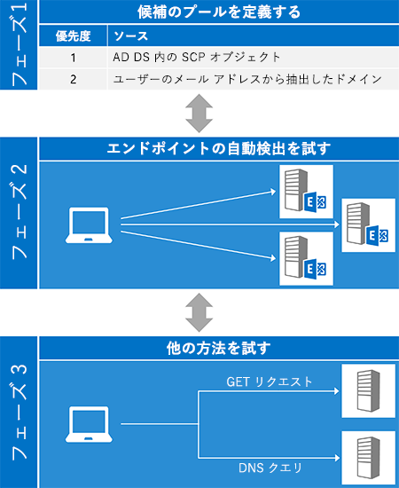
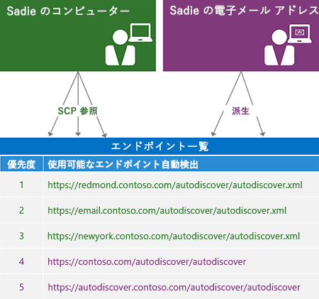
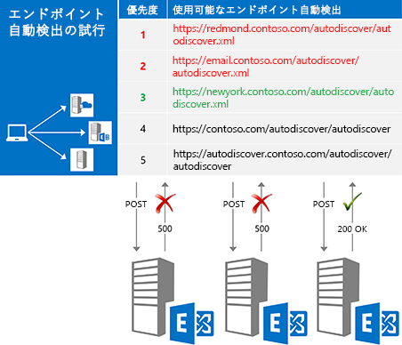
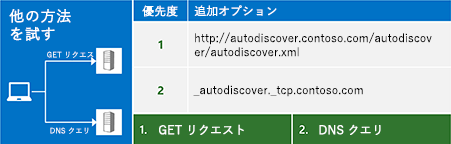

# Exchange の自動検出Autodiscover for Exchange

Exchange 自動検出サービスについて説明します。Learn about the Autodiscover service in Exchange.
  
Exchange 自動検出サービスは、最小限のユーザー入力でカスタムのクライアント アプリケーションが構成されるようにするための簡単な方法を提供します。ほとんどのユーザーは、自分の電子メール アドレスとパスワードを知っています。それら 2 つの情報の断片によって、稼働に必要なその他の詳細のすべてを取得できます。Exchange Web サービス (EWS) クライアントの場合、通常、自動検出は EWS エンドポイント URL を見つけるために使用されますが、その他のプロトコルを使用するクライアントを構成する情報も自動検出によって得られます。自動検出は、ファイアウォールの内側または外側のクライアント アプリケーションに有効であり、リソース フォレストおよび複数フォレストのシナリオで動作します。The Exchange Autodiscover service provides an easy way for your client application to configure itself with minimal user input. Most users know their email address and password, and with those two pieces of information, you can retrieve all the other details you need to get up and running. For Exchange Web Services (EWS) clients, Autodiscover is typically used to find the EWS endpoint URL, but Autodiscover can also provide information to configure clients that use other protocols. Autodiscover works for client applications that are inside or outside firewalls and will work in resource forest and multiple forest scenarios.
  
## 自動検出プロセスの概要Overview of the Autodiscover process

自動検出プロセスには、基本的に 3 つのフェーズがあります。フェーズ 1 では潜在的な自動検出サーバーの一覧を生成して、フェーズ 2 では成功の応答 (可能な場合) が得られるまで一覧の各サーバーを試します。いずれの候補もうまくいかなかった場合は、フェーズ 3 に移行します。このフェーズは、自動検出エンドポイントを見つけるための「最後の努力」を表します。The Autodiscover process essentially has three phases. In phase one, you generate a list of potential Autodiscover servers, and in phase two, you try each server in your list until you (hopefully) get a successful response. If none of your candidates worked out, you move on to phase three, which represents a "last ditch" attempt to find an Autodiscover endpoint.
  
EWS マネージ API の [ExchangeService.AutodiscoverUrl](https://msdn.microsoft.com/library/microsoft.exchange.webservices.data.exchangeservice.autodiscoverurl%28v=exchg.80%29.aspx) メソッドにより、このプロセスの 3 つのフェーズはすべて実装されます。そのため、EWS マネージ API を使用する場合は、独自に自動検出を実装することについて心配する必要はありません。The [ExchangeService.AutodiscoverUrl](https://msdn.microsoft.com/library/microsoft.exchange.webservices.data.exchangeservice.autodiscoverurl%28v=exchg.80%29.aspx) method in the EWS Managed API implements all three phases of this process for you, so if you are using the EWS Managed API, you don't need to worry about implementing Autodiscover yourself. 次の図は、自動検出プロセスの 3 つのフェーズを示しています。The following figure shows the three phases of the Autodiscover process. 
  
**図 1. 自動検出プロセスの 3 つのフェーズ****Figure 1. Three phases of the Autodiscover process**

  
### フェーズ 1: 候補プールを定義するPhase 1: Defining the candidate pool

自動検出を使用するには、まず、ユーザーに正しい自動検出サーバーの場所を示す必要があります。好都合なことに、自動検出の定義により、探す場所の数は限られています。複数の候補が見つかった場合、自動検出では[一覧の生成して優先度を設定する方法](how-to-generate-a-list-of-autodiscover-endpoints.md)も定義されています。Before you can use Autodiscover, you have to locate the right Autodiscover server for your user. Luckily, Autodiscover defines a limited number of places for you to look. In the case where multiple candidates are found, Autodiscover also defines [a way to generate and prioritize the list](how-to-generate-a-list-of-autodiscover-endpoints.md).
  
**表 1. 自動検出エンドポイント候補のソース****Table 1: Autodiscover endpoint candidate sources**

|**探す場所****Place to look**|**見つかるもの****What you'll find**|
|:-----|:-----|
|Active Directory Domain Services (AD DS)Active Directory Domain Services (AD DS)    |ドメインに参加しているクライアントの場合は、最初に探す場所になります。Exchange は AD DS にサービス接続ポイント (SCP) オブジェクトを公開します。これにより、自動検出の要求は Active Directory サイトに基づいてサーバーにルーティングできるようになります。[SCP 検索](how-to-find-autodiscover-endpoints-by-using-scp-lookup-in-exchange.md)の結果は、候補一覧の最上位にする必要があります。For domain-joined clients, this is the first place to look. Exchange publishes service connection point (SCP) objects in AD DS, which allows Autodiscover requests to be routed to servers based on Active Directory sites. The results of an [SCP lookup](how-to-find-autodiscover-endpoints-by-using-scp-lookup-in-exchange.md) should be at the top of your candidate list.    **注**: SCP 検索は、ドメインに参加していないクライアントや Active Directory サーバーにアクセスできないクライアントには使用できません。**NOTE**: SCP lookup isn't available for clients that are not joined to a domain or that do not have access to Active Directory servers. この場合は、SCP 検索を省略する必要があります。In this case, you should skip SCP lookup.  |
|ユーザーの電子メール アドレス ドメインThe user's email address domain    | 自動検出では、標準エンドポイント URL の形式が 2 つ定義されています。これは、ユーザーの電子メール アドレスのドメイン部分から派生します。Autodiscover defines two standard endpoint URL forms that are derived from the domain portion of the user's email address:   `"https://" + domain + "/autodiscover/autodiscover" +  *fileExtension*`   `"https://autodiscover." + domain + "/autodiscover/autodiscover" +  *fileExtension*`    *fileExtension* の値は、自動検出のアクセス方式に [SOAP](https://msdn.microsoft.com/library/61c21ea9-7fea-4f56-8ada-bf80e1e6b074%28Office.15%29.aspx) と [POX](https://msdn.microsoft.com/library/877152f0-f4b1-4f63-b2ce-924f4bdf2d20%28Office.15%29.aspx) のどちらを使用しているかによって決まります。The value of  *fileExtension*  depends on which Autodiscover access method you are using, [SOAP](https://msdn.microsoft.com/library/61c21ea9-7fea-4f56-8ada-bf80e1e6b074%28Office.15%29.aspx) or [POX](https://msdn.microsoft.com/library/877152f0-f4b1-4f63-b2ce-924f4bdf2d20%28Office.15%29.aspx). SOAP サービスではファイル拡張子 ".svc" が使用され、POX では ".xml" が使用されます。The SOAP service uses a ".svc" file extension; POX uses ".xml".    |
   
次の図は、自動検出エンドポイント一覧の生成方法を示しています。The following figure shows how to generate an Autodiscover endpoint list.
  
**図 2. 自動検出エンドポイント一覧の生成プロセス****Figure 2. Process for generating an Autodiscover endpoint list**

  
### フェーズ 2: 各候補を試してみるPhase 2: Trying each candidate

潜在的な候補の順序付き一覧を生成したら、[URL に要求を送信](how-to-get-user-settings-from-exchange-by-using-autodiscover.md)して結果を検証することで、一覧の各候補を試してみます。図 3 を参照してください。成功の応答が得られた時点で完了です。After you generate an ordered list of potential candidates, the next step is try each one in the list by [sending a request to the URL](how-to-get-user-settings-from-exchange-by-using-autodiscover.md) and validating the results, as shown in Figure 3. When you get a successful response, you're done! 
  
**図 3. 各エンドポイント候補を順に試す****Figure 3. Trying each endpoint candidate in order**

  
候補に要求を送信する前に、その候補が信頼可能であることを確認します。ユーザーの資格情報を送信することを忘れてはいけません。その情報の共有は信頼できるサーバーに限定することが重要です。少なくとも、次の事項を確認する必要があります。Before you send a request to a candidate, make sure it is trustworthy. Remember that you're sending the user's credentials, so it's important to make sure that you're only sharing them with a server you can trust. At a minimum, you should verify:
  
- エンドポイントが HTTPS エンドポイントであること。クライアント アプリケーションは、非 SSL エンドポイントに対して認証やデータの送信を行ってはいけません。That the endpoint is an HTTPS endpoint. Client applications should not authenticate or send data to a non-SSL endpoint.
    
- サーバーが提示した SSL 証明書が信頼された機関からのものであり有効であること。That the SSL certificate presented by the server is valid and from a trusted authority.
    
> [!NOTE]
> これらは、基本的なセキュリティの推奨事項にすぎません。認証を扱うときには、コードが組織のセキュリティ要件を満たしていることを常に確認します。These are just basic security suggestions. Whenever you are working with authentication, make sure that your code meets the security requirements of your organization. 
  
送信する要求の種類は、自動検出サービスにアクセスする方法によって決まります。The type of request you send depends on how you are accessing the Autodiscover service.
  
**表 2. 自動検出の要求の種類****Table 2. Types of Autodiscover requests**

|**使用するもの****If you are using…**|**要求を送信する手段****Send a request by using…**|
|:-----|:-----|
|EWS マネージ APIThe EWS Managed API    |[GetUserSettings](https://msdn.microsoft.com/library/microsoft.exchange.webservices.autodiscover.autodiscoverservice.getusersettings%28v=exchg.80%29.aspx) メソッド。The [GetUserSettings](https://msdn.microsoft.com/library/microsoft.exchange.webservices.autodiscover.autodiscoverservice.getusersettings%28v=exchg.80%29.aspx) method.    |
|SOAP 自動検出サービスThe SOAP Autodiscover service    |[GetUserSettings](https://msdn.microsoft.com/library/758d965c-ef63-4de4-9120-e293abf14ff8%28Office.15%29.aspx) 操作。The [GetUserSettings](https://msdn.microsoft.com/library/758d965c-ef63-4de4-9120-e293abf14ff8%28Office.15%29.aspx) operation.    |
|POX 自動検出サービスThe POX Autodiscover service    |[自動検出要求本文](https://msdn.microsoft.com/library/75671b1d-f35b-497b-8d8c-706f3f2535fd%28Office.15%29.aspx)が含まれる HTTP POST。An HTTP POST with an [Autodiscover request body](https://msdn.microsoft.com/library/75671b1d-f35b-497b-8d8c-706f3f2535fd%28Office.15%29.aspx).    |
   
### フェーズ 3: その他の方法を試すPhase 3: Trying other alternatives

一覧に含まれるすべてのエンドポイントを試してみたときに、それらすべてがエラーを返すことがあります。あきらめる前に、いくつか別のものを試してみることができます。認証されていない GET 要求を送信したり、SRV レコードについて DNS を照会したりできます。これらの試行でも成果が得られない場合は、自動検出サービスに接続できません。In some cases you might try all the endpoints in your list, only to find that all of them return an error. Before throwing in the towel, you can try a couple more things: you can send an unauthenticated GET request, or query DNS for an SRV record. If these attempts also don't yield results, you cannot contact the Autodiscover service.
  
**図 4. その他の方法を試す****Figure 4. Trying other alternatives**

  
#### 認証されていない GET 要求の送信Sending an unauthenticated GET request

最初に試してみることは、ユーザーの電子メール アドレスから派生したエンドポイントに向けて、認証されていない GET 要求を送信することです。The first thing to try is to send an unauthenticated GET request to an endpoint derived from the user's email address. そのエンドポイントは、"http://autodiscover"The format of that endpoint is "http://autodiscover." + domain + "/autodiscover/autodiscover.xml" の形式です。+ domain + "/autodiscover/autodiscover.xml". これは SSL エンドポイントでない点に注意してください。Note that this is NOT an SSL endpoint. サーバーが 302 リダイレクト応答を返す場合は、その応答の Location ヘッダーに含まれるエンドポイント URL に向けて[自動検出要求の再送信](handling-autodiscover-error-messages.md#bk_ResendRequest)を試してみます。If the server returns a 302 redirect response, you can then attempt to [resend the Autodiscover request](handling-autodiscover-error-messages.md#bk_ResendRequest) to the endpoint URL in the Location header of the response. 
  
#### SRV レコードについての DNS の照会Querying DNS for an SRV record

認証されていない GET 要求が失敗した場合に、最後に試してみることは、自動検出サービスに関する SRV レコードに対する DNS クエリです。このレコードは、"_autodiscover._tcp." + ドメインの形式になります。このクエリは複数のレコードを返すことがありますが、最高の優先度と重みが付けられた SSL エンドポイントをポイントするレコードのみを使用します。If the unauthenticated GET request doesn't work out, the last thing to try is a DNS query for SRV records for the Autodiscover service. The record will take the form "_autodiscover._tcp." + domain. This query might return multiple records, but you should only use records that point to an SSL endpoint and that have the highest priority and weight.
  
## 自動検出を使用する場合のオプションOptions for using Autodiscover

自動検出には、SOAP Web サービスまたは POX Web サービスを使用してアクセスできます。どのメソッドを使用するかは、要件と環境に応じて決まります。ただし、可能であれば SOAP Web サービスの使用をお勧めします。EWS マネージ API も選択肢の 1 つになります。これにより、SOAP と POX の両方の自動検出サービスのクライアント部分が実装されます。You can access Autodiscover either by using the SOAP or the POX web service. The method you use depends on your requirements and environment; however, we recommend using the SOAP web service, if possible. The EWS Managed API is also an option. It implements the client portion of both the SOAP and POX Autodiscover services.
  
**表 3: 自動検出にアクセスする場合のオプション****Table 3: Options for accessing Autodiscover**

|**オプション****Option**|**利点****Pros**|**欠点****Cons**|
|:-----|:-----|:-----|
|[EWS マネージ APIEWS Managed API](get-started-with-ews-managed-api-client-applications.md)   | 自動検出プロセスが実装される。Implements the Autodiscover process for you.  SOAP と POX の両方の自動検出サービスを使用する。Uses both the SOAP and POX Autodiscover services.  Exchange Online、Office 365 の一部としての Exchange Online、または Exchange 2007 SP1 以降の Exchange の各バージョンで動作する。Works with Exchange Online, Exchange Online as part of Office 365, or a version of Exchange starting with Exchange 2007 SP1.  使いやすい。Easy to use.    | [Microsoft.Exchange.WebServices.Autodiscover.UserSettingName](https://msdn.microsoft.com/library/microsoft.exchange.webservices.autodiscover.usersettingname%28v=EXCHG.80%29.aspx) 列挙体で使用できるユーザー設定に制限される。Limited to the user settings that are available in the [Microsoft.Exchange.WebServices.Autodiscover.UserSettingName](https://msdn.microsoft.com/library/microsoft.exchange.webservices.autodiscover.usersettingname%28v=EXCHG.80%29.aspx) enumeration.  .NET Framework アプリケーションにのみ使用できる。Only available for .NET Framework applications.    |
|[SOAP 自動検出SOAP Autodiscover](https://msdn.microsoft.com/library/61c21ea9-7fea-4f56-8ada-bf80e1e6b074%28Office.15%29.aspx)   | プラットフォームに依存しない。Platform independent.  監視のある設定のみを要求できる。Allows you to request just the settings you are interested in.    | Exchange 2007 では使用できない。Not available in Exchange 2007.    |
|[POX 自動検出POX Autodiscover](https://msdn.microsoft.com/library/877152f0-f4b1-4f63-b2ce-924f4bdf2d20%28Office.15%29.aspx)   | プラットフォームに依存しない。Platform independent.  Exchange Online および Exchange 2007 SP1 以降のすべてのバージョンでサポートされる。Supported in Exchange Online and all versions of Exchange starting with Exchange 2007 SP1.    | 特定の設定を要求できない。Does not allow you to request specific settings.    |
   
## このセクションの内容In this section

- [Exchange の SCP 参照を使用して自動検出エンドポイントを見つけるFind Autodiscover endpoints by using SCP lookup in Exchange](how-to-find-autodiscover-endpoints-by-using-scp-lookup-in-exchange.md)
    
- [自動検出エンドポイントの一覧を生成するGenerate a list of Autodiscover endpoints](how-to-generate-a-list-of-autodiscover-endpoints.md)
    
- [自動検出を使用して接続ポイントを検索するUse Autodiscover to find connection points](how-to-use-autodiscover-to-find-connection-points.md)
    
- [自動検出を使用して Exchange からユーザー設定を取得するGet user settings from Exchange by using Autodiscover](how-to-get-user-settings-from-exchange-by-using-autodiscover.md)
    
- [Exchange サーバーからドメイン設定を取得するGet domain settings from an Exchange server](how-to-get-domain-settings-from-an-exchange-server.md)
    
- [自動検出を使用して構成情報を更新するRefresh configuration information by using Autodiscover](how-to-refresh-configuration-information-by-using-autodiscover.md)
    
- [自動検出のエラー メッセージを処理するHandling Autodiscover error messages](handling-autodiscover-error-messages.md)
    
- [Exchange の自動検出を使用するときにパフォーマンスを向上させるImproving performance when using Autodiscover for Exchange](improving-performance-when-using-autodiscover-for-exchange.md)
    
## 関連項目See also

- [Exchange で Web サービスの使用を開始するStart using web services in Exchange](start-using-web-services-in-exchange.md)    
- [Exchange 2013: 自動検出によるユーザー設定の取得Exchange 2013: Get user settings with Autodiscover](https://code.msdn.microsoft.com/Exchange-2013-Get-user-7e22c86e)
- [Autodiscover Checker サンプルAutodiscover Checker sample](https://code.msdn.microsoft.com/exchange/Autodiscover-Checker-e1ebca42)  
- [Exchange の Web サービス クライアントを開発するDevelop web service clients for Exchange](develop-web-service-clients-for-exchange.md)
    

