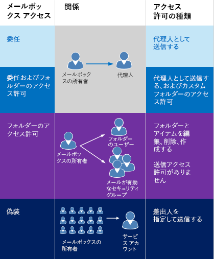
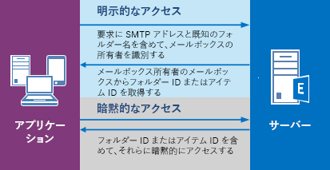

# <a name="delegate-access-and-ews-in-exchange"></a>Exchange での代理人アクセスと EWS

Exchange の EWS マネージ API と EWS を使用してユーザーのメールボックスに代理人アクセスできるようにする方法を説明します。
  
ユーザーが他のユーザーのメールボックスにアクセスできるようにするには、次の 3 つの方法のいずれかを使用できます。  
  
- 代理人を追加し、各代理人にアクセス許可を指定します。
    
- フォルダーのアクセス許可を直接変更します。
    
- 偽装を使用します。
    
委任、およびフォルダーのアクセス許可は、各メールボックスに個別にアクセス許可を追加する必要があるため、少数のユーザーにのみアクセス許可を付与する場合に最適です。偽装は、1 つのサービス アカウントによるデータベース内のすべてのメールボックスへのアクセスを簡単に許可できるため、多数のメールボックスを処理するときに最適です。図 1 は、各種のアクセスの相違点を示しています。
  
**図 1. 他のユーザーのメールボックスにアクセスする方法**


  
メールを送信するか、会議をスケジュールする際に、代理人得ることができます「代理送信」のアクセス許可では、電子メールまたは代理人から送信された会議出席依頼の受信者が表示されます「*を委任する**メールボックス所有者*の代理」としているため、receive Outlook の電子メールや会議出席依頼します。 「代理送信」のテキストを含むクライアント実装の詳細では、"from"と「送信者」を使用して作成することができます値です。 「から」値は、メールボックスの所有者を示すし、「送信者」の値は、メールを送信する代理人を示します。 ユーザーを偽装して、サービス アカウントに電子メールを送信、メールボックスの所有者の会議をスケジュールする場合、メッセージ「として送信されます」メールボックスの所有者。 サービス アカウントによって送信されたメールであることを受信者が確認する手段はありません。 フォルダーのアクセス許可を付与し、代理アクセス権がないユーザーは、「送信者」または「代理送信」メールボックスの所有者のことではできません。 メールボックスのフォルダーにアクセス権を持つ、フォルダーにアイテムを作成できる場合がありますが、アイテムを送信することはできません。 
  
まだそのフォルダーのアクセス許可を直接変更するのには適切ですか。 一般的とする、フォルダーへのユーザー アクセスを提供する必要しますが、 [DelegateFolderPermissionLevel](http://msdn.microsoft.com/en-us/library/microsoft.exchange.webservices.data.delegatefolderpermissionlevel%28v=exchg.80%29.aspx) EWS のマネージ API の列挙値、アクセス許可の要件は、このマップではないと、ユーザー、「代理送信」アクセス許可を付与したくない、または[PermissionLevel](http://msdn.microsoft.com/library/87978600-3523-451e-a725-ef092c543e2a%28Office.15%29.aspx)EWS の要素の値、または 1 つのカスタム フォルダーへのユーザー アクセスを提供します。 
  
のみ、目標を達成するのにはフォルダーのアクセス許可を変更する必要がある場合、代理人を追加する必要はありません (つまり、「代理送信」アクセス許可が必要なければ、) [Exchange EWS を使用して別のユーザーのフォルダーのアクセス許可の設定](how-to-set-folder-permissions-for-another-user-by-using-ews-in-exchange.md)を参照してください。 
  
使用することもできます[Outlook](http://office.microsoft.com/en-us/outlook-help/allow-someone-else-to-manage-your-mail-and-calendar-HA102749417.aspx)または[Exchange Server PowerShell (Exchange 管理シェル)](https://docs.microsoft.com/en-us/powershell/exchange/exchange-server/exchange-management-shell?view=exchange-ps)の代理アクセス権を設定するのには注意してください。 
  
## <a name="how-does-delegate-access-work"></a>代理人アクセスはどのように機能するか

代理アクセスでは、一部またはすべてのメールボックス所有者のフォルダーにアクセスし、メールボックス所有者の代理として行動することができます。 メールボックスの所有者にはユーザー、または会議室のように、リソースを使用できます。 などの受付係には、予約要求を処理するために会議室の予定表フォルダーへの代理アクセス権を付与できます。 EWS のマネージ API または EWS を使用するには、代理人を追加するには、メールボックスの所有者または管理者を有効にするのには、代理人がアクセス、およびそのフォルダーに対するアクセス許可を指定し、どのようなフォルダーを指定します。 デリゲートには、次のフォルダーへのアクセス権を与えることができます。 
  
- 予定表
    
- タスク
    
- 受信トレイ
    
- 連絡先
    
- メモ
    
- ジャーナル
    
ユーザーに 1 つ以上のこれらのフォルダーに代理人アクセスが設定されているとき、ことができますを作成、取得、更新、削除、コピー、およびそのフォルダーとフォルダーの設定の[アクセス許可](#bk_delegateperms)によって、すべての子フォルダー内のアイテムを検索します。 アプリケーションがこれらのアクションを実行する方法は、[明示的](#bk_explicit)または[暗黙的な](#bk_implicit)アクセスが必要かどうかによって異なります。 
  
## <a name="delegate-permissions"></a>代理アクセス権
<a name="bk_delegateperms"> </a>

管理者またはメールボックスの所有者のメールボックスに代理人を追加するときは、1 つまたは複数のフォルダーのアクセス許可レベルを設定、こともできます。 フォルダーのアクセス許可レベルが設定されていない場合、アクセス許可の値の既定値は、[なし] にします。 複数のユーザーが、フォルダーに同じアクセス許可レベルを持つことができ、ユーザーが別のフォルダーに異なるアクセス許可レベルを持つことができます。 EWS のマネージ API を使用する場合フォルダーに代理アクセス権を設定するのには、各フォルダーの[DelegateFolderPermissionLevel](http://msdn.microsoft.com/en-us/library/microsoft.exchange.webservices.data.delegatefolderpermissionlevel%28v=exchg.80%29.aspx)の列挙値のいずれかを含む、 [DelegateUser.Permissions](http://msdn.microsoft.com/en-us/library/microsoft.exchange.webservices.data.delegateuser.permissions%28v=exchg.80%29.aspx)プロパティを使用します。 EWS を使用する場合、アクセス許可レベルを定義するのには、 [DelegatePermissions](http://msdn.microsoft.com/library/292badc7-bab3-4368-9d7c-9a8b7edb279b%28Office.15%29.aspx) 、代理人アクセス許可を設定する要素と要素の[PermissionLevel](http://msdn.microsoft.com/library/87978600-3523-451e-a725-ef092c543e2a%28Office.15%29.aspx)を使用します。 
  
**表 2 になります。デリゲートのアクセス許可のレベル**

|**アクセス許可レベル**|**説明**|
|:-----|:-----|
|なし  <br/> |これはすべてのフォルダーの既定値です。  <br/> |
|Author  <br/> |代理人は、読み取り、アイテムの作成し変更ししを作成するアイテムを削除できます。 などの代理人はメールボックスの所有者の仕事または予定表のフォルダーに直接仕事の依頼と会議出席依頼を作成し、メールボックス所有者の代わりにアイテムを送信できます。  <br/> |
|Editor  <br/> |代理人は、Author にできるすべてのことに加え、メールボックスの所有者が作成したアイテムの変更や削除もできます。  <br/> |
|Reviewer  <br/> |代理人はアイテムを読むことができます。たとえば、Reviewer のアクセス許可を持つ代理人は、別のユーザーの受信トレイのメッセージを読むことができます。  <br/> |
|Custom  <br/> |メールボックスの所有者が代理人にアクセス許可のカスタム セットを与えている場合です。  <br/> |
   
EWS マネージ API の[DelgateUser.ViewPrivateItems](http://msdn.microsoft.com/en-us/library/microsoft.exchange.webservices.data.delegateuser.viewprivateitems%28v=exchg.80%29.aspx)プロパティと[ViewPrivateItems](http://msdn.microsoft.com/library/80b949ac-440c-4a01-b428-ebafb5b1b802%28Office.15%29.aspx)の EWS の要素は、すべてのメールボックス所有者のフォルダーすべてのメール、連絡先、予定表、タスク、メモ、および仕訳帳のフォルダーに影響を与えるグローバル設定です。 フォルダーの 1 つだけの非公開アイテムへのアクセスを許可することはできません。 
  
## <a name="explicit-access"></a>明示的なアクセス
<a name="bk_explicit"> </a>

簡単に言えば、明示的なアクセスとは、代理人がメールボックス所有者のフォルダーまたはアイテムに対してアクションを実行するための通路のようなものです。代理人がサーバーへの要求にメールボックスの所有者のフォルダーの既知のフォルダー名とメールボックスの所有者の SMTP アドレスを含めると、代理人に明示的なアクセスが与えられます。このアクセスは明示的です。なぜなら、代理人の要求は、メソッドまたは操作のコンテキストがメールボックス所有者のメールボックスであって、代理人のメールボックスではないことを、明示的に示しているためです。
  
明示的なアクセス権は、すべてのメソッドや、フォルダーまたは前方に移動する項目に対して実行する操作のコンテキストを定義します。 明示的なアクセス権を一意に設定されている場合に返されるすべてのアイテムおよびフォルダーの Id (ではなく、人間が読める形式) に、メールボックスの所有者に属するものとして識別します。 この方法では、アプリケーションが繰り返しは、メールボックス所有者の SMTP アドレスを指定する必要がないです。コンテキストは、識別子で非表示にします。 アイテムまたはフォルダーを特定すると、デリゲートは実際に項目を変更するのには[暗黙のアクセス](#bk_implicit)を使用します。 明示的および暗黙的なアクセスを取得するプロセスを次の図に示します。 
  
**図 2 になります。アイテムまたはフォルダーへの明示的および暗黙的なアクセスを要求します。**


  
様々なシナリオで明示的なアクセスを設定できます。基本的に、フォルダー ID をメソッドまたは操作に入れて送信する場合は常に、明示的なアクセスを設定できます。これには、フォルダーの検索、予定の検索、アイテムの取得、会話の検索などがあります。
  
### <a name="explicit-access-and-the-ews-managed-api"></a>明示的なアクセスと EWS マネージ API
<a name="bk_explicitewsma"> </a>

フォルダーを識別するのには[フォルダー Id](http://msdn.microsoft.com/en-us/library/microsoft.exchange.webservices.data.folderid%28v=exchg.80%29.aspx)の入力パラメーターを受け取るオーバー ロードされたメソッドの次のいずれかを使用して、明示的なデリゲートのアクセスを開始できます。 
  
- [Folder.Bind](http://msdn.microsoft.com/en-us/library/microsoft.exchange.webservices.data.folder.bind%28v=exchg.80%29.aspx)
    
- [ExchangeService.FindItems](http://msdn.microsoft.com/en-us/library/microsoft.exchange.webservices.data.exchangeservice.finditems%28v=exchg.80%29.aspx)
    
- [ExchangeService.FindAppointments](http://msdn.microsoft.com/en-us/library/microsoft.exchange.webservices.data.exchangeservice.findappointments%28v=exchg.80%29.aspx)
    
- [ExchangeService.FindFolders](http://msdn.microsoft.com/en-us/library/microsoft.exchange.webservices.data.exchangeservice.findfolders%28v=exchg.80%29.aspx)
    
- その他多数。
    
これらのメソッドのそれぞれに**フォルダー Id**パラメーターを使用するには次のようにメールボックス所有者のターゲット フォルダーを識別します。 
  
```cs
new FolderId(WellKnownFolderName.Calendar, "primary@contoso.com");
```

たとえば、予定表フォルダーにバインドするにこの**バインド**のメソッドでは、**フォルダー Id**を指定、よく知られているフォルダー名、およびメールボックス所有者の SMTP アドレス。 
  
```cs
CalendarFolder calendar = CalendarFolder.Bind(service, new FolderId(WellKnownFolderName.Calendar, "primary@contoso.com"), new PropertySet());
```

よく知られているフォルダー名と SMTP アドレスを指定すると、代理人がメールボックス所有者の予定表フォルダーにバインドできる、フォルダーに明示的なアクセス権をましょうします。 [暗黙のアクセス](#bk_implicit)フォルダー内のアイテムのすべての後続の要求は、Id と Id のフォルダーにアイテムに返されるコンテキストに依存しています。 基本的には、識別子には、黙示的な代理人アクセスの呼び出しのコンテキストが含まれています。 または、特定の条件に一致する項目の項目 ID を取得するには、次のように使用します。 
  
```cs
FindItemsResults<Item> results = service.FindItems(new FolderId(WellKnownFolderName.Calendar, "primary@contoso.com"), filter, view);
```

この場合、アイテム ID が返された後、このアイテム ID を使用すれば、代理人は暗黙的なアクセスでアイテムを変更できます。
  
項目 ID または既存の明示的なアクセス権を使用してアクセスしていないフォルダー ID が必要になるまでに明示的なアクセス権をもう一度開始する必要はありません。 
  
### <a name="explicit-access-and-ews"></a>明示的なアクセスと EWS
<a name="bk_explicitewsma"> </a>

[GetFolder](http://msdn.microsoft.com/library/355bcf93-dc71-4493-b177-622afac5fdb9%28Office.15%29.aspx)、 [FindItem](http://msdn.microsoft.com/library/ebad6aae-16e7-44de-ae63-a95b24539729%28Office.15%29.aspx)、 [FindFolder](http://msdn.microsoft.com/library/7a9855aa-06cc-45ba-ad2a-645c15b7d031%28Office.15%29.aspx)操作を使用して明示的なアクセスを行うことができます。 これらの操作は、対象となるフォルダーを識別する[DistinguishedFolderId](http://msdn.microsoft.com/library/50018162-2941-4227-8a5b-d6b4686bb32f%28Office.15%29.aspx)要素を使用するオプションを提供します。 **DistinguishedFolderId**要素には、[メールボックス](http://msdn.microsoft.com/library/befc70fd-51cb-4258-884c-80c9050f0e82%28Office.15%29.aspx)の要素、1 つの省略可能な子要素があります。 **メールボックス**の要素、 **DistinguishedFolderId**の要素の子として使用する場合は、代理人アクセスのメールボックスを指定します。 呼び出し元のユーザーにメールボックス所有者のフォルダーにアクセスする権限がある場合、応答にはアイテムまたはそのメールボックス内のフォルダーの識別子のコレクションが含まれます。 暗黙の代理人アクセスの応答で返されるアイテムおよびフォルダーの識別子を使用できます。 
  
## <a name="implicit-access"></a>暗黙的なアクセス
<a name="bk_implicit"> </a>

代理人がメールボックスの所有者のメールボックス内のアイテムまたはフォルダーの ID を取得したら、アイテムの更新、削除、またはコピーを行うとき、後は暗黙的なアクセスが使用されます。代理人が要求でそのアイテム ID またはフォルダー ID を使用すると、メールボックス所有者のメールボックス内のアイテムに対して変更が加えられます。代理人はメールボックス所有者の SMTP アドレスを含める必要はありません。  
  
など、その代理人にメールボックス所有者のフォルダーのいずれかの ID が設定されているとき、代理人は ID を使用して、フォルダー、メールボックス所有者のメールボックスを明示的に識別することがなくそのフォルダーに対して**FindItem**操作を実行できます。 その時点では、デリゲートは、応答で返される Id を使用して、メールボックス所有者のフォルダーにアクションを実行できます。 
  
### <a name="implicit-access-and-the-ews-managed-api"></a>暗黙的なアクセスと EWS マネージ API

[FindItems](http://msdn.microsoft.com/en-us/library/microsoft.exchange.webservices.data.exchangeservice.finditems%28v=exchg.80%29.aspx)メソッドによって、アイテムの ID を取得した場合は、項目にバインドするのにはそれ以降の[Item.Bind](http://msdn.microsoft.com/en-us/library/microsoft.exchange.webservices.data.item.bind%28v=exchg.80%29.aspx)メソッドの呼び出しでそのアイテムの ID が使用できます。 [Item.Update](http://msdn.microsoft.com/en-us/library/office/microsoft.exchange.webservices.data.item.update%28v=exchg.80%29.aspx)、 [Item.Delete](http://msdn.microsoft.com/en-us/library/office/microsoft.exchange.webservices.data.item.delete%28v=exchg.80%29.aspx)、または[Item.Copy](http://msdn.microsoft.com/en-us/library/office/microsoft.exchange.webservices.data.item.copy%28v=exchg.80%29.aspx)メソッドを呼び出すことができますし、- または項目 ID を必要とするメソッドの呼び出し-タスクを完了するために必要とします。 限り、代理人が、アイテムを含むフォルダーの適切なアクセス許可 (および該当する場合、フォルダー項目へ移動)、代理人は、アクセス許可レベルに応じて変更を実行できます。 
  
### <a name="implicit-access-and-ews"></a>暗黙的なアクセスと EWS

[FindItem](http://msdn.microsoft.com/library/ebad6aae-16e7-44de-ae63-a95b24539729%28Office.15%29.aspx)操作によって項目 ID を取得した場合は、項目にバインドするのには以降の[GetItem](http://msdn.microsoft.com/library/e3590b8b-c2a7-4dad-a014-6360197b68e4%28Office.15%29.aspx)操作でそのアイテムの ID が使用できます。 [UpdateItem](http://msdn.microsoft.com/library/5d027523-e0bc-4da2-b60b-0cb9fc1fdfe4%28Office.15%29.aspx)、 [DeleteItem](http://msdn.microsoft.com/library/3e26c416-fa12-476e-bfd2-5c1f4bb7b348%28Office.15%29.aspx)、または[CopyItem](http://msdn.microsoft.com/library/bcc68f9e-d511-4c29-bba6-ed535524624a%28Office.15%29.aspx)の操作を呼び出すことができますし、- または項目 ID が要求される操作-タスクを完了するために必要とします。 限り、代理人が、アイテムを含むフォルダーの適切なアクセス許可 (および該当する場合、フォルダー項目へ移動)、代理人は、アクセス許可レベルに応じて変更を実行できます。 
  
## <a name="in-this-section"></a>このセクションの内容
<a name="bk_implicit"> </a>

- [追加し、Exchange の EWS を使用して、デリゲートを削除します。](how-to-add-and-remove-delegates-by-using-ews-in-exchange.md)
    
- [EWS を使用して Exchange 内で代理人に予定表にアクセスします。](how-to-access-a-calendar-as-a-delegate-by-using-ews-in-exchange.md)
    
- [Exchange EWS を使用して代理人としてアクセス連絡先](how-to-access-contacts-as-a-delegate-by-using-ews-in-exchange.md)
    
- [EWS を使用して Exchange 内で代理人として電子メールにアクセスします。](how-to-access-email-as-a-delegate-by-using-ews-in-exchange.md)
    
- [Exchange EWS を使用して別のユーザーのフォルダーのアクセス許可を設定します。](how-to-set-folder-permissions-for-another-user-by-using-ews-in-exchange.md)
    
- [Exchange EWS での委任に関連するエラーの処理](handling-delegation-related-errors-in-ews-in-exchange.md)
    
## <a name="see-also"></a>関連項目


- [Exchange の Web サービス クライアントを開発する](develop-web-service-clients-for-exchange.md)
    
- [自分のメールと予定表を管理するために他のユーザーを許可します。](http://office.microsoft.com/en-us/outlook-help/allow-someone-else-to-manage-your-mail-and-calendar-HA102749417.aspx)
    
- [追加 MailboxPermission](http://technet.microsoft.com/en-us/library/bb124097%28v=exchg.150%29.aspx)
    

