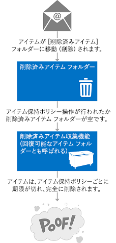
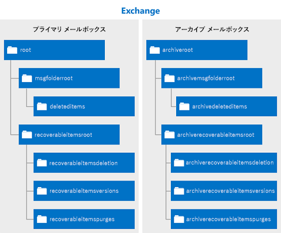

# Exchange で EWS を使用してアイテムを削除するDeleting items by using EWS in Exchange

Exchange で EWS マネージ API または EWS を使用して、アイテムを削除済みアイテム フォルダーまたはごみ箱に移動して削除する方法について説明します。Find out how you can use the EWS Managed API or EWS in Exchange to delete items either by moving them to the Deleted Items folder or to the dumpster.
  
アイテムを削除済みアイテム フォルダーに移動することと、ごみ箱に移動することにどんな違いがあるか考えたことがおありですか。Have you ever asked yourself what the difference is between moving items to the Deleted Items folder, and moving them to the dumpster? 削除されたアイテムを処理する別のオプションや、アプリケーションでそれらのオプションを実装する方法について興味を持たれるかもしれません。You might be curious about the different options for handling deleted items and how to implement those options in your application. Exchange Web サービス (EWS) には、削除されたアイテムを処理する 3 つのオプションが含まれています。Exchange Web Services (EWS) includes three options for handling deleted items. この記事を読むことによって、それらの違いについての混乱をすべて解決できることでしょう。This article will hopefully clear up any confusion you might have about the differences between them.
  
## アイテムを削除する場合のオプションDeleting items – what are my options?

アイテムを削除する際の全体的な概要を理解する前に、次の違いを認識することが重要です。Before you can understand the overall landscape for deleting items, it's important to recognize the difference between the following:
  
- 削除済みアイテム フォルダー - メールボックスでアイテムを削除すると、アイテムはここに移動されます。The Deleted Items folder – When you delete items in a mailbox, this is where they go.
    
- ごみ箱 (回復可能なアイテム フォルダー) - メールボックスからアイテムを削除すると、アイテムはここに移動されます。The dumpster (aka the Recoverable Items folder) – When you remove items from a mailbox, this is where they go.
    
図 1 と図 2 は、メールボックスのアイテムとフォルダーの削除処理がどのようなものかを示しています。Figures 1 and 2 show what the deletion process looks like for items and folders in a mailbox. 

**図 1. メールボックスからアイテムを削除する際のプロセス****Figure 1.  Process for deleting items from a mailbox**

 

**図 2. メールボックスからフォルダーを削除する際のプロセス****Figure 2.  Process for deleting folders from a mailbox**

![削除されたフォルダーが [削除済みアイテム] フォルダーに移動された後、メールボックスから完全に削除される仕組みを示す図。](media/Ex_.png)
   
削除の「永続性」に応じて、アイテムとフォルダーは 3 つの方法で削除できます。You can delete items and folders three different ways, depending on how "permanent" you would like the deletion to be.
  
**表 1. EWS を使用してアイテムを削除する場合のオプション****Table 1:  Options for deleting items by using EWS**

|**オプション****Option**|**結果****What happens**|
|:-----|:-----|
|削除済みアイテム フォルダーに移動するMove to the Deleted Items folder    |これは、アイテムを削除する方法のなかで最も永続性が低いものです。This is the least permanent way to delete items.  これは、自分の席の横にあるごみ箱に紙を捨てることに似ています。This is the least permanent way to delete items. This is like putting a piece of paper in the recycle bin by your desk. You can easily grab it if you need it again. 必要であれば、もう一度簡単に取り出すことができます。You can easily grab it if you need it again.  この操作を実行するには、削除済みアイテム フォルダーに移動するオプションを実装する任意の[削除操作](deleting-items-by-using-ews-in-exchange.md#bk_howdoIdeleteitems)を使用できます。You can use any [deletion operation](deleting-items-by-using-ews-in-exchange.md#bk_howdoIdeleteitems) that implements the move to the Deleted Items folder option to perform this action.  また、[MoveItem 操作](http://msdn.microsoft.com/library/dcf40fa7-7796-4a5c-bf5b-7a509a18d208%28Office.15%29.aspx) ([Item.Move()](http://msdn.microsoft.com/ja-JP/library/microsoft.exchange.webservices.data.item.move%28v=exchg.80%29.aspx)) または [MoveFolder 操作](http://msdn.microsoft.com/library/c7233966-6c87-4a14-8156-b1610760176d%28Office.15%29.aspx) ([Folder.Move()](http://msdn.microsoft.com/ja-JP/library/microsoft.exchange.webservices.data.folder.move%28v=exchg.80%29.aspx)) を使用して、アイテムまたはフォルダーを削除済みアイテム フォルダーに移動することもできます。You can also use the [MoveItem operation](http://msdn.microsoft.com/library/dcf40fa7-7796-4a5c-bf5b-7a509a18d208%28Office.15%29.aspx) ( [Item.Move()](http://msdn.microsoft.com/ja-JP/library/microsoft.exchange.webservices.data.item.move%28v=exchg.80%29.aspx)) or the [MoveFolder operation](http://msdn.microsoft.com/library/c7233966-6c87-4a14-8156-b1610760176d%28Office.15%29.aspx) ( [Folder.Move()](http://msdn.microsoft.com/ja-JP/library/microsoft.exchange.webservices.data.folder.move%28v=exchg.80%29.aspx)) to move an item or folder to the Deleted Items folder.    |
|論理的な削除Soft delete    |アイテムはごみ箱の削除フォルダーに移動されます。MovedEvent for the item. This specifies both the old and new parent folder identifiers. The item is moved to the Deletions folder in the dumpster.  これは、ごみ箱の中身を収集用のコンテナーに移して空にするのと同様です。This is like emptying your recycle bin into your curbside container. 必要であれば、少し面倒ではありますが、そのアイテムにアクセスすることはまだ可能です。You can still access the item if you need to, it's just a little harder.    ごみ箱 (回復可能なアイテム フォルダーとも呼ばれる) および電子情報開示や訴訟ホールドなどのシナリオの詳細については、TechNet の「[回復可能なアイテム フォルダー](http://technet.microsoft.com/ja-JP/library/ee364755%28v=exchg.150%29.aspx)」を参照してください。For more about the dumpster (also called the Recoverable Items folder) and scenarios such as eDiscovery or litigation holds, see [Recoverable Items Folderhttp://technet.microsoft.com/en-us/library/ee364755(v=exchg.150).aspx](http://technet.microsoft.com/ja-JP/library/ee364755%28v=exchg.150%29.aspx) on TechNet.  Exchange 2007 を対象とするアプリケーションの場合、論理的な削除はお勧めしません。Soft deletions aren't recommended for applications that target Exchange 2007. Exchange 2007 で論理的な削除を処理するには、アイテムで、そのアイテムが不特定の時間にごみ箱に移動されることを示すビットを設定します。In Exchange 2007, soft deletions are handled by setting a bit on the item to indicate that it will be moved to the dumpster at an unspecified time.  論理的な削除の走査、つまり [FindItem Operation](http://msdn.microsoft.com/library/ebad6aae-16e7-44de-ae63-a95b24539729%28Office.15%29.aspx) によって削除済みアイテム フォルダーに移動されたアイテムの検索は、Exchange Online、Office 365 の一部としての Exchange Online、Exchange 2010 以降のバージョンの Exchange ではサポートされていません。Soft deletions aren’t recommended for applications that target Exchange 2007. In Exchange 2007, soft deletions are handled by setting a bit on the item to indicate that it will be moved to the dumpster at an unspecified time. Soft delete traversals, or searches of items that have been soft deleted via the [FindItem Operation](http://msdn.microsoft.com/library/ebad6aae-16e7-44de-ae63-a95b24539729%28Office.15%29.aspx), are not supported in Exchange Online, Exchange Online as part of Office 365, and versions of Exchange starting with Exchange 2010.    **注**: フォルダーを削除済みアイテム フォルダーへ移動することはできません。Folders cannot be soft deleted.           |
|物理的な削除Hard delete    |アイテムまたはフォルダーが完全に削除されます。The item or folder is permanently deleted.  物理的に削除されたアイテムはごみ箱の Purges フォルダーに配置されます。Hard-deleted items are placed in the Purges folder of the dumpster. これは、ごみ収集車が収集用のコンテナーを空にするのと同じです。This is like when the recycling truck empties your curbside recycle container. Outlook または Outlook Web App のような電子メール クライアントからはこれらのアイテムにアクセスできず、メールボックスに保持設定がない限り、アイテムは一定期間後に完全に削除されます。The items cannot be accessed from an email client like Outlook or Outlook Web App, and, unless there is a hold set on the mailbox, the items will be permanently deleted after a set period of time.  アイテムの保存期間については、TechNet の「[削除済みアイテムの保存期間と回復可能なアイテムのクォータを構成する](http://technet.microsoft.com/ja-JP/library/ee364752%28v=exchg.150%29.aspx)」の記事を参照してください。You can read more about item retention in the article [Configure Deleted Item Retention and Recoverable Items Quotas](http://technet.microsoft.com/ja-JP/library/ee364752%28v=exchg.150%29.aspx).  **注**: フォルダーを物理的に削除する場合、そのフォルダーは Purges フォルダーには配置されません。Folders are not placed in the Purges folder when they are hard deleted. Hard-deleted folders are removed from the mailbox.. 物理的に削除されたフォルダーは、メールボックスから削除されます。Hard-deleted folders are removed from the mailbox.  |
   
削除済みアイテム フォルダーへの移動および物理的な削除のオプションはトランザクションです。これは、Web サービス呼び出しが完了するまでに、アイテムが削除済みアイテム フォルダーまたはごみ箱に移動されていることを意味します。The move to the Deleted Items folder and the hard delete options are transactional, which means that by the time the web service call finishes, the item has been moved to the Deleted Items folder or the dumpster.
  
削除済みアイテムの格納に使用されるフォルダーのエコシステムについて理解するために、次の図は、削除済みアイテムを含めることができるフォルダーの階層を示しています。To help you better understand the ecosystem of folders that are used to store deleted items, the following figure shows the hierarchy of folders that can contain deleted items. The folder names are as they appear in the DistinguishedFolderIdNameType schema type, or the WellKnownFolderName enumeration in the EWS Managed API. フォルダー名は、**DistinguishedFolderIdNameType** スキーマの種類、または EWS マネージ API の **WellKnownFolderName** 列挙体の場合と同じように表示されています。To help you better understand the ecosystem of folders that are used to store deleted items, the following figure shows the hierarchy of folders that can contain deleted items. The folder names are as they appear in the **DistinguishedFolderIdNameType** schema type, or the **WellKnownFolderName** enumeration in the EWS Managed API. 
  
**図 3. 削除済みアイテムを格納するフォルダーの階層****Figure 3.  Hierarchy of folders that contain deleted items**

  
**表 2. 削除済みアイテムを格納するフォルダー ****Table 2:  Folders that contain deleted items**

|**フォルダー名****Folder name**|**導入バージョン****Introduced in**|**説明****Description**|
|:-----|:-----|:-----|
|deleteditemsdeleteditems    |Exchange 2007Exchange 2007    |既定の削除済みアイテム フォルダー。アイテムは、論理的な削除によって削除されるか、物理的に削除されるまで、または保存期間が超えるまでこのフォルダーに残ります。次に、このアイテムはごみ箱内のフォルダーに移動されます。削除済みフォルダーは、削除済みアイテム フォルダーに配置されており、論理的な削除によって削除されるか、物理的に削除されるときに、メールボックスから完全に削除され、回復できなくなります。The default Deleted Items folder. Items remain in this folder until they are soft- or hard-deleted or until a retention period has been exceeded. Then they are moved to a folder in the dumpster. Deleted folders are placed in the Deleted Items folder, and when they are soft- or hard-deleted, they are permanently removed from the mailbox and are not recoverable.    |
|recoverableitemsrootrecoverableitemsroot    |Exchange 2010Exchange 2010    |ごみ箱、つまり回復可能なアイテム フォルダーのルート。The root of the dumpster, or the Recoverable Items folder. Exchange 2010 の EWS では、ごみ箱へのアクセスが実装されています。Dumpster access was implemented in EWS in Exchange 2010. このフォルダーの表示名は、「回復可能なアイテム」です。The display name for this folder is "Recoverable Items".    |
|recoverableitemsdeletionsrecoverableitemsdeletions    |Exchange 2010Exchange 2010    |メールボックスのメインごみ箱フォルダー。The main dumpster folder for a mailbox. アイテム保持ポリシーによって、論理的な削除によって削除されたアイテムおよび削除済みアイテム フォルダーから移動されたアイテムは、このフォルダーに配置されます。The main dumpster folder for a mailbox. Soft-deleted items and items moved from the Deleted Items folder by a retention policy are placed in this folder. The display name for this folder is “Deletions”. このフォルダーの表示名は、「削除」です。The display name for this folder is "Deletions".    |
|recoverableitemsversionsrecoverableitemsversions    |Exchange 2010Exchange 2010    |以前のバージョンのアイテムが格納されます。Where older versions of archived items are stored. 以前のバージョンのアイテムは、アイテムが更新されたときに作成されます。Old versions of an item are created when an item is updated. 下書きバージョンのアイテムはこのフォルダーに保存されません。Draft item versions are not saved to this folder. このフォルダーの表示名は、「バージョン」です。The display name of this folder is "Versions".    |
|recoverableitemspurgesrecoverableitemspurges    |Exchange 2010Exchange 2010    |削除フォルダーから削除されるアイテムが格納されます。Where items that are removed from the Deletions folder are stored. 記憶域で物理的に削除されたすべてのアイテムは、このフォルダーに移動されます。All store hard-deleted items are moved to this folder. このフォルダーの表示名は、「Purges」です。The display name for this folder is "Purges".    |
|archiveddeletedtitemsarchiveddeletedtitems    |Exchange 2010Exchange 2010    |アーカイブ メールボックスの既定の削除済みアイテム フォルダー。The default Deleted Items folder for an archive mailbox.    |
|archiverecoverablesitemsrootarchiverecoverablesitemsroot    |Exchange 2010Exchange 2010    |アーカイブ メールボックスのルートごみ箱フォルダー。論理的な削除によって削除されたアーカイブ アイテムは、このフォルダーのサブフォルダーに移動されます。The root dumpster folder for an archive mailbox. Archived items that are soft-deleted are moved to a subfolder in this folder.    |
|archiverecoverableitemsdeletionsarchiverecoverableitemsdeletions    |Exchange 2010Exchange 2010    |アーカイブ メールボックスのメインごみ箱フォルダー。ごみ箱に移動されたアーカイブ アイテムはここに配置されます。The main dumpster folder for an archive mailbox. Archived items moved to the dumpster are placed here.    |
|archiverecoverableitemsversionsarchiverecoverableitemsversions    |Exchange 2010Exchange 2010    |以前のバージョンのアーカイブ アイテムが格納されます。Where older versions of archived items are stored.    |
|archiverecoverableitemspurgesarchiverecoverableitemspurges    |Exchange 2010Exchange 2010    |ごみ箱のアーカイブ削除フォルダーにある物理的に削除されたアイテムが格納されます。記憶域で物理的に削除されたすべてのアーカイブ アイテムは、このフォルダーに移動されます。Where items that are hard-deleted from the archive Deletions folder in the dumpster are stored. All store hard-deleted archived items are moved to this folder.    |
   
## アイテムを削除する方法How do I delete items?

次のいずれかを使用して、削除済みアイテム フォルダーにアイテムを移動するか、論理的な削除または物理的な削除を実行するかどうかを指定します。Use one of the following to indicate whether to move an item to the Deleted Items folder or perform a soft delete or a hard delete:
  
- **DisposalType** の単純型 (EWS を使用して Exchange にアクセスする場合)。The **DisposalType** simple type, if you use EWS to access Exchange. 
    
- [DeleteMode 列挙型](http://msdn.microsoft.com/ja-JP/library/exchange/microsoft.exchange.webservices.data.deletemode%28v=exchg.80%29.aspx) (EWS マネージ API を使用する場合)。The [DeleteMode enumeration](http://msdn.microsoft.com/ja-JP/library/exchange/microsoft.exchange.webservices.data.deletemode%28v=exchg.80%29.aspx), if you use the EWS Managed API.
    
複数の異なる EWS 操作または EWS マネージ API メソッドを使用して、メールボックスからアイテムやフォルダーを削除できます。You can use a number of different EWS operations or EWS Managed API methods to delete items and folders from a mailbox.
  
**表 3. アイテムを削除するための EWS 操作と EWS マネージ API メソッド****Table 3:  EWS operations and EWS Managed API methods for deleting items**

|**EWS 操作****EWS operation**|**EWS マネージ API メソッド****EWS Managed API method**|**導入バージョン****Introduced in**|**機能****What it does**|
|:-----|:-----|:-----|:-----|
|[DeleteFolder 操作DeleteFolder Operation](http://msdn.microsoft.com/library/b0f92682-4895-4bcf-a4a1-e4c2e8403979%28Office.15%29.aspx)   |[Folder.Delete メソッドFolder.Delete method](http://msdn.microsoft.com/ja-JP/library/exchange/microsoft.exchange.webservices.data.folder.delete%28v=exchg.80%29.aspx)   |Exchange 2007Exchange 2007    |メールボックスからフォルダーを削除します。EWS では、フォルダーをバッチ削除できます。EWS マネージ API では、呼び出しごとに 1 つのフォルダーのみを削除できます。Deletes folders from a mailbox. With EWS, you can batch delete folders. With the EWS Managed API, you can only delete a single folder per call.    |
|[DeleteItem 操作DeleteItem Operation](http://msdn.microsoft.com/library/3e26c416-fa12-476e-bfd2-5c1f4bb7b348%28Office.15%29.aspx)   |[Item.Delete メソッドItem.Delete method](http://msdn.microsoft.com/ja-JP/library/exchange/microsoft.exchange.webservices.data.item.delete%28v=exchg.80%29.aspx)  [ExchangeService.DeleteItems メソッドExchangeService.DeleteItems method](http://msdn.microsoft.com/ja-JP/library/exchange/microsoft.exchange.webservices.data.exchangeservice.deleteitems%28v=exchg.80%29.aspx)   |Exchange 2007Exchange 2007    |メールボックスからアイテムを削除します。Deletes items from a mailbox.    |
|[EmptyFolder 操作EmptyFolder Operation](http://msdn.microsoft.com/library/98161486-e2f2-480f-8d5d-708ba81b208a%28Office.15%29.aspx)   |[Folder.Empty メソッドFolder.Empty method](http://msdn.microsoft.com/ja-JP/library/exchange/microsoft.exchange.webservices.data.folder.empty%28v=exchg.80%29.aspx)   |Exchange 2010Exchange 2010    |フォルダー内のすべての項目を削除します。必要に応じて、フォルダー内のすべてのサブフォルダーも削除します。Deletes all the items in a folder, and, optionally, deletes all subfolders in a folder.    |
|[ApplyConversationAction 操作ApplyConversationAction Operation](http://msdn.microsoft.com/library/73d7943d-d361-4f8b-9948-d85f886efa1a%28Office.15%29.aspx)   |[Conversation.EnableAlwaysDeleteItems メソッドConversation.EnableAlwaysDeleteItems method](http://msdn.microsoft.com/ja-JP/library/exchange/microsoft.exchange.webservices.data.conversation.enablealwaysdeleteitems%28v=exchg.80%29.aspx)  [Conversation.DeleteItems メソッドConversation.DeleteItems method](http://msdn.microsoft.com/ja-JP/library/exchange/microsoft.exchange.webservices.data.conversation.deleteitems%28v=exchg.80%29.aspx)   |Exchange 2010Exchange 2010    |会話の電子メール メッセージに対して削除処理アクションを設定し、それらが削除されるようにします。Sets a delete processing action on email messages in a conversation so that they are deleted.    |
|[DeleteUserConfiguration 操作DeleteUserConfiguration Operation](http://msdn.microsoft.com/library/93e44690-be2d-4fdb-96a8-4ded3c193aed%28Office.15%29.aspx)   |[UserConfiguration.Delete メソッドUserConfiguration.Delete method](http://msdn.microsoft.com/ja-JP/library/exchange/microsoft.exchange.webservices.data.userconfiguration.delete%28v=exchg.80%29.aspx)   |Exchange 2010Exchange 2010    |アイテムに関連付けられているフォルダーを削除し、ごみ箱に移動します。Deletes a folder associated item and moves it to the dumpster.    |
|[CreateItem 操作CreateItem operation](http://msdn.microsoft.com/library/78a52120-f1d0-4ed7-8748-436e554f75b6%28Office.15%29.aspx)   |[Appointment.Accept メソッドAppointment.Accept method](http://msdn.microsoft.com/ja-JP/library/microsoft.exchange.webservices.data.appointment.accept%28v=exchg.80%29.aspx)   [Appointment.AcceptTentatively メソッドAppointment.AcceptTentatively method](http://msdn.microsoft.com/ja-JP/library/microsoft.exchange.webservices.data.appointment.accepttentatively%28v=exchg.80%29.aspx)  [Appointment.CancelMeeting メソッドAppointment.CancelMeeting method](http://msdn.microsoft.com/ja-JP/library/microsoft.exchange.webservices.data.appointment.cancelmeeting%28v=exchg.80%29.aspx)  [Appointment.DeclineAppointment.Decline](http://msdn.microsoft.com/ja-JP/library/microsoft.exchange.webservices.data.appointment.decline%28v=exchg.80%29.aspx)  [MeetingRequest.Accept メソッドMeetingRequest.Accept method](http://msdn.microsoft.com/ja-JP/library/microsoft.exchange.webservices.data.meetingrequest.accept%28v=exchg.80%29.aspx)  [MeetingRequest.AcceptTentatively メソッドMeetingRequest.AcceptTentatively method](http://msdn.microsoft.com/ja-JP/library/microsoft.exchange.webservices.data.meetingrequest.accepttentatively%28v=exchg.80%29.aspx)  [MeetingRequest.Decline メソッドMeetingRequest.Decline method](http://msdn.microsoft.com/ja-JP/library/microsoft.exchange.webservices.data.meetingrequest.decline%28v=exchg.80%29.aspx)   |Exchange 2007Exchange 2007    |会議出席依頼への応答が送信されるか、応答が予定に設定されるたびに、アイテムを削除済みアイテム フォルダーに間接的に移動します。Indirectly moves an item to the Deleted Items folder whenever a response to a meeting request is sent or the response is set on the appointment. The deletion type is not set on this operation. The meeting messages are moved to the Deleted Items folder when a response object is successfully processed by the service.  削除の種類は、この操作では設定されません。The deletion type is not set on this operation. 応答オブジェクトがサービスによって正常に処理されると、会議のメッセージは削除済みアイテム フォルダーに移動されます。The meeting messages are moved to the Deleted Items folder when a response object is successfully processed by the service.    |
   
受信トレイ ルールを使用して、削除済みアイテム フォルダーにアイテムを移動することもできます。You can also move items to the Deleted Items folder by using Inbox rules. For example, you can create rules that have a delete action. たとえば、削除アクションを含む[ルールを作成する](inbox-management-and-ews-in-exchange.md)ことができます。You can also move items to the Deleted Items folder by using Inbox rules. For example, you can [create rules](inbox-management-and-ews-in-exchange.md) that have a delete action. 
  
アイテムを削除する場合の注意点:Some points to note about deleting items:
  
- 定期的な発生アイテムを削除しても、削除済みアイテム フォルダーまたはごみ箱への移動は行われません。これにより、定期的なアイテムの定期的マスター アイテムが更新されます。Deleting an occurrence of a recurring item does not trigger a move to the Deleted Items folder or the dumpster. This results in an update to the recurring master item of the recurring series.
    
- 既定のフォルダーはメールボックスから削除できません。You cannot delete default folders from the mailbox.
    
- 会議または会議のメッセージ (会議出席依頼または会議の更新など) は削除しないでください。Avoid deleting meetings or meeting messages, such as meeting requests and or meeting updates. 代わりに、応答オブジェクトを使用してこれらのアイテムに対応します。Instead, respond to these items by using response objects. これで、関連付けられている予定表アイテムが更新され、レスポンダーまたは開催者のアクションが反映されます。This way, the associated calendar items are updated to reflect the responder's or organizer's actions.
    
- アイテムが削除済みアイテムまたは削除フォルダーに移動されている場合、アイテムのキーの変更は更新されません。An item’s change key is not updated when the item is moved to the Deleted Items or Deletions folder.
    
- アイテムの物理的な削除を実行してから、[SyncFolderHierarchy 操作](http://msdn.microsoft.com/library/b31916b1-bc6c-4451-a475-b7c5417f752d%28Office.15%29.aspx)や [SyncFolderHierarchy](http://msdn.microsoft.com/ja-JP/library/microsoft.exchange.webservices.data.exchangeservice.syncfolderhierarchy%28v=exchg.80%29.aspx) EWS マネージ API メソッド、または [SyncFolderItems 操作](http://msdn.microsoft.com/library/7f0de089-8876-47ec-a871-df118ceae75d%28Office.15%29.aspx)や [SyncFolderItems](http://msdn.microsoft.com/ja-JP/library/microsoft.exchange.webservices.data.exchangeservice.syncfolderitems%28v=exchg.80%29.aspx) メソッドを呼び出すと、**Delete** 変更エントリが返されます。If you perform a hard delete on an item and then call a [SyncFolderHierarchy operation](http://msdn.microsoft.com/library/b31916b1-bc6c-4451-a475-b7c5417f752d%28Office.15%29.aspx) or [SyncFolderHierarchy](http://msdn.microsoft.com/ja-JP/library/microsoft.exchange.webservices.data.exchangeservice.syncfolderhierarchy%28v=exchg.80%29.aspx) EWS Managed API method, or a [SyncFolderItems operation](http://msdn.microsoft.com/library/7f0de089-8876-47ec-a871-df118ceae75d%28Office.15%29.aspx) or [SyncFolderItems](http://msdn.microsoft.com/ja-JP/library/microsoft.exchange.webservices.data.exchangeservice.syncfolderitems%28v=exchg.80%29.aspx) method, a **Delete** change entry will be returned. アイテムを削除済みアイテム フォルダーに移動すると、**Update** 変更エントリが返されます。If you move an item to the Deleted Items folder, an **Update** change entry is returned. これは、アイテムまたはフォルダーが新しい [ParentFolderId](http://msdn.microsoft.com/library/258f4b1f-367e-4c7d-9c29-eb775a2398c7%28Office.15%29.aspx) プロパティ値を持つためです。This is because the item or folder will have a new [ParentFolderId](http://msdn.microsoft.com/library/258f4b1f-367e-4c7d-9c29-eb775a2398c7%28Office.15%29.aspx) property value. 削除済みアイテムの同期がシナリオの一部になっている場合は、[同期について参照してください](mailbox-synchronization-and-ews-in-exchange.md)。[Read more about synchronization](mailbox-synchronization-and-ews-in-exchange.md) if synchronizing deleted items is part of your scenario. 
    
## アイテムの削除についての詳細Find out more about deleting items

- [Exchange での EWS の削除に関連するメールボックス イベントのプル通知Pull notifications for EWS deletion-related mailbox events in Exchange](pull-notifications-for-ews-deletion-related-mailbox-events-in-exchange.md)
    
- [Exchange における EWS での削除に関連するエラーの処理Handling deletion-related errors in EWS in Exchange](handling-deletion-related-errors-in-ews-in-exchange.md)
    
## 関連項目See also

- [Exchange の EWS のフォルダーとアイテムFolders and items in EWS in Exchange](folders-and-items-in-ews-in-exchange.md)    
- [Exchange の Web サービス クライアントを開発するDevelop web service clients for Exchange](develop-web-service-clients-for-exchange.md)    
- [回復可能なアイテム フォルダーRecoverable Items Folder](http://technet.microsoft.com/ja-JP/library/ee364755.aspx)    
- [Exchange Server 2010 での単一アイテムの回復Single Item Recovery in Exchange Server 2010http://blogs.technet.com/b/exchange/archive/2009/09/25/3408389.aspx#_Single_Item_Recovery](http://blogs.technet.com/b/exchange/archive/2009/09/25/3408389.aspx#_Single_Item_Recovery)    
- [Exchange 2013: Exchange サーバーからプログラムを使用して定期的なアイテムを削除するExchange 2013: Delete a recurring series programmatically from Exchange servershttp://code.msdn.microsoft.com/exchange/Exchange-2013-Delete-a-e1c7b89d](http://code.msdn.microsoft.com/exchange/Exchange-2013-Delete-a-e1c7b89d)    
- [Exchange 2013: プログラムを使用して Exchange サーバー上のアカウントからタスクを削除するExchange 2013: Delete tasks from an account on Exchange servers programmaticallyhttp://code.msdn.microsoft.com/exchange/Exchange-2013-Delete-tasks-13824637](http://code.msdn.microsoft.com/exchange/Exchange-2013-Delete-tasks-13824637)    
- [Exchange 2013: プログラムを使用して Exchange サーバー上のフォルダーを空にするExchange 2013: Empty folders on Exchange servers programmaticallyhttp://code.msdn.microsoft.com/exchange/Exchange-2013-Empty-6487df37](http://code.msdn.microsoft.com/exchange/Exchange-2013-Empty-6487df37)    
- [Exchange 2013: Exchange サーバーからプログラムを使用してフォルダーを削除するExchange 2013: Delete folders programmatically from Exchange servershttp://code.msdn.microsoft.com/exchange/Exchange-2013-Delete-aa1a5823](http://code.msdn.microsoft.com/exchange/Exchange-2013-Delete-aa1a5823)    
- [Exchange 2013: Exchange サーバーからプログラムを使用して多くのアイテムを削除するExchange 2013: Delete many items programmatically from Exchange servershttp://code.msdn.microsoft.com/exchange/Exchange-2013-Delete-many-064f8760](http://code.msdn.microsoft.com/exchange/Exchange-2013-Delete-many-064f8760)    
- [Exchange 2013: Exchange サーバーからプログラムを使用して連絡先を削除するExchange 2013: Delete contacts programmatically from Exchange servershttp://code.msdn.microsoft.com/exchange/Exchange-2013-Delete-3b8b0640](http://code.msdn.microsoft.com/exchange/Exchange-2013-Delete-3b8b0640)    
- [Exchange の EWS を使用して、予定を削除し、会議をキャンセルするHow to: Delete appointments and cancel meetings by using EWS in Exchange](how-to-delete-appointments-and-cancel-meetings-by-using-ews-in-exchange.md)    
- [Exchange で EWS を使用して永続的なアプリケーションの設定を管理するHow to: Manage persistent application settings by using EWS in Exchange](how-to-manage-persistent-application-settings-by-using-ews-in-exchange.md)
    

