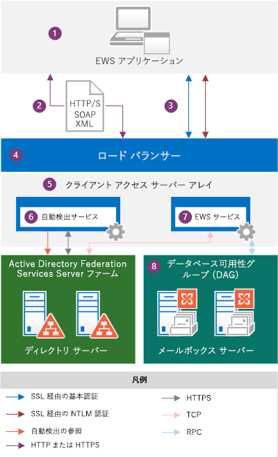
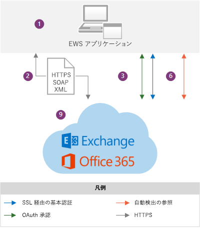

# EWS アプリケーションと Exchange のアーキテクチャEWS applications and the Exchange architecture

EWS が Exchange アーキテクチャで動作する仕組みと、EWS が依存するプロトコルについて説明します。Learn about how EWS works within the Exchange architecture, and find out which protocols EWS relies on.
  
Exchange Web Services (EWS) は、Exchange Online、Office 365 の一部としての Exchange Online、Exchange 2007 以降のオンプレミス バージョンの  Exchange からのメール メッセージ、会議、連絡先などのメールボックス アイテムにアプリケーションがアクセスするためのクロスプラットフォーム API です。Exchange Web Services (EWS) is a cross-platform API that enables applications to access mailbox items such as email messages, meetings, and contacts from Exchange Online, Exchange Online as part of Office 365, or on-premises versions of Exchange starting with Exchange Server 2007. EWS applications can access mailbox items locally or remotely by sending a request in a SOAP-based XML message. The SOAP message is embedded in an HTTP message when sent between the application and the server, which means that as long as your application can post XML through HTTP, it can use EWS to access Exchange. [EWS アプリケーション](ews-application-types.md)は、SOAP ベースの XML メッセージで要求を送信することによって、ローカルまたはリモートでメールボックス アイテムにアクセスできます。[EWS applications](ews-application-types.md) can access mailbox items locally or remotely by sending a request in a SOAP-based XML message. SOAP メッセージは、アプリケーションとサーバーの間で送信されるときに、HTTP メッセージに埋め込まれます。つまり、アプリケーションが HTTP 経由で XML を投稿できる場合に限り、EWS を使用して Exchange にアクセスできます。The SOAP message is embedded in an HTTP message when sent between the application and the server, which means that as long as your application can post XML through HTTP, it can use EWS to access Exchange. 
  
## Exchange のアーキテクチャ概要Exchange architecture overview

次の図は、Exchange 2013 および Exchange Online と通信する場合に EWS アプリケーションで使用される認証方法および通信パスを示しています。EWS アプリケーションの観点からすると、通信パスは同じであり、認証方法だけが多少異なります。主な違いは、Exchange バックエンドを見ることができるかどうかということです。The following diagrams show the authentication methods and communication paths used by EWS applications when communicating with Exchange 2013 and Exchange Online. From the EWS application perspective, the communication paths are identical and the authentication methods only vary slightly; the main difference is the visibility you have into the Exchange backend.
  
**図 1. EWS アプリケーションと Exchange オンプレミス アーキテクチャ****Figure 1.  EWS application and the Exchange on-premises architecture**

  
図 2 は、Exchange Online と通信するときに EWS アプリケーションで使用される、図 1 に示したのと同じ通信パスを示しています。Figure 2 shows the same communication paths shown in Figure 1, as used by EWS applications when communicating with Exchange Online.
  
**図 2. EWS アプリケーションと Exchange Online アーキテクチャ****Figure 2.  EWS application and the Exchange Online architecture**

  
図に示されているコンポーネントは次のとおりです。The following are the components that are shown in the diagrams:
  
1. EWS アプリケーション - これは、[クライアント、ポータル、またはサービス アプリケーション](ews-application-types.md)であり、クライアントまたは Exchange オンプレミスのクライアント アクセス サーバー上にインストールできます。EWS application — This can be a [client, portal, or service application](ews-application-types.md) and it can be installed on a client or on an Exchange on-premises Client Access server. If you use the EWS Managed API to develop the EWS application, the EWS Managed API assemblies have to be installed on the client and redistributed by your application. EWS マネージ API を使用して EWS アプリケーションを開発する場合、EWS マネージ API アセンブリをクライアントにインストールし、[アプリケーションで再配布](redistribution-requirements-for-the-ews-managed-api.md)する必要があります。EWS application — This can be a client, portal, or service application and it can be installed on a client or on an Exchange on-premises Client Access server. If you use the EWS Managed API to develop the EWS application, the EWS Managed API assemblies have to be installed on the client and [redistributed by your application](redistribution-requirements-for-the-ews-managed-api.md).
    
2. SOAP XML メッセージ - SOAP エンベロープ内の XML メッセージであり、クライアント アクセス サーバー上の Services.wsdl ファイルに準拠した HTTP/S メッセージに埋め込まれています。HTTPS は、Exchange オンプレミスで推奨されており、Exchange Online では必須です。The SOAP XML message — An XML message, in a SOAP envelope, embedded in an HTTP/S message that conforms to the Services.wsdl file on the Client Access server. HTTPS is recommended for Exchange on-premises and is required for Exchange Online. 
    
3. 認証方法 - EWS メッセージには、基本認証、NTLM 認証 (Windows 統合認証) または OAuth 認証の情報が HTTP ペイロードの一部として含まれます。Authentication methods — EWS messages include basic, NTLM (Windows Integrated authentication), or OAuth authentication information as part of the HTTP payload. 
    
4. ロード バランサー - ロード バランサーは、クライアント アクセス サーバー アレイ内のクライアント アクセス サーバーにメッセージを配信します。このコンポーネントは、Exchange オンプレミス アーキテクチャでのみ表示されます。Load balancer — The load balancer distributes the message to a Client Access server in the Client Access server array. This component is only visible in the Exchange on-premises architecture.
    
5. クライアント アクセス サーバー アレイ - クライアント アクセス サーバーは、クライアント アクセス サーバー アレイと呼ばれる負荷分散グループに編成されています。Client Access server array — Client Access servers are organized into a load-balanced group called a Client Access server array. 個々のクライアント アクセス サーバーは、認証、制限付きリダイレクト、およびプロキシ サービスを提供します。Individual Client Access servers provide authentication, limited redirection, and proxy services. クライアント アクセス サーバー自体はデータのレンダリングを実行しません。クライアント アクセス サーバーにはキューに入れられるデータまたは格納されるデータは何もありません。これは、最小限の機能を備えたステートレス サーバーであり、要求を認証し、自動検出を実行してから、メールボックス サーバーへの要求をプロキシ処理します。The Client Access servers themselves don't do any data rendering, and no data is queued or stored on a Client Access server - it is thin and stateless; it simply authenticates the request, performs an Autodiscover lookup, and then proxies the request to the Mailbox server. クライアント アクセス サーバーは、ユーザーのデータをホストしているメールボックス サーバーと 1 対 1 のリレーションシップを維持します。The Client Access server does maintain a 1:1 relationship with the Mailbox server that hosts the user's data. HTTP プロトコル (自己署名入りの証明書を使用して SSL を経由してセキュリティで保護されます) は、クライアント アクセス サーバーとメールボックス サーバーの間で使用されます。The HTTP protocol (secured via SSL using a self-signed certificate) is used between the Client Access server and Mailbox server. このコンポーネントは、Exchange オンプレミス アーキテクチャでのみ表示されます。This component is only visible in the Exchange on-premises architecture.
    
6. 自動検出サービス - 自動検出サービスは、Active Directory Domain Services (AD DS) にアクセスすることでサービス検出を実行し、ユーザーのデータのアクティブ コピーをホストしているメールボックス サーバーのメールボックスのバージョンと場所を取得します。Autodiscover service — The Autodiscover service performs a service discovery by accessing Active Directory Domain Services (AD DS) to retrieve the mailbox version and the location of the Mailbox server that is hosting the active copy of the user’s data.
    
7. EWS サービス - EWS サービスは、次の 3 つのファイルで記述されます。Services.wsdl、Messages.xsd、Types.xsd、および EWS マネージ API のアセンブリです。Services.wsdl はクライアントとサーバーの間のコントラクトを記述し、Messages.xsd は要求および応答の SOAP メッセージを定義し、Types.xsd は SOAP メッセージで使用される要素を定義します。以前のバージョンのスキーマが存在する場合でも、Messages.xsd と Types.xsd には常に最新バージョンのスキーマが含まれます。Services.wsdl、Messages.xsd、Types.xsd はクライアント アクセス サーバーで利用可能ですが、実際にはスキーマの検証で使用されないことに注意してください。これらは参照目的でのみ提供されます。EWS マネージ API アセンブリは、サーバー側の EWS クライアント アプリケーションに提供され、クライアント アクセス サーバーだけでなく、すべての Exchange Server の役割で展開されます。このコンポーネントは、Exchange オンプレミス アーキテクチャでのみ表示されます。EWS service —The EWS service is described by three files: Services.wsdl, Messages.xsd, and Types.xsd, as well as the EWS Managed API assemblies. Services.wsdl describes the contract between the client and server, Messages.xsd defines the request and response SOAP messages, and Types.xsd defines the elements used in the SOAP messages. Messages.xsd and Types.xsd always contain the latest versions of the schema, although earlier versions of the schema exist. Note that Services.wsdl, Messages.xsd, and Types.xsd are made available on the Client Access server, but are not actually used for schema validation — they are provided for reference only. The EWS Managed API assemblies are provided for server-side EWS client applications and are deployed on all Exchange Server roles, not just the Client Access servers. This component is only visible in the Exchange on-premises architecture.
    
    機能が使用可能かどうかは、アプリケーションが対象とする EWS のスキーマのバージョン次第です。Feature availability is based on the EWS schema version that your application targets. EWS のスキーマは後方互換性と前方互換性を持つため、Exchange  2007 SP1 などの以前のバージョンのスキーマを対象とするアプリケーションを作成する場合、アプリケーションは Exchange 2010 SP2 のサービスや Exchange Online など、後のバージョンのスキーマでも動作します。Regardless of the development option that you choose, you should consider how EWS features are implemented in your client. Feature availability is based on the EWS schema version that your application targets. Because EWS schemas are backward- and forward-compatible, if you create an application that targets an earlier schema version, such as Exchange Server 2007 SP1, your application will also work against a later schema version, such as the Exchange Server 2013 SP1 service, as well as Exchange Online. 機能および機能の更新はスキーマによって決定されるため、クライアント アプリケーションに実装する EWS 機能を対象としているもののうち、最も古い共通のコード ベースを使用することをお勧めします。Because features and feature updates are driven by the schema, we recommend that you use the earliest common code base that targets the EWS features that you want to implement in your client application. 多くのアプリケーションは Exchange2007_SP1 バージョンを対象にできます。なぜなら、Exchange 2007 SP1 のスキーマには、Exchange のストアのアイテムやフォルダーを操作するための Exchange のほとんどすべての主要機能が含まれているためです。Many applications can target the Exchange2007_SP1 version, because the Exchange 2007 SP1 schema contains almost all the core Exchange functionality for working with items and folders in the Exchange store. 詳細については、[EWS のクライアント機能](ews-client-design-overview-for-exchange.md#EWSFeatures)を参照してください。For more information, see [EWS client features](ews-client-design-overview-for-exchange.md#EWSFeatures).
    
8. データベース可用性グループ (DAG) - メールボックス サーバーを 1 つの可用性の高い DAG にまとめら、1 つまたは複数のデータ センターに展開することができます。メールボックス サーバーは、メールボックス データベースを含んでおり、サーバー上のアクティブ メールボックスのすべてのアクティビティを処理します。データを処理、表示、格納するすべてのコンポーネントは、メールボックス サーバー上にあります。クライアントはメールボックス サーバーに直接接続しません。すべての接続はクライアント アクセス サーバーによって処理されます。このコンポーネントは、Exchange オンプレミス アーキテクチャでのみ表示されます。Database Availability Group (DAG) — Mailbox servers are organized into a highly available DAG, which can be deployed in one or more datacenters. The Mailbox server contains the mailbox database and handles all activity for the active mailboxes on that server. All components that process, render, and store data are on the Mailbox server. Clients do not connect directly to the Mailbox server; all connections are handled by the Client Access server. This component is only visible in the Exchange on-premises architecture.
    
9. Exchange Online および Office 365 の一部としての Exchange Online - クラウド ベースのサービスとして Exchange の機能を提供するホスト型のメッセージング ソリューション。Exchange Online and Exchange Online as part of Office 365 — The hosted messaging solution that delivers Exchange features as a cloud-based service.
    
EWS アプリケーションが Exchange ストアから情報を要求すると、SOAP 規格に準拠した XML 要求メッセージが作成され、Exchange サーバーに送信されます。Exchange サーバーは要求を受信すると、クライアントによって提供される資格情報を検証し、要求データの XML を自動的に解析します。次に、サーバーは、要求された厳密に型指定されたオブジェクトとそのプロパティを表す XML データを含む SOAP 応答を作成します。XML データは、HTTP 応答でアプリケーションに送り返されます。アプリケーションは、XML を逆シリアル化し、そのデータを使用して厳密に型指定されたオブジェクトを再構成します。When an EWS application requests information from the Exchange store, an XML request message that complies with the SOAP standard is created and sent to the Exchange server. When the Exchange server receives the request, it verifies the credentials that are provided by the client and automatically parses the XML for the requested data. The server then builds a SOAP response that contains XML data that represents the requested strongly typed objects and their properties. The XML data is sent back to the application in an HTTP response. The application then deserializes the XML and uses the data to reform the strongly typed objects.
  
## EWS アプリケーションでサポートする必要があるプロトコルおよび規格Protocols and standards that EWS applications must support

Exchange サーバーと通信するには、EWS アプリケーションは次のプロトコルと規格をサポートしている必要があります。To communicate with an Exchange server, EWS applications must support the following protocols and standards.
  
**表 1. プロトコル****Table 1.  Protocols**

|**プロトコル****Protocol**|**使用方法****How it’s used**|
|:-----|:-----|
|HTTP/SHTTP/S    |クライアントがインターネット上にあるかイントラネット上にあるかにかかわらず、EWS アプリケーションがネットワーク経由で Exchange データベースのデータにアクセスできるようにします。Enables EWS applications to access Exchange database data over the network, regardless of whether the client is on the Internet or intranet.    |
|SOAP 1.0SOAP 1.0    |メッセージング ペイロードの周囲にエンベロープを形成します。EWS では、SOAP エンベロープのさまざまな部分を使用して SOAP プロトコルを実装し、さまざまな機能を実現します。SOAP ヘッダーは、偽装する場合や、バージョン管理データを提供する場合に使用されます。SOAP 本体は、実行する操作および操作に送信されるデータについての情報を提供します。SOAP は、呼び出す操作を記述する WSDL に依存します。Forms an envelope around the messaging payload. EWS implements the SOAP protocol by using different parts of the SOAP envelope to enable different functionality. The SOAP header is used for impersonation and to provide versioning data. The SOAP body provides information about the operation to run and the data that is submitted to the operation. SOAP relies on WSDL to describe the operations to call.    |
|WSDL 1.0WSDL 1.0    |Services.wsdl ファイルで、EWS 操作の呼び出しに使用されるバインド、操作、プロパティについて記述します。このファイルは、参照されるスキーマ ファイルと共に、EWS アプリケーションと Exchange サーバーの間のコントラクトを構成し、ベンダー固有のツールと共に使用され、プラットフォーム固有のアプリケーションを作成します。WSDL ファイルは、Web サイトのルートにある、EWS 仮想ディレクトリに配置されています。Describes the bindings, the operations, and the properties that are used to call EWS operations, in the Services.wsdl file. This file, along with the referenced schema files, comprises the contract between an EWS application and the Exchange server, and is often used along with vendor-specific tools to create platform-specific applications. The WSDL file is located in the EWS virtual directory, which is at the root of the website.    |
|トランスポート層セキュリティ (TLS)/SSLTransport Layer Security (TLS)/SSL    |インターネットやイントラネット上にセキュリティで保護された Web 通信を提供します。TLS を使用すると、アプリケーションはサーバーを認証でき、オプションでサーバーが EWS アプリケーションを認証できます。また、通信の暗号化によってセキュリティ チャネルが提供されます。TLS は最新バージョンの SSL (Secure Sockets Layer) プロトコルです。Provides secure web communications on the Internet or on intranet. TLS enables applications to authenticate servers or, optionally, servers to authenticate EWS applications. It also provides a security channel by encrypting communications. TLS is the latest version of the Secure Sockets Layer (SSL) protocol.    |
|XML/XSDXML/XSD    |Exchange サーバーとクライアント間で情報を交換するための汎用のメッセージ形式を提供します。XML は、複雑な Exchange データベースのデータを、定義された構造でクライアント アプリケーションに提供します。XML の長所は、EWS アプリケーションおよびサーバーが共通のプラットフォームを共有しない場合でもデータを交換できるという点です。Provides a universal message format for the exchange of information between the Exchange server and the client. XML provides complex Exchange database data to client applications, but in a defined structure. The beauty of XML is that it allows for the exchange of data even when an EWS application and server do not share a common platform.    |
   
さらに、EWS アプリケーションは、以下の認証規格をサポートする必要があります。In addition, EWS applications must support the following authentication standards:
  
- SSL 経由の基本認証 (Exchange Online または Exchange オンプレミスを対象とするアプリケーション用)。Basic authentication over SSL, for applications that target Exchange Online or Exchange on-premises.
    
- SSL 経由の NTLM 認証 (Exchange オンプレミスをサポートするアプリケーション用)。NTLM authentication over SSL, for applications that support Exchange on-premises.
    
- OAuth 2.0 トークン認証 (信頼できるパートナー アプリケーション、および Lync Server 2013 と SharePoint Server 2013 との相互運用のため)。OAuth 2.0 token authentication, for trusted partner applications and interoperability with Lync Server 2013 and SharePoint Server 2013.
    
## 関連項目See also

- [Exchange で Web サービスの使用を開始するStart using web services in Exchange](start-using-web-services-in-exchange.md)
    
- [EWS アプリケーションの種類EWS application types](ews-application-types.md)
    
- [Exchange の EWS クライアントの設計の概要EWS client design overview for Exchange](ews-client-design-overview-for-exchange.md)
    

