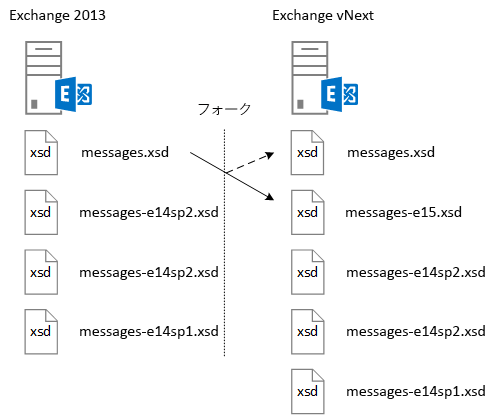

# <a name="ews-schema-versions-in-exchange"></a>Exchange の EWS スキーマのバージョン

EWS スキーマ、それと連動するアプリケーションの設計方法、ならびに各スキーマ バージョンで使用できる機能、およびスキーマと Exchange サービスのバージョンとの関係について説明します。
  
EWS のスキーマに送信され、Exchange によって返されることができるデータ構造体を定義します。 EWS 機能の大幅な変更が含まれている Exchange の新しいバージョンは、新しいスキーマに含まれます。 EWS および EWS のスキーマは、逆方向の両方と、場合によっては上位互換性の EWS の以前のバージョンに対して設計されたアプリケーションが働き、EWS、以降のバージョンで、ほとんどの場合、EWS の以降のバージョンを対象とするアプリケーション場合、同じ機能は、以前のバージョンに含まれています。 EWS のスキーマの役割、スキーマのバージョン管理の動作、スキーマのバージョンとサービスのバージョンとの間の関係および EWS スキーマを操作するアプリケーションを設計する方法を理解するには、この資料が役立ちます。 
  
## <a name="role-of-the-ews-schema"></a>EWS スキーマの役割

EWS スキーマには、次の役割があります。
  
- クライアントに提供される機能のセットを定義します。 クライアントは、SOAP の[自動検出サービス](autodiscover-for-exchange.md)を使用して、サポートされているスキーマのバージョンの一覧を取得できます。 クライアントの[EWS の機能セットは、](ews-schema-versions-in-exchange.md#bk_features)各スキーマのバージョンを表すためにアクセスできる、どの機能を決定できます。 EWS のリリースの新しい各スキーマは、以前のバージョンとの新しい機能のためのスキーマの定義からスキーマのエンティティの含まれています。 この方法では、EWS では、EWS の以前のバージョンを対象とするアプリケーションをサポートしています。
    
- API コントラクトの概要を提供する。このコントラクトを使用して、Exchange との間で送受信できるデータ構造体を判断できます。
    
- 要求を送信するためのバージョン管理メカニズムを提供する。Exchange サーバーの仮想ディレクトリには、サポートされるすべての EWS スキーマ バージョンが含まれます。  
    
## <a name="designing-your-application-with-schema-version-in-mind"></a>スキーマ バージョンを考慮したアプリケーションの設計

それぞれ異なるバージョンの EWS スキーマと連動するアプリケーションを設計するときは、次の点を念頭に置いてください。
  
- オン/オフ機能のスキーマのバージョンに基づいてください。 スキーマのバージョンと、場合によっては、サービスのバージョンには、クライアントの機能をマップします。 次の使用例は、サービス、スキーマのバージョンに基づいての[プロパティ設定](http://msdn.microsoft.com/en-us/library/office/microsoft.exchange.webservices.data.propertyset%28v=exchg.80%29.aspx)に戻ります。 
    
  ```cs
  private static PropertySet InitPropertySetByVersion(ExchangeService service)
  {
      PropertySet props;
      // The schema version to target to access the NormalizedBody property 
      // is Exchange2013 or later. The server version to target to access the 
      // NormalizedBody property on an email is 15 or later, which 
      // equates to Exchange 2013.
      if (service.RequestedServerVersion >= ExchangeVersion.Exchange2013 &amp;&amp;
          service.ServerInfo.MajorVersion >= 15)
      {
          props = new PropertySet(EmailMessageSchema.NormalizedBody);
      }
      else
      {
          props = new PropertySet(EmailMessageSchema.Body);
      }
      return props;
  }
  ```

- バージョンを使用する機能をサポートしている EWS スキーマの最も古いバージョンを要求します。 これにより、お客様より多くの潜在的な Exchange サーバーに適用します。 これが重要である場合は、組織のサーバーのみを対象とする基幹業務アプリケーションを開発しているが、幅の広い Exchange ユーザーを対象にアプリケーションを構築する場合に非常に重要です。
    
## <a name="features-by-schema-version"></a>スキーマ バージョン別の機能
<a name="bk_features"> </a>

クライアントに利用可能なスキーマのバージョンは、types.xsd スキーマ内にある**ExchangeVersionType**の単純型で識別されます。 **ExchangeVersionType**は、 [RequestServerVersion](http://msdn.microsoft.com/library/af4032d5-42b3-463e-9d0a-8236d78e5b75%28Office.15%29.aspx)要素によって実装されます。 **RequestServerVersion**要素は、クライアントの対象をスキーマのバージョンをサーバーに示すすべての EWS 要求で送信されます。 次にクライアントに提供される機能のセットを識別します。 
  
**表 1: 製品およびスキーマのバージョンの EWS 機能**

|**製品バージョン**|**関連付けられているスキーマのバージョン**|**機能**|
|:-----|:-----|:-----|
|Exchange Online  |最新のスキーマ バージョン。  |オンライン クライアント用に追加された新機能に加え、現在のバージョンの Exchange のすべての機能が含まれます。 |
|Exchange 2013 SP1 |Exchange2013_SP1 | Exchange 2013 のすべての機能が含まれています。<br/><br/>次の機能は、Exchange 2013 の SP1 で導入されました。 <ul><li>[メールボックスの保留中のポリシー](http://msdn.microsoft.com/en-us/library/office/microsoft.exchange.webservices.data.exchangeservice.setholdonmailboxes%28v=exchg.80%29.aspx) </li><li> [新しい日時を指定します。](how-to-propose-a-new-meeting-time-by-using-ews-in-exchange.md) </li><li>  [更新](http://msdn.microsoft.com/EN-US/library/office/dn600559%28v=exchg.80%29.aspx)および[削除する](http://msdn.microsoft.com/EN-US/library/office/dn600557%28v=exchg.80%29.aspx)アイテムの受領書の更新を読み取る  </li><li> 会話の[IRM の情報](http://msdn.microsoft.com/EN-US/library/office/microsoft.exchange.webservices.data.conversation.hasirm%28v=exchg.80%29.aspx)の更新  </li></ul> |
|Exchange 2013   |Exchange2013   | Exchange 2007 および Exchange 2010 で導入されたすべての機能が含まれています。 <br/><br/>次の機能は、Exchange 2013 で導入されました。<ul><li>アーカイブ  </li><li>  電子情報開示  </li><li>  ペルソナ  </li><li>  アイテム保持ポリシー  </li><li>  統合連絡先ストア  </li><li>  ユーザーの写真  </li></ul> |
|Exchange 2010 SP2   |Exchange2010_SP2 | Exchange 2010 SP1 で導入されたすべての機能が含まれています。 <br/><br/>次の機能は、Exchange 2010 SP2 で導入されました。<ul><li>パスワードの有効期限の取得  </li><li>  DateTime の精度  </li><li>  連絡先のプロパティ識別子の更新  </li><li>  新しい偽装シナリオ  </li></ul> |
|Exchange 2010 SP1  |Exchange2010_SP1   | Exchange 2010 で導入されたすべての機能が含まれています。 <br/><br/>次の機能は、Exchange 2010 SP1 で導入されました。<ul><li>受信トレイ ルールの作成、取得、変更  </li><li>  プログラムによるアーカイブ メールボックスへのアクセス  </li><li>  会話アクション  </li><li>  ファイアウォールを通過する通知  </li><li>  管理機能の向上  </li><li>  混在バージョンのサポートの向上  </li><li>  保護サポートの調整  </li><li>  EWS へのアプリケーション アクセスの制御  </li><li>  クライアント証明書認証サポート  </li></ul> |
|Exchange 2010  |Exchange2010   | Exchange 2007 SP1 で導入されたすべての機能が含まれています。 <br/><br/>次の機能は、Exchange 2010 の最初のリリース バージョンで導入されました。<ul><li>個人用完全配布リスト  </li><li>  ユーザー構成オブジェクト  </li><li>  フォルダーに関連付けられたアイテム  </li><li>  メッセージ追跡  </li><li>  ユニファイド メッセージング  </li><li>  SOAP 自動検出  </li><li>  タイム ゾーン サポートの強化  </li><li>  会議室リソースの空き時間情報  </li><li>  インデックス検索  </li><li>  ごみ箱へのアクセス  </li><li>  メールヒント情報  </li></ul> |
|Exchange 2007 SP1   |Exchange2007_SP1  | Exchange 2007 で導入されたすべての機能が含まれています。 <br/><br/>次の機能は、Exchange 2007 SP1 で導入されました。<ul><li>管理の委任  </li><li>  フォルダーのアクセス許可  </li><li>  パブリック フォルダー  </li><li>  アイテムの投稿  </li><li>  ID 変換  </li></ul>|
|Exchange 2007  |Exchange2007 | 次の機能は、Exchange 2007 の最初のリリース バージョンで導入されました。<ul><li>アイテム、フォルダー、添付ファイルへのフル アクセス (作成、取得、更新、削除)  </li><li>  可用性  </li><li>  不在設定  </li><li>  通知  </li><li>  同期  </li><li>  名前の解決  </li><li>  配布リスト (DL) の展開  </li><li>  検索  </li></ul> |
   
## <a name="relationship-between-the-ews-schema-and-the-service-version"></a>EWS スキーマとサービスのバージョンの関係
<a name="bk_features"> </a>

EWS のスキーマのバージョンは、サーバーが実行されている EWS サービスのバージョンに関連しています。 EWS のスキーマの名前付けパターンは、設置型バージョンの Exchange に関連しています。 たとえば、Exchange 2013 の最初のリリースでは、15.00.0516.032 と**Exchange2013**のスキーマ名のサービス バージョンがあります。 Exchange 2013 のスキーマが更新されたため Exchange 2013 および Exchange Online サービスのバージョン 15.00.0516.032 およびそれ以降の最新のスキーマを同じバージョンの名前であります。 以前のバージョンの Exchange では、EWS のスキーマは (プログラムのロールアップと呼ばれていた) の累積的な更新プログラムで更新されませんでした。 Exchange が Exchange Online をサポートするために頻繁に更新されるため累積的な更新が含まれていますスキーマの更新には EWS。 スキーマ ファイルの名前、および関連するスキーマのバージョン名は、サービス パックまたは Exchange の設置型のメジャー リリースでのみ更新されます。
  
EWS のスキーマでは、一部のシナリオで、コントラクトを定義、サービスのバージョンがクライアントがサービスとの対話を予定する方法を決定する唯一の方法です。 スキーマに反映されていないサービスの動作の変更は、EWS のすべての応答で返されるサービスのバージョンでのみ確認できます。 などの[パブリック フォルダー](public-folder-access-with-ews-in-exchange.md)が Exchange 2013 で再設計され、ときに操作に使用される移動およびコピーのパブリック フォルダーを変更します。 Exchange 2010 では、パブリック フォルダーをコピーするようにクライアントを設計する場合は、Exchange 2013 で同じ結果を取得する別の操作を使用するよう更新する必要があります。 
  
## <a name="how-the-ews-schema-is-updated"></a>EWS スキーマの更新のされ方
<a name="bk_features"> </a>

Exchange 2007 以降のバージョンの Exchange を実行する Exchange サーバーでは、EWS サービスをホストする仮想ディレクトリに EWS スキーマがあります。現在のスキーマ バージョンは常に、types.xsd ファイルと messages.xsd ファイルによって表されます。図 1 は、新しいバージョンのスキーマを開発するときに messages.xsd スキーマがどのようにフォークされるかを示しています。新機能が追加される前に、元の messages.xsd スキーマのコピーが取り込まれ、前のバージョンのスキーマを表す名前に変更されます。次に messages.xsd ファイルが、新しいバージョンのサービスの説明を使用して更新されます。
  
**図 1 です。EWS のスキーマを更新する方法**


  
EWS スキーマが新しいバージョン用に更新される前に、現在のバージョンのスキーマがフォークされ、次の規則に従って名前が変更されます。
  
`<schemaname>-<majorserverversion><servicepack>.xsd`
  
元のファイル名が最新スキーマを表すようになります。以前のバージョンのスキーマの更新と修正を除いて、すべての新機能が最新スキーマに追加されます。  
  
## <a name="see-also"></a>関連項目

- [Exchange のスキーマ バージョンの EWS](ews-schema-versions-in-exchange.md) 
- [Exchange の自動検出](autodiscover-for-exchange.md) 
- [Exchange の Web サービス クライアントを開発する](develop-web-service-clients-for-exchange.md)
    

