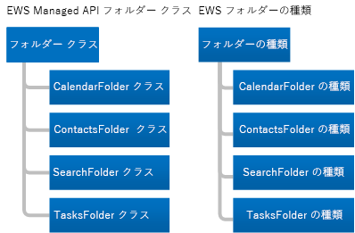
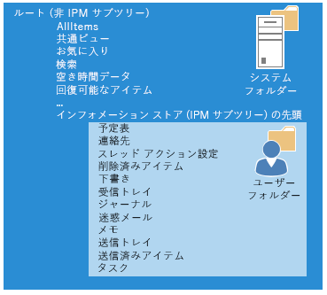

# Exchange  の EWS のフォルダーとアイテムFolders and items in EWS in Exchange

フォルダーおよびメールボックスのアイテムと、EWS マネージ API または EWS クライアントでこれらのアイテムを表す方法について説明します。Learn about folders and mailbox items and how your EWS Managed API or EWS client represents them.
  
フォルダーは、Exchange メールボックスの構成要素です。フォルダーには、メール メッセージ、連絡先、予定、会議、タスクなどのメールボックス アイテムを含めたり、その他のフォルダーを含めたりすることができます。Exchange にはさまざまな種類のフォルダーが含まれていますが、フォルダーの種類は非常によく似ています。主な違いは、含まれているアイテムの種類です。Folders are the organizing element of an Exchange mailbox. Folders can contain mailbox items, such as email messages, contacts, appointments, meetings, and tasks, or they can contain other folders. Exchange includes different types of folders, but the folder types are similar to each other. The main difference between them is the type of item they contain.
  
アイテムには、ただし、一意の型があります。Items, however, have unique types. 各項目の種類には、プロパティまたはそれを定義するスキーマの異なるセットがあります。Each item type has a different set of properties or schema to define it. この記事では、フォルダーと利用可能な項目とそれらの間の相違点の種類について説明します。In this article, we'll discuss the types of folders and items that are available and the differences between them.

## フォルダーFolders

すべてのフォルダーは、同じ基本クラスまたは基本型、EWS マネージ api では、[フォルダー](http://msdn.microsoft.com/ja-jp/library/microsoft.exchange.webservices.data.folder%28v=EXCHG.80%29.aspx)クラスまたは EWS での[フォルダー](http://msdn.microsoft.com/library/812948d8-c7db-45ce-bb3a-77233a53a974%28Office.15%29.aspx)の種類から派生します。Folders all derive from the same base class or base type, the [Folder](http://msdn.microsoft.com/ja-jp/library/microsoft.exchange.webservices.data.folder%28v=EXCHG.80%29.aspx) class in the EWS Managed API, or the [Folder](http://msdn.microsoft.com/library/812948d8-c7db-45ce-bb3a-77233a53a974%28Office.15%29.aspx) type in EWS. 次の図では、EWS のマネージ API のクラスおよび EWS 型を示します。The following figure shows the EWS Managed API classes and EWS types. 
  
**図 1 です。フォルダー クラスのマネージ API の EWS と EWS フォルダーの種類****Figure 1. EWS Managed API folder classes and EWS folder types**

  
各フォルダーのクラスとの種類のフォルダーとの間の主な相違点は、フォルダーの種類ごとに特定の種類の項目を作成することのみできます。The primary difference between each of the folder classes and folder types is that you can only create a certain type of item in each type of folder. その他の違いの 1 つが、クライアントがフォルダー内の情報を表示する方法です。One other difference is in how the client displays information in a folder. たとえば、Exchange を使用すると、予定表フォルダーで予定を作成できます。For example, Exchange allows you to create appointments in the Calendar folder. 、それらを作成した後に Outlook が表示されない、予定表フォルダーに他の種類のアイテムを移動できます。You can move other types of items into the Calendar folder after you create them, but Outlook won't display them. のみ、outlook では、[フォルダーに別の種類の項目が存在する場合でも](folders-and-items-in-ews-in-exchange.md#bk_item)、予定表フォルダーで予定や会議などの予定表アイテムが表示されます。Outlook only displays calendar items such as appointments and meetings in the Calendar folder, [even if another type of item exists in the folder](folders-and-items-in-ews-in-exchange.md#bk_item). 
  
**表 1 です。フォルダー クラスのマネージ API の EWS と EWS フォルダーの種類****Table 1. EWS Managed API folder classes and EWS folder types**

|**EWS マネージ API クラス****EWS Managed API class**|**EWS 型****EWS type**|**FolderClass 値****FolderClass value**|**内容****Contains**|**メモ****Notes**|
|:-----|:-----|:-----|:-----|:-----|
|[FolderFolder](http://msdn.microsoft.com/ja-jp/library/microsoft.exchange.webservices.data.folder%28v=exchg.80%29.aspx)   |[FolderFolder](http://msdn.microsoft.com/library/812948d8-c7db-45ce-bb3a-77233a53a974%28Office.15%29.aspx)   |IPF.NoteIPF.Note    |メール メッセージまたはフォルダー。Email messages or folders.    | フォルダーの一般的なクラスまたは EWS のマネージ API の[WellKnownFolderName](http://msdn.microsoft.com/ja-jp/library/microsoft.exchange.webservices.data.wellknownfoldername%28v=exchg.80%29.aspx)の次のフォルダーおよび EWS [DistinguishedFolderId](http://msdn.microsoft.com/library/50018162-2941-4227-8a5b-d6b4686bb32f%28Office.15%29.aspx)フォルダーの種類です。This is the generic folder class or type for the following EWS Managed API [WellKnownFolderName](http://msdn.microsoft.com/ja-jp/library/microsoft.exchange.webservices.data.wellknownfoldername%28v=exchg.80%29.aspx) folders and EWS [DistinguishedFolderId](http://msdn.microsoft.com/library/50018162-2941-4227-8a5b-d6b4686bb32f%28Office.15%29.aspx) folders: <ul><li>  ルート (IPM サブツリー)Root (IPM subtree)</li><li>NonIpmSubtreeNonIpmSubtree</li><li>受信トレイInbox</li><li>削除済みアイテムDeleted Items</li><li>下書きDrafts</li><li>ジャーナルJournal</li><li>メモNotes  </li><li>送信トレイOutbox</li><li>送信済みアイテムSent Items</li><li>メッセージ フォルダーMessage Folder</li><li>迷惑メールJunk Email</li><li>ボイス メールVoice Mail</li></ul> |
|[CalendarFolderCalendarFolder](http://msdn.microsoft.com/ja-jp/library/microsoft.exchange.webservices.data.calendarfolder%28v=exchg.80%29.aspx)   |[CalendarFolderCalendarFolder](http://msdn.microsoft.com/library/48687a78-e757-4c04-9641-bf4302c6b565%28Office.15%29.aspx)   |IPF.AppointmentIPF.Appointment    |予定および会議。Appointments and meetings.    |ユーザーは、会議出席依頼に応答すると、予定は、EWS のマネージ API の[WellKnownFolderName.Calendar](http://msdn.microsoft.com/ja-jp/library/microsoft.exchange.webservices.data.wellknownfoldername%28v=exchg.80%29.aspx)または、EWS [DistinguishedFolderId.CalendarFolder](http://msdn.microsoft.com/library/50018162-2941-4227-8a5b-d6b4686bb32f%28Office.15%29.aspx)のみに追加されます。When a user responds to a meeting request, the appointment is added to the EWS Managed API [WellKnownFolderName.Calendar](http://msdn.microsoft.com/ja-jp/library/microsoft.exchange.webservices.data.wellknownfoldername%28v=exchg.80%29.aspx) or the EWS [DistinguishedFolderId.CalendarFolder](http://msdn.microsoft.com/library/50018162-2941-4227-8a5b-d6b4686bb32f%28Office.15%29.aspx) only. これらは、会議出席依頼や返答を自動対話をサポートするフォルダーのみです。These are the only folders that support automatic interaction with meeting requests and responses.    このクラスのフォルダーまたはフォルダーの種類の予定と会議の EWS のマネージ API の[Folder.FindItem](http://msdn.microsoft.com/ja-jp/library/microsoft.exchange.webservices.data.folder.finditems%28v=EXCHG.80%29.aspx)メソッドと、[予定表ビュー](http://msdn.microsoft.com/ja-jp/library/microsoft.exchange.webservices.data.calendarview%28v=exchg.80%29.aspx)クラス、または[FindItem EWS を使用して開始日と終了日を基に取得する予定表ビューの使用をサポートしています。](http://msdn.microsoft.com/library/ebad6aae-16e7-44de-ae63-a95b24539729%28Office.15%29.aspx)操作および[予定表ビュー](http://msdn.microsoft.com/library/a4a953b8-0710-416c-95ef-59e51eba9982%28Office.15%29.aspx)の要素です。This folder class or folder type supports the use of calendar views to return appointments and meetings based on a start date and an end date by using the EWS Managed API [Folder.FindItem](http://msdn.microsoft.com/ja-jp/library/microsoft.exchange.webservices.data.folder.finditems%28v=EXCHG.80%29.aspx) method and the [CalendarView](http://msdn.microsoft.com/ja-jp/library/microsoft.exchange.webservices.data.calendarview%28v=exchg.80%29.aspx) class, or the EWS [FindItem](http://msdn.microsoft.com/library/ebad6aae-16e7-44de-ae63-a95b24539729%28Office.15%29.aspx) operation and the [CalendarView](http://msdn.microsoft.com/library/a4a953b8-0710-416c-95ef-59e51eba9982%28Office.15%29.aspx) element.    |
|[メッセージContactsFolder](http://msdn.microsoft.com/ja-jp/library/microsoft.exchange.webservices.data.contactsfolder%28v=exchg.80%29.aspx)   |[メッセージContactsFolder](http://msdn.microsoft.com/library/6c299de8-2087-4aeb-8e66-2bc7586509a6%28Office.15%29.aspx)   |IPF.ContactIPF.Contact    |連絡先と配布リスト。Contacts and distribution lists.    |なし。None.    |
|[SearchFolderSearchFolder](http://msdn.microsoft.com/ja-jp/library/microsoft.exchange.webservices.data.searchfolder%28v=exchg.80%29.aspx)   |[SearchFolderSearchFolder](http://msdn.microsoft.com/library/1a7d408b-2e98-4391-8834-085ed6d5757c%28Office.15%29.aspx)   |IPF.NoteIPF.Note    |内容は、制限またはフィルターによって決まります。検索フォルダーにサブフォルダーは含まれていません。Contents are determined by a restriction or filter. Search folders do not have subfolders.    |検索条件に一致するアイテムは、実際には検索フォルダーに含まれていません。そうではなく、メールボックスの他の場所にあります。The items that meet the search criteria are not actually contained in the search folder; instead, they are located elsewhere in the mailbox.    検索フォルダーを Outlook で使用可能にするには、検索 (Finder) フォルダーに検索 (Search) フォルダーを作成します。To ensure that Search folders are available in Outlook, create them in the Finder folder.    |
|[TasksFolderTasksFolder](http://msdn.microsoft.com/ja-jp/library/microsoft.exchange.webservices.data.tasksfolder%28v=exchg.80%29.aspx)   |[TasksFolderTasksFolder](http://msdn.microsoft.com/library/5a9a4612-8064-4986-b467-c44f268c64df%28Office.15%29.aspx)   |IPF.TaskIPF.Task    |行うべき作業アイテムが含まれています。Contains work items to complete.    |なし。None.    |
   
### フォルダー構造Folder structure

フォルダーは、メールボックスの構造を提供します。Folders provide a mailbox structure. 非 IPM サブツリーまたは EWS のルートではほとんどのユーザーに表示しない、システム フォルダーと同様に、ほとんどのユーザーは、自分のメールボックスと対話、EWS でインフォメーション ストアの最上部と呼ばれる、IPM サブツリーが含まれます。This includes the IPM Subtree, known as the Top of Information Store in EWS, where most users interact with their mailbox, as well as system folders that most users never see, which are in the Non-IPM Subtree or Root in EWS. 次の図は、ユーザー用のフォルダー構造を示しています、示し、ユーザーのアイテムのあるフォルダーはシステム フォルダーです。The following figure shows the folder structure for a user and indicates which folders are for the user's items and which are system folders.
  
**図 2 になります。メールボックス内の項目とシステム フォルダー****Figure 2. Item and system folders in a mailbox**

  
### 既知のフォルダーWell-known folders

メールボックス内には、特殊なフォルダーもあります。これらは、EWS マネージ API の既知のフォルダーまたは EWS の識別フォルダーのことです。これらのフォルダーの一部には、フォルダー名、フォルダー構造内での場所、フォルダーを削除可能かどうかについての制限があります。他の「汎用」(特殊ではない) フォルダーには、こうした制限はありません。次の既知のフォルダーまたは識別フォルダーについて理解することは重要です。これらは、ルート システム、ユーザー、検索フォルダーであり、ほとんどの実装に適用できるからです。 Of the folders in a mailbox, some are special folders. These equate to well-known folders in the EWS Managed API, or distinguished folders in EWS. Some of these folders have restrictions on the folder name, where they are located in the folder structure, and whether they can be deleted. Other "generic" (non-special) folders do not have the same restrictions. It is important for you to be familiar with the following well-known or distinguished folders because they are the root system, user, and search folders, and are applicable to most implementations. 
  
**表 2 になります。主識別し、既知のフォルダー****Table 2. Primary well-known and distinguished folders**

|**フレンドリ名****Friendly name**|**EWS のマネージ API の**WellKnownFolderName**の値****EWS Managed API **WellKnownFolderName** values**|**EWS **DistinguishedFolderId**値****EWS **DistinguishedFolderId** values**|**説明****Description**|
|:-----|:-----|:-----|:-----|
|ルート (非 IPM サブツリー)Root (Non-IPM Subtree)    |WellKnownFolderName.RootWellKnownFolderName.Root    |DistinguishedFolderId.rootDistinguishedFolderId.root    |非 IPM サブツリーとも呼ばれる、メールボックスのルート フォルダーが含まれます。このフォルダーには親が含まれていないため、フォルダーを移動、コピー、名前変更、削除することはできません。各メッセージ ストアには 1 つのルート フォルダーだけが含まれます。Contains the root folder of a mailbox, also known as the Non-IPM Subtree. This folder has no parent, and you cannot move, copy, rename, or delete it. Each message store contains only one root folder.    |
|インフォメーション ストアの先頭 (IPM サブツリー)Top of Information Store (IPM Subtree)    |WellKnownFolderName.MsgFolderRootWellKnownFolderName.MsgFolderRoot    |DistinguishedFolderId.msgfolderrootDistinguishedFolderId.msgfolderroot    |受信トレイやユーザーのその他のフォルダーが含まれます。 Contains the Inbox and other user folders.    |
|検索 (検索フォルダー)Finder (Search folders)    |WellKnownFolderName.SearchFoldersWellKnownFolderName.SearchFolders    |DistinguishedFolderId.searchfoldersDistinguishedFolderId.searchfolders.    |Outlook で表示可能な検索フォルダーが含まれます。Contains search folders that are visible in Outlook.    |
   
EWS のマネージ API の[WellKnownFolderName](http://msdn.microsoft.com/ja-jp/library/microsoft.exchange.webservices.data.folder.wellknownfoldername%28v=exchg.80%29.aspx)プロパティの値の一覧は、 [WellKnownFolderName](http://msdn.microsoft.com/ja-jp/library/microsoft.exchange.webservices.data.wellknownfoldername%28v=EXCHG.80%29.aspx)列挙体を参照してください。For a complete list of the EWS Managed API [WellKnownFolderName](http://msdn.microsoft.com/ja-jp/library/microsoft.exchange.webservices.data.folder.wellknownfoldername%28v=exchg.80%29.aspx) property values, see the [WellKnownFolderName](http://msdn.microsoft.com/ja-jp/library/microsoft.exchange.webservices.data.wellknownfoldername%28v=EXCHG.80%29.aspx) enumeration. EWS **DistinguishedFolderId**の値の一覧は、 [DistinguishedFolderId](http://msdn.microsoft.com/library/50018162-2941-4227-8a5b-d6b4686bb32f%28Office.15%29.aspx)を参照してください。For a complete list of the EWS **DistinguishedFolderId** values, see [DistinguishedFolderId](http://msdn.microsoft.com/library/50018162-2941-4227-8a5b-d6b4686bb32f%28Office.15%29.aspx).
  
### フォルダー プロパティFolder properties

EWS マネージ API では、[[フォルダーのプロパティ](http://msdn.microsoft.com/ja-jp/library/microsoft.exchange.webservices.data.folder_properties%28v=exchg.80%29.aspx)はすべて、基本クラスから派生[フォルダー](http://msdn.microsoft.com/ja-jp/library/microsoft.exchange.webservices.data.folder%28v=EXCHG.80%29.aspx)です。In the EWS Managed API, the [folder properties](http://msdn.microsoft.com/ja-jp/library/microsoft.exchange.webservices.data.folder_properties%28v=exchg.80%29.aspx) are all derived from the base [Folder](http://msdn.microsoft.com/ja-jp/library/microsoft.exchange.webservices.data.folder%28v=EXCHG.80%29.aspx) class. EWS、すべてのフォルダーが[フォルダー](http://msdn.microsoft.com/library/812948d8-c7db-45ce-bb3a-77233a53a974%28Office.15%29.aspx)の種類で使用可能なフォルダーの要素を使用します。And in EWS, all folders use the folder elements that are available on the [Folder](http://msdn.microsoft.com/library/812948d8-c7db-45ce-bb3a-77233a53a974%28Office.15%29.aspx) type. フォルダー関連のプロパティおよび要素のほとんどは簡単です (親フォルダーの ID、表示名、およびなど) がいくつかは、少しより詳細な説明を必要とします。Most of the folder-related properties and elements are straightforward (parent folder ID, display name, and so on), but a few require a little more explanation. 
  
EWS のマネージ API の[Folder.FolderClass](http://msdn.microsoft.com/ja-jp/library/microsoft.exchange.webservices.data.folder.folderclass%28v=EXCHG.80%29.aspx)プロパティまたは EWS [FolderClass](http://msdn.microsoft.com/library/0041d135-2869-4612-89a5-d1aa86aa1093%28Office.15%29.aspx)要素に次の注意事項が適用されます。The following caveats apply to the EWS Managed API [Folder.FolderClass](http://msdn.microsoft.com/ja-jp/library/microsoft.exchange.webservices.data.folder.folderclass%28v=EXCHG.80%29.aspx) property or the EWS [FolderClass](http://msdn.microsoft.com/library/0041d135-2869-4612-89a5-d1aa86aa1093%28Office.15%29.aspx) element: 
  
- 場合は、派生クラス型、またはフォルダーの設定、プロパティ、または要素の値が一致しなければなりません。If set, the value of the property or element must agree with the derived class or type of the folder. たとえば、 **FolderClass**プロパティまたは要素はフォルダーは、クラスの中に、[連絡先] フォルダーまたは予定表フォルダーのフォルダーの種類を示しますに示すことはできません。For example, the **FolderClass** property or element can't indicate that the folder is a Contacts folder while the class or type of the folder indicates the folder is a Calendar folder. 
    
- 汎用フォルダーの種類のフォルダーを作成し、 **FolderClass**プロパティまたは要素を指定できます。 またはいずれかの[フォルダーを作成する](how-to-work-with-folders-by-using-ews-in-exchange.md#bk_createfolderewsma)特定の種類の**FolderClass**プロパティまたは要素を設定できます。You can either [create folders](how-to-work-with-folders-by-using-ews-in-exchange.md#bk_createfolderewsma) of a specific type without setting the **FolderClass** property or element, or you can create a folder with the generic folder type and specify the **FolderClass** property or element. 両方のオプションは、同じ結果を作成します。Both options create the same result. 
    
- フォルダーの特定の種類を作成することによって、または**FolderClass**プロパティまたは要素自体を設定することにより、 **FolderClass**の値を設定した後は変更できません。After you set the **FolderClass** value by creating a specific type of folder or by setting the **FolderClass** property or element itself, you cannot change it. などの IPF を変更することはできません。IPF にフォルダーをメモします。フォルダーにお問い合わせください。For example, you cannot change an IPF.Note folder to an IPF.Contact folder. IPF に変更することができます、ただし、します。Note.Contoso フォルダーです。You can, however, change it to an IPF.Note.Contoso folder. 
    
- 定義済みのプレフィックスのいずれかを使用しない任意の**FolderClass**値は、IPF として扱われます。注フォルダーです。Any **FolderClass** value that does not use one of the predefined prefixes is treated as an IPF.Note folder. たとえば、IAmAFolderClass の**FolderClass**の値は、IPF として扱われます。注フォルダーです。For example, a **FolderClass** value of IAmAFolderClass is treated as an IPF.Note folder. 
    
フォルダー クラス値は、拡張可能です。The folder class value is extensible. つまり、表 1 に記載されているデフォルトの**FolderClass**値は、プレフィックスとして扱われます。 カスタム値を追加することができます。This means that the default **FolderClass** values listed in Table 1 are treated as prefixes and you can add custom values. たとえば、IPF の**FolderClass**値を持つフォルダーを作成することができます。Contact.Contoso、およびそれは、連絡先フォルダーとして扱われます。For example, you can create a folder with a **FolderClass** value of IPF.Contact.Contoso, and it is treated as a Contacts folder. 
  
どのようなように、フォルダーに、クライアントが持っているアクセス許可を削除、読み取り、および、EWS のマネージ API の[Folder.EffectiveRights](http://msdn.microsoft.com/ja-jp/library/microsoft.exchange.webservices.data.folder.effectiverights%28v=EXCHG.80%29.aspx)プロパティまたは EWS [EffectiveRights](http://msdn.microsoft.com/library/bf5278eb-3a1a-4d27-9d16-b8be043bb023%28Office.15%29.aspx)要素を使用して、変更を確認できます。You can determine what permissions the client has on the folders, such as delete, read, and modify, by using the EWS Managed API [Folder.EffectiveRights](http://msdn.microsoft.com/ja-jp/library/microsoft.exchange.webservices.data.folder.effectiverights%28v=EXCHG.80%29.aspx) property or the EWS [EffectiveRights](http://msdn.microsoft.com/library/bf5278eb-3a1a-4d27-9d16-b8be043bb023%28Office.15%29.aspx) element. 
  
### パブリック フォルダーPublic folders

パブリック フォルダーは、共有のアクセス用に設計され、収集、整理、およびワークグループまたは組織内の他のユーザーと情報を共有する簡単で効果的な方法を提供します。Public folders are designed for shared access and provide an easy and effective way to collect, organize, and share information with other people in your workgroup or organization. 配布グループのコンテンツをアーカイブするのにパブリック フォルダーを使用することもできます。You can also use public folders to archive distribution group content. パブリック フォルダーに関する詳細な情報は、 [EWS を使って Exchange パブリック フォルダーにアクセス](public-folder-access-with-ews-in-exchange.md)を参照してください。For in-depth information about public folders, see [Public folder access with EWS in Exchange](public-folder-access-with-ews-in-exchange.md).

### 隠しフォルダーHidden folders

Exchange がメールボックスのルートに作成するすべてのフォルダーは非表示、およびインフォメーション ストア上の [追加のフォルダーを非表示にするのには EWS のマネージ API または EWS を使用することができます。All the folders that Exchange creates at the root of the mailbox are hidden, and you can use the EWS Managed API or EWS to hide additional folders under the Top of Information Store. 隠しフォルダーの詳細については、 [Exchange で EWS を使用して非表示のフォルダーを操作](how-to-work-with-hidden-folders-by-using-ews-in-exchange.md)を参照してください。For more information about hidden folders, see [Work with hidden folders by using EWS in Exchange](how-to-work-with-hidden-folders-by-using-ews-in-exchange.md). 

### 検索フォルダーSearch folders

検索フォルダーは、プロパティまたは検索フィルターを定義する要素がない限り、通常のフォルダーと同じようにします。Search folders are just like regular folders, except that they have a property or element that defines the search filter. 、Exchange メールボックス内の任意のフォルダーに検索フォルダーを作成することができ、他の任意のフォルダーを作成するのと同じ方法でそれらを作成します。You can create search folders in any folder in an Exchange mailbox, and you create them in the same way that you create any other folder. ただし、検索フォルダーの Outlook、Outlook Web App、または Outlook Live で表示するのには、EWS のマネージ API を使用して作成する[SearchFolder](http://msdn.microsoft.com/ja-jp/library/microsoft.exchange.webservices.data.searchfolder%28v=exchg.80%29.aspx)オブジェクト置く必要があります[WellKnownFolderName.SearchFolders](http://msdn.microsoft.com/ja-jp/library/microsoft.exchange.webservices.data.wellknownfoldername%28v=exchg.80%29.aspx)フォルダー、および[SearchFolder](http://msdn.microsoft.com/library/1a7d408b-2e98-4391-8834-085ed6d5757c%28Office.15%29.aspx)EWS を使用して作成する型は、 [DistinguishedFolderId.SearchFolders](http://msdn.microsoft.com/library/50018162-2941-4227-8a5b-d6b4686bb32f%28Office.15%29.aspx)フォルダーにある必要があります。However, for a search folder to appear in Outlook, Outlook Web App, or Outlook Live, [SearchFolder](http://msdn.microsoft.com/ja-jp/library/microsoft.exchange.webservices.data.searchfolder%28v=exchg.80%29.aspx) objects that you create by using the EWS Managed API must be located in the [WellKnownFolderName.SearchFolders](http://msdn.microsoft.com/ja-jp/library/microsoft.exchange.webservices.data.wellknownfoldername%28v=exchg.80%29.aspx) folder, and [SearchFolder](http://msdn.microsoft.com/library/1a7d408b-2e98-4391-8834-085ed6d5757c%28Office.15%29.aspx) types that you create by using EWS must be located in the [DistinguishedFolderId.SearchFolders](http://msdn.microsoft.com/library/50018162-2941-4227-8a5b-d6b4686bb32f%28Office.15%29.aspx) folder. 検索フォルダー作成する場合は別の場所にも使用可能になるし、カスタム クライアント アプリケーションで表示することができます。If the search folder is created in a different location, it is still available and you can view it in custom client applications. 

## アイテムItems

Exchange 内では、**アイテム**を使用して、個々 の電子メール メッセージ、予定、会議、連絡先、配布リスト、タスク、投稿、およびメールボックス内の項目を表します。EWS in Exchange uses **Items** to represent individual email messages, appointments, meetings, contacts, distribution lists, tasks, posts, and other items, in a mailbox. 項目は、いずれかの厳密に型指定、関連付けられている特定のクラスまたはスキーマ、または厳密に型指定されない場合とも呼ばれる汎用的なアイテムであることを意味します。Items are either strongly typed, which means that they have a specific associated class or schema, or not strongly typed, also known as generic items. 汎用アイテムは、EWS の EWS のマネージ API と[アイテム](http://msdn.microsoft.com/library/4dfe8f48-e7b4-444d-bdf9-a34e180f598b%28Office.15%29.aspx)の種類の[項目](http://msdn.microsoft.com/ja-jp/library/microsoft.exchange.webservices.data.item%28v=exchg.80%29.aspx)のオブジェクトです。Generic items are [Item](http://msdn.microsoft.com/ja-jp/library/microsoft.exchange.webservices.data.item%28v=exchg.80%29.aspx) objects in the EWS Managed API and [Item](http://msdn.microsoft.com/library/4dfe8f48-e7b4-444d-bdf9-a34e180f598b%28Office.15%29.aspx) types in EWS. 電子メール メッセージ、連絡先、配布リスト、投稿などの共通の項目とタスクは、厳密に型指定にスキーマの特定のプロパティまたは要素を設定することができます。Common items like email messages, contacts, distribution lists, posts, and tasks are strongly typed, and you can set specific schematized properties or elements on them. 
  
**表 3。厳密に型指定された項目****Table 3. Strongly typed items**

|**EWS のマネージ API の項目の種類****EWS Managed API item type**|**EWS 項目要素****EWS item element**|
|:-----|:-----|
|[AppointmentAppointment](http://msdn.microsoft.com/ja-jp/library/microsoft.exchange.webservices.data.appointment%28v=exchg.80%29.aspx)   |[カレンダー項目CalendarItem](http://msdn.microsoft.com/library/b0c1fd27-b6da-46e5-88b8-88f00c71ba80%28Office.15%29.aspx)   |
|[ContactContact](http://msdn.microsoft.com/ja-jp/library/microsoft.exchange.webservices.data.contact%28v=exchg.80%29.aspx)   |[ContactContact](http://msdn.microsoft.com/library/66bfff50-7a91-4d81-b6a0-610b9962f677%28Office.15%29.aspx)   |
|[ContactGroupContactGroup](http://msdn.microsoft.com/ja-jp/library/microsoft.exchange.webservices.data.contactgroup%28v=exchg.80%29.aspx)   |[DistributionListDistributionList](http://msdn.microsoft.com/library/f65aea01-e870-44a2-8571-fa6c001341cc%28Office.15%29.aspx)   |
|[なかEmailMessage](http://msdn.microsoft.com/ja-jp/library/microsoft.exchange.webservices.data.emailmessage%28v=exchg.80%29.aspx)   |[MessageMessage](http://msdn.microsoft.com/library/2400b33c-43b2-4fc2-b6fb-275a99e0e810%28Office.15%29.aspx)   |
|[PostItemPostItem](http://msdn.microsoft.com/ja-jp/library/microsoft.exchange.webservices.data.postitem%28v=exchg.80%29.aspx)   |[PostItemPostItem](http://msdn.microsoft.com/library/7727ed84-9591-4a1c-bb04-12129926499b%28Office.15%29.aspx)   |
|[TaskTask](http://msdn.microsoft.com/ja-jp/library/microsoft.exchange.webservices.data.task%28v=exchg.80%29.aspx)   |[タスクTask](http://msdn.microsoft.com/library/7c84927e-db28-4c5d-b0b5-cbcc2b88d869%28Office.15%29.aspx)   |
   
EWS のマネージ API を厳密にする項目[の項目](http://msdn.microsoft.com/ja-jp/library/microsoft.exchange.webservices.data.item%28v=EXCHG.80%29.aspx)の基本クラスから派生します。EWS Managed API strongly typed items derive from the base [Item](http://msdn.microsoft.com/ja-jp/library/microsoft.exchange.webservices.data.item%28v=EXCHG.80%29.aspx) class. ただし、通常直接操作する表 3 に記載されている派生型のいずれかと**アイテム**のクラスではなく。However, you usually work with one of the derived types listed in Table 3, and not with the **Item** class directly. [ItemCollection](http://msdn.microsoft.com/ja-jp/library/dd634001%28v=EXCHG.80%29.aspx)クラスを使用するときに、**項目**のクラスのインスタンスを直接使用する可能性があります。When you work with the [ItemCollection](http://msdn.microsoft.com/ja-jp/library/dd634001%28v=EXCHG.80%29.aspx) class, however, you might work directly with instances of the **Item** class. その場合は、**項目**のクラスのインスタンスを表すストア内のアイテムの種類を決定するロジックを実装する必要があります。In that case, you should implement logic that determines the type of item in the store that the instance of the **Item** class represents. そのアイテムを操作するには、アイテムを表すクラスのインスタンスを使用して項目に連結する必要があります。To work with that item, you should bind to the item by using an instance of the class that represents the item. 
  
### フォルダー内のアイテムItems in folders

一部のフォルダーには、格納できるアイテムの種類について制限があります。これらは、Exchange メールボックス データベースがフォルダーに適用する制限であり、クライアント ビューの制限ではありません。 Some folders have restrictions about the types of items that they can contain. These are restrictions that the Exchange mailbox database applies to folders, not client view limitations. 
  
**表 4 です。フォルダーのアイテムの制限****Table 4. Item restrictions for folders**

|**EWS で API フォルダー管理クラス****EWS Managed API Folder class**|**EWS のフォルダーの種類****EWS Folder type**|**Restriction****Restriction**|
|:-----|:-----|:-----|
|[フォルダーの基本クラスBase Folder class](http://msdn.microsoft.com/ja-jp/library/microsoft.exchange.webservices.data.folder%28v=exchg.80%29.aspx)   |[FolderFolder](http://msdn.microsoft.com/library/812948d8-c7db-45ce-bb3a-77233a53a974%28Office.15%29.aspx)   |EWS のマネージ API の[なか](http://msdn.microsoft.com/ja-jp/library/microsoft.exchange.webservices.data.emailmessage%28v=exchg.80%29.aspx)の新しいオブジェクトと[PostItem](http://msdn.microsoft.com/ja-jp/library/microsoft.exchange.webservices.data.postitem%28v=exchg.80%29.aspx)オブジェクトでは、EWS の[メッセージ](http://msdn.microsoft.com/library/2400b33c-43b2-4fc2-b6fb-275a99e0e810%28Office.15%29.aspx)の種類または**PostItem**の種類は、一般的なフォルダーの中にのみ作成できます。You can only create new EWS Managed API [EmailMessage](http://msdn.microsoft.com/ja-jp/library/microsoft.exchange.webservices.data.emailmessage%28v=exchg.80%29.aspx) objects and [PostItem](http://msdn.microsoft.com/ja-jp/library/microsoft.exchange.webservices.data.postitem%28v=exchg.80%29.aspx) objects, or EWS [Message](http://msdn.microsoft.com/library/2400b33c-43b2-4fc2-b6fb-275a99e0e810%28Office.15%29.aspx) types or **PostItem** types, in the generic folders. 汎用フォルダーは、他の項目の種類に移動することができますが、クライアントは表示されませんがあります。You can move other item types into generic folders, but the client might not display them.    |
|[CalendarFolderCalendarFolder](http://msdn.microsoft.com/ja-jp/library/microsoft.exchange.webservices.data.calendarfolder%28v=exchg.80%29.aspx)   |[CalendarFolderCalendarFolder](http://msdn.microsoft.com/library/48687a78-e757-4c04-9641-bf4302c6b565%28Office.15%29.aspx)   |EWS のマネージ API の[予定](http://msdn.microsoft.com/ja-jp/library/microsoft.exchange.webservices.data.appointment%28v=exchg.80%29.aspx)の新しいオブジェクトおよび EWS[カレンダー項目](http://msdn.microsoft.com/library/b0c1fd27-b6da-46e5-88b8-88f00c71ba80%28Office.15%29.aspx)の種類は、予定表フォルダーでのみ作成できます。You can only create new EWS Managed API [Appointment](http://msdn.microsoft.com/ja-jp/library/microsoft.exchange.webservices.data.appointment%28v=exchg.80%29.aspx) objects and EWS [CalendarItem](http://msdn.microsoft.com/library/b0c1fd27-b6da-46e5-88b8-88f00c71ba80%28Office.15%29.aspx) types in the Calendar folder. 予定表] フォルダーにその他の項目の種類を移動することができますが、クライアントは表示されませんがあります。You can move other item types into the Calendar folder, but the client might not display them.    |
|[メッセージContactsFolder](http://msdn.microsoft.com/ja-jp/library/microsoft.exchange.webservices.data.contactsfolder%28v=exchg.80%29.aspx)   |[メッセージContactsFolder](http://msdn.microsoft.com/library/6c299de8-2087-4aeb-8e66-2bc7586509a6%28Office.15%29.aspx)   |新しい EWS のマネージ API の[連絡先](http://msdn.microsoft.com/ja-jp/library/microsoft.exchange.webservices.data.contact%28v=exchg.80%29.aspx)オブジェクトと[ContactGroup](http://msdn.microsoft.com/ja-jp/library/microsoft.exchange.webservices.data.contactgroup%28v=exchg.80%29.aspx)オブジェクト、または EWS[連絡先](http://msdn.microsoft.com/library/66bfff50-7a91-4d81-b6a0-610b9962f677%28Office.15%29.aspx)型または[DistributionList](http://msdn.microsoft.com/library/f65aea01-e870-44a2-8571-fa6c001341cc%28Office.15%29.aspx)型は、連絡先フォルダーでのみ作成できます。You can only create new EWS Managed API [Contact](http://msdn.microsoft.com/ja-jp/library/microsoft.exchange.webservices.data.contact%28v=exchg.80%29.aspx) and [ContactGroup](http://msdn.microsoft.com/ja-jp/library/microsoft.exchange.webservices.data.contactgroup%28v=exchg.80%29.aspx) objects, or EWS [Contact](http://msdn.microsoft.com/library/66bfff50-7a91-4d81-b6a0-610b9962f677%28Office.15%29.aspx) types or [DistributionList](http://msdn.microsoft.com/library/f65aea01-e870-44a2-8571-fa6c001341cc%28Office.15%29.aspx) types in the Contacts folder. 連絡先フォルダーにその他の項目の種類を移動することができますが、クライアントに表示されません。You can move other item types into the Contacts folder, but the client might not display them    |
|[SearchFolderSearchFolder](http://msdn.microsoft.com/ja-jp/library/microsoft.exchange.webservices.data.searchfolder%28v=exchg.80%29.aspx)   |[SearchFolderSearchFolder](http://msdn.microsoft.com/library/1a7d408b-2e98-4391-8834-085ed6d5757c%28Office.15%29.aspx)   |制限はありません。アイテムは実際には検索フォルダー内に存在しません。これらは、メールボックス内の別の場所に存在します。No restrictions. Items are not actually located in the Search folder; they are located elsewhere in the mailbox.    |
|[TasksFolderTasksFolder](http://msdn.microsoft.com/ja-jp/library/microsoft.exchange.webservices.data.tasksfolder%28v=exchg.80%29.aspx)   |[TasksFolderTasksFolder](http://msdn.microsoft.com/library/5a9a4612-8064-4986-b467-c44f268c64df%28Office.15%29.aspx)   |新しい EWS マネージ API[タスク](http://msdn.microsoft.com/ja-jp/library/microsoft.exchange.webservices.data.task%28v=exchg.80%29.aspx)オブジェクトまたは EWS の[タスク](http://msdn.microsoft.com/library/7c84927e-db28-4c5d-b0b5-cbcc2b88d869%28Office.15%29.aspx)の種類は、[仕事] フォルダーでのみ作成できます。You can only create new EWS Managed API [Task](http://msdn.microsoft.com/ja-jp/library/microsoft.exchange.webservices.data.task%28v=exchg.80%29.aspx) objects or EWS [Task](http://msdn.microsoft.com/library/7c84927e-db28-4c5d-b0b5-cbcc2b88d869%28Office.15%29.aspx) types in the Tasks folder. タスク] フォルダーにその他の項目の種類を移動することができますが、クライアントに表示されません。You can move other item types into the Tasks folder, but the client might not display them    |

## 以前の製品バージョンからのアップグレードUpgrading from earlier product versions

フォルダーの大部分は以前のバージョンおよび現在の製品バージョンで変更されていないままであります。Folders have for the most part remained unchanged in earlier and current product versions. ただし、Exchange の以前のバージョンでの管理フォルダーを使用して、メッセージング レコード管理 (MRM) を実行することに注意してください。Note, however, that earlier versions of Exchange use managed folders to perform messaging records management (MRM). Exchange のオンライン、Exchange オンライン Office 365 の一部のバージョンの Exchange が Exchange 2013 で始まるとは、MRM のリテンション ・ ポリシーを使用します。Exchange Online, Exchange Online as part of Office 365, and versions of Exchange starting with Exchange 2013 use retention policies for MRM. [アップグレード ・ リテンション ・ ポリシーを使用するフォルダーを管理する](http://technet.microsoft.com/ja-jp/library/dd298032%28v=exchg.150%29.aspx)ことができます。You can [upgrade managed folders to use retention policies](http://technet.microsoft.com/ja-jp/library/dd298032%28v=exchg.150%29.aspx). 
  
以前および現在の製品バージョンで、アイテムは変更されていません。Items have not changed in earlier and current product versions.

## このセクションの内容In this section

- [Exchange EWS を使用してフォルダーを操作します。Work with folders by using EWS in Exchange](how-to-work-with-folders-by-using-ews-in-exchange.md)
    
- [Exchange EWS を使用して非表示のフォルダーの操作します。Work with hidden folders by using EWS in Exchange](how-to-work-with-hidden-folders-by-using-ews-in-exchange.md)
    
- [EWS を使用して Exchange で Exchange メールボックスのアイテムを扱うWork with Exchange mailbox items by using EWS in Exchange](how-to-work-with-exchange-mailbox-items-by-using-ews-in-exchange.md)
    
- [Exchange EWS を使用して項目を削除します。Delete items by using EWS in Exchange](deleting-items-by-using-ews-in-exchange.md)
    
- [エクスポートし、Exchange の EWS を使用してアイテムをインポートExport and import items by using EWS in Exchange](exporting-and-importing-items-by-using-ews-in-exchange.md)
    
## 関連項目See also

- [Exchange の Web サービス クライアントを開発するDevelop web service clients for Exchange](develop-web-service-clients-for-exchange.md)   
- [Exchange で Web サービスの使用を開始するStart using web services in Exchange](start-using-web-services-in-exchange.md)   
- [Exchange の EWS クライアントの設計の概要EWS client design overview for Exchange](ews-client-design-overview-for-exchange.md)
    

