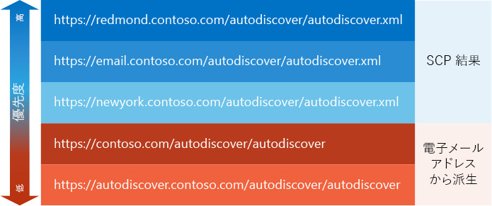

# 自動検出エンドポイントの一覧を生成します。Generate a list of Autodiscover endpoints

自動検出エンドポイントの優先順位を付けた一覧を生成する方法について説明します。Find out how to generate a prioritized list of Autodiscover endpoints.
  
[自動検出プロセス](autodiscover-for-exchange.md)の最初のタスクでは、実行するアプリケーションの自動検出エンドポイントの一覧を生成します。The first task in the [Autodiscover process](autodiscover-for-exchange.md) is to generate a list of Autodiscover endpoints for your application to try. これらのエンドポイントの自動検出は、 [SCP のルックアップ](how-to-find-autodiscover-endpoints-by-using-scp-lookup-in-exchange.md)に由来することができます。 またはユーザーの電子メール アドレスから派生させることができます。These Autodiscover endpoints can come from an [SCP lookup](how-to-find-autodiscover-endpoints-by-using-scp-lookup-in-exchange.md) or can be derived from the user's email address. 最後に、エンドポイントの数が多い場合終了できます。In the end, you can end up with a large number of endpoints. 優先順位を整理する方法を見てみましょう。Let's take a look at how you can organize them by priority. 
  
## SCP 参照から始めるStart with SCP lookup

[SCP の検索](how-to-find-autodiscover-endpoints-by-using-scp-lookup-in-exchange.md)からの自動検出エンドポイントの一覧で最上位の優先順位が必要です。Autodiscover endpoints that come from an [SCP lookup](how-to-find-autodiscover-endpoints-by-using-scp-lookup-in-exchange.md) should have top priority in your list. 管理者は、これらのエンドポイントを使用して起動するので、最も近いまたは最も効率的な自動検出エンドポイントに、クライアントをルーティングする SCP オブジェクトを構成できます。Administrators can configure SCP objects to route your client to the closest or most efficient Autodiscover endpoint, so it is a good idea to start with these endpoints. SCP 検索プロセスは、独自の優先順位付けがあるため、SCP 検索の結果既に優先度付けは、次のように。Because the SCP lookup process has its own prioritization scheme, the results of an SCP lookup are already prioritized, as follows: 
  
1. クライアント コンピューターが属する Active Directory サイトを対象とする SCP オブジェクトからの自動検出エンドポイント。Autodiscover endpoints from SCP objects scoped to the Active Directory site that the client computer belongs to.
    
2. Active Directory サイトのいずれをも対象としない SCP オブジェクトからの自動検出エンドポイント。Autodiscover endpoints from SCP objects not scoped to any Active Directory site.
    
3. クライアント コンピューターが属するサイトとは別の Active Directory サイトを対象とする SCP オブジェクトからの自動検出エンドポイント。Autodiscover endpoints from SCP objects scoped to a different Active Directory site than the site that the client computer belongs to.
    
SCP 検索プロセスの結果を作成したら、ユーザーの電子メール アドレスから派生するエンドポイントを追加できます。After you have the results of the SCP lookup process, you can add endpoints that derive from the user's email address. これらは、SCP の結果が存在しないか、SCP 検索から返されたエンドポイントは不十分な場合に既定のエンドポイント、およびフォールバックのセットとして使用できます。These can serve as a default set of endpoints and a fallback in case there are no SCP results or the endpoints returned from the SCP lookup are not sufficient.
  
## ユーザーのメール アドレスから派生したエンドポイントを追加するAdd endpoints derived from the user's email address

SCP 参照が動作しない場合、または SCP 参照によって返されたエンドポイントが正常な応答を返さない場合、ユーザーのメール アドレスから既定の自動検出エンドポイントのセットを得ることができます。これらのエンドポイントは SCP 参照からのどのエンドポイントよりも優先度は低くなりますが、SCP 参照が失敗する場合に必要になる可能性があります。When SCP lookup doesn't work, or the endpoints returned by the SCP lookup don't return a successful response, you can derive a set of default Autodiscover endpoints from the user's email address. These endpoints should be a lower priority than any that come from an SCP lookup, but you might need them if the SCP lookup was not successful.
  
### 自動検出エンドポイントを取得する方法To derive Autodiscover endpoints

1. ユーザーのメール アドレスからドメイン名を抽出します。たとえば、ユーザーのメール アドレスが Sadie.Daniels@contoso.com である場合、ドメイン名は contoso.com になります。Extract the domain name from the user's email address. For example, if the user's email address is Sadie.Daniels@contoso.com, the domain name would be contoso.com.
    
2. ファイル拡張子を持たないエンドポイント URL を、次の形式で作成します。Construct endpoint URLs without file extensions in the following formats:
    
  - "https://" + ドメイン + "/autodiscover/autodiscover""https://" + domain + "/autodiscover/autodiscover"
    
  - "https://autodiscover." + ドメイン +「自動検出/自動検出」+ domain + "/autodiscover/autodiscover"
    
SCP 検索とユーザーの電子メール アドレスの両方から派生するエンドポイントの Url のリストをコンパイルした後は、 [SOAP の自動検出 web サービス](http://msdn.microsoft.com/library/61c21ea9-7fea-4f56-8ada-bf80e1e6b074%28Office.15%29.aspx)または POX の[のどちらを使用しているかどうかに応じて、これらの Url でファイル名の拡張子を変更する必要があります。自動検出 web サービス](http://msdn.microsoft.com/library/877152f0-f4b1-4f63-b2ce-924f4bdf2d20%28Office.15%29.aspx)。After you compile the list of endpoint URLs that derive from both SCP lookup and the user's email address, you might need to revise file name extensions in those URLs, depending on whether you're using the [SOAP Autodiscover web service](http://msdn.microsoft.com/library/61c21ea9-7fea-4f56-8ada-bf80e1e6b074%28Office.15%29.aspx) or the [POX Autodiscover web service](http://msdn.microsoft.com/library/877152f0-f4b1-4f63-b2ce-924f4bdf2d20%28Office.15%29.aspx).
  
## エンドポイント URL のファイル名拡張子を追加または置き換えるAdd or replace file name extensions in endpoint URLs

自動検出サービスにアクセスするには、SOAP 自動検出 Web サービスまたは POX 自動検出 Web サービスを使用します。各サービスでは、類似したエンドポイント URL (ファイル名拡張子だけが異なる) が使用されます。SOAP 自動検出 Web サービスでは ".svc" ファイル名拡張子が使用され、POX 自動検出 Web サービスでは ".xml" ファイル名拡張子が使用されます。You can access the Autodiscover service by using either the SOAP Autodiscover web service or the POX Autodiscover web service. Each service uses similar endpoint URLs, with the only difference being the file name extension. The SOAP Autodiscover web service uses the ".svc" file name extension, and the POX Autodiscover web service uses the ".xml" file name extension.
  
既定では、SCP 参照から返された自動検出エンドポイント URL は POX URL です。ただし、SOAP 自動検出を使用している場合は、ファイル名拡張子を ".xml" から ".svc" に変更するだけで、SOAP 要求を試行できます。By default, the Autodiscover endpoint URLs returned from an SCP lookup are POX URLs. However, if you are using SOAP Autodiscover, you can simply change the file name extension from ".xml" to ".svc" and try a SOAP request.
  
派生した自動検出エンドポイント URL の場合、ファイル拡張子は省略されています。URL を試用する前に、使用中の自動検出 Web サービスに適切なファイル拡張子を追加します。For the derived Autodiscover endpoint URLs, the file extension is omitted. Add the appropriate file extension for the Autodiscover web service you are using prior to trying the URL.
  
## 例:自動検出エンドポイントの一覧を生成するExample: Generating a list of Autodiscover endpoints

例を見てみましょう。Sadie Daniels (Sadie.Daniels@contoso.com) は、Exchange Web サービス (EWS) アプリケーションを初めて使用しています。アプリケーションでは、アプリケーション自体を構成するのに自動検出を使用します。Sadie のコンピューターは、contoso.com ドメインに参加し、Redmond Active Directory サイトにあります。アプリケーションでは、図 1 に示すように自動検出エンドポイントの一覧が生成されます。Let's take a look at an example. Sadie Daniels (Sadie.Daniels@contoso.com) is using an Exchange Web Services (EWS) application for the first time. The application uses Autodiscover to configure itself. Sadie's computer is joined to the contoso.com domain and is in the Redmond Active Directory site. The application generates the list of Autodiscover endpoints shown in Figure 1.
  
**自動検出エンドポイントの図 1: サンプルの一覧****Figure 1: Sample list of Autodiscover endpoints**

  
この例の EWS アプリケーションでは SOAP 自動検出 Web サービスが使用されるため、SCP 結果のファイル名拡張子を ".svc" に変更してから SOAP 要求を送信します。The EWS application in this example prefers the SOAP Autodiscover web service, so it changes the file name extension for the SCP results to ".svc" before sending SOAP requests to them.
  
## 次の手順Next steps

自動検出エンドポイントの一覧を生成した後は、[これらのエンドポイントへの要求を送信](how-to-get-user-settings-from-exchange-by-using-autodiscover.md)してください。After you generate a list of Autodiscover endpoints, try them by [sending requests to those endpoints](how-to-get-user-settings-from-exchange-by-using-autodiscover.md).
  
## 関連項目See also

- [Exchange の自動検出Autodiscover for Exchange](autodiscover-for-exchange.md)
    
- [Exchange SCP のルックアップを使用して自動検出エンドポイントを検索します。Find Autodiscover endpoints by using SCP lookup in Exchange](how-to-find-autodiscover-endpoints-by-using-scp-lookup-in-exchange.md)
    
- [自動検出のエラー メッセージの処理Handling Autodiscover error messages](handling-autodiscover-error-messages.md)
    

