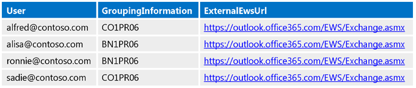
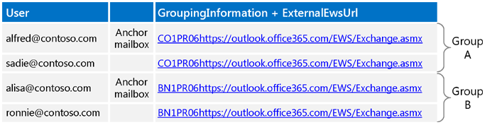
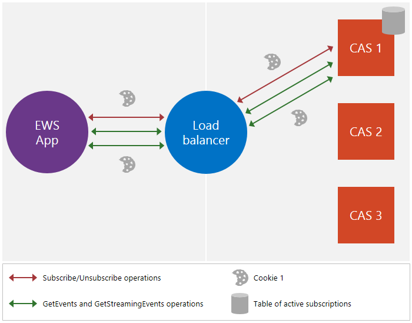
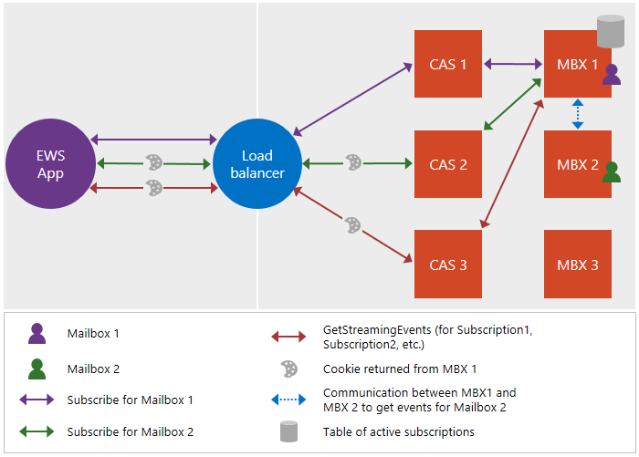

# <a name="maintain-affinity-between-a-group-of-subscriptions-and-the-mailbox-server-in-exchange"></a><span data-ttu-id="87f9a-103">Exchange の購読グループとメールボックス サーバー間のアフィニティを維持します。</span><span class="sxs-lookup"><span data-stu-id="87f9a-103">Maintain affinity between a group of subscriptions and the Mailbox server in Exchange</span></span>

<span data-ttu-id="87f9a-104">サブスクリプション グループとメールボックス サーバー間のアフィニティの維持について説明します。</span><span class="sxs-lookup"><span data-stu-id="87f9a-104">Find out about maintaining the affinity between a group of subscriptions and the Mailbox server.</span></span>
  
<span data-ttu-id="87f9a-105">アフィニティは、特定のメールボックス サーバーと一連の要求および応答メッセージの関連付けです。</span><span class="sxs-lookup"><span data-stu-id="87f9a-105">Affinity is the association of a sequence of request and response messages with a particular Mailbox server.</span></span> <span data-ttu-id="87f9a-106">Exchange のほとんどの機能のため、アフィニティは、サーバーによって処理されます。</span><span class="sxs-lookup"><span data-stu-id="87f9a-106">For most functionality in Exchange, affinity is handled by the server.</span></span> <span data-ttu-id="87f9a-107">ただしは、通知を使用すると、例外です。</span><span class="sxs-lookup"><span data-stu-id="87f9a-107">Notifications, however, are an exception.</span></span> <span data-ttu-id="87f9a-108">クライアントの通知サブスクリプションをメールボックス サーバーとの類似性を維持するための責任です。</span><span class="sxs-lookup"><span data-stu-id="87f9a-108">The client is responsible for maintaining the affinity with the Mailbox server for notification subscriptions.</span></span> <span data-ttu-id="87f9a-109">このアフィニティは、負荷分散装置とクライアント アクセス サーバーのクライアントとサーバーがルートの通知サブスクリプションとサブスクリプションを保持しているメールボックス サーバーに関連する要求の間で有効にします。</span><span class="sxs-lookup"><span data-stu-id="87f9a-109">This affinity enables the load balancer and Client Access servers between the client and the server to route notification subscriptions and related requests to the Mailbox server that maintains the subscription.</span></span> <span data-ttu-id="87f9a-110">関係なしには、クライアントのサブスクリプションでは、返される[ErrorSubscriptionNotFound](http://msdn.microsoft.com/library/4b84d670-74c9-4d6d-84e7-f0a9f76f0d93%28Office.15%29.aspx)エラーが発生することができますが含まれていない別のメールボックス サーバーに要求をルーティングを取得可能性があります。</span><span class="sxs-lookup"><span data-stu-id="87f9a-110">Without affinity, the request might get routed to a different Mailbox server that does not include the client's subscriptions, which can cause an [ErrorSubscriptionNotFound](http://msdn.microsoft.com/library/4b84d670-74c9-4d6d-84e7-f0a9f76f0d93%28Office.15%29.aspx) error to be returned.</span></span> 
  
## <a name="how-is-affinity-maintained"></a><span data-ttu-id="87f9a-111">アフィニティはどのように維持されますか？</span><span class="sxs-lookup"><span data-stu-id="87f9a-111">How is affinity maintained?</span></span>
<span data-ttu-id="87f9a-112"><a name="bk_howmaintained"> </a></span><span class="sxs-lookup"><span data-stu-id="87f9a-112"></span></span>

<span data-ttu-id="87f9a-p102">Exchange でのアフィニティは、Cookie に基づきます。クライアントがサブスクリプション要求に特定のヘッダーを含めることにより、Cookie の作成をトリガーし、次いでサブスクリプションの応答に Cookie が含められます。クライアントは、要求が適切なメールボックス サーバーにルーティングされるようにするために、それ以降の要求で Cookie を送信します。</span><span class="sxs-lookup"><span data-stu-id="87f9a-p102">Affinity in Exchange is cookie based. The client triggers the creation of the cookie by including specific headers in the subscription request, and then the subscription response contains the cookie. The client then sends that cookie in subsequent requests to ensure that the request is routed to the right Mailbox server.</span></span>
  
<span data-ttu-id="87f9a-116">具体的には、Exchange でのアフィニティは、次のように処理されます。 </span><span class="sxs-lookup"><span data-stu-id="87f9a-116">More specifically, affinity in Exchange is handled by the following:</span></span> 
  
- <span data-ttu-id="87f9a-p103">X-AnchorMailbox – 初期サブスクリプション要求に含まれる HTTP ヘッダー。同じメールボックス サーバーとアフィニティを共有するメールボックスのグループの最初のメールボックスを識別します。</span><span class="sxs-lookup"><span data-stu-id="87f9a-p103">X-AnchorMailbox — An HTTP header that is included in the initial subscription request. It identifies the first mailbox in a group of mailboxes that share affinity with the same Mailbox server.</span></span>
    
- <span data-ttu-id="87f9a-119">X-PreferServerAffinity – X-AnchorMailbox ヘッダーを持つ最初のサブスクリプション要求に含まれる HTTP ヘッダー。アフィニティがメールボックス サーバーで維持されるようクライアントが要求していることを示す場合に true に設定されます。</span><span class="sxs-lookup"><span data-stu-id="87f9a-119">X-PreferServerAffinity — An HTTP header that is included in the initial subscription request with the X-AnchorMailbox header and is set to true to indicate that the client is requesting that affinity be maintained with the Mailbox server.</span></span>
    
- <span data-ttu-id="87f9a-120">X-BackEndOverrideCookie – 最初のサブスクリプション応答に含まれる Cookie。後続の要求を同じメールボックス サーバーにルーティングするためにロード バランサーとクライアント アクセス サーバーが使用する Cookie を含みます。</span><span class="sxs-lookup"><span data-stu-id="87f9a-120">X-BackEndOverrideCookie — A cookie that is included in the initial subscription response and contains a cookie that the load balancer and Client Access server use to route subsequent requests to the same Mailbox server.</span></span>
    
## <a name="how-do-i-maintain-affinity-by-using-the-ews-managed-api-or-ews"></a><span data-ttu-id="87f9a-121">EWS Managed API または EWS を使用してアフィニティを維持する方法</span><span class="sxs-lookup"><span data-stu-id="87f9a-121">How do I maintain affinity by using the EWS Managed API or EWS?</span></span>
<span data-ttu-id="87f9a-122"><a name="bk_howdoimaintain"> </a></span><span class="sxs-lookup"><span data-stu-id="87f9a-122"></span></span>

<span data-ttu-id="87f9a-123">同じ手順を使用して、複数のメールボックスのサブスクリプションとメールボックス サーバーに対するアフィニティを維持できます。ストリーミング、プル、またはプッシュの通知のどれを使用しているかには関係なく、オンプレミスの Exchange Server または Exchange Online のどちらを対象としているかにも関係ありません。</span><span class="sxs-lookup"><span data-stu-id="87f9a-123">You can use the same steps to maintain affinity for multiple mailbox subscriptions and their Mailbox servers, regardless of whether you are using streaming, pull, or push notifications, and regardless of whether you're targeting an Exchange on-premises server or Exchange Online.</span></span>
  
1. <span data-ttu-id="87f9a-124">メールボックスごとに[自動検出を呼び出す](how-to-get-user-settings-from-exchange-by-using-autodiscover.md)し、GroupingInformation と ExternalEwsUrl のユーザー設定を取得します。</span><span class="sxs-lookup"><span data-stu-id="87f9a-124">For each mailbox, [call Autodiscover](how-to-get-user-settings-from-exchange-by-using-autodiscover.md) and get the GroupingInformation and ExternalEwsUrl user settings.</span></span> <span data-ttu-id="87f9a-125">SOAP の自動検出の[設定](http://msdn.microsoft.com/library/43db26e1-f7be-49fd-b26b-fc1b10bd3458%28Office.15%29.aspx)要素を使用して POX の自動検出は、 [GroupingInformation](http://msdn.microsoft.com/library/2d8a007f-d79c-43c8-90e3-2c6d883f3a7c%28Office.15%29.aspx)要素を使用します。</span><span class="sxs-lookup"><span data-stu-id="87f9a-125">For SOAP Autodiscover, you use the [Setting](http://msdn.microsoft.com/library/43db26e1-f7be-49fd-b26b-fc1b10bd3458%28Office.15%29.aspx) element, and for POX Autodiscover, you use the [GroupingInformation](http://msdn.microsoft.com/library/2d8a007f-d79c-43c8-90e3-2c6d883f3a7c%28Office.15%29.aspx) element.</span></span> 
    
2. <span data-ttu-id="87f9a-p105">自動検出応答からの GroupingInformation と ExternalEwsUrl 設定を使用して、メールボックスを同じグループの ExternalEwsUrl と GroupingInformation の連結された値に配置します。グループに 200 個を超えるメールボックスがある場合は、グループをさらに分解して、各グループが 200 個を超えるメールボックスを持たないようにします。</span><span class="sxs-lookup"><span data-stu-id="87f9a-p105">Using the GroupingInformation and ExternalEwsUrl settings from the Autodiscover responses, place mailboxes with the same ExternalEwsUrl and GroupingInformation concatenated value in the same group. If any groups have more than 200 mailboxes, break the groups down further so that each group has no more than 200 mailboxes.</span></span>
    
3. <span data-ttu-id="87f9a-128">作成し、プロシージャの残りの部分の 1 つの[ExchangeService](http://msdn.microsoft.com/en-us/library/microsoft.exchange.webservices.data.exchangeservice%28v=EXCHG.80%29.aspx)オブジェクトを使用します。</span><span class="sxs-lookup"><span data-stu-id="87f9a-128">Create and use one [ExchangeService](http://msdn.microsoft.com/en-us/library/microsoft.exchange.webservices.data.exchangeservice%28v=EXCHG.80%29.aspx) object for the rest of the procedure.</span></span> <span data-ttu-id="87f9a-129">使用すると、同じ**ExchangeService**オブジェクト、cookie およびヘッダー (設定している) 場合は自動的に維持されます。</span><span class="sxs-lookup"><span data-stu-id="87f9a-129">When you use the same **ExchangeService** object, cookies and headers (when they are set) are automatically maintained.</span></span> <span data-ttu-id="87f9a-130">グループ ストリーミングのサブスクリプションの単一の接続にする予定がない場合としている偽装されたユーザーごとに別の**ExchangeService**オブジェクトを作成するに注意してください。</span><span class="sxs-lookup"><span data-stu-id="87f9a-130">Note that if you do not intend to group streaming subscriptions into a single connection, you are free to create a different **ExchangeService** object for each impersonated user.</span></span> 
    
4. <span data-ttu-id="87f9a-131">グループ内のすべてのユーザーがアルファベット順に並べ替えられたときに、ユーザー名が最初に表示するユーザーの要求を[送信するサブスクリプション](notification-subscriptions-mailbox-events-and-ews-in-exchange.md)(私たちを参照してくださいアンカーのメールボックスのユーザーとしてこのユーザー)。</span><span class="sxs-lookup"><span data-stu-id="87f9a-131">[Send a subscription](notification-subscriptions-mailbox-events-and-ews-in-exchange.md) request for the user whose user name appears first when all users in the group are sorted alphabetically (we'll refer to this user as the anchor mailbox user).</span></span> <span data-ttu-id="87f9a-132">次の操作を行います。</span><span class="sxs-lookup"><span data-stu-id="87f9a-132">Do the following:</span></span> 
    
  - <span data-ttu-id="87f9a-133">アンカーのメールボックス ユーザーの SMTP アドレスに設定された値を持つ X-AnchorMailbox ヘッダーを含めます。</span><span class="sxs-lookup"><span data-stu-id="87f9a-133">Include the X-AnchorMailbox header with a value set to the SMTP address of the anchor mailbox user.</span></span>
    
  - <span data-ttu-id="87f9a-134">値が true に設定された X-PreferServerAffinity ヘッダーを含めます。</span><span class="sxs-lookup"><span data-stu-id="87f9a-134">Include the X-PreferServerAffinity header with a value set to true.</span></span>
    
  - <span data-ttu-id="87f9a-135">[ApplicationImpersonation](http://technet.microsoft.com/en-us/library/dd776119%28v=exchg.150%29.aspx)ロール ( [ExchangeImpersonation](http://msdn.microsoft.com/library/d8cbac49-47d0-4745-a2a7-545d33f8da93%28Office.15%29.aspx)型) を使用します。</span><span class="sxs-lookup"><span data-stu-id="87f9a-135">Use the [ApplicationImpersonation](http://technet.microsoft.com/en-us/library/dd776119%28v=exchg.150%29.aspx) role (the [ExchangeImpersonation](http://msdn.microsoft.com/library/d8cbac49-47d0-4745-a2a7-545d33f8da93%28Office.15%29.aspx) type).</span></span> 
    
5. <span data-ttu-id="87f9a-p108">サブスクリプションの応答で、X-BackEndOverrideCookie の値を取得します。このグループ内のユーザーに対するそれ以降のサブスクリプション要求のそれぞれに、この値を含めます。</span><span class="sxs-lookup"><span data-stu-id="87f9a-p108">In the subscription response, get the X-BackEndOverrideCookie value. Include this value in each of the subsequent subscription requests for users in this group.</span></span>
    
6. <span data-ttu-id="87f9a-138">グループ内の追加ユーザーごとに、サブスクリプション要求を送信して、次の操作を行います。</span><span class="sxs-lookup"><span data-stu-id="87f9a-138">For each additional user in the group, send a subscription request and do the following:</span></span>
    
  - <span data-ttu-id="87f9a-139">グループのアンカーのメールボックス ユーザーの SMTP アドレスに設定された値と X-AnchorMailbox ヘッダーを含めます。</span><span class="sxs-lookup"><span data-stu-id="87f9a-139">Include the X-AnchorMailbox header with a value set to the SMTP address of the anchor mailbox user for the group.</span></span>
    
  - <span data-ttu-id="87f9a-140">値が true に設定された X-PreferServerAffinity ヘッダーを含めます。</span><span class="sxs-lookup"><span data-stu-id="87f9a-140">Include the X-PreferServerAffinity header with a value set to true.</span></span>
    
  - <span data-ttu-id="87f9a-141">サブスクリプションのアンカーのメールボックス ユーザーの応答で返された X BackEndOverrideCookie が含まれます。</span><span class="sxs-lookup"><span data-stu-id="87f9a-141">Include the X-BackEndOverrideCookie that was returned in the anchor mailbox user's subscription response.</span></span>
    
  - <span data-ttu-id="87f9a-142">[ApplicationImpersonation](http://technet.microsoft.com/en-us/library/dd776119%28v=exchg.150%29.aspx)ロール ( [ExchangeImpersonation](http://msdn.microsoft.com/library/d8cbac49-47d0-4745-a2a7-545d33f8da93%28Office.15%29.aspx)型) を使用します。</span><span class="sxs-lookup"><span data-stu-id="87f9a-142">Use the [ApplicationImpersonation](http://technet.microsoft.com/en-us/library/dd776119%28v=exchg.150%29.aspx) role (the [ExchangeImpersonation](http://msdn.microsoft.com/library/d8cbac49-47d0-4745-a2a7-545d33f8da93%28Office.15%29.aspx) type).</span></span> 
    
    <span data-ttu-id="87f9a-p109">サーバーは X-PreferServerAffinity と X-BackendOverrideCookie の値を一緒に使用して、メールボックス サーバーへのルーティングを実行することに注意してください。X-AnchorMailbox ヘッダーも必要ですが、他の 2 つの値が有効な場合、サーバーでは無視されます。X-AnchorMailbox と X-PreferServerAffinity が要求内にあり、X-BackendOverrideCookie が含まれていない場合、X-AnchorMailbox の値が要求のルーティングに使用されます。</span><span class="sxs-lookup"><span data-stu-id="87f9a-p109">Note that the server uses the X-PreferServerAffinity and X-BackendOverrideCookie values together to perform the routing to the mailbox server. The X-AnchorMailbox header is also required, but is ignored by the server if the other two values are valid. If X-AnchorMailbox and X-PreferServerAffinity are in a request and X-BackendOverrideCookie is not included, the X-AnchorMailbox value is used to route the requests.</span></span>
    
    <span data-ttu-id="87f9a-146">X-PreferServerAffinity と X-BackendOverrideCookie の値がルーティングを実行するため、アンカーのメールボックスが別のグループまたはサーバーに移動する場合、X-BackendOverrideCookie が要求をグループの適切なサーバーにルーティングし、ロジックは変わりません。</span><span class="sxs-lookup"><span data-stu-id="87f9a-146">Because the X-PreferServerAffinity and X-BackendOverrideCookie values perform the routing, if the anchor mailbox ever moves to another group or server, the logic does not change because the X-BackendOverrideCookie will route the request to the correct server for the group.</span></span>
    
7. <span data-ttu-id="87f9a-147">グループの 1 つの[GetStreamingEvents](http://msdn.microsoft.com/library/dbe83857-c4f8-4d98-813f-e03c289697a1%28Office.15%29.aspx)または[GetEvents](http://msdn.microsoft.com/library/22d4da6b-d8a8-484f-82c4-3e4b8f5431cd%28Office.15%29.aspx)要求を送信して、次の操作を行います。</span><span class="sxs-lookup"><span data-stu-id="87f9a-147">Send a single [GetStreamingEvents](http://msdn.microsoft.com/library/dbe83857-c4f8-4d98-813f-e03c289697a1%28Office.15%29.aspx) or [GetEvents](http://msdn.microsoft.com/library/22d4da6b-d8a8-484f-82c4-3e4b8f5431cd%28Office.15%29.aspx) requests for the group, and do the following:</span></span> 
    
  - <span data-ttu-id="87f9a-148">各グループ内のメールボックスの 1 つのサブスクリプションの応答で返された[サブスクリプション Id](http://msdn.microsoft.com/library/3f86c178-2311-4844-82db-c2a0e469d116%28Office.15%29.aspx)値が含まれます。</span><span class="sxs-lookup"><span data-stu-id="87f9a-148">Include the [SubscriptionId](http://msdn.microsoft.com/library/3f86c178-2311-4844-82db-c2a0e469d116%28Office.15%29.aspx) values returned in each of the individual subscription responses for mailboxes in the group.</span></span> 
    
  - <span data-ttu-id="87f9a-149">グループに対しては、200 以上のサブスクリプションが存在する場合は、複数の要求を作成します。</span><span class="sxs-lookup"><span data-stu-id="87f9a-149">If more than 200 subscriptions exist for the group, create multiple requests.</span></span> <span data-ttu-id="87f9a-150">要求に含める[サブスクリプション Id](http://msdn.microsoft.com/library/3f86c178-2311-4844-82db-c2a0e469d116%28Office.15%29.aspx)値の最大数は、200 です。</span><span class="sxs-lookup"><span data-stu-id="87f9a-150">The maximum number of [SubscriptionId](http://msdn.microsoft.com/library/3f86c178-2311-4844-82db-c2a0e469d116%28Office.15%29.aspx) values to include in a request is 200.</span></span> 
    
  - <span data-ttu-id="87f9a-151">移動先のメールボックスを使用できるよりもより多くの接続が必要な場合にサービス アカウントを使用してグループのアンカーのメールボックスの偽装それ以外の場合、偽装を使用しません。</span><span class="sxs-lookup"><span data-stu-id="87f9a-151">If you need more connections than are available to the target mailbox, use the service account to impersonate the anchor mailbox for the group; otherwise, do not use impersonation.</span></span> <span data-ttu-id="87f9a-152">理想的には、調整の制限を受けることはありませんように[GetStreamingEvents](http://msdn.microsoft.com/library/dbe83857-c4f8-4d98-813f-e03c289697a1%28Office.15%29.aspx)または[GetEvents](http://msdn.microsoft.com/library/22d4da6b-d8a8-484f-82c4-3e4b8f5431cd%28Office.15%29.aspx)要求ごとに一意のメールボックスの権限を借用します。</span><span class="sxs-lookup"><span data-stu-id="87f9a-152">Ideally, you want to impersonate a unique mailbox per [GetStreamingEvents](http://msdn.microsoft.com/library/dbe83857-c4f8-4d98-813f-e03c289697a1%28Office.15%29.aspx) or [GetEvents](http://msdn.microsoft.com/library/22d4da6b-d8a8-484f-82c4-3e4b8f5431cd%28Office.15%29.aspx) request so that you never encounter throttling limits.</span></span> 
    
  - <span data-ttu-id="87f9a-153">ApplicationImpersonation を使用して、[移動先のメールボックスを使用できるよりもより多くの接続](how-to-maintain-affinity-between-group-of-subscriptions-and-mailbox-server.md#bk_throttling)が必要な場合それ以外の場合、ApplicationImpersonation を使用しません。</span><span class="sxs-lookup"><span data-stu-id="87f9a-153">Use ApplicationImpersonation if you need [more connections than are available to the target mailbox](how-to-maintain-affinity-between-group-of-subscriptions-and-mailbox-server.md#bk_throttling); otherwise, do not use ApplicationImpersonation.</span></span>
    
  - <span data-ttu-id="87f9a-154">X PreferServerAffinity ヘッダーをインクルードし、true に設定します。</span><span class="sxs-lookup"><span data-stu-id="87f9a-154">Include the X-PreferServerAffinity header and set it to true.</span></span> <span data-ttu-id="87f9a-155">この値は、手順 2 で作成した**ExchangeService**オブジェクトを使用している場合に自動的に含まれます。</span><span class="sxs-lookup"><span data-stu-id="87f9a-155">This value is automatically included if you are using the **ExchangeService** object that you created in step 2.</span></span> 
    
  - <span data-ttu-id="87f9a-156">グループ (、X-BackEndOverrideCookie アンカー メールボックス ユーザーのサブスクリプションの応答で返された) の X-BackEndOverrideCookie が含まれます。</span><span class="sxs-lookup"><span data-stu-id="87f9a-156">Include the X-BackEndOverrideCookie for the group (the X-BackEndOverrideCookie that was returned in the anchor mailbox user's subscription response).</span></span> <span data-ttu-id="87f9a-157">この値は、手順 2 で作成した**ExchangeService**オブジェクトを使用している場合に自動的に含まれます。</span><span class="sxs-lookup"><span data-stu-id="87f9a-157">This value is automatically included if you are using the **ExchangeService** object that you created in step 2.</span></span> 
    
8. <span data-ttu-id="87f9a-158">返されたイベントを別のスレッドに渡して処理します。</span><span class="sxs-lookup"><span data-stu-id="87f9a-158">Pass the returned events to a separate thread for processing.</span></span>
    
## <a name="what-throttling-values-do-i-need-to-take-into-consideration"></a><span data-ttu-id="87f9a-159">考慮に入れる必要がある調整の値は何ですか？</span><span class="sxs-lookup"><span data-stu-id="87f9a-159">What throttling values do I need to take into consideration?</span></span>
<span data-ttu-id="87f9a-160"><a name="bk_throttling"> </a></span><span class="sxs-lookup"><span data-stu-id="87f9a-160"></span></span>

<span data-ttu-id="87f9a-161">通知の実装を計画するときは、2 つの値を考慮に入れるたい: 接続の数をおよびサブスクリプションの数です。</span><span class="sxs-lookup"><span data-stu-id="87f9a-161">As you plan your notification implementation, you'll want to take two values into consideration: the number of connections, and the number of subscriptions.</span></span> <span data-ttu-id="87f9a-162">次の表は、各[調整](ews-throttling-in-exchange.md)の設定の既定値と設定を使用する方法です。</span><span class="sxs-lookup"><span data-stu-id="87f9a-162">The following table lists the default values for each [throttling](ews-throttling-in-exchange.md) setting and how the settings are used.</span></span> <span data-ttu-id="87f9a-163">、値ごとに、予算は、移動先のメールボックスに割り当てられます。</span><span class="sxs-lookup"><span data-stu-id="87f9a-163">For each value, the budget is allocated to the target mailbox.</span></span> <span data-ttu-id="87f9a-164">このため、多くのシナリオで必要な手順は、追加の接続を得るために偽装を使用します。</span><span class="sxs-lookup"><span data-stu-id="87f9a-164">For this reason, using impersonation to gain additional connections is a required step in many scenarios.</span></span> 
  
<span data-ttu-id="87f9a-165">**表 1 です。既定のスロットル値**</span><span class="sxs-lookup"><span data-stu-id="87f9a-165">**Table 1. Default throttling values**</span></span>

|<span data-ttu-id="87f9a-166">**領域の考慮事項**</span><span class="sxs-lookup"><span data-stu-id="87f9a-166">**Area of consideration**</span></span>|<span data-ttu-id="87f9a-167">**調整設定**</span><span class="sxs-lookup"><span data-stu-id="87f9a-167">**Throttling setting**</span></span>|<span data-ttu-id="87f9a-168">**既定値**</span><span class="sxs-lookup"><span data-stu-id="87f9a-168">**Default value**</span></span>|<span data-ttu-id="87f9a-169">**説明**</span><span class="sxs-lookup"><span data-stu-id="87f9a-169">**Description**</span></span>|
|:-----|:-----|:-----|:-----|
|<span data-ttu-id="87f9a-170">ストリーミング接続</span><span class="sxs-lookup"><span data-stu-id="87f9a-170">Streaming connections</span></span>  <br/> |<span data-ttu-id="87f9a-171">既定の接続切断の制限</span><span class="sxs-lookup"><span data-stu-id="87f9a-171">Default hanging connection limit</span></span>  <br/> |<span data-ttu-id="87f9a-172">Exchange のオンライン 10</span><span class="sxs-lookup"><span data-stu-id="87f9a-172">10 for Exchange Online</span></span>  <br/> <span data-ttu-id="87f9a-173">Exchange 2013 の 3</span><span class="sxs-lookup"><span data-stu-id="87f9a-173">3 for Exchange 2013</span></span>  <br/> |<span data-ttu-id="87f9a-174">アカウントを持つことができる、ストリーミングの同時接続の最大数は、サーバー上で同時に開きます。</span><span class="sxs-lookup"><span data-stu-id="87f9a-174">The maximum number of concurrent streaming connections that an account can have open on the server at one time.</span></span> <span data-ttu-id="87f9a-175">この制限内で作業対象のメールボックスに割り当てられている ApplicationImpersonation の役割を持つサービス アカウントを使用して、イベントをストリームを取得するときは、各サブスクリプション ID のグループの最初のユーザーを偽装します。</span><span class="sxs-lookup"><span data-stu-id="87f9a-175">To work within this limit, use a service account with the ApplicationImpersonation role assigned for the target mailboxes, and impersonate the first user in each subscription ID group when getting streamed events.</span></span>  <br/> |
|<span data-ttu-id="87f9a-176">プルまたはプッシュの接続</span><span class="sxs-lookup"><span data-stu-id="87f9a-176">Pull or push connections</span></span>  <br/> |<span data-ttu-id="87f9a-177">EWSMaxConcurrency</span><span class="sxs-lookup"><span data-stu-id="87f9a-177">EWSMaxConcurrency</span></span>  <br/> |<span data-ttu-id="87f9a-178">27</span><span class="sxs-lookup"><span data-stu-id="87f9a-178">27</span></span>  <br/> |<span data-ttu-id="87f9a-179">アカウントがサーバー上で同時に開いておくことができる並行プルまたはプッシュの最大接続数 (受信されているが、まだ応答されていない要求)。</span><span class="sxs-lookup"><span data-stu-id="87f9a-179">The maximum number of concurrent pull or push connections (requests that have been received but not yet responded to) that an account can have open on the server at one time.</span></span>  <br/> |
|<span data-ttu-id="87f9a-180">サブスクリプション</span><span class="sxs-lookup"><span data-stu-id="87f9a-180">Subscriptions</span></span>  <br/> |<span data-ttu-id="87f9a-181">EWSMaxSubscriptions</span><span class="sxs-lookup"><span data-stu-id="87f9a-181">EWSMaxSubscriptions</span></span>  <br/> |<span data-ttu-id="87f9a-182">Exchange のオンライン 20</span><span class="sxs-lookup"><span data-stu-id="87f9a-182">20 for Exchange Online</span></span>  <br/> <span data-ttu-id="87f9a-183">Exchange 2013 5000</span><span class="sxs-lookup"><span data-stu-id="87f9a-183">5000 for Exchange 2013</span></span>  <br/> |<span data-ttu-id="87f9a-p116">アカウントが同時に持つことができる、期限が切れていないサブスクリプションの最大数。この値は、サーバーでサブスクリプションが作成されたときに減少します。</span><span class="sxs-lookup"><span data-stu-id="87f9a-p116">The maximum number of nonexpired subscriptions that an account can have at one time. This value is decremented when the subscription is created on the server.</span></span>  <br/> |
   
<span data-ttu-id="87f9a-186">次の例では、すべてターゲット メールボックスと対象のメールボックスに割り当てられている[ApplicationImpersonation](http://technet.microsoft.com/en-us/library/dd776119%28v=exchg.150%29.aspx)の役割を持つサービス アカウントの間で予算を処理する方法を示します。</span><span class="sxs-lookup"><span data-stu-id="87f9a-186">The following example shows how budgets are handled between any target mailbox and the service account that has the [ApplicationImpersonation](http://technet.microsoft.com/en-us/library/dd776119%28v=exchg.150%29.aspx) role assigned for the target mailboxes.</span></span> 
  
- <span data-ttu-id="87f9a-p117">ServiceAccount1 (sa1) は、(m1、m2、m3 など) の多くのユーザーを偽装し、メールボックスごとにサブスクリプションを作成します。サブスクリプションが作成されると、サブスクリプションの所有者は sa1 となり、sa1 がサブスクリプションとの接続を開くと、EWS が強制してサブスクリプションが sa1 に所有されます。</span><span class="sxs-lookup"><span data-stu-id="87f9a-p117">ServiceAccount1 (sa1) impersonates many users (m1, m2, m3, and so on) and creates subscriptions for each mailbox. Note that when the subscriptions are created, the subscription owner is sa1, so when sa1 opens a connection with the subscriptions, EWS enforces that the subscriptions are owned by sa1.</span></span>
    
- <span data-ttu-id="87f9a-189">sa1 は、次の方法で接続を開くことができます。</span><span class="sxs-lookup"><span data-stu-id="87f9a-189">Sa1 can open the connection in the following ways:</span></span>
    
1. <span data-ttu-id="87f9a-190">偽装をせず、接続が sa1 に対して課金されます。</span><span class="sxs-lookup"><span data-stu-id="87f9a-190">Without impersonation, so the connection is charged against sa1.</span></span>
    
2. <span data-ttu-id="87f9a-191">すべてのユーザーを偽装して、たとえば m1-接続は m1 の予算のコピーを請求するためです。</span><span class="sxs-lookup"><span data-stu-id="87f9a-191">By impersonating any of the users — m1 for example — so that the connection is charged against a copy of m1's budget.</span></span> <span data-ttu-id="87f9a-192">(M1 自体、Exchange Online を使用して、10 個の接続を開くことができ、m1 を偽装しているすべてのサービス アカウントは、コピー元の予算を使用して 10 個の接続を開くことができます)。</span><span class="sxs-lookup"><span data-stu-id="87f9a-192">(M1 itself can open ten connections by using Exchange Online, and all service accounts impersonating m1 can open ten connections by using the copied budget.)</span></span>
    
- <span data-ttu-id="87f9a-193">接続制限に達した場合、次の回避策を利用できます。</span><span class="sxs-lookup"><span data-stu-id="87f9a-193">If the connection limit is hit, the following workarounds are available:</span></span>
    
  - <span data-ttu-id="87f9a-194">オプション 1 が使用されている場合、管理者は、追加のユーザーを偽装するように複数のサービス アカウントを作成できます。</span><span class="sxs-lookup"><span data-stu-id="87f9a-194">If option 1 is used, the administrator can create multiple service accounts to impersonate additional users.</span></span>
    
  - <span data-ttu-id="87f9a-195">オプション 2 が使用されている場合、コードが別のユーザー (m2 など) を偽装できます。</span><span class="sxs-lookup"><span data-stu-id="87f9a-195">If option 2 is used, the code can impersonate another user — m2 for example.</span></span>
    
## <a name="example-maintaining-affinity-between-a-group-of-subscriptions-and-the-mailbox-server"></a><span data-ttu-id="87f9a-196">例:サブスクリプション グループとメールボックス サーバー間のアフィニティを維持する</span><span class="sxs-lookup"><span data-stu-id="87f9a-196">Example: Maintaining affinity between a group of subscriptions and the Mailbox server</span></span>
<span data-ttu-id="87f9a-197"><a name="bk_ce"> </a></span><span class="sxs-lookup"><span data-stu-id="87f9a-197"></span></span>

<span data-ttu-id="87f9a-198">ですが、アクションの説明を参照してください。</span><span class="sxs-lookup"><span data-stu-id="87f9a-198">Okay, let's see it in action.</span></span> <span data-ttu-id="87f9a-199">次のコード例は、ユーザーをグループ化し、メールボックス サーバーとのアフィニティを維持するために X AnchorMailbox X PreferServerAffinity のヘッダーと X BackendOverrideCookie の cookie を使用する方法を示しています。</span><span class="sxs-lookup"><span data-stu-id="87f9a-199">The following code example shows you how to group users and use the X-AnchorMailbox and X-PreferServerAffinity headers and the X-BackendOverrideCookie cookie to maintain affinity with the Mailbox server.</span></span> <span data-ttu-id="87f9a-200">ヘッダーおよび cookie はアフィニティのストーリーの中で重要であるために、次の使用例は、EWS の XML 要求と応答について説明します。</span><span class="sxs-lookup"><span data-stu-id="87f9a-200">Because the headers and the cookie are of primary importance in the affinity story, this example focuses on the EWS XML requests and responses.</span></span> <span data-ttu-id="87f9a-201">EWS のマネージ API を使用して、サブスクリプションの要求と応答の本文を作成するのには、 [EWS を使用して Exchange でのメールボックスのイベントに関する通知をストリーム](how-to-stream-notifications-about-mailbox-events-by-using-ews-in-exchange.md)し[、EWS を使用して Exchange メールボックスのイベントに関する通知をプル](how-to-pull-notifications-about-mailbox-events-by-using-ews-in-exchange.md)を参照してください。</span><span class="sxs-lookup"><span data-stu-id="87f9a-201">To use the EWS Managed API to create the body of the subscription requests and responses, see [Stream notifications about mailbox events by using EWS in Exchange](how-to-stream-notifications-about-mailbox-events-by-using-ews-in-exchange.md) and [Pull notifications about mailbox events by using EWS in Exchange](how-to-pull-notifications-about-mailbox-events-by-using-ews-in-exchange.md).</span></span> <span data-ttu-id="87f9a-202">このセクションには、アフィニティを維持し、要求にヘッダーを追加する特定追加の手順にはが含まれています。</span><span class="sxs-lookup"><span data-stu-id="87f9a-202">This section includes additional steps particular to maintaining affinity and adding the headers to your requests.</span></span>
  
<span data-ttu-id="87f9a-203">この例では、4 つのユーザー: alfred@contoso.com、alisa@contoso.com、ronnie@contoso.com、および sadie@contoso.com。</span><span class="sxs-lookup"><span data-stu-id="87f9a-203">This example has four users: alfred@contoso.com, alisa@contoso.com, ronnie@contoso.com, and sadie@contoso.com.</span></span> <span data-ttu-id="87f9a-204">次の図は、GroupingInformation と ExternalEwsUrl の[自動検出の設定](how-to-get-user-settings-from-exchange-by-using-autodiscover.md)ユーザーを示します。</span><span class="sxs-lookup"><span data-stu-id="87f9a-204">The following figure shows the GroupingInformation and ExternalEwsUrl [Autodiscover settings](how-to-get-user-settings-from-exchange-by-using-autodiscover.md) for the users.</span></span> 
  
<span data-ttu-id="87f9a-205">**図 1 です。グループのメールボックスに使用される自動検出の設定**</span><span class="sxs-lookup"><span data-stu-id="87f9a-205">**Figure 1. Autodiscover settings used to group mailboxes**</span></span>


  
<span data-ttu-id="87f9a-p121">自動検出応答からの設定を使用して、GroupingInformation と ExternalEwsUrl の設定の連結された値により、メールボックスがグループ化されます。この例では、Alfred と Sadie は同じ値を持つ 1 つのグループであり、Alisa および Ronnie は別のグループにいて同じ値を共有しています。</span><span class="sxs-lookup"><span data-stu-id="87f9a-p121">Using the settings from the Autodiscover responses, the mailboxes are grouped by the concatenated value of the GroupingInformation and ExternalEwsUrl settings. In this example, Alfred and Sadie have the same values, so they are in one group, and Alisa and Ronnie share the same values, so they are in another group.</span></span>
  
<span data-ttu-id="87f9a-209">**図 2 になります。メールボックスのグループを作成します。**</span><span class="sxs-lookup"><span data-stu-id="87f9a-209">**Figure 2. Creating mailbox groups**</span></span>


  
<span data-ttu-id="87f9a-211">この例では、グループ A にフォーカスします私たちはグループ B に同じ手順を使用ですが、別の X AnchorMailbox 値を使用して、そのグループの。</span><span class="sxs-lookup"><span data-stu-id="87f9a-211">For the purpose of this example, we'll focus on Group A. We would use the same steps for group B, but use a different X-AnchorMailbox value for that group.</span></span>
  
<span data-ttu-id="87f9a-212">X AnchorMailbox ヘッダーを設定とアンカーのメールボックス (alfred@contoso.com)、サブスクリプション要求を作成する[ApplicationImpersonation](http://technet.microsoft.com/en-us/library/dd776119%28v=exchg.150%29.aspx)を使用して、その電子メール アドレスと、X PreferServerAffinity ヘッダーの値が true です。</span><span class="sxs-lookup"><span data-stu-id="87f9a-212">Using [ApplicationImpersonation](http://technet.microsoft.com/en-us/library/dd776119%28v=exchg.150%29.aspx), create the subscription request for the anchor mailbox (alfred@contoso.com), with the X-AnchorMailbox header set to the their email address and an X-PreferServerAffinity header value of true.</span></span> <span data-ttu-id="87f9a-213">これら 2 つのヘッダー値を設定すると、応答の X BackEndOverrideCookie を作成するサーバーが発生します。</span><span class="sxs-lookup"><span data-stu-id="87f9a-213">Setting these two header values will trigger the server to create an X-BackEndOverrideCookie for the response.</span></span>
  
<span data-ttu-id="87f9a-214">EWS のマネージ API を使用する場合は、ように、サブスクリプション要求に 2 つのヘッダーを追加するのには[立てて](http://msdn.microsoft.com/en-us/library/microsoft.exchange.webservices.data.exchangeservice_members%28v=exchg.80%29.aspx)[Add](http://msdn.microsoft.com/EN-US/library/cy7xta5e)メソッドを使用します。</span><span class="sxs-lookup"><span data-stu-id="87f9a-214">If you're using the EWS Managed API, use the [HttpHeaders](http://msdn.microsoft.com/en-us/library/microsoft.exchange.webservices.data.exchangeservice_members%28v=exchg.80%29.aspx)[Add](http://msdn.microsoft.com/EN-US/library/cy7xta5e) method to add the two headers to your subscription request, as shown.</span></span> 
  
```cs
service.HttpHeaders.Add("X-AnchorMailbox", Mailbox.SMTPAddress);
service.HttpHeaders.Add("X-PreferServerAffinity", "true");
```

<span data-ttu-id="87f9a-215">アルフレッドのサブスクリプションの要求は次のような。</span><span class="sxs-lookup"><span data-stu-id="87f9a-215">So Alfred's subscription request looks like this.</span></span>
  
```XML
POST https://outlook.office365.com/EWS/Exchange.asmx HTTP/1.1
Content-Type: text/xml; charset=utf-8
Accept: text/xml
User-Agent: ExchangeServicesClient/15.00.0516.014
X-AnchorMailbox: alfred@contoso.com
X-PreferServerAffinity: true
Host: outlook.office365.com
<?xml version="1.0" encoding="utf-8"?>
<soap:Envelope xmlns:xsi="http://www.w3.org/2001/XMLSchema-instance" xmlns:m="http://schemas.microsoft.com/exchange/services/2006/messages" xmlns:t="http://schemas.microsoft.com/exchange/services/2006/types" xmlns:soap="http://schemas.xmlsoap.org/soap/envelope/">
  <soap:Header>
    <t:RequestServerVersion Version="Exchange2013" />
    <t:ExchangeImpersonation>
      <t:ConnectingSID>
        <t:SmtpAddress>alfred@contoso.com</t:SmtpAddress>
      </t:ConnectingSID>
    </t:ExchangeImpersonation>
  </soap:Header>
  <soap:Body>
    <m:Subscribe>
      <m:StreamingSubscriptionRequest>
        <t:FolderIds>
          <t:DistinguishedFolderId Id="inbox" />
        </t:FolderIds>
        <t:EventTypes>
          <t:EventType>NewMailEvent</t:EventType>
        </t:EventTypes>
      </m:StreamingSubscriptionRequest>
    </m:Subscribe>
  </soap:Body>
</soap:Envelope>
```

<span data-ttu-id="87f9a-216">アルフレッドのサブスクリプションの要求への応答は、次の XML メッセージと、X の BackEndOverrideCookie が含まれています。</span><span class="sxs-lookup"><span data-stu-id="87f9a-216">The following XML message is the response to Alfred's subscription request, and it includes the X-BackEndOverrideCookie.</span></span> <span data-ttu-id="87f9a-217">このグループ内のユーザーのすべての後続の要求に対しては、この cookie を再送信します。</span><span class="sxs-lookup"><span data-stu-id="87f9a-217">Resend this cookie for all subsequent requests for users in this group.</span></span> <span data-ttu-id="87f9a-218">応答が Exchange 2010 によって使用される exchangecookie クッキーなどの他の cookie にはも含まれていることを確認します。</span><span class="sxs-lookup"><span data-stu-id="87f9a-218">Notice that the response also contains additional cookies, such as the exchangecookie cookie used by Exchange 2010.</span></span> <span data-ttu-id="87f9a-219">Exchange Online、Exchange オンライン Office 365 の一部のバージョンの Exchange が Exchange 2013 年から始まるとそれ以降のサブスクリプション要求に含まれている場合、exchangecookie を無視します。</span><span class="sxs-lookup"><span data-stu-id="87f9a-219">Exchange Online, Exchange Online as part of Office 365, and versions of Exchange starting with Exchange 2013, ignore exchangecookie if it is included in subsequent subscription requests.</span></span>
  
```XML
HTTP/1.1 200 OK
Content-Type: text/xml; charset=utf-8
Set-Cookie: exchangecookie=ddb8c383aef34c7694132aa679744feb; expires=Thu, 25-Sep-2014 18:42:45 GMT; path=/;
    HttpOnly
Set-Cookie: X-BackEndOverrideCookie=CO1PR06MB222.namprd06.prod.outlook.com~1941996295; path=/; secure; HttpOnly
Set-Cookie: X-BackEndCookie=alfred@contoso.com=Ox8XKzcXLxg==; 
    expires=Wed, 25-Sep-2013 18:52:49 GMT; path=/EWS; secure; HttpOnly
<?xml version="1.0" encoding="utf-8"?>
<s:Envelope xmlns:s="http://schemas.xmlsoap.org/soap/envelope/">
  <s:Header>
    <h:ServerVersionInfo MajorVersion="15"
                         MinorVersion="0"
                         MajorBuildNumber="775"
                         MinorBuildNumber="7"
                         Version="V2_4"
                         xmlns:h="http://schemas.microsoft.com/exchange/services/2006/types"
                         xmlns="http://schemas.microsoft.com/exchange/services/2006/types"
                         xmlns:xsd="http://www.w3.org/2001/XMLSchema"
                         xmlns:xsi="http://www.w3.org/2001/XMLSchema-instance"/>
  </s:Header>
  <s:Body xmlns:xsi="http://www.w3.org/2001/XMLSchema-instance"
          xmlns:xsd="http://www.w3.org/2001/XMLSchema">
    <m:SubscribeResponse xmlns:m="http://schemas.microsoft.com/exchange/services/2006/messages"
                         xmlns:t="http://schemas.microsoft.com/exchange/services/2006/types">
      <m:ResponseMessages>
        <m:SubscribeResponseMessage ResponseClass="Success">
          <m:ResponseCode>NoError</m:ResponseCode>
          <m:SubscriptionId>JgBjbzFwcjA2bWIyMjIubmFtcHJkMDYucHJvZC5vdXRsb29rLmNvbRAAAAAUeGk+7JFdSaFM8/NI/gQQpVdgZX6H0Ag=</m:SubscriptionId>
        </m:SubscribeResponseMessage>
      </m:ResponseMessages>
    </m:SubscribeResponse>
  </s:Body>
</s:Envelope>
```

<span data-ttu-id="87f9a-220">アルフレッドの応答からの X-BackEndOverrideCookie を使用して、X AnchorMailbox ヘッダー、Sadie のサブスクリプション要求が作成される、グループ a: Sadie のサブスクリプション要求の他のメンバーは次のようになります。</span><span class="sxs-lookup"><span data-stu-id="87f9a-220">Using the X-BackEndOverrideCookie from Alfred's response and the X-AnchorMailbox header, the subscription request is created for Sadie, the other member of Group A. Sadie's subscription request looks like this.</span></span>
  
```XML
POST https://outlook.office365.com/EWS/Exchange.asmx HTTP/1.1
Content-Type: text/xml; charset=utf-8
Accept: text/xml
User-Agent: ExchangeServicesClient/15.00.0516.014
X-AnchorMailbox: alfred@consoso.com
X-PreferServerAffinity: true
Host: outlook.office365.com
Cookie: X-BackEndOverrideCookie=CO1PR06MB222.namprd06.prod.outlook.com~1941996295
<?xml version="1.0" encoding="utf-8"?>
<soap:Envelope xmlns:xsi="http://www.w3.org/2001/XMLSchema-instance" xmlns:m="http://schemas.microsoft.com/exchange/services/2006/messages" xmlns:t="http://schemas.microsoft.com/exchange/services/2006/types" xmlns:soap="http://schemas.xmlsoap.org/soap/envelope/">
  <soap:Header>
    <t:RequestServerVersion Version="Exchange2013" />
    <t:ExchangeImpersonation>
      <t:ConnectingSID>
        <t:SmtpAddress>sadie@consoso.com </t:SmtpAddress>
      </t:ConnectingSID>
    </t:ExchangeImpersonation>
  </soap:Header>
  <soap:Body>
    <m:Subscribe>
      <m:StreamingSubscriptionRequest>
        <t:FolderIds>
          <t:DistinguishedFolderId Id="inbox" />
        </t:FolderIds>
        <t:EventTypes>
          <t:EventType>NewMailEvent</t:EventType>
        </t:EventTypes>
      </m:StreamingSubscriptionRequest>
    </m:Subscribe>
  </soap:Body>
</soap:Envelope>

```

<span data-ttu-id="87f9a-221">Sadie のサブスクリプションの応答は、次のように検索します。</span><span class="sxs-lookup"><span data-stu-id="87f9a-221">Sadie's subscription response looks like this.</span></span> <span data-ttu-id="87f9a-222">X-BackEndOverrideCookie が含まれていないことに注意してください。</span><span class="sxs-lookup"><span data-stu-id="87f9a-222">Note that it does not include the X-BackEndOverrideCookie.</span></span> <span data-ttu-id="87f9a-223">クライアントは、以降の要求は、その値をキャッシュします。</span><span class="sxs-lookup"><span data-stu-id="87f9a-223">The client is responsible for caching that value for future requests.</span></span>
  
```XML
HTTP/1.1 200 OK
Content-Type: text/xml; charset=utf-8
Set-Cookie: exchangecookie=640ea858f69d47ff8cce8b44c337f6d9; path=/
Set-Cookie: X-BackEndCookie=alfred@contoso.com=Ox8XKzcXLxg==; 
   expires= Wed, 25-Sep-2013 18:53:06 GMT; path=/EWS; secure; HttpOnly
<?xml version="1.0" encoding="utf-8"?>
<s:Envelope xmlns:s="http://schemas.xmlsoap.org/soap/envelope/">
  <s:Header>
    <h:ServerVersionInfo MajorVersion="15"
                         MinorVersion="0"
                         MajorBuildNumber="775"
                         MinorBuildNumber="7"
                         Version="V2_4"
                         xmlns:h="http://schemas.microsoft.com/exchange/services/2006/types"
                         xmlns="http://schemas.microsoft.com/exchange/services/2006/types"
                         xmlns:xsd="http://www.w3.org/2001/XMLSchema"
                         xmlns:xsi="http://www.w3.org/2001/XMLSchema-instance"/>
  </s:Header>
  <s:Body xmlns:xsi="http://www.w3.org/2001/XMLSchema-instance"
          xmlns:xsd="http://www.w3.org/2001/XMLSchema">
    <m:SubscribeResponse xmlns:m="http://schemas.microsoft.com/exchange/services/2006/messages"
                         xmlns:t="http://schemas.microsoft.com/exchange/services/2006/types">
      <m:ResponseMessages>
        <m:SubscribeResponseMessage ResponseClass="Success">
          <m:ResponseCode>NoError</m:ResponseCode>
          <m:SubscriptionId>JgBjbzFwcjA2bWIyMjIubmFtcHJkMDYucHJvZC5vdXRsb29rLmNvbRAAAAB4EQOy2pfrQJfM3hzs/nZJIZssan6H0Ag=</m:SubscriptionId>
        </m:SubscribeResponseMessage>
      </m:ResponseMessages>
    </m:SubscribeResponse>
  </s:Body>
</s:Envelope>
```

<span data-ttu-id="87f9a-224">グループ内のすべてのサブスクリプションのサブスクリプション応答の[サブスクリプション Id](http://msdn.microsoft.com/library/3f86c178-2311-4844-82db-c2a0e469d116%28Office.15%29.aspx)値を使用すると、 [GetStreamingEvents](http://msdn.microsoft.com/library/dbe83857-c4f8-4d98-813f-e03c289697a1%28Office.15%29.aspx)操作の要求が作成されました。</span><span class="sxs-lookup"><span data-stu-id="87f9a-224">Using the [SubscriptionId](http://msdn.microsoft.com/library/3f86c178-2311-4844-82db-c2a0e469d116%28Office.15%29.aspx) values from the subscription responses, a [GetStreamingEvents](http://msdn.microsoft.com/library/dbe83857-c4f8-4d98-813f-e03c289697a1%28Office.15%29.aspx) operation request was created for all the subscriptions in the group.</span></span> <span data-ttu-id="87f9a-225">このグループの数が 200 未満のサブスクリプションがあるため、すべての送信要求が 1 つ。</span><span class="sxs-lookup"><span data-stu-id="87f9a-225">Because there are less than 200 subscriptions in this group, they are all sent in one request.</span></span> <span data-ttu-id="87f9a-226">X PreferServerAffinity ヘッダーの設定を true に、X の BackEndOverrideCookie が含まれています。</span><span class="sxs-lookup"><span data-stu-id="87f9a-226">The X-PreferServerAffinity header is set to true and the X-BackEndOverrideCookie is included.</span></span> 
  
```XML
POST https://outlook.office365.com/EWS/Exchange.asmx HTTP/1.1
Content-Type: text/xml; charset=utf-8
Accept: text/xml
User-Agent: ExchangeServicesClient/15.00.0516.014
X-AnchorMailbox: alfred@contoso.com
X-PreferServerAffinity: true
Host: outlook.office365.com
Cookie: X-BackEndOverrideCookie=CO1PR06MB222.namprd06.prod.outlook.com~1941996295
<?xml version="1.0" encoding="utf-8"?>
<soap:Envelope xmlns:xsi="http://www.w3.org/2001/XMLSchema-instance" xmlns:m="http://schemas.microsoft.com/exchange/services/2006/messages" xmlns:t="http://schemas.microsoft.com/exchange/services/2006/types" xmlns:soap="http://schemas.xmlsoap.org/soap/envelope/">
  <soap:Header>
    <t:RequestServerVersion Version="Exchange2013" />
    <t:ExchangeImpersonation>
      <t:ConnectingSID>
        <t:SmtpAddress>sadie@contoso.com</t:SmtpAddress>
      </t:ConnectingSID>
    </t:ExchangeImpersonation>
  </soap:Header>
  <soap:Body>
    <m:GetStreamingEvents>
      <m:SubscriptionIds>
        <t:SubscriptionId>JgBjbzFwcjA2bWIyMjIubmFtcHJkMDYucHJvZC5vdXRsb29rLmNvbRAAAAB4EQOy2pfrQJfM3hzs/nZJIZssan6H0Ag=</t:SubscriptionId>
        <t:SubscriptionId>JgBjbzFwcjA2bWIyMjIubmFtcHJkMDYucHJvZC5vdXRsb29rLmNvbRAAAAAUeGk+7JFdSaFM8/NI/gQQpVdgZX6H0Ag=</t:SubscriptionId>
      </m:SubscriptionIds>
      <m:ConnectionTimeout>10</m:ConnectionTimeout>
    </m:GetStreamingEvents>
  </soap:Body>
</soap:Envelope>
```

<span data-ttu-id="87f9a-227">返されたイベントは、別のスレッドに渡して処理します。</span><span class="sxs-lookup"><span data-stu-id="87f9a-227">The returned events are then passed to a separate thread for processing.</span></span>
  
## <a name="how-has-affinity-changed"></a><span data-ttu-id="87f9a-228">アフィニティはどのように変化したのでしょうか？</span><span class="sxs-lookup"><span data-stu-id="87f9a-228">How has affinity changed?</span></span>
<span data-ttu-id="87f9a-229"><a name="bk_howchanged"> </a></span><span class="sxs-lookup"><span data-stu-id="87f9a-229"></span></span>

<span data-ttu-id="87f9a-230">Exchange 2010 では、サブスクリプションが使用されます、クライアント アクセス サーバーで、図 3 に示すように。</span><span class="sxs-lookup"><span data-stu-id="87f9a-230">In Exchange 2010, subscriptions are maintained on the Client Access server, as shown in Figure 3.</span></span> <span data-ttu-id="87f9a-231">図 4 に示すようには、Exchange 2010 以降のバージョンの Exchange メールボックス サーバーで、サブスクリプションが維持されます。</span><span class="sxs-lookup"><span data-stu-id="87f9a-231">In versions of Exchange later than Exchange 2010, subscriptions are maintained on the Mailbox server, as shown in Figure 4.</span></span>
  
<span data-ttu-id="87f9a-232">**図 3 です。Exchange 2010 での類似性を維持するためのプロセス**</span><span class="sxs-lookup"><span data-stu-id="87f9a-232">**Figure 3. Process for maintaining affinity in Exchange 2010**</span></span>


  
<span data-ttu-id="87f9a-234">**図 4 です。オンラインの Exchange および Exchange 2013 のアフィニティを維持するためのプロセス**</span><span class="sxs-lookup"><span data-stu-id="87f9a-234">**Figure 4. Process for maintaining affinity in Exchange Online and Exchange 2013**</span></span>


  
<span data-ttu-id="87f9a-236">Exchange 2010 クライアントだけを知っているロード バランサーのアドレスとサーバーによって返される exchangecookie が適切なクライアント アクセス サーバーに要求がルーティングされることを保証します。</span><span class="sxs-lookup"><span data-stu-id="87f9a-236">In Exchange 2010, the client only knows the address of the load balancer, and the exchangecookie that is returned by the server ensures that the request is routed to the right Client Access server.</span></span> <span data-ttu-id="87f9a-237">ただし、それ以降のバージョン、ロード バランサー、およびクライアント アクセス サーバーの役割の両方があるメールボックス サーバーを取得する前に、適切に要求をルーティングします。</span><span class="sxs-lookup"><span data-stu-id="87f9a-237">However, in later versions, the load balancer and the Client Access server roles both have to route the requests appropriately before they get to the Mailbox server.</span></span> <span data-ttu-id="87f9a-238">追加情報が必要であるには、新しいヘッダーおよび cookie が導入された理由であります。</span><span class="sxs-lookup"><span data-stu-id="87f9a-238">To do that, additional information is required, which is why the new headers and cookie were introduced.</span></span> <span data-ttu-id="87f9a-239">[通知サブスクリプション、メールボックス イベント、および Exchange 内](notification-subscriptions-mailbox-events-and-ews-in-exchange.md)の資料では、Exchange 2013 のサブスクリプションを維持する方法について説明します。</span><span class="sxs-lookup"><span data-stu-id="87f9a-239">The article [Notification subscriptions, mailbox events, and EWS in Exchange](notification-subscriptions-mailbox-events-and-ews-in-exchange.md) explains how subscriptions are maintained in Exchange 2013.</span></span> 
  
<span data-ttu-id="87f9a-240">以降のバージョンで Exchange 2010 を使用する exchangecookie がまだ返されることがわかります可能性があります。</span><span class="sxs-lookup"><span data-stu-id="87f9a-240">You might notice that the exchangecookie that Exchange 2010 uses is still returned by later versions.</span></span> <span data-ttu-id="87f9a-241">要求でこの cookie を含む危害はありませんが、それ以降のバージョンの Exchange を無視すること。</span><span class="sxs-lookup"><span data-stu-id="87f9a-241">There's no harm in including this cookie in requests, but later versions of Exchange ignore it.</span></span>
  
## <a name="see-also"></a><span data-ttu-id="87f9a-242">関連項目</span><span class="sxs-lookup"><span data-stu-id="87f9a-242">See also</span></span>

- [<span data-ttu-id="87f9a-243">Notification subscriptions, mailbox events, and EWS in Exchange</span><span class="sxs-lookup"><span data-stu-id="87f9a-243">Notification subscriptions, mailbox events, and EWS in Exchange</span></span>](notification-subscriptions-mailbox-events-and-ews-in-exchange.md)
- [<span data-ttu-id="87f9a-244">Exchange の EWS を使用してメールボックスのイベントに関する通知をストリーム</span><span class="sxs-lookup"><span data-stu-id="87f9a-244">Stream notifications about mailbox events by using EWS in Exchange</span></span>](how-to-stream-notifications-about-mailbox-events-by-using-ews-in-exchange.md)
- [<span data-ttu-id="87f9a-245">EWS を使用して Exchange でメールボックスのイベントに関する通知をプルします。</span><span class="sxs-lookup"><span data-stu-id="87f9a-245">Pull notifications about mailbox events by using EWS in Exchange</span></span>](how-to-pull-notifications-about-mailbox-events-by-using-ews-in-exchange.md)
- [<span data-ttu-id="87f9a-246">Exchange における EWS での通知関連エラーの処理</span><span class="sxs-lookup"><span data-stu-id="87f9a-246">Handling notification-related errors in EWS in Exchange</span></span>](handling-notification-related-errors-in-ews-in-exchange.md)
- [<span data-ttu-id="87f9a-247">EWS サブスクリプション用の関係を管理するうえで変更しています.</span><span class="sxs-lookup"><span data-stu-id="87f9a-247">Changes in Managing Affinity for EWS Subscriptions…</span></span>](http://blogs.msdn.com/b/mstehle/archive/2013/04/17/changes-in-managing-affinity-for-ews-subscriptions.aspx)
- [<span data-ttu-id="87f9a-248">EWS の交換で調整</span><span class="sxs-lookup"><span data-stu-id="87f9a-248">EWS throttling in Exchange</span></span>](ews-throttling-in-exchange.md)
    

