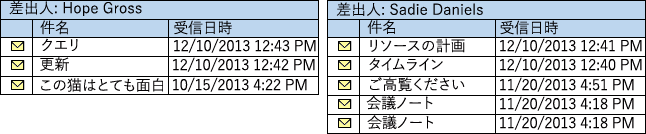
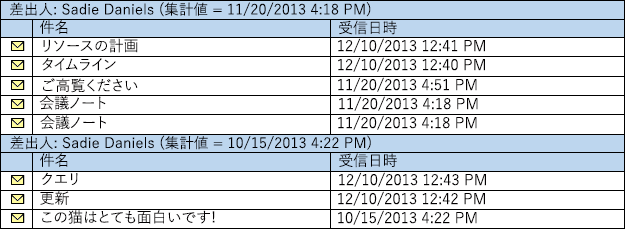

# <a name="perform-grouped-searches-by-using-ews-in-exchange"></a><span data-ttu-id="0700e-103">EWS を使用して Exchange によってグループ化された検索を実行します。</span><span class="sxs-lookup"><span data-stu-id="0700e-103">Perform grouped searches by using EWS in Exchange</span></span>

<span data-ttu-id="0700e-104">EWS マネージ API または Exchange を対象とする EWS アプリケーションで、グループ化された検索を実行する方法を説明します。</span><span class="sxs-lookup"><span data-stu-id="0700e-104">Find out how to perform grouped searches in your EWS Managed API or EWS application that targets Exchange.</span></span>
  
<span data-ttu-id="0700e-p101">グループ化された検索は、検索結果を整理する方法を管理できるという点が便利です。検索結果を整理することにより、管理可能な方法で、アプリケーションが結果を処理したり結果をエンド ユーザーに表示したりすることが簡単にできるようになります。</span><span class="sxs-lookup"><span data-stu-id="0700e-p101">Grouped searches are useful in that they gives you control over how search results are organized. Organized search results can make it easier for your application to process results or display them to an end user in a manageable way.</span></span>
  
<span data-ttu-id="0700e-p102">特定のフィールドの同じ値を持つ結果セット内のすべてのアイテムをグループに配置してグループ化します。たとえば、送信者ごとに結果をグループ化でき、同じ人のすべてのアイテムは別のグループに入れられ、各グループ内のアイテムはビューで指定した順序に従って並べ替えられます。グループ自体は、選択したフィールドに基づく集約値で並べ替えられます。</span><span class="sxs-lookup"><span data-stu-id="0700e-p102">Grouping works by putting all items within the result set that have the same value of a specific field into a group. For example, you can group your results by the sender, and all items from the same person will be in a separate group, and the items within each group will be sorted according to the order you specify on the view. The groups themselves are sorted by an aggregate value based on a field you choose.</span></span>
  
<span data-ttu-id="0700e-110">**表 1 です。EWS のマネージ API のメソッドおよび検索結果を整理するための EWS の操作**</span><span class="sxs-lookup"><span data-stu-id="0700e-110">**Table 1. EWS Managed API methods and EWS operations for organizing search results**</span></span>

|<span data-ttu-id="0700e-111">**目的…**</span><span class="sxs-lookup"><span data-stu-id="0700e-111">**If you want to…**</span></span>|<span data-ttu-id="0700e-112">**EWS のマネージ API で次のコマンドを使用してください.**</span><span class="sxs-lookup"><span data-stu-id="0700e-112">**In the EWS Managed API, use…**</span></span>|<span data-ttu-id="0700e-113">**EWS で次のコマンドを使用してください.**</span><span class="sxs-lookup"><span data-stu-id="0700e-113">**In EWS, use…**</span></span>|
|:-----|:-----|:-----|
|<span data-ttu-id="0700e-114">結果内の特定のプロパティが同じ値のアイテムをグループに分類する</span><span class="sxs-lookup"><span data-stu-id="0700e-114">Organize items with the same value in a specific property in your results into groups</span></span>  <br/> |[<span data-ttu-id="0700e-115">Grouping.GroupOn</span><span class="sxs-lookup"><span data-stu-id="0700e-115">Grouping.GroupOn</span></span>](http://msdn.microsoft.com/en-us/library/microsoft.exchange.webservices.data.grouping.groupon%28v=exchg.80%29.aspx) <br/> |<span data-ttu-id="0700e-116">[FieldURI](http://msdn.microsoft.com/library/24af8e3b-3074-4c8c-8d0a-52446508d044%28Office.15%29.aspx) [GroupBy](http://msdn.microsoft.com/library/9728619b-4674-4b9d-9f6c-e75c6165966c%28Office.15%29.aspx)要素の子要素</span><span class="sxs-lookup"><span data-stu-id="0700e-116">[FieldURI](http://msdn.microsoft.com/library/24af8e3b-3074-4c8c-8d0a-52446508d044%28Office.15%29.aspx) element as a child of the [GroupBy](http://msdn.microsoft.com/library/9728619b-4674-4b9d-9f6c-e75c6165966c%28Office.15%29.aspx) element</span></span>  <br/> |
|<span data-ttu-id="0700e-117">特定のプロパティの値によって各グループ内でアイテムを並べ替える</span><span class="sxs-lookup"><span data-stu-id="0700e-117">Sort items within each group by the value in a specific property</span></span>  <br/> |[<span data-ttu-id="0700e-118">ItemView.OrderBy</span><span class="sxs-lookup"><span data-stu-id="0700e-118">ItemView.OrderBy</span></span>](http://msdn.microsoft.com/en-us/library/microsoft.exchange.webservices.data.itemview.orderby%28v=exchg.80%29.aspx) <br/> |<span data-ttu-id="0700e-119">[SortOrder](http://msdn.microsoft.com/library/c2413f0b-8c03-46ae-9990-13338b3c53a6%28Office.15%29.aspx)要素</span><span class="sxs-lookup"><span data-stu-id="0700e-119">[SortOrder](http://msdn.microsoft.com/library/c2413f0b-8c03-46ae-9990-13338b3c53a6%28Office.15%29.aspx) element</span></span>  <br/> |
|<span data-ttu-id="0700e-120">グループを並べ替える</span><span class="sxs-lookup"><span data-stu-id="0700e-120">Sort the groups</span></span>  <br/> |[<span data-ttu-id="0700e-121">Grouping.AggregateOn</span><span class="sxs-lookup"><span data-stu-id="0700e-121">Grouping.AggregateOn</span></span>](http://msdn.microsoft.com/en-us/library/microsoft.exchange.webservices.data.grouping.aggregateon%28v=exchg.80%29.aspx) <br/><br/> [<span data-ttu-id="0700e-122">Grouping.AggregateType</span><span class="sxs-lookup"><span data-stu-id="0700e-122">Grouping.AggregateType</span></span>](http://msdn.microsoft.com/en-us/library/microsoft.exchange.webservices.data.grouping.aggregatetype%28v=exchg.80%29.aspx) <br/><br/> [<span data-ttu-id="0700e-123">Grouping.SortDirection</span><span class="sxs-lookup"><span data-stu-id="0700e-123">Grouping.SortDirection</span></span>](http://msdn.microsoft.com/en-us/library/microsoft.exchange.webservices.data.grouping.sortdirection%28v=exchg.80%29.aspx) <br/> |<span data-ttu-id="0700e-124">**FieldURI**要素は、 [AggregateOn](http://msdn.microsoft.com/library/9b0a03f2-3282-46e1-b1a0-cbb9a0fbe9bb%28Office.15%29.aspx)要素の子要素として</span><span class="sxs-lookup"><span data-stu-id="0700e-124">**FieldURI** element as a child of the [AggregateOn](http://msdn.microsoft.com/library/9b0a03f2-3282-46e1-b1a0-cbb9a0fbe9bb%28Office.15%29.aspx) element</span></span><br/><br/> <span data-ttu-id="0700e-125">**AggregateOn**要素の属性を**集計**</span><span class="sxs-lookup"><span data-stu-id="0700e-125">**Aggregate** attribute on the **AggregateOn** element</span></span><br/><br/><span data-ttu-id="0700e-126">**GroupBy**要素の属性を**注文**</span><span class="sxs-lookup"><span data-stu-id="0700e-126">**Order** attribute on the **GroupBy** element</span></span>  <br/> |
   
<span data-ttu-id="0700e-127">それぞれ順を追って説明します。</span><span class="sxs-lookup"><span data-stu-id="0700e-127">Let's take it step by step.</span></span>
  
## <a name="group-results-by-a-specific-property"></a><span data-ttu-id="0700e-128">特定のプロパティによる結果のグループ化</span><span class="sxs-lookup"><span data-stu-id="0700e-128">Group results by a specific property</span></span>
<span data-ttu-id="0700e-129"><a name="bk_GroupResults"> </a></span><span class="sxs-lookup"><span data-stu-id="0700e-129"></span></span>

<span data-ttu-id="0700e-130">プロパティを選択するか、属性のグループ化] を Exchange ストア内のアイテムをグループ化を使用する最初の手順では。</span><span class="sxs-lookup"><span data-stu-id="0700e-130">The first step to using grouping is to select a property, or attribute on the items in the Exchange store, to group by.</span></span> <span data-ttu-id="0700e-131">EWS のマネージ API は、EWS を XML 要素として公開するときに、対応するクラスで、クラスのプロパティとして公開されています。</span><span class="sxs-lookup"><span data-stu-id="0700e-131">The EWS Managed API exposes these as class properties on the corresponding classes, while EWS exposes them as XML elements.</span></span> <span data-ttu-id="0700e-132">カスタムまたは拡張のプロパティを含め、任意のプロパティを選択することができますが、項目がグループ化方法を選択するプロパティの値に基づいてを理解するおくと便利です。</span><span class="sxs-lookup"><span data-stu-id="0700e-132">You can choose any property, including custom or extended properties, but it is helpful to understand how items are grouped based on the value of the property you choose.</span></span> 

<span data-ttu-id="0700e-133">別にグループ化するプロパティに同じ値を持つすべての項目グループにまとめられます。</span><span class="sxs-lookup"><span data-stu-id="0700e-133">All items that have the same value in the property you choose to group by will be grouped together.</span></span> <span data-ttu-id="0700e-134">当たり前のことがありますが、重要なの詳細情報です。</span><span class="sxs-lookup"><span data-stu-id="0700e-134">This might seem obvious, but it is an important detail.</span></span> <span data-ttu-id="0700e-135">考慮 EWS のマネージ API では、 [Item.DateTimeReceived](http://msdn.microsoft.com/en-us/library/microsoft.exchange.webservices.data.item.datetimereceived%28v=exchg.80%29.aspx)または EWS の[DateTimeReceived](http://msdn.microsoft.com/library/8f489bd4-2434-4d0a-91fe-1b5ba7eb5765%28Office.15%29.aspx)要素など、日付/時刻プロパティでグループ化するかどうか。</span><span class="sxs-lookup"><span data-stu-id="0700e-135">Consider what happens if you group by a date/time property, such as [Item.DateTimeReceived](http://msdn.microsoft.com/en-us/library/microsoft.exchange.webservices.data.item.datetimereceived%28v=exchg.80%29.aspx) in the EWS Managed API, or the [DateTimeReceived](http://msdn.microsoft.com/library/8f489bd4-2434-4d0a-91fe-1b5ba7eb5765%28Office.15%29.aspx) element in EWS.</span></span> <span data-ttu-id="0700e-136">同じ日からの項目を格納している各グループに、グループに、結果を整理するために意図があります。</span><span class="sxs-lookup"><span data-stu-id="0700e-136">The intent might be to organize the results into groups, with each group containing items from the same day.</span></span> <span data-ttu-id="0700e-137">ただし、グループ化は、時間が含まれます、全体の値を表示します。</span><span class="sxs-lookup"><span data-stu-id="0700e-137">However, grouping looks at the entire value, which includes the time.</span></span> 

<span data-ttu-id="0700e-138">最終的には独自のグループ、2 番目に、同時に受信したアイテムになるよう、アイテムをグループ化にすることです。</span><span class="sxs-lookup"><span data-stu-id="0700e-138">The end result is that the items will be grouped so that items received at the same time, down to the second, are in their own groups.</span></span> <span data-ttu-id="0700e-139">結果は、ほとんどの場合多数の各グループ内の項目の数が少ないグループに並べ替えられます。</span><span class="sxs-lookup"><span data-stu-id="0700e-139">The results will most likely be sorted into a large number of groups with a small number of items in each group.</span></span> 
  
<span data-ttu-id="0700e-140">結果セットのグループの数を減らして、各グループ内の項目の多くを取得するには、 [EmailMessage.From](http://msdn.microsoft.com/en-us/library/microsoft.exchange.webservices.data.emailmessage.from%28v=exchg.80%29.aspx)または EWS マネージ API では、または[から](http://msdn.microsoft.com/library/5a52d644-3677-4049-874c-12bd5c3080dc%28Office.15%29.aspx)の[Item.Categories](http://msdn.microsoft.com/en-us/library/microsoft.exchange.webservices.data.item.categories%28v=exchg.80%29.aspx)などの値の数を少なくする可能性があるプロパティを選択します。または EWS で[カテゴリ](http://msdn.microsoft.com/library/d84d4927-b524-4e62-bf3d-1f12fec8c21a%28Office.15%29.aspx)を選択します。</span><span class="sxs-lookup"><span data-stu-id="0700e-140">To get a results set with a smaller number of groups and a larger number of items in each group, choose a property that is likely to have a smaller number of values, such as [EmailMessage.From](http://msdn.microsoft.com/en-us/library/microsoft.exchange.webservices.data.emailmessage.from%28v=exchg.80%29.aspx) or [Item.Categories](http://msdn.microsoft.com/en-us/library/microsoft.exchange.webservices.data.item.categories%28v=exchg.80%29.aspx) in the EWS Managed API, or [From](http://msdn.microsoft.com/library/5a52d644-3677-4049-874c-12bd5c3080dc%28Office.15%29.aspx) or [Categories](http://msdn.microsoft.com/library/d84d4927-b524-4e62-bf3d-1f12fec8c21a%28Office.15%29.aspx) in EWS.</span></span> <span data-ttu-id="0700e-141">次の図は、受信トレイ内に表示される電子メールの一覧を示します。</span><span class="sxs-lookup"><span data-stu-id="0700e-141">The following figure shows a list of emails that appear in an Inbox.</span></span> 
  
<span data-ttu-id="0700e-142">**図 1 です。受信トレイ内のメッセージ**</span><span class="sxs-lookup"><span data-stu-id="0700e-142">**Figure 1. Messages in an Inbox**</span></span>

![ユーザーの [受信トレイ] のメッセージのサンプル リスト](media/Ex15_GroupedSearch_MsgList.png)
  
<span data-ttu-id="0700e-144">**EmailMessage.From**プロパティでは、図 1 内のアイテムをグループ化する場合、結果になります期待しての総額によって送信されたメッセージと Sadie Daniels から送信されたメッセージの 2 つのグループです。</span><span class="sxs-lookup"><span data-stu-id="0700e-144">If you group the items in Figure 1 by the **EmailMessage.From** property, the result will be two groups, one for messages sent by Hope Gross, and one for messages sent by Sadie Daniels.</span></span> 
  
<span data-ttu-id="0700e-145">**図 2 になります。メッセージの From プロパティに基づいてグループ分け**</span><span class="sxs-lookup"><span data-stu-id="0700e-145">**Figure 2. Messages separated into groups based on the From property**</span></span>


  
## <a name="sort-the-items-within-groups"></a><span data-ttu-id="0700e-147">グループ内でアイテムを並べ替える</span><span class="sxs-lookup"><span data-stu-id="0700e-147">Sort the items within groups</span></span>
<span data-ttu-id="0700e-148"><a name="bk_SortItems"> </a></span><span class="sxs-lookup"><span data-stu-id="0700e-148"></span></span>

<span data-ttu-id="0700e-149">EWS のマネージ API では、 [ItemView.OrderBy](http://msdn.microsoft.com/en-us/library/microsoft.exchange.webservices.data.itemview.orderby%28v=exchg.80%29.aspx)プロパティまたは EWS での[並べ替え順序](http://msdn.microsoft.com/library/c2413f0b-8c03-46ae-9990-13338b3c53a6%28Office.15%29.aspx)の要素を使用して、「各グループ内の項目の並べ替え方法を制御することができます。</span><span class="sxs-lookup"><span data-stu-id="0700e-149">You can control how items are sorted within each group by using the [ItemView.OrderBy](http://msdn.microsoft.com/en-us/library/microsoft.exchange.webservices.data.itemview.orderby%28v=exchg.80%29.aspx) property in the EWS Managed API, or the [SortOrder](http://msdn.microsoft.com/library/c2413f0b-8c03-46ae-9990-13338b3c53a6%28Office.15%29.aspx) element in EWS.</span></span> <span data-ttu-id="0700e-150">同じ順序は、各グループに適用されます。</span><span class="sxs-lookup"><span data-stu-id="0700e-150">The same ordering applies to each group.</span></span> <span data-ttu-id="0700e-151">などの降順の順序で、 **Item.DateTimeReceived**プロパティでは、図 1 からのアイテムを並べ替える場合を期待して総額から最後に受信された項目は期待粗グループで最初になり Sadie Daniels から最近受信したアイテムになりますSadie Daniels のグループの最初の。</span><span class="sxs-lookup"><span data-stu-id="0700e-151">For example, if you sort the items from Figure 1 by the **Item.DateTimeReceived** property, in descending order, the item most recently received from Hope Gross will be first in the Hope Gross group, and the item most recently received from Sadie Daniels will be first in the Sadie Daniels group.</span></span> <span data-ttu-id="0700e-152">便利なことに、図 2 のグループはこの方法で、ソートされます。</span><span class="sxs-lookup"><span data-stu-id="0700e-152">Conveniently, the groups in Figure 2 are already sorted this way.</span></span> 
  
## <a name="sort-the-groups"></a><span data-ttu-id="0700e-153">グループを並べ替える</span><span class="sxs-lookup"><span data-stu-id="0700e-153">Sort the groups</span></span>
<span data-ttu-id="0700e-154"><a name="bk_SortGroups"> </a></span><span class="sxs-lookup"><span data-stu-id="0700e-154"></span></span>

<span data-ttu-id="0700e-155">決済のグループがある場合は、これで最後の手順は、グループ全体を並べ替えます。</span><span class="sxs-lookup"><span data-stu-id="0700e-155">Now that you have your groups settled, the final step is sorting the groups themselves.</span></span> <span data-ttu-id="0700e-156">グループ自体が特定の値を持たないためグループ化プロセスはグループごとに並べ替え値を割り当てるには。</span><span class="sxs-lookup"><span data-stu-id="0700e-156">Because the groups themselves have no specific values, the grouping process has to assign a sort value to each group.</span></span> <span data-ttu-id="0700e-157">これは、EWS の[AggregateOn](http://msdn.microsoft.com/library/9b0a03f2-3282-46e1-b1a0-cbb9a0fbe9bb%28Office.15%29.aspx)要素の子として、EWS のマネージ API で、または[FieldURI](http://msdn.microsoft.com/library/24af8e3b-3074-4c8c-8d0a-52446508d044%28Office.15%29.aspx)要素の[Grouping.AggregateOn](http://msdn.microsoft.com/en-us/library/microsoft.exchange.webservices.data.grouping.aggregateon%28v=exchg.80%29.aspx)プロパティで指定された各グループ内の特定のプロパティの値の集計を実行します。</span><span class="sxs-lookup"><span data-stu-id="0700e-157">This is done by aggregation of the values of a specific property within each group, specified by the [Grouping.AggregateOn](http://msdn.microsoft.com/en-us/library/microsoft.exchange.webservices.data.grouping.aggregateon%28v=exchg.80%29.aspx) property in the EWS Managed API, or the [FieldURI](http://msdn.microsoft.com/library/24af8e3b-3074-4c8c-8d0a-52446508d044%28Office.15%29.aspx) element as a child of the [AggregateOn](http://msdn.microsoft.com/library/9b0a03f2-3282-46e1-b1a0-cbb9a0fbe9bb%28Office.15%29.aspx) element in EWS.</span></span> <span data-ttu-id="0700e-158">EWS のマネージ API (または、EWS の**AggregateOn**要素の属性が**集計**) で[Grouping.AggregateType](http://msdn.microsoft.com/en-us/library/microsoft.exchange.webservices.data.grouping.aggregatetype%28v=exchg.80%29.aspx)プロパティの指定グループの並べ替え値を各グループ内のアイテムの値が割り当てられている、いずれか、最大値または最小値。</span><span class="sxs-lookup"><span data-stu-id="0700e-158">The [Grouping.AggregateType](http://msdn.microsoft.com/en-us/library/microsoft.exchange.webservices.data.grouping.aggregatetype%28v=exchg.80%29.aspx) property in the EWS Managed API (or the **Aggregate** attribute on the **AggregateOn** element in EWS) specifies which value from the items within each group is assigned to the sort value for the group — either the largest value or the smallest value.</span></span> <span data-ttu-id="0700e-159">最後に、並べ替えの順序 (降順または昇順) は、EWS のマネージ API で、または EWS に[GroupBy](http://msdn.microsoft.com/library/9728619b-4674-4b9d-9f6c-e75c6165966c%28Office.15%29.aspx)要素の**順序**属性の[Grouping.SortDirection](http://msdn.microsoft.com/en-us/library/microsoft.exchange.webservices.data.grouping.sortdirection%28v=exchg.80%29.aspx)プロパティによって指定されます。</span><span class="sxs-lookup"><span data-stu-id="0700e-159">Finally, the sort order (descending or ascending) is specified by the [Grouping.SortDirection](http://msdn.microsoft.com/en-us/library/microsoft.exchange.webservices.data.grouping.sortdirection%28v=exchg.80%29.aspx) property in the EWS Managed API, or the **Order** attribute on the [GroupBy](http://msdn.microsoft.com/library/9728619b-4674-4b9d-9f6c-e75c6165966c%28Office.15%29.aspx) element in EWS.</span></span> 
  
<span data-ttu-id="0700e-160">たとえば、図 2 からのグループを並べ替える場合は、 **Item.DateTimeReceived**プロパティを集約することにより、最小の値を使用して、降順で並べ替え項目が返されますに示すように図 3 の順序で。</span><span class="sxs-lookup"><span data-stu-id="0700e-160">For example, if the groups from Figure 2 are sorted by aggregating on the **Item.DateTimeReceived** property, using the smallest value, and sorting in descending order, the items are returned in the order in shown Figure 3.</span></span> 
  
<span data-ttu-id="0700e-161">**図 3 です。DateTimeReceived プロパティによって並べ替えられたグループにグループ化された検索結果**</span><span class="sxs-lookup"><span data-stu-id="0700e-161">**Figure 3. Grouped search results with the groups sorted by the DateTimeReceived property**</span></span>


  
<span data-ttu-id="0700e-163">次のセクションでは、コードでグループ化と並べ替えをまとめてプルする方法を説明します。</span><span class="sxs-lookup"><span data-stu-id="0700e-163">The next sections show you how you might pull grouping and sorting together in code.</span></span>
  
## <a name="example-perform-a-grouped-search-by-using-the-ews-managed-api"></a><span data-ttu-id="0700e-164">例:EWS マネージ API を使用して、グループ化された検索を実行する</span><span class="sxs-lookup"><span data-stu-id="0700e-164">Example: Perform a grouped search by using the EWS Managed API</span></span>
<span data-ttu-id="0700e-165"><a name="bk_GroupSearchEWSMA"> </a></span><span class="sxs-lookup"><span data-stu-id="0700e-165"></span></span>

<span data-ttu-id="0700e-166">次の EWS マネージ API メソッドではグループ化を使用できます。</span><span class="sxs-lookup"><span data-stu-id="0700e-166">The following EWS Managed API methods can use grouping:</span></span>
  
- [<span data-ttu-id="0700e-167">ExchangeService.FindItems</span><span class="sxs-lookup"><span data-stu-id="0700e-167">ExchangeService.FindItems</span></span>](http://msdn.microsoft.com/en-us/library/microsoft.exchange.webservices.data.exchangeservice.finditems%28v=exchg.80%29.aspx)
    
- [<span data-ttu-id="0700e-168">Folder.FindItems</span><span class="sxs-lookup"><span data-stu-id="0700e-168">Folder.FindItems</span></span>](http://msdn.microsoft.com/en-us/library/microsoft.exchange.webservices.data.folder.finditems%28v=exchg.80%29.aspx)
    
<span data-ttu-id="0700e-169">**ExchangeService.FindItems**メソッドを使用して、次の使用例ただし、同じ規則や概念は、 **Folder.FindItems**メソッドに適用されます。</span><span class="sxs-lookup"><span data-stu-id="0700e-169">The following example uses the **ExchangeService.FindItems** method; however, the same rules and concepts apply to the **Folder.FindItems** method.</span></span> <span data-ttu-id="0700e-170">この例では、 **GroupItemsByFrom**と呼ばれるメソッドを定義します。</span><span class="sxs-lookup"><span data-stu-id="0700e-170">In this example, a method called **GroupItemsByFrom** is defined.</span></span> <span data-ttu-id="0700e-171">[ExchangeService](http://msdn.microsoft.com/en-us/library/microsoft.exchange.webservices.data.exchangeservice%28v=exchg.80%29.aspx)オブジェクトと[WellKnownFolderName](http://msdn.microsoft.com/en-us/library/microsoft.exchange.webservices.data.wellknownfoldername%28v=exchg.80%29.aspx)オブジェクトはパラメーターとして受け取ります。</span><span class="sxs-lookup"><span data-stu-id="0700e-171">It takes an [ExchangeService](http://msdn.microsoft.com/en-us/library/microsoft.exchange.webservices.data.exchangeservice%28v=exchg.80%29.aspx) object and a [WellKnownFolderName](http://msdn.microsoft.com/en-us/library/microsoft.exchange.webservices.data.wellknownfoldername%28v=exchg.80%29.aspx) object as parameters.</span></span> <span data-ttu-id="0700e-172">**EmailMessage.From**プロパティは、 **Item.DateTimeReceived**プロパティの順序を降順で並べ替え、グループ化、フォルダー内の最初の 50 のアイテムを要求します。</span><span class="sxs-lookup"><span data-stu-id="0700e-172">It requests the first 50 items in the folder, grouped by the **EmailMessage.From** property, sorted by the **Item.DateTimeReceived** property in descending order.</span></span> <span data-ttu-id="0700e-173">グループ自体は、降順で、その項目の最小の**Item.DateTimeReceived**プロパティの値に基づいて並べ替えられます。</span><span class="sxs-lookup"><span data-stu-id="0700e-173">The groups themselves are sorted by the smallest **Item.DateTimeReceived** property value on their items, in descending order.</span></span> 
  
<span data-ttu-id="0700e-174">次の使用例では、[資格情報](http://msdn.microsoft.com/en-us/library/microsoft.exchange.webservices.data.exchangeservicebase.credentials%28v=exchg.80%29.aspx)と[Url](http://msdn.microsoft.com/en-us/library/microsoft.exchange.webservices.data.exchangeservice.url%28v=exchg.80%29.aspx)のプロパティで有効な値を持つ**ExchangeService**オブジェクトが初期化されたことを前提としています。</span><span class="sxs-lookup"><span data-stu-id="0700e-174">This example assumes that the **ExchangeService** object has been initialized with valid values in the [Credentials](http://msdn.microsoft.com/en-us/library/microsoft.exchange.webservices.data.exchangeservicebase.credentials%28v=exchg.80%29.aspx) and [Url](http://msdn.microsoft.com/en-us/library/microsoft.exchange.webservices.data.exchangeservice.url%28v=exchg.80%29.aspx) properties.</span></span> 
  
```cs
static void GroupItemsByFrom(ExchangeService service, WellKnownFolderName folder)
{
    // Limit the result set to 50 items.
    ItemView view = new ItemView(50);
    view.PropertySet = new PropertySet(ItemSchema.Subject,
                                       ItemSchema.DateTimeReceived,
                                       EmailMessageSchema.From,
                                       ItemSchema.Categories);
    // Item searches do not support Deep traversal.
    view.Traversal = ItemTraversal.Shallow;
    // Specify the sorting done within the groups.
    view.OrderBy.Add(ItemSchema.DateTimeReceived, SortDirection.Descending);
    // Configure grouping.
    Grouping groupByFrom = new Grouping();
    groupByFrom.GroupOn = EmailMessageSchema.From;
    groupByFrom.AggregateOn = ItemSchema.DateTimeReceived;
    groupByFrom.AggregateType = AggregateType.Minimum;
    groupByFrom.SortDirection = SortDirection.Descending;
    try
    {
        GroupedFindItemsResults<Item> results = service.FindItems(folder,
            view, groupByFrom);
        foreach (ItemGroup<Item> group in results.ItemGroups)
        {
            Console.WriteLine("Group: {0}", group.GroupIndex);
            foreach (Item item in group.Items)
            {
                if (item is EmailMessage)
                {
                    EmailMessage message = item as EmailMessage;
                    Console.WriteLine("From: {0}", message.From);
                    Console.WriteLine("Subject: {0}", message.Subject);
                    Console.WriteLine("Id: {0}\n", message.Id.ToString());
                }
            }
        }
    }
    catch (Exception ex)
    {
        Console.WriteLine("Exception while enumerating results: {0}", ex.Message);
    }
}
```

## <a name="example-perform-a-grouped-search-by-using-ews"></a><span data-ttu-id="0700e-175">例:EWS を使用して、グループ化された検索を実行する</span><span class="sxs-lookup"><span data-stu-id="0700e-175">Example: Perform a grouped search by using EWS</span></span>
<span data-ttu-id="0700e-176"><a name="bk_GroupSearchEWS"> </a></span><span class="sxs-lookup"><span data-stu-id="0700e-176"></span></span>

<span data-ttu-id="0700e-177">要求の例を次は、フォルダー**から**要素を**DateTimeReceived**の要素の順序を降順で並べ替え、グループ化された[FindItem 操作](http://msdn.microsoft.com/library/ebad6aae-16e7-44de-ae63-a95b24539729%28Office.15%29.aspx)要求の最初の 50 の項目を示しています。</span><span class="sxs-lookup"><span data-stu-id="0700e-177">The following request example shows a [FindItem operation](http://msdn.microsoft.com/library/ebad6aae-16e7-44de-ae63-a95b24539729%28Office.15%29.aspx) request for the first 50 items in the folder, grouped by the **From** element, sorted by the **DateTimeReceived** element in descending order.</span></span> <span data-ttu-id="0700e-178">最小**DateTimeReceived**要素の値の降順に並べ替え、アイテムの上では、グループ全体が並べ替えられます。</span><span class="sxs-lookup"><span data-stu-id="0700e-178">The groups themselves are sorted by the smallest **DateTimeReceived** element value on their items, in descending order.</span></span> 
  
```XML
<?xml version="1.0" encoding="utf-8"?>
<soap:Envelope xmlns:xsi="http://www.w3.org/2001/XMLSchema-instance" 
    xmlns:m="http://schemas.microsoft.com/exchange/services/2006/messages" 
    xmlns:t="http://schemas.microsoft.com/exchange/services/2006/types" 
    xmlns:soap="http://schemas.xmlsoap.org/soap/envelope/">
  <soap:Header>
    <t:RequestServerVersion Version="Exchange2007_SP1" />
    <t:TimeZoneContext>
      <t:TimeZoneDefinition Id="Eastern Standard Time" />
    </t:TimeZoneContext>
  </soap:Header>
  <soap:Body>
    <m:FindItem Traversal="Shallow">
      <m:ItemShape>
        <t:BaseShape>IdOnly</t:BaseShape>
        <t:AdditionalProperties>
          <t:FieldURI FieldURI="item:Subject" />
          <t:FieldURI FieldURI="item:DateTimeReceived" />
          <t:FieldURI FieldURI="message:From" />
          <t:FieldURI FieldURI="item:Categories" />
        </t:AdditionalProperties>
      </m:ItemShape>
      <m:IndexedPageItemView MaxEntriesReturned="50" Offset="0" BasePoint="Beginning" />
      <m:GroupBy Order="Descending">
        <t:FieldURI FieldURI="message:From" />
        <t:AggregateOn Aggregate="Minimum">
          <t:FieldURI FieldURI="item:DateTimeReceived" />
        </t:AggregateOn>
      </m:GroupBy>
      <m:SortOrder>
        <t:FieldOrder Order="Descending">
          <t:FieldURI FieldURI="item:DateTimeReceived" />
        </t:FieldOrder>
      </m:SortOrder>
      <m:ParentFolderIds>
        <t:DistinguishedFolderId Id="inbox" />
      </m:ParentFolderIds>
    </m:FindItem>
  </soap:Body>
</soap:Envelope>
```

<span data-ttu-id="0700e-179">サーバーは次の応答を返します。</span><span class="sxs-lookup"><span data-stu-id="0700e-179">The server returns the following response.</span></span>
  
```XML
<?xml version="1.0" encoding="utf-8"?>
<s:Envelope xmlns:s="http://schemas.xmlsoap.org/soap/envelope/">
  <s:Header>
    <h:ServerVersionInfo MajorVersion="15" MinorVersion="0" MajorBuildNumber="712" MinorBuildNumber="22" Version="V2_3" 
        xmlns:h="http://schemas.microsoft.com/exchange/services/2006/types" 
        xmlns="http://schemas.microsoft.com/exchange/services/2006/types" 
        xmlns:xsd="http://www.w3.org/2001/XMLSchema" 
        xmlns:xsi="http://www.w3.org/2001/XMLSchema-instance" />
  </s:Header>
  <s:Body xmlns:xsi="http://www.w3.org/2001/XMLSchema-instance" xmlns:xsd="http://www.w3.org/2001/XMLSchema">
    <m:FindItemResponse xmlns:m="http://schemas.microsoft.com/exchange/services/2006/messages" 
      xmlns:t="http://schemas.microsoft.com/exchange/services/2006/types">
      <m:ResponseMessages>
        <m:FindItemResponseMessage ResponseClass="Success">
          <m:ResponseCode>NoError</m:ResponseCode>
          <m:RootFolder IndexedPagingOffset="10" TotalItemsInView="8" IncludesLastItemInRange="true">
            <t:Groups>
              <t:GroupedItems>
                <t:GroupIndex>0</t:GroupIndex>
                <t:Items>
                  <t:Message>
                    <t:ItemId Id="AAMkAGM2..." ChangeKey="CQAAABYA..." />
                    <t:Subject>Planning resources</t:Subject>
                    <t:DateTimeReceived>2013-12-10T17:41:05Z</t:DateTimeReceived>
                    <t:From>
                      <t:Mailbox>
                        <t:Name>Sadie Daniels</t:Name>
                        <t:EmailAddress>/O=FIRST ORGANIZATION/OU=EXCHANGE ADMINISTRATIVE GROUP (FYDIBOHF23SPDLT)/CN=RECIPIENTS/CN=8D84A3F4CBB34D48838A3AECF99795C0-SADIE</t:EmailAddress>
                        <t:RoutingType>EX</t:RoutingType>
                      </t:Mailbox>
                    </t:From>
                  </t:Message>
                  <t:Message>
                    <t:ItemId Id="AAMkAGM2..." ChangeKey="CQAAABYA..." />
                    <t:Subject>Timeline</t:Subject>
                    <t:DateTimeReceived>2013-12-10T17:40:37Z</t:DateTimeReceived>
                    <t:Categories>
                      <t:String>Project</t:String>
                    </t:Categories>
                    <t:From>
                      <t:Mailbox>
                        <t:Name>Sadie Daniels</t:Name>
                        <t:EmailAddress>/O=FIRST ORGANIZATION/OU=EXCHANGE ADMINISTRATIVE GROUP (FYDIBOHF23SPDLT)/CN=RECIPIENTS/CN=8D84A3F4CBB34D48838A3AECF99795C0-SADIE</t:EmailAddress>
                        <t:RoutingType>EX</t:RoutingType>
                      </t:Mailbox>
                    </t:From>
                  </t:Message>
                  <t:Message>
                    <t:ItemId Id="AAMkAGM2..." ChangeKey="CQAAABYA..." />
                    <t:Subject>For your perusal</t:Subject>
                    <t:DateTimeReceived>2013-11-20T21:51:16Z</t:DateTimeReceived>
                    <t:From>
                      <t:Mailbox>
                        <t:Name>Sadie Daniels</t:Name>
                        <t:EmailAddress>/O=FIRST ORGANIZATION/OU=EXCHANGE ADMINISTRATIVE GROUP (FYDIBOHF23SPDLT)/CN=RECIPIENTS/CN=8D84A3F4CBB34D48838A3AECF99795C0-SADIE</t:EmailAddress>
                        <t:RoutingType>EX</t:RoutingType>
                      </t:Mailbox>
                    </t:From>
                  </t:Message>
                  <t:Message>
                    <t:ItemId Id="AAMkAGM2..." ChangeKey="CQAAABYA..." />
                    <t:Subject>meeting notes</t:Subject>
                    <t:DateTimeReceived>2013-11-20T21:18:51Z</t:DateTimeReceived>
                    <t:Categories>
                      <t:String>Blue category</t:String>
                    </t:Categories>
                    <t:From>
                      <t:Mailbox>
                        <t:Name>Sadie Daniels</t:Name>
                        <t:EmailAddress>/O=FIRST ORGANIZATION/OU=EXCHANGE ADMINISTRATIVE GROUP (FYDIBOHF23SPDLT)/CN=RECIPIENTS/CN=8D84A3F4CBB34D48838A3AECF99795C0-SADIE</t:EmailAddress>
                        <t:RoutingType>EX</t:RoutingType>
                      </t:Mailbox>
                    </t:From>
                  </t:Message>
                  <t:Message>
                    <t:ItemId Id="AAMkAGM2..." ChangeKey="CQAAABYA..." />
                    <t:Subject>Meeting notes</t:Subject>
                    <t:DateTimeReceived>2013-11-20T21:18:51Z</t:DateTimeReceived>
                    <t:From>
                      <t:Mailbox>
                        <t:Name>Sadie Daniels</t:Name>
                        <t:EmailAddress>/O=FIRST ORGANIZATION/OU=EXCHANGE ADMINISTRATIVE GROUP (FYDIBOHF23SPDLT)/CN=RECIPIENTS/CN=8D84A3F4CBB34D48838A3AECF99795C0-SADIE</t:EmailAddress>
                        <t:RoutingType>EX</t:RoutingType>
                      </t:Mailbox>
                    </t:From>
                  </t:Message>
                </t:Items>
              </t:GroupedItems>
              <t:GroupedItems>
                <t:GroupIndex>1</t:GroupIndex>
                <t:Items>
                  <t:Message>
                    <t:ItemId Id="AAMkAGM2..." ChangeKey="CQAAABYA..." />
                    <t:Subject>Query</t:Subject>
                    <t:DateTimeReceived>2013-12-10T17:43:15Z</t:DateTimeReceived>
                    <t:From>
                      <t:Mailbox>
                        <t:Name>Hope Gross</t:Name>
                        <t:EmailAddress>/O=FIRST ORGANIZATION/OU=EXCHANGE ADMINISTRATIVE GROUP (FYDIBOHF23SPDLT)/CN=RECIPIENTS/CN=9B55E4100C064D9D8C5F72FF36802ED3-HOPE</t:EmailAddress>
                        <t:RoutingType>EX</t:RoutingType>
                      </t:Mailbox>
                    </t:From>
                  </t:Message>
                  <t:Message>
                    <t:ItemId Id="AAMkAGM2..." ChangeKey="CQAAABYA..." />
                    <t:Subject>Update</t:Subject>
                    <t:DateTimeReceived>2013-12-10T17:42:33Z</t:DateTimeReceived>
                    <t:Categories>
                      <t:String>Project</t:String>
                      <t:String>Blue category</t:String>
                    </t:Categories>
                    <t:From>
                      <t:Mailbox>
                        <t:Name>Hope Gross</t:Name>
                        <t:EmailAddress>/O=FIRST ORGANIZATION/OU=EXCHANGE ADMINISTRATIVE GROUP (FYDIBOHF23SPDLT)/CN=RECIPIENTS/CN=9B55E4100C064D9D8C5F72FF36802ED3-HOPE</t:EmailAddress>
                        <t:RoutingType>EX</t:RoutingType>
                      </t:Mailbox>
                    </t:From>
                  </t:Message>
                  <t:Message>
                    <t:ItemId Id="AAMkAGM2..." ChangeKey="CQAAABYA..." />
                    <t:Subject>This cat is hilarious!</t:Subject>
                    <t:DateTimeReceived>2013-10-15T20:22:12Z</t:DateTimeReceived>
                    <t:From>
                      <t:Mailbox>
                        <t:Name>Hope Gross</t:Name>
                        <t:EmailAddress>/O=FIRST ORGANIZATION/OU=EXCHANGE ADMINISTRATIVE GROUP (FYDIBOHF23SPDLT)/CN=RECIPIENTS/CN=9B55E4100C064D9D8C5F72FF36802ED3-HOPE</t:EmailAddress>
                        <t:RoutingType>EX</t:RoutingType>
                      </t:Mailbox>
                    </t:From>
                  </t:Message>
                </t:Items>
              </t:GroupedItems>
            </t:Groups>
          </m:RootFolder>
        </m:FindItemResponseMessage>
      </m:ResponseMessages>
    </m:FindItemResponse>
  </s:Body>
</s:Envelope>
```

## <a name="version-differences"></a><span data-ttu-id="0700e-180">バージョンの相違点</span><span class="sxs-lookup"><span data-stu-id="0700e-180">Version differences</span></span>
<span data-ttu-id="0700e-181"><a name="bk_VersionDiffs"> </a></span><span class="sxs-lookup"><span data-stu-id="0700e-181"></span></span>

<span data-ttu-id="0700e-182">15 のメジャー バージョンとで開始および終了ビルド 15.0.775.38 戻り値要素を**グループ化**(型**GroupedItemsType**) の[GroupedItems](http://msdn.microsoft.com/library/53170df4-4272-4b37-b23f-cd8e2d4a7396%28Office.15%29.aspx)要素の代わりに、SOAP 応答での Exchange のバージョンです。</span><span class="sxs-lookup"><span data-stu-id="0700e-182">Versions of Exchange starting with major version 15 and ending with build 15.0.775.38 return **Group** elements (of type **GroupedItemsType**) in place of [GroupedItems](http://msdn.microsoft.com/library/53170df4-4272-4b37-b23f-cd8e2d4a7396%28Office.15%29.aspx) elements in the SOAP response.</span></span> <span data-ttu-id="0700e-183">EWS のマネージ API を使用する場合は、0 のオブジェクトを格納する[GroupedFindItemsResults.ItemGroups](http://msdn.microsoft.com/en-us/library/office/dd633961%28v=exchg.80%29.aspx)コレクションなります。</span><span class="sxs-lookup"><span data-stu-id="0700e-183">If you are using the EWS Managed API, this will cause the [GroupedFindItemsResults.ItemGroups](http://msdn.microsoft.com/en-us/library/office/dd633961%28v=exchg.80%29.aspx) collection to contain 0 objects.</span></span> <span data-ttu-id="0700e-184">EWS を使用する場合は、 **GroupedItems**の要素として要素を**グループ化**を処理する必要があります。</span><span class="sxs-lookup"><span data-stu-id="0700e-184">If you are using EWS, **Group** elements should be handled as **GroupedItems** elements.</span></span> 
  
<span data-ttu-id="0700e-185">15 のメジャー バージョンの Exchange のバージョンでは、 **xsi:nil**属性が**true**では、SOAP 応答に設定を**グループ**または**GroupedItems**の余分な要素を返します。</span><span class="sxs-lookup"><span data-stu-id="0700e-185">Versions of Exchange starting with major version 15 return extra **Group** or **GroupedItems** elements with the **xsi:nil** attribute set to **true** in the SOAP response.</span></span> <span data-ttu-id="0700e-186">EWS のマネージ API を使用する場合、これらの余分な要素には、 [ServiceXmlDeserializationException](http://msdn.microsoft.com/en-us/library/microsoft.exchange.webservices.data.servicexmldeserializationexception%28v=exchg.80%29.aspx)がスローされますが発生します。</span><span class="sxs-lookup"><span data-stu-id="0700e-186">If you are using the EWS Managed API, these extra elements will cause a [ServiceXmlDeserializationException](http://msdn.microsoft.com/en-us/library/microsoft.exchange.webservices.data.servicexmldeserializationexception%28v=exchg.80%29.aspx) to be thrown.</span></span> <span data-ttu-id="0700e-187">EWS を使用する場合は、これらの余分な要素は無視されます。</span><span class="sxs-lookup"><span data-stu-id="0700e-187">If you are using EWS, these extra elements should be ignored.</span></span> 
  
## <a name="see-also"></a><span data-ttu-id="0700e-188">関連項目</span><span class="sxs-lookup"><span data-stu-id="0700e-188">See also</span></span>

- [<span data-ttu-id="0700e-189">Exchange の検索と EWS</span><span class="sxs-lookup"><span data-stu-id="0700e-189">Search and EWS in Exchange</span></span>](search-and-ews-in-exchange.md)    
- [<span data-ttu-id="0700e-190">ExchangeService.FindItems</span><span class="sxs-lookup"><span data-stu-id="0700e-190">ExchangeService.FindItems</span></span>](http://msdn.microsoft.com/en-us/library/microsoft.exchange.webservices.data.exchangeservice.finditems%28v=exchg.80%29.aspx)    
- [<span data-ttu-id="0700e-191">Folder.FindItems</span><span class="sxs-lookup"><span data-stu-id="0700e-191">Folder.FindItems</span></span>](http://msdn.microsoft.com/en-us/library/microsoft.exchange.webservices.data.folder.finditems%28v=exchg.80%29.aspx)   
- [<span data-ttu-id="0700e-192">クラスをグループ化</span><span class="sxs-lookup"><span data-stu-id="0700e-192">Grouping class</span></span>](http://msdn.microsoft.com/en-us/library/microsoft.exchange.webservices.data.grouping%28v=exchg.80%29.aspx)    
- <span data-ttu-id="0700e-193">
  [FindItem 操作](http://msdn.microsoft.com/library/ebad6aae-16e7-44de-ae63-a95b24539729%28Office.15%29.aspx)</span><span class="sxs-lookup"><span data-stu-id="0700e-193">[FindItem operation](http://msdn.microsoft.com/library/ebad6aae-16e7-44de-ae63-a95b24539729%28Office.15%29.aspx)</span></span>
    

