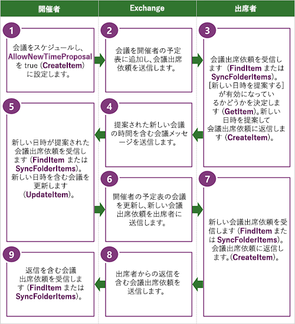

# <a name="propose-a-new-meeting-time-by-using-ews-in-exchange"></a><span data-ttu-id="55db5-103">Exchange EWS を使用して、会議の新しい日時を提案します。</span><span class="sxs-lookup"><span data-stu-id="55db5-103">Propose a new meeting time by using EWS in Exchange</span></span>

<span data-ttu-id="55db5-104">Exchange で EWS を使用して Exchange クライアント アプリケーションから新しい会議日時を提案する方法について説明します。</span><span class="sxs-lookup"><span data-stu-id="55db5-104">Find out how to propose new meeting times from your Exchange client application by using EWS in Exchange.</span></span>
  
<span data-ttu-id="55db5-p101">出席者は、新しい日時を提案する機能を使用して、新しい会議日時を Exchange 予定表ワークフローの一部として会議開催者に提案できます。出席者が新しい会議を提案すると、開催者は提案された新しい会議日時を使用して会議を更新し、最新情報をすべての出席者に送信できます。新しい会議日時を出席者が提案できるようにするためには、新しい日時の提案を開催者が許可しているかどうかを確認しておく必要があります。この記事では、新しい日時を提案できるかどうかを確認する方法、および EWS を使用して新しい日時を提案する方法について説明します。</span><span class="sxs-lookup"><span data-stu-id="55db5-p101">The propose new time feature enables attendees to propose new meeting times to the meeting organizer as part of the Exchange calendar workflow. When an attendee proposes a new meeting, the organizer can use the proposed new meeting time to update the meeting and send updates to all attendees. Before you can enable attendees to propose new meeting times, you need to determine whether the organizer allows for new time proposals. This article describes how to determine whether you can propose a new time and how to use EWS to propose a new time.</span></span>
  
> [!NOTE]
> <span data-ttu-id="55db5-109">EWS マネージ API はこの機能を実装していません。</span><span class="sxs-lookup"><span data-stu-id="55db5-109">The EWS Managed API does not implement this functionality.</span></span> 
  
## <a name="determine-whether-you-can-propose-a-new-time-for-a-meeting-by-using-ews"></a><span data-ttu-id="55db5-110">EWS を使用して会議の新しい日時を提案できるかどうかを確認する</span><span class="sxs-lookup"><span data-stu-id="55db5-110">Determine whether you can propose a new time for a meeting by using EWS</span></span>
<span data-ttu-id="55db5-111"><a name="bk_Determine"> </a></span><span class="sxs-lookup"><span data-stu-id="55db5-111"></span></span>

<span data-ttu-id="55db5-p102">会議の新しい日時を提案するためには、その会議への参照を見つけ、新しい日時の提案をサポートするように会議開催者が会議を構成しているかどうかを確認しておく必要があります。会議への参照は、次のいずれかの方法で取得できます。 </span><span class="sxs-lookup"><span data-stu-id="55db5-p102">Before you can propose a new time for a meeting, you need to find a reference to that meeting and determine whether the meeting organizer configured the meeting to support new time proposals. You can get a reference to a meeting by doing either of the following:</span></span> 
  
- <span data-ttu-id="55db5-114">受信トレイで会議出席依頼を見つける</span><span class="sxs-lookup"><span data-stu-id="55db5-114">Finding the meeting request in the Inbox</span></span>
    
- <span data-ttu-id="55db5-115">予定表で予定を見つける</span><span class="sxs-lookup"><span data-stu-id="55db5-115">Finding the appointment in the calendar</span></span>
    
<span data-ttu-id="55db5-116">会議の参照を見つけるには、次の手順を使用します。</span><span class="sxs-lookup"><span data-stu-id="55db5-116">Use the following steps to find a meeting reference:</span></span>
  
1. <span data-ttu-id="55db5-117">[FindItem](http://msdn.microsoft.com/library/ebad6aae-16e7-44de-ae63-a95b24539729%28Office.15%29.aspx) EWS の操作 (またはメソッドを使用[Folder.FindItems](http://msdn.microsoft.com/en-us/library/microsoft.exchange.webservices.data.folder.finditems%28v=EXCHG.80%29.aspx) EWS マネージ API) ターゲットを検索するのには会議の依頼または予定表のアイテムです。</span><span class="sxs-lookup"><span data-stu-id="55db5-117">Use the [FindItem](http://msdn.microsoft.com/library/ebad6aae-16e7-44de-ae63-a95b24539729%28Office.15%29.aspx) EWS operation (or the [Folder.FindItems](http://msdn.microsoft.com/en-us/library/microsoft.exchange.webservices.data.folder.finditems%28v=EXCHG.80%29.aspx) EWS Managed API method) to find the target meeting request or calendar item.</span></span> <span data-ttu-id="55db5-118">または、会議の依頼または予定表アイテムのターゲットの識別子を取得するのに[SyncFolderItems](http://msdn.microsoft.com/library/7f0de089-8876-47ec-a871-df118ceae75d%28Office.15%29.aspx) EWS の操作を使用できます。</span><span class="sxs-lookup"><span data-stu-id="55db5-118">Alternatively, you can use the [SyncFolderItems](http://msdn.microsoft.com/library/7f0de089-8876-47ec-a871-df118ceae75d%28Office.15%29.aspx) EWS operation to get the identifier of the target meeting request or calendar item.</span></span> 
    
2. <span data-ttu-id="55db5-119">会議アイテムの項目の識別子を取得する**FindItem**操作 (または**Folder.FindItems**メソッド) の結果を解析します。</span><span class="sxs-lookup"><span data-stu-id="55db5-119">Parse the results of the **FindItem** operation (or **Folder.FindItems** method) to get the item identifier of the meeting item.</span></span> 
    
3. <span data-ttu-id="55db5-120">会議の応答オブジェクトを取得するのにには、 [GetItem](http://msdn.microsoft.com/library/e3590b8b-c2a7-4dad-a014-6360197b68e4%28Office.15%29.aspx) EWS の操作を使用します。</span><span class="sxs-lookup"><span data-stu-id="55db5-120">Use the [GetItem](http://msdn.microsoft.com/library/e3590b8b-c2a7-4dad-a014-6360197b68e4%28Office.15%29.aspx) EWS operation to get the response objects for the meeting.</span></span> 
    
<span data-ttu-id="55db5-121">次の XML は、アイテムの応答オブジェクトを要求するために何が送られるかを示しています。</span><span class="sxs-lookup"><span data-stu-id="55db5-121">The following XML shows what is sent to request the response objects on an item.</span></span>
  
```XML
<?xml version="1.0" encoding="utf-8"?>
<soap:Envelope xmlns:xsi="http://www.w3.org/2001/XMLSchema-instance"
               xmlns:xsd="http://www.w3.org/2001/XMLSchema"
               xmlns:soap="http://schemas.xmlsoap.org/soap/envelope/"
               xmlns:t="http://schemas.microsoft.com/exchange/services/2006/types"
               xmlns:m="http://schemas.microsoft.com/exchange/services/2006/messages">
  <soap:Header>
    <t:RequestServerVersion Version="Exchange2013" />
    <t:MailboxCulture>en-US</t:MailboxCulture>
  </soap:Header>
  <soap:Body>
    <m:GetItem>
      <m:ItemShape>
        <t:BaseShape>IdOnly</t:BaseShape>
        <t:AdditionalProperties>
          <t:FieldURI FieldURI="item:ResponseObjects"/>
          <t:FieldURI FieldURI="item:Subject"/>
          <t:FieldURI FieldURI="calendar:Start"/>
          <t:FieldURI FieldURI="calendar:End"/>
        </t:AdditionalProperties>
      </m:ItemShape>
      <m:ItemIds>
        <t:ItemId Id="AAMkADEzOTExYjJkL1AAA=" ChangeKey="CwAAAB/G6X"/>
      </m:ItemIds>
    </m:GetItem>
  </soap:Body>
</soap:Envelope>
```

<span data-ttu-id="55db5-122">**GetItem**操作の応答は会議の時間に変更の提案の構成内容の変更を許可する場合と、項目 id、ミーティングの開始と終了時刻、応答オブジェクトのコレクションを要求した場合、次の XML のようななります。</span><span class="sxs-lookup"><span data-stu-id="55db5-122">The **GetItem** operation response will look similar to the following XML if you request the item identifier, the meeting start and end time, the response object collection, and if the organizer allows for proposed changes to the meeting time.</span></span> <span data-ttu-id="55db5-123">[ResponseObjects](http://msdn.microsoft.com/library/ad29e064-3f3d-4b7b-aa4c-9ec27326381d%28Office.15%29.aspx)要素によって表される応答オブジェクトのコレクションには、予定表アイテムの有効な応答のセットが含まれています。</span><span class="sxs-lookup"><span data-stu-id="55db5-123">The response object collection, which is represented by the [ResponseObjects](http://msdn.microsoft.com/library/ad29e064-3f3d-4b7b-aa4c-9ec27326381d%28Office.15%29.aspx) element, contains the set of responses that are valid for the calendar item.</span></span> <span data-ttu-id="55db5-124">**ProposeNewTime**要素は、ユーザーが会議の新しい日時を指定できることを示す応答オブジェクトです。</span><span class="sxs-lookup"><span data-stu-id="55db5-124">The **ProposeNewTime** element is a response object that indicates that the user can propose a new time for the meeting.</span></span> <span data-ttu-id="55db5-125">[AcceptItem](http://msdn.microsoft.com/library/05a15431-77e1-411a-a16b-5481d364d3cc%28Office.15%29.aspx)、 [TentativelyAcceptItem](http://msdn.microsoft.com/library/ce6f50ef-ad8a-47e4-915a-487b2ef7a2e0%28Office.15%29.aspx)、および[DeclineItem](http://msdn.microsoft.com/library/2d8d2389-924e-4d03-a324-35d56cf0d6b1%28Office.15%29.aspx)の要素では、会議の開催者に会議の新しい日時を提案するために使用できる応答オブジェクトを表します。</span><span class="sxs-lookup"><span data-stu-id="55db5-125">The [AcceptItem](http://msdn.microsoft.com/library/05a15431-77e1-411a-a16b-5481d364d3cc%28Office.15%29.aspx), [TentativelyAcceptItem](http://msdn.microsoft.com/library/ce6f50ef-ad8a-47e4-915a-487b2ef7a2e0%28Office.15%29.aspx), and [DeclineItem](http://msdn.microsoft.com/library/2d8d2389-924e-4d03-a324-35d56cf0d6b1%28Office.15%29.aspx) elements represent the response objects that you can use to propose a new meeting time to the meeting organizer.</span></span> 
  
```XML
<s:Envelope xmlns:s="http://schemas.xmlsoap.org/soap/envelope/">
  <s:Header>
    <h:ServerVersionInfo MajorVersion="15" 
                         MinorVersion="0" 
                         MajorBuildNumber="815" 
                         MinorBuildNumber="6" 
                         Version="V2_7" 
                         xmlns:h="http://schemas.microsoft.com/exchange/services/2006/types" 
                         xmlns="http://schemas.microsoft.com/exchange/services/2006/types" 
                         xmlns:xsd="http://www.w3.org/2001/XMLSchema" 
                         xmlns:xsi="http://www.w3.org/2001/XMLSchema-instance"/>
  </s:Header>
  <s:Body xmlns:xsi="http://www.w3.org/2001/XMLSchema-instance" 
          xmlns:xsd="http://www.w3.org/2001/XMLSchema">
    <m:GetItemResponse xmlns:m="http://schemas.microsoft.com/exchange/services/2006/messages" 
                       xmlns:t="http://schemas.microsoft.com/exchange/services/2006/types">
      <m:ResponseMessages>
        <m:GetItemResponseMessage ResponseClass="Success">
          <m:ResponseCode>NoError</m:ResponseCode>
          <m:Items>
            <t:MeetingRequest>
              <t:ItemId Id="AAMkADEzOTExYjJkL1AAA=" ChangeKey="CwAAAB/G6X"/>
              <t:Subject>Competitive analysis: kick off meeting</t:Subject>
              <t:ResponseObjects>
                <t:AcceptItem/>
                <t:TentativelyAcceptItem/>
                <t:DeclineItem/>
                <t:ProposeNewTime/>
                <t:ReplyToItem/>
                <t:ReplyAllToItem/>
                <t:ForwardItem/>
              </t:ResponseObjects>
              <t:Start>2013-11-09T17:00:00Z</t:Start>
              <t:End>2013-11-09T17:30:00Z</t:End>
            </t:MeetingRequest>
          </m:Items>
        </m:GetItemResponseMessage>
      </m:ResponseMessages>
    </m:GetItemResponse>
  </s:Body>
</s:Envelope>
```

## <a name="propose-a-new-meeting-time-by-using-ews"></a><span data-ttu-id="55db5-126">EWS を使用して新しい会議日時を提案する</span><span class="sxs-lookup"><span data-stu-id="55db5-126">Propose a new meeting time by using EWS</span></span>
<span data-ttu-id="55db5-127"><a name="bk_Propose"> </a></span><span class="sxs-lookup"><span data-stu-id="55db5-127"></span></span>

<span data-ttu-id="55db5-128">**GetItem**操作を使用して予定表アイテムまたは会議出席依頼を取得するときに、 **ProposeNewTime**の応答オブジェクトを受信した場合は、提案された新しい会議の時間で応答できます。</span><span class="sxs-lookup"><span data-stu-id="55db5-128">If you received a **ProposeNewTime** response object when you used the **GetItem** operation to get a calendar item or meeting request, you can respond with a proposed new meeting time.</span></span> <span data-ttu-id="55db5-129">**ProposeNewTime** response オブジェクトを受信していない、予定表のワークフローの一部として新しい会議日時を指定することはできません。</span><span class="sxs-lookup"><span data-stu-id="55db5-129">If you didn't receive a **ProposeNewTime** response object, you won't be able to propose a new meeting time as part of the calendar workflow.</span></span> <span data-ttu-id="55db5-130">新しい会議の時間を要求するための開催者に返信することができます、ただし、します。</span><span class="sxs-lookup"><span data-stu-id="55db5-130">You can, however, reply to the organizer to request a new meeting time.</span></span> <span data-ttu-id="55db5-131">**ProposeNewTime** response オブジェクトを受信した場合、その識別子を参照することによって、会議に対応し、開催者に会議の新しい日時を提案できます。</span><span class="sxs-lookup"><span data-stu-id="55db5-131">If you receive a **ProposeNewTime** response object, you can respond to the meeting by referencing its identifier, and propose a new meeting time to the organizer.</span></span> <span data-ttu-id="55db5-132">これは、 **ProposeNewTime**の応答オブジェクトがオブジェクトの一般的な応答のパターンとは異なる**ProposeNewTime**の応答オブジェクトを使用して応答しないことにします。</span><span class="sxs-lookup"><span data-stu-id="55db5-132">This is where the **ProposeNewTime** response object is different than the typical response object pattern in that you don't respond with a **ProposeNewTime** response object.</span></span> <span data-ttu-id="55db5-133">他のいずれかを使用する会議の応答などのオブジェクト、 **AcceptItem**、 **TentativelyAcceptItem**、 **DeclineItem**、新しい会議を提案します。</span><span class="sxs-lookup"><span data-stu-id="55db5-133">You use one of the other meeting response objects, such as **AcceptItem**, **TentativelyAcceptItem**, or **DeclineItem**, to propose a new meeting.</span></span> <span data-ttu-id="55db5-134">この例では、 **AcceptItem**応答オブジェクトを使用します。</span><span class="sxs-lookup"><span data-stu-id="55db5-134">This example uses the **AcceptItem** response object.</span></span> 
  
```XML
<?xml version="1.0" encoding="UTF-8"?>
<soap:Envelope xmlns:soap="http://schemas.xmlsoap.org/soap/envelope/"
               xmlns:t="http://schemas.microsoft.com/exchange/services/2006/types"
               xmlns:m="http://schemas.microsoft.com/exchange/services/2006/messages">
  <soap:Header>
    <t:RequestServerVersion Version="Exchange2013"/>
  </soap:Header>
  <soap:Body>
    <m:CreateItem>
      <m:Items>
        <t:AcceptItem>
          <t:Body BodyType="Text">This time works better for the HiPPO.</t:Body>
          <t:ReferenceItemId Id="AAMkADEzOTExYjJkL1AAA=" ChangeKey="CwAAAB/G6X"/>
          <t:ProposedStart>2013-11-28T04:00:00Z</t:ProposedStart>
          <t:ProposedEnd>2013-11-28T04:30:00Z</t:ProposedEnd>
        </t:AcceptItem>
      </m:Items>
    </m:CreateItem>
  </soap:Body>
</soap:Envelope>
```

<span data-ttu-id="55db5-135">この要求への応答には、出席者の予定表に追加された予定表アイテムの識別子、および出席者の削除済みアイテム フォルダーに配置された会議出席依頼のコピーが含まれています。</span><span class="sxs-lookup"><span data-stu-id="55db5-135">The response to this request contains the identifier of the calendar item that was added to the attendee's calendar and a copy of the meeting request that was placed in the attendee's Deleted Items folder.</span></span> <span data-ttu-id="55db5-136">新しい時間の提案で応答メッセージは、出席者の [送信済みアイテム フォルダーにも保存された (会議を検索する必要がある応答メッセージをそのハンドルを取得する)。</span><span class="sxs-lookup"><span data-stu-id="55db5-136">The response message with the new time proposal was also saved in the attendee's Sent Items folder (you will need to find the meeting response message to get a handle on it).</span></span>
  
```XML
<s:Envelope xmlns:s="http://schemas.xmlsoap.org/soap/envelope/">
  <s:Header>
    <h:ServerVersionInfo MajorVersion="15" 
                         MinorVersion="0" 
                         MajorBuildNumber="815" 
                         MinorBuildNumber="6" 
                         Version="V2_7" 
                         xmlns:h="http://schemas.microsoft.com/exchange/services/2006/types" 
                         xmlns="http://schemas.microsoft.com/exchange/services/2006/types" 
                         xmlns:xsd="http://www.w3.org/2001/XMLSchema" 
                         xmlns:xsi="http://www.w3.org/2001/XMLSchema-instance"/>
  </s:Header>
  <s:Body xmlns:xsi="http://www.w3.org/2001/XMLSchema-instance" 
          xmlns:xsd="http://www.w3.org/2001/XMLSchema">
    <m:CreateItemResponse xmlns:m="http://schemas.microsoft.com/exchange/services/2006/messages" 
                          xmlns:t="http://schemas.microsoft.com/exchange/services/2006/types">
      <m:ResponseMessages>
        <m:CreateItemResponseMessage ResponseClass="Success">
          <m:ResponseCode>NoError</m:ResponseCode>
          <m:Items>
            <t:CalendarItem>
              <t:ItemId Id="AAMkAGRmOWE2OWAAA=" ChangeKey="DwAAJsmU"/>
            </t:CalendarItem>
            <t:MeetingRequest>
              <t:ItemId Id="AAMkAGRmOWE2AAABB=" ChangeKey="AAAGJu1A"/>
            </t:MeetingRequest>
          </m:Items>
        </m:CreateItemResponseMessage>
      </m:ResponseMessages>
    </m:CreateItemResponse>
  </s:Body>
</s:Envelope>
```

<span data-ttu-id="55db5-137">開催者はメッセージが表示される[MeetingResponse](http://msdn.microsoft.com/library/9f798e79-dafd-4d4d-9967-95fd8e5c0502%28Office.15%29.aspx)出席者が会議の提案された新しい日時を使用して応答します。</span><span class="sxs-lookup"><span data-stu-id="55db5-137">The organizer will receive a [MeetingResponse](http://msdn.microsoft.com/library/9f798e79-dafd-4d4d-9967-95fd8e5c0502%28Office.15%29.aspx) message when the attendee responds with a proposed new meeting time.</span></span> <span data-ttu-id="55db5-138">**MeetingResponse**メッセージには、提案された新しい会議が含まれています。 開催者の予定表の時刻と終了時刻、および関連付けられている予定表アイテムの識別子を開始します。</span><span class="sxs-lookup"><span data-stu-id="55db5-138">The **MeetingResponse** message contains the proposed new meeting start time and end time, and the identifier of the associated calendar item in the organizer's calendar.</span></span> <span data-ttu-id="55db5-139">開催者は、既存の会議の予定表のアイテムを更新するのにはその情報を使用できます。</span><span class="sxs-lookup"><span data-stu-id="55db5-139">The organizer can use that information to update their existing calendar item for the meeting.</span></span> <span data-ttu-id="55db5-140">会議の新しい日時を提案する**MeetingResponse**メッセージに応答する構成内容変更のワークフローを次に示します。</span><span class="sxs-lookup"><span data-stu-id="55db5-140">The following is the workflow for the organizer to respond to a **MeetingResponse** message that proposes a new meeting time:</span></span> 
  
1. <span data-ttu-id="55db5-141">**MeetingResponse**で**ProposedStart**または**ProposedEnd**の要素が設定されているかどうかを決定します。</span><span class="sxs-lookup"><span data-stu-id="55db5-141">Determine whether the **ProposedStart** or **ProposedEnd** elements have been set in the **MeetingResponse**.</span></span> <span data-ttu-id="55db5-142">その場合は、手順 2 に進みます。</span><span class="sxs-lookup"><span data-stu-id="55db5-142">If so, go to step 2.</span></span> <span data-ttu-id="55db5-143">それ以外の場合は、 **MeetingResponse**メッセージは、出席者を承諾、仮承諾、または、会議を辞退するかどうかのみを示します。</span><span class="sxs-lookup"><span data-stu-id="55db5-143">If not, the **MeetingResponse** message only indicates whether the attendee has accepted, tentatively accepted, or declined the meeting.</span></span> 
    
2. <span data-ttu-id="55db5-144">**AssociatedCalendarItemId**要素に返される EWS 識別子を使用して、会議の開催者の既存の予定表アイテムを取得します。</span><span class="sxs-lookup"><span data-stu-id="55db5-144">Get the organizer's existing calendar item for the meeting by using the EWS identifier returned in the **AssociatedCalendarItemId** element.</span></span> 
    
3. <span data-ttu-id="55db5-p109">元の開始時刻と終了時刻を、提案された新しい会議日時と比較します。提案された新しい会議日時を開催者が受け入れることができる場合は、手順 4 に進みます。それ以外の場合、会議開催者は、提案された会議日時を無視するか、新しい会議日時を提案した出席者にメール応答を送信できます。</span><span class="sxs-lookup"><span data-stu-id="55db5-p109">Compare the original start and end time with the proposed new meeting time. If the proposed new meeting time is acceptable to the organizer, go to step 4. Otherwise, the meeting organizer can either ignore the proposed meeting time, or send an email response to the attendee that proposed the new meeting time.</span></span>
    
4. <span data-ttu-id="55db5-148">(省略可能)ルームとリソース メールボックスを含む、すべての出席者に対して提案された時間は動作するかどうかを確認する[GetUserAvailability](http://msdn.microsoft.com/library/8da17226-5d3a-4525-9ffa-d83730f47bb1%28Office.15%29.aspx) EWS 操作の呼び出しを実行します。</span><span class="sxs-lookup"><span data-stu-id="55db5-148">(Optional) Perform a [GetUserAvailability](http://msdn.microsoft.com/library/8da17226-5d3a-4525-9ffa-d83730f47bb1%28Office.15%29.aspx) EWS operation call to find out whether the proposed time will work for all attendees, including room and resource mailboxes.</span></span> <span data-ttu-id="55db5-149">(も使えます[ExchangeService.GetUserAvailability](http://msdn.microsoft.com/en-us/library/microsoft.exchange.webservices.data.exchangeservice.getuseravailability%28v=exchg.80%29.aspx) EWS のマネージ API のメソッドをこれを行うにします。)</span><span class="sxs-lookup"><span data-stu-id="55db5-149">(You can also use the [ExchangeService.GetUserAvailability](http://msdn.microsoft.com/en-us/library/microsoft.exchange.webservices.data.exchangeservice.getuseravailability%28v=exchg.80%29.aspx) EWS Managed API method to do this.)</span></span> 
    
5. <span data-ttu-id="55db5-150">開催者は、新しい提案された会議の時間にその会議を更新し、 [UpdateItem](http://msdn.microsoft.com/library/5d027523-e0bc-4da2-b60b-0cb9fc1fdfe4%28Office.15%29.aspx) EWS 操作 (または[Appointment.Update](http://msdn.microsoft.com/en-us/library/microsoft.exchange.webservices.data.appointment.update%28v=exchg.80%29.aspx)の EWS のマネージ API のメソッド) を使用して、すべての出席者に更新を送信します。</span><span class="sxs-lookup"><span data-stu-id="55db5-150">The organizer can then update their meeting with the new proposed meeting times and send the updates to all attendees by using the [UpdateItem](http://msdn.microsoft.com/library/5d027523-e0bc-4da2-b60b-0cb9fc1fdfe4%28Office.15%29.aspx) EWS operation (or the [Appointment.Update](http://msdn.microsoft.com/en-us/library/microsoft.exchange.webservices.data.appointment.update%28v=exchg.80%29.aspx) EWS Managed API method).</span></span> 
    
<span data-ttu-id="55db5-151">次の図は、会議開催者、出席者、および EWS 呼び出しを処理する Exchange サーバーの間で行われるプロセスを示しています。</span><span class="sxs-lookup"><span data-stu-id="55db5-151">The following figure shows the process that occurs between the meeting organizer, the attendee, and the Exchange server that handled the EWS calls.</span></span>
  
<span data-ttu-id="55db5-152">**図 1 です。会議の新しい日時を提案するためのプロセス**</span><span class="sxs-lookup"><span data-stu-id="55db5-152">**Figure 1. Process for proposing a new meeting time**</span></span>


  
## <a name="version-differences"></a><span data-ttu-id="55db5-155">バージョンの相違点</span><span class="sxs-lookup"><span data-stu-id="55db5-155">Version differences</span></span>
<span data-ttu-id="55db5-156"><a name="bk_Behavior"> </a></span><span class="sxs-lookup"><span data-stu-id="55db5-156"></span></span>

<span data-ttu-id="55db5-p112">新しい日時を提案する機能は、Exchange ビルド バージョン 15.00.0800.007 で導入されました。以前のバージョンの Exchange では、EWS アプリケーション ユーザーは、異なる会議日時を要求するためには、別個のメールを会議開催者に送信する必要があります。 </span><span class="sxs-lookup"><span data-stu-id="55db5-p112">The propose new time feature was introduced in Exchange build version 15.00.0800.007. In earlier versions of Exchange, EWS application users have to send a separate email to the meeting organizer to request a different meeting time.</span></span> 
  
## <a name="see-also"></a><span data-ttu-id="55db5-159">関連項目</span><span class="sxs-lookup"><span data-stu-id="55db5-159">See also</span></span>


- [<span data-ttu-id="55db5-160">Calendars and EWS in Exchange</span><span class="sxs-lookup"><span data-stu-id="55db5-160">Calendars and EWS in Exchange</span></span>](calendars-and-ews-in-exchange.md)
    
- [<span data-ttu-id="55db5-161">Exchange 2013 の EWS を使用して予定および会議を作成します。</span><span class="sxs-lookup"><span data-stu-id="55db5-161">Create appointments and meetings by using EWS in Exchange 2013</span></span>](how-to-create-appointments-and-meetings-by-using-ews-in-exchange-2013.md)
    
- [<span data-ttu-id="55db5-162">Exchange EWS を使用して予定および会議を取得します。</span><span class="sxs-lookup"><span data-stu-id="55db5-162">Get appointments and meetings by using EWS in Exchange</span></span>](how-to-get-appointments-and-meetings-by-using-ews-in-exchange.md)
    
- [<span data-ttu-id="55db5-163">Exchange EWS を使用して予定および会議を更新します。</span><span class="sxs-lookup"><span data-stu-id="55db5-163">Update appointments and meetings by using EWS in Exchange</span></span>](how-to-update-appointments-and-meetings-by-using-ews-in-exchange.md)
    
- [<span data-ttu-id="55db5-164">予定を削除して、Exchange で EWS を使用して会議をキャンセル</span><span class="sxs-lookup"><span data-stu-id="55db5-164">Delete appointments and cancel meetings by using EWS in Exchange</span></span>](how-to-delete-appointments-and-cancel-meetings-by-using-ews-in-exchange.md)
    

