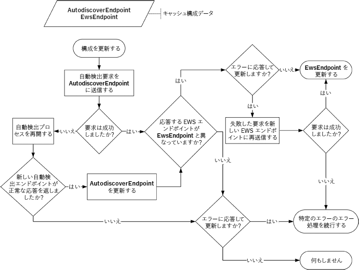

# 自動検出を使用して構成情報を更新します。Refresh configuration information by using Autodiscover

自動検出を使用して、Exchange 接続の構成情報をいつまたどのように更新するかについて説明します。Learn how and when to refresh configuration information for your Exchange connection by using Autodiscover.
  
EWS アプリケーションを初めて実行するとき、自動検出は、ユーザーの Exchange メールボックスに接続するために必要な情報を収集する優れた方法です。しかし、自動検出は初めての使用だけに適しているわけではありません。定期的に自動検出を使用することで、アプリケーションを Exchange 展開の変化に対応させ、接続状態を保持することができます。When your EWS application runs for the first time, Autodiscover provides a great way for you to collect the information you need in order to connect to your user's Exchange mailbox. But Autodiscover isn't just for first time use. Using Autodiscover on a regular basis can help keep your application connected by enabling it to respond to changes in the Exchange deployment.
  
## 自動検出エンドポイントおよび EWS 設定のキャッシュCache Autodiscover endpoint and EWS settings

自動検出を定期的に使用することをお勧めしますが、これを行うには考慮すべき事項があります。環境の変化に対する迅速な対応と、数多く生成される不要なネットワーク トラフィックとのバランスをとるのが理想的です。アプリケーションが初めて自動検出応答に成功した場合、EWS 要求を送信するたびに自動検出プロセスを繰り返さなくてもいいように、次の情報を保存してください。While we recommend that you use Autodiscover regularly, how regularly you use it requires some consideration. Ideally you can balance responding quickly to changes in the environment against generating too much unnecessary network traffic. When your application gets a successful Autodiscover response for the first time, you should save the following information so that you do not have to repeat the Autodiscover process every time you send an EWS request.
  
**表 1 です。自動検出要求をキャッシュするための情報****Table 1. Information to cache for Autodiscover requests**

|**キャッシュを設定します。****Setting to cache**|**に対して無効です。****Valid for…**|**詳細情報****Details**|
|:-----|:-----|:-----|
|自動検出エンドポイントAutodiscover endpoint    |動作中As long as it works    |正常な応答が返されますが、自動検出エンドポイントを保存すると、[自動検出エンドポイントの一覧を生成して](how-to-generate-a-list-of-autodiscover-endpoints.md)、正常な応答を取得するまでにしようとしてのプロセスを繰り返す必要はありません。When you save the Autodiscover endpoint that returned a successful response, you do not have to repeat the process of [generating a list of Autodiscover endpoints](how-to-generate-a-list-of-autodiscover-endpoints.md) and trying them until you get a successful response.   **注**:「EWS のマネージ API が自動検出エンドポイント キャッシュをサポートしていますいません。**NOTE**: The EWS Managed API does not support caching the Autodiscover endpoint.           |
|EWS URL および自動検出応答から取得したその他の設定EWS URL and any other settings retrieved from the Autodiscover response    |24 時間24 hours    |EWS の URL とその他を保存することによって関連の EWS 要求ごとに[新しい自動検出要求の送信](how-to-get-user-settings-from-exchange-by-using-autodiscover.md)をする必要がないか、アプリケーションが再起動するかどうかの設定をします。By saving the EWS URL and other related settings, you do not have to [send a new Autodiscover request](how-to-get-user-settings-from-exchange-by-using-autodiscover.md) for each EWS request or if your application restarts. ただし、EWS の URL は、ユーザーの動作する場合でもサーバーがあることがより最適です。However, even if an EWS URL works for your user, a server might be available that is more optimal.   など、ユーザーのメールボックスは、EWS 端点を優先に、新しいメールボックス サーバーに移動しました可能性があります。For example, the user's mailbox might have moved to a new mailbox server, resulting in a new preferred EWS endpoint. 最後の自動検出の要求から 24 時間経過後、新しい自動検出要求を送信することによって、ユーザーの設定を更新することをお勧めします。We recommend that you refresh your user settings by sending a new Autodiscover request after 24 hours have passed since your last Autodiscover request. この時間は、アプリケーションの要件を満たすように調整できます。This time can be adjusted to meet the requirements of your application.    |
   
## キャッシュされた構成情報を更新するRefresh cached configuration information

情報をキャッシュしたので、今度はそのキャッシュを最新の状態に保つ方法について調べてみましょう。次の場合に、キャッシュされた情報を更新することをお勧めします。Now that you have the information cached, let's examine how you can keep that cache fresh. We recommend that you refresh your cached information when:
  
- 情報の有効期間の期限が切れている場合。The information's validity period expires.
    
- の[接続に関連するエラー](#bk_ConnectionErrors)が発生します。A [Connection-related errors](#bk_ConnectionErrors) occurs. 
    
キャッシュされた情報を更新するには、キャッシュされた自動検出エンドポイントに自動検出要求を送信し、次の操作を行います。To refresh your cached information, send an Autodiscover request to a cached Autodiscover endpoint, and do the following:
  
- 要求が成功したら、応答の EWS エンドポイントとキャッシュされた EWS エンドポイントを比較し、次の操作を行います。If the request succeeds, compare the EWS endpoint in the response with the cached EWS endpoint, and do the following:
    
  - 2 つのエンドポイントが異なる場合は、新しい EWS エンドポイントを使用します。エラーから回復するために更新する場合は、新しいエンドポイントを使用して失敗した要求を再試行してください。If they are different, use the new EWS endpoint. If you're refreshing to recover from an error, retry the failed request with the new endpoint.
    
  - 2 つのエンドポイントが同じ場合は、元の EWS エンドポイントを引き続き使用します。エラーから回復するために更新する場合は、必要に応じてエラーを処理します。If they are the same, continue to use the original EWS endpoint. If you're refreshing to recover from an error, handle the error as appropriate.
    
- 要求が失敗した場合、[自動検出プロセス](autodiscover-for-exchange.md)を最初から開始します。If the request fails, start the [Autodiscover process](autodiscover-for-exchange.md) from the beginning. 正常な応答を取得した後は、自動検出エンドポイントが成功し、新しい EWS エンドポイントを使用する続行すると自動検出エンドポイントのキャッシュを交換してください。After you get a successful response, replace the cached Autodiscover endpoint with the Autodiscover endpoint that succeeded and continue to use the new EWS endpoint. 正常な応答が得られなかった場合は、引き続き元の自動検出エンドポイントとエンドポイントの EWS を使用します。If you do not get a successful response, continue to use the original Autodiscover endpoint and EWS endpoint. エラーから回復するのには更新する場合は、必要に応じてエラーを処理します。If you're refreshing to recover from an error, handle the error as appropriate. 
    
次の図は、このプロセスを視覚的に表したものです。The following figure provides a visual representation of this process.
  
**図 1 です。自動検出を使用して構成情報を更新するためのプロセス****Figure 1. Process for refreshing configuration information by using Autodiscover**

  
### 接続に関連するエラーConnection-related errors

キャッシュされた構成情報を更新すると、すべてではありませんが、一部のエラーを解決することができます。 Refreshing your cached configuration information can help with some errors, but not all. 
  
**表 2 になります。エラーが、キャッシュを更新することで解決****Table 2. Errors addressed by refreshing your cache**

|**Error****Error**|**EWS のマネージ API の実装****EWS Managed API implementation**|**メモ****Notes**|
|:-----|:-----|:-----|
|DNS またはネットワークのエラーDNS or network failure errors   例: ホスト名が見つかりませんでした。Example: Host name could not be found.    |[ServiceRemoteExceptionServiceRemoteException](https://msdn.microsoft.com/library/Microsoft.Exchange.WebServices.Data.ServiceRemoteException.aspx)   |自動検出を試みることによって、サーバーが見つかりませんでしたか、到達できませんでしたを示す、エラーを解決する可能性があります。Any error that indicates that the server could not be found or could not be reached might be resolved by trying Autodiscover.    EWS エンドポイントのキャッシュが有効な場合は、不要になった場合があり、自動検出できる新しいサーバーをポイントすることがあります。Your cached EWS endpoint might no longer be valid, and Autodiscover might be able to point you to the new server.    |
|HTTP 状態のエラーHTTP status errors   例: 503 サービスを利用できません。Example: 503 Service Unavailable    |[ServiceRemoteExceptionServiceRemoteException](https://msdn.microsoft.com/library/Microsoft.Exchange.WebServices.Data.ServiceRemoteException.aspx)   |HTTP ステータス エラーは、さまざまな理由で発生します。HTTP status errors can happen for many different reasons.   ただしは、新しい EWS エンドポイントが、ユーザーが利用できるかどうかを自動検出を実行することをお勧めです。However, it's a good idea to try Autodiscover to see if a new EWS endpoint is available for the user.    |
|EWS エラー コードEWS error codes    例: ErrorConnectionFailedExample: ErrorConnectionFailed   |[ResponseCodeTypeResponseCodeType](https://msdn.microsoft.com/library/Microsoft.Exchange.WebServices.Data.ResponseCodeType.aspx)   | EWS エラー コードのほとんどは保証するもので、構成情報を更新します。Most EWS error codes don't warrant refreshing your configuration information.   ただし、次を具体的に指定の構成情報を更新する必要があること。However, the following specifically indicate that the configuration information needs to be updated: - **ErrorConnectionFailed**- **ErrorConnectionFailed**  - **ErrorMailboxMoveInProgress**- **ErrorMailboxMoveInProgress**   |
   
## 関連項目See also

- [Exchange の自動検出Autodiscover for Exchange](autodiscover-for-exchange.md)  
- [自動検出エンドポイントの一覧を生成します。Generate a list of Autodiscover endpoints](how-to-generate-a-list-of-autodiscover-endpoints.md)   
- [Exchange から自動検出を使用してユーザー設定を取得します。Get user settings from Exchange by using Autodiscover](how-to-get-user-settings-from-exchange-by-using-autodiscover.md)
    

