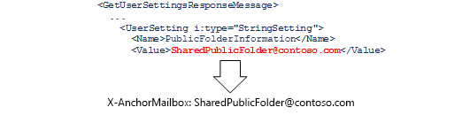
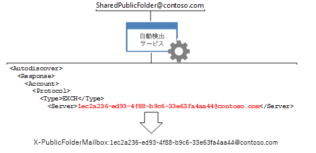

# <a name="route-public-folder-hierarchy-requests"></a>パブリック フォルダー階層の要求のルーティング

パブリック フォルダー情報の移動、更新、削除、パブリック フォルダーの検索など、パブリック フォルダー階層の知識を必要とするすべての要求は、特定のユーザーの既定のパブリック フォルダー階層メールボックスにルーティングする必要があります。 要求をそのメールボックスに転送するには、自動検出サービスによって返される特定の値に**X AnchorMailbox** **X PublicFolderMailbox**のヘッダーを設定する必要があります。 
  
**パブリック フォルダーの概要**

|ヘッダー|必要なもの|取得する方法|
|:-----|:-----|:-----|
|**X AnchorMailbox** <br/> |**X AnchorMailbox**ヘッダーの値になります[GetUserSettings](http://msdn.microsoft.com/en-us/library/office/dd877096%28v=exchg.150%29.aspx)の自動検出の SOAP 応答から[PublicFolderInformation](http://msdn.microsoft.com/en-us/library/dn751006%28v=exchg.150%29.aspx)の値です。<br/><br/> | 1. ユーザーのメールボックスの SMTP アドレスを使用して**GetUserSetting**要求を送信します。<br/><br/>2. 自動検出サービスから返される**PublicFolderInformation**の要素の値をキャッシュします。 コード、または新しい[EWS マネージ API の GetUserSettings を呼び出す](#bk_getpfinfoewsma) [GetUserSettings の SOAP 要求](#bk_getpfinfoews)に既存の自動検出要求のキャッシュされていることができます。  <br/><br/>3. **X AnchorMailbox**のヘッダーの値を設定するのに**PublicFolderInformation**要素を使用します。 **PublicFolderInformation**要素の値は、SMTP アドレスです。  <br/> |
|**X PublicFolderMailbox** <br/> |[サーバー](http://msdn.microsoft.com/en-us/library/bb204084%28v=exchg.150%29.aspx)の値は、 [POX の自動検出の応答](http://msdn.microsoft.com/en-us/library/bb204082%28v=exchg.150%29.aspx)、 **X PublicFolderMailbox**のヘッダーの値となります。<br/><br/> |1。 POX の自動検出サービスの[呼び出し](#bk_makeautodrequest) **X AnchorMailbox**の電子メール アドレスを使用します。  <br/><br/>2. **X PublicFolderMailbox**のヘッダーの値を設定するのには、自動検出サービスによって返される**サーバー**の要素を使用します。 **X PublicFolderMailbox**の値は、ユーザー名と GUID がある SMTP アドレスです。  <br/> |

<br/>

ヘッダーの値を確認した後は、[パブリック フォルダー階層の要求を作成するとき](#bk_setheadervalues)に含めます。
  
この資料の手順は、パブリック フォルダー階層の要求に固有です。 要求は、パブリック フォルダー階層またはコンテンツの要求かどうかを確認するのには、[パブリック フォルダー要求のルーティング](public-folder-access-with-ews-in-exchange.md#bk_routing)を参照してください。
  
## <a name="determine-the-value-of-the-x-anchormailbox-header-by-using-the-ews-managed-api"></a>EWS マネージ API を使用して X-AnchorMailbox ヘッダーの値を決定する
<a name="bk_getpfinfoewsma"> </a>

[PublicFolderInformation (POX)](http://msdn.microsoft.com/library/a221aa9e-b4ac-4ec5-aa42-7e2a69e8eaa6%28Office.15%29.aspx)の値を取得するには、EWS のマネージ API を使用して、自動検出サービスへの既存の呼び出しが返されると、 **PublicFolderInformation**要素の値をキャッシュするか、新しい呼び出しを実行します。 
  
新しい呼び出しを作成する場合、 **GetUserSettings**を取得する次のコードを使用してメソッドのサンプル コード、およびその後の呼び出しに[EWS のマネージ API を使用してユーザー設定の取得](how-to-get-user-settings-from-exchange-by-using-autodiscover.md#bk_Managed)を[EWS のマネージ API を使用してユーザー設定を取得](how-to-get-user-settings-from-exchange-by-using-autodiscover.md#bk_Managed)することができます。**PublicFolderInformation**要素の値のみです。 入力パラメーターとしてメールボックスのユーザーの SMTP アドレスが含まれます。 
  
```cs
GetUserSettingsResponse userResponse = GetUserSettings(adservice, "sonyaf@contoso.com", 3, UserSettingName.PublicFolderInformation);
Console.WriteLine("X-AnchorMailbox value for public folder hierarchy requests: {0}", userResponse.Settings[UserSettingName.PublicFolderInformation]);
```

コードを実行すると、次の情報がコンソールに表示されます。
  
`X-AnchorMailbox for public folder hierarchy requests: SharedPublicFolder@contoso.com`

これで**PublicFolderInformation**の値がある場合は、パブリック フォルダー階層のすべての要求で X AnchorMailbox ヘッダーの値として含まれます。 
  
`X-AnchorMailbox: SharedPublicFolder@contoso.com`

## <a name="determine-the-value-of-the-x-anchormailbox-header-using-soap"></a>SOAP を使用して X-AnchorMailbox ヘッダーの値を決定する
<a name="bk_getpfinfoews"> </a>

[GetUserSettings](http://msdn.microsoft.com/en-us/library/dd877096%28v=exchg.150%29.aspx) SOAP 操作を使用して、 **PublicFolderInformation**値を取得する方法を次のコード例に示します。 メールボックス ユーザーが[メールボックス](http://msdn.microsoft.com/en-us/library/dd877076%28v=exchg.150%29.aspx)要素で指定されているし、 [RequestedSettings](http://msdn.microsoft.com/en-us/library/office/dd877107%28v=exchg.150%29.aspx)要素は、 [PublicFolderInformation](http://msdn.microsoft.com/en-us/library/dn751006%28v=exchg.150%29.aspx)の値への応答を制限します。 
  
```XML
<?xml version="1.0" encoding="utf-8"?>
<soap:Envelope xmlns:a="http://schemas.microsoft.com/exchange/2010/Autodiscover"
               xmlns:wsa="http://www.w3.org/2005/08/addressing"
               xmlns:xsi="http://www.w3.org/2001/XMLSchema-instance"
               xmlns:soap="http://schemas.xmlsoap.org/soap/envelope/">
  <soap:Header>
    <a:RequestedServerVersion>Exchange2007_SP1</a:RequestedServerVersion>
    <wsa:Action>http://schemas.microsoft.com/exchange/2010/Autodiscover/Autodiscover/GetUserSettings</wsa:Action>
    <wsa:To>https://pod51042.outlook.com/autodiscover/autodiscover.svc</wsa:To>
  </soap:Header>
  <soap:Body>
    <a:GetUserSettingsRequestMessage xmlns:a="http://schemas.microsoft.com/exchange/2010/Autodiscover">
      <a:Request>
        <a:Users>
          <a:User>
            <a:Mailbox>sonyaf@contoso.com</a:Mailbox>
          </a:User>
        </a:Users>
        <a:RequestedSettings>
          <a:Setting>PublicFolderInformation</a:Setting>
        </a:RequestedSettings>
      </a:Request>
    </a:GetUserSettingsRequestMessage>
  </soap:Body>
</soap:Envelope>
```

応答には、 **PublicFolderInformation**の値が含まれています。 
  
```XML
<UserSetting i:type="StringSetting">
    <Name>PublicFolderInformation</Name>
    <Value>SharedPublicFolder@contoso.com</Value>
</UserSetting>
```

これで**PublicFolderInformation**の値がある場合は、パブリック フォルダー階層のすべての要求で X AnchorMailbox ヘッダーの値として含まれます。 
  
`X-AnchorMailbox: SharedPublicFolder@contoso.com`

## <a name="make-an-autodiscover-request-to-determine-the-x-publicfolderinformation-value"></a>自動検出要求によって X-PublicFolderInformation 値を決定する
<a name="bk_makeautodrequest"> </a>

**X AnchorMailbox**の値として使用しています**PublicFolderInformation**の SMTP アドレスを使用して、自動検出要求を行います。 使用、 [Exchange 2013: 自動検出とユーザー設定を取得する](http://code.msdn.microsoft.com/exchange/Exchange-2013-Get-user-7e22c86e)の自動検出プロセスを合理化するために自動検出サービスを呼び出すためのコード サンプルです。 このコード サンプルでは、次の表に記載されているコマンドライン引数を使用して、 **PublicFolderInformation**の SMTP アドレスの POX の自動検出サービスを呼び出します。 
  
|**コマンドライン引数**|**説明**|
|:-----|:-----|
|emailAddress  <br/> |**PublicFolderInformation** SMTP アドレスです。  <br/> |
|-skipSOAP  <br/> |  このシナリオに、POX 自動検出要求を使用します。  <br/> |
|-auth authEmailAddress  <br/> |認証に使用されるメールボックス ユーザーの電子メール アドレスです。サンプルを実行すると、メールボックス ユーザーのパスワードの入力を求められます。  <br/> |
   
たとえば、SharedPublicFolder@contoso.com、 **PublicFolderInformation**要素の SMTP アドレスは、sonyaf@contoso.com メールボックス ユーザー、コマンドライン引数する必要がありますこれのようになります。 
  
`SharedPublicFolder@contoso.com -skipSOAP -auth sonyaf@contoso.com`

実行すると、 **Exchange 2013: 自動検出とユーザー設定を取得する**サンプルでは、最後の自動検出応答する必要がありますが成功してメールボックス GUID に関連付けられているすべてのユーザー設定が含まれます。 EXCH[プロトコル](http://msdn.microsoft.com/en-us/library/bb204278%28v=exchg.150%29.aspx)の[種類](http://msdn.microsoft.com/en-us/library/office/bb204223%28v=exchg.150%29.aspx)の要素に関連付けられている[サーバー](http://msdn.microsoft.com/en-us/library/bb204084%28v=exchg.150%29.aspx)の値は、 **X PublicFolderInformation**のヘッダーの値です。 
  
```XML
<Autodiscover xmlns="http://schemas.microsoft.com/exchange/autodiscover/responseschema/2006">
  <Response xmlns="http://schemas.microsoft.com/exchange/autodiscover/outlook/responseschema/2006a">
    …
    <Account>
      <AccountType>email</AccountType>
      <Action>settings</Action>
      <Protocol>
        <Type>EXCH</Type>
        <Server>1ec2a236-ed93-4f88-b9c6-33e63fa4aa44@contoso.com</Server>

```

またはを使用したくない場合、 **Exchange 2013: 自動検出でユーザー設定を取得する**サンプルでは、[自動検出エンドポイントの一覧を生成する](how-to-generate-a-list-of-autodiscover-endpoints.md)に、次の POX の自動検出を送信し、**サーバー**の値を取得できます正常な応答を受信するまでは、各 URL に要求します。 SharedPublicFolder@contoso.com は、 **X PublicFolderMailbox**のヘッダーの値です。 
  
```XML
<?xml version="1.0" encoding="utf-8"?>
<Autodiscover xmlns="http://schemas.microsoft.com/exchange/autodiscover/outlook/requestschema/2006">
  <Request>
    <EMailAddress>SharedPublicFolder@contoso.com</EMailAddress>
    <AcceptableResponseSchema>http://schemas.microsoft.com/exchange/autodiscover/outlook/responseschema/2006a</AcceptableResponseSchema>
  </Request>
</Autodiscover>
```

自動検出プロセスの詳細については、 [Exchange の自動検出](autodiscover-for-exchange.md)、[自動検出エンドポイントの一覧を生成する](how-to-generate-a-list-of-autodiscover-endpoints.md)、および[ユーザー設定の自動検出を使用して Exchange からの取得](how-to-get-user-settings-from-exchange-by-using-autodiscover.md)を参照してください。
  
## <a name="set-the-values-of-the-x-anchormailbox-and-x-publicfoldermailbox-headers"></a>X-AnchorMailbox ヘッダーと X-PublicFolderMailbox ヘッダーの値を設定する
<a name="bk_setheadervalues"> </a>

[EWS のマネージ API を使用して X AnchorMailbox ヘッダーの値を決定する](#bk_getpfinfoewsma)または[SOAP を使用して X AnchorMailbox ヘッダーの値を決定](#bk_getpfinfoews)し、**サーバーで取得した**PublicFolderInformation** SMTP アドレスの値を使用します。** [X PublicFolderInformation の値を確認するのには、自動検出要求を行う](#bk_makeautodrequest)で取得した値、パブリック フォルダー コンテンツ要求の**X AnchorMailbox** **X PublicFolderMailbox**ヘッダーの値を設定します。 
  
たとえば、 **PublicFolderInformation** SMTP アドレスは SharedPublicFolder@contoso.com と 1ec2a236-ed93-4f88-b9c6-33e63fa4aa44@contoso.com の**サーバー**の値を指定するには、次のヘッダーには、次の呼び出しを実行するときメソッドまたは操作します。 
  
`X-AnchorMailbox: SharedPublicFolder@contoso.com` <br/>
`X-PublicFolderMailbox: 1ec2a236-ed93-4f88-b9c6-33e63fa4aa44@contoso.com`

**X AnchorMailbox と X-パブリック フォルダーのヘッダーを必要とするパブリック フォルダーの呼び出し**

|**EWS マネージ API メソッド**|**EWS の操作**|
|:-----|:-----|
|[Folder.FindFolders](http://msdn.microsoft.com/en-us/library/microsoft.exchange.webservices.data.folder.findfolders%28v=exchg.80%29.aspx) <br/> [Folder.Delete](http://msdn.microsoft.com/en-us/library/microsoft.exchange.webservices.data.folder.delete%28v=exchg.80%29.aspx) <br/> [Folder.Update](http://msdn.microsoft.com/en-us/library/microsoft.exchange.webservices.data.folder.update%28v=exchg.80%29.aspx) <br/> [Folder.Move](http://msdn.microsoft.com/en-us/library/microsoft.exchange.webservices.data.folder.move%28v=exchg.80%29.aspx) <br/> |[CreateFolder](http://msdn.microsoft.com/library/6f6c334c-b190-4e55-8f0a-38f2a018d1b3%28Office.15%29.aspx) <br/> [FindFolder](http://msdn.microsoft.com/library/7a9855aa-06cc-45ba-ad2a-645c15b7d031%28Office.15%29.aspx) <br/> [DeleteFolder](http://msdn.microsoft.com/library/b0f92682-4895-4bcf-a4a1-e4c2e8403979%28Office.15%29.aspx) <br/> [UpdateFolder](http://msdn.microsoft.com/library/3494c996-b834-4813-b1ca-d99642d8b4e7%28Office.15%29.aspx) <br/> [MoveFolder](http://msdn.microsoft.com/library/c7233966-6c87-4a14-8156-b1610760176d%28Office.15%29.aspx) <br/> |
   
EWS のマネージ API を使用して、これらのヘッダーを追加するには、 [HttpHeaders.Add](http://msdn.microsoft.com/en-us/library/system.net.http.headers.httpheaders.add%28v=vs.118%29.aspx)メソッドを使用します。 
  
```cs
service.HttpHeaders.Add("X-AnchorMailbox", "SharedPublicFolder@contoso.com");service.HttpHeaders.Add("X-PublicFolderMailbox", "1ec2a236-ed93-4f88-b9c6-33e63fa4aa44@contoso.com");
```

たとえば、次のコードでは、この資料の例で取得した値に設定し、 **X AnchorMailbox** **X PublicFolderMailbox**のヘッダーを持つ[FindFolder](http://msdn.microsoft.com/library/7a9855aa-06cc-45ba-ad2a-645c15b7d031%28Office.15%29.aspx)要求を示しています。 
  
```XML
POST https://outlook.office365.com/EWS/Exchange.asmx HTTP/1.1
Content-Type: text/xml; charset=utf-8
User-Agent: SoapSender1.0
X-AnchorMailbox: SharedPublicFolder@contoso.com
X-PublicFolderMailbox: 1ec2a236-ed93-4f88-b9c6-33e63fa4aa44@contoso.com
Host: outlook.office365.com
Content-Length: 1174
Expect: 100-continue
Connection: Keep-Alive
<?xml version="1.0" encoding="utf-8"?>
<soap:Envelope xmlns:xsi="http://www.w3.org/2001/XMLSchema-instance" xmlns:m="http://schemas.microsoft.com/exchange/services/2006/messages" xmlns:t="http://schemas.microsoft.com/exchange/services/2006/types" xmlns:soap="http://schemas.xmlsoap.org/soap/envelope/">
  <soap:Header>
    <t:RequestServerVersion Version="Exchange2013_SP1" />
  </soap:Header>
  <soap:Body>
    <m:FindFolder Traversal="Shallow">
      <m:FolderShape>
        <t:BaseShape>AllProperties</t:BaseShape>
      </m:FolderShape>
      <m:IndexedPageFolderView MaxEntriesReturned="1" Offset="0" BasePoint="Beginning" />
      <m:Restriction>
        <t:IsEqualTo>
          <t:FieldURI FieldURI="folder:DisplayName" />
          <t:FieldURIOrConstant>
            <t:Constant Value="My Public Contacts" />
          </t:FieldURIOrConstant>
        </t:IsEqualTo>
      </m:Restriction>
      <m:ParentFolderIds>
        <t:FolderId Id="AQEuAAADy/LIWjRCp0GFb0W6aGPbwwEARg5aCLUc8k6wLfl1c0a/2AAAAwIAAAA=" ChangeKey="AQAAABYAAABGDloItRzyTrAt+XVzRr/YAABdo/XB" />
      </m:ParentFolderIds>
    </m:FindFolder>
  </soap:Body>
</soap:Envelope>
```

## <a name="see-also"></a>関連項目

- [Exchange での EWS を使用したパブリック フォルダー アクセス](public-folder-access-with-ews-in-exchange.md)    
- [パブリック フォルダー コンテンツの要求をルーティングします。](how-to-route-public-folder-content-requests.md)    
- [EWS のマネージ API を使用してユーザー設定を取得します。](how-to-get-user-settings-from-exchange-by-using-autodiscover.md#bk_Managed)
    

