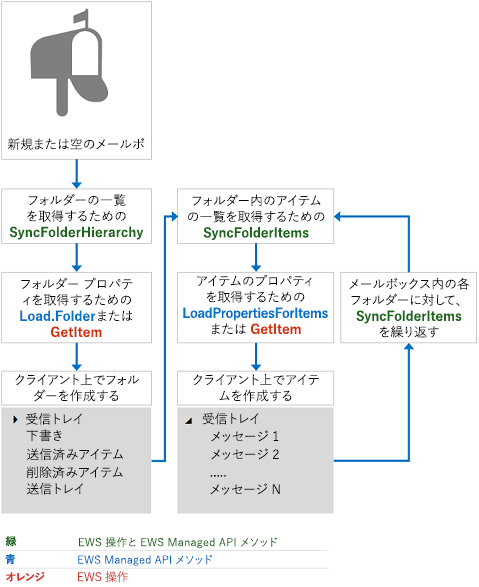

# Exchange のメールボックス同期と EWSMailbox synchronization and EWS in Exchange

EWS を使用して Exchange にアクセスするときのメールボックスの同期の動作を確認します。Find out how mailbox synchronization works when you use EWS to access Exchange.
  
Exchange では EWS が次の 2 種類の同期を使用して、メールボックスの内容、およびその内容への変更を取得します。EWS in Exchange uses two types of synchronization to retrieve mailbox content and changes to mailbox content:
  
- フォルダーの同期Folder synchronization
    
- アイテムの同期Item synchronization
    
この記事では、両方の同期の種類、同期のしくみ、同期の設計パターン、および同期のベスト プラクティスについて説明します。In this article, you'll learn about both types of synchronization, how synchronization works, synchronization design patterns, and synchronization best practices.
  
## フォルダーとアイテムの同期Folder and item synchronization

フォルダーの同期では、フォルダー構造、またはフォルダー階層を同期します。アイテムの同期では、フォルダー内のアイテムを同期します。アイテムを同期するときは、メールボックス内の各フォルダーを個別に同期する必要があります。フォルダーおよびアイテムの同期を実装するには、アプリケーションに EWS または EWS マネージ API を使用できます。Folder synchronization syncs a folder structure, or folder hierarchy. Item synchronization syncs the items within a folder. When you synchronize items, you have to sync each folder in the mailbox independently. You can use EWS or the EWS Managed API in your application to implement both folder and item synchronization.
  
**表 1. フォルダーとアイテムの同期のための EWS 操作と EWS マネージ API****Table 1. EWS operations and EWS Managed API methods for syncing folders and items**

|**EWS 操作****EWS operation**|**EWS マネージ API メソッド****EWS Managed API method**|
|:-----|:-----|
|[SyncFolderHierarchySyncFolderHierarchy](https://msdn.microsoft.com/library/b31916b1-bc6c-4451-a475-b7c5417f752d%28Office.15%29.aspx)   |[ExchangeService.SyncFolderHierarchy メソッドExchangeService.SyncFolderHierarchy method](https://msdn.microsoft.com/library/microsoft.exchange.webservices.data.exchangeservice.syncfolderhierarchy%28v=exchg.80%29.aspx)   |
|[SyncFolderItemsSyncFolderItems](https://msdn.microsoft.com/library/7f0de089-8876-47ec-a871-df118ceae75d%28Office.15%29.aspx)   |[ExchangeService.SyncFolderItems メソッドExchangeService.SyncFolderItems method](https://msdn.microsoft.com/library/microsoft.exchange.webservices.data.exchangeservice.syncfolderitems%28v=exchg.80%29.aspx)   |
   
発生する同期の範囲は、次のように、初期同期か、または継続している同期かによって異なります。The scope of the synchronization that occurs differs depending on whether it is an initial or an ongoing sync, as follows:
  
- 初期同期は、サーバー上のすべてのフォルダーまたはアイテムをクライアントに同期します。初期同期後、クライアントには、今後の同期のために格納される同期状態があります。同期状態は、サーバーがクライアントに伝えたサーバー上のすべての変更を表します。An initial synchronization syncs all folders or items on the server to the client. After the initial synchronization, the client has a sync state that it stores for future synchronizations. The sync state represents all the changes on the server that the server communicated to the client.
    
- 継続的な同期では、前回の同期以降に追加、削除、または変更したアイテムまたはフォルダーを同期します。サーバーは、同期状態を使用して、それぞれの継続的な同期ループ中にクライアントに報告する変更を計算します。Ongoing synchronizations sync any items or folders that have been added, deleted, or changed since the previous synchronization. The server uses the sync state to calculate the changes to report to the client during each of the ongoing synchronization loops.
    
各同期メソッドまたは操作は、変更した実際のフォルダーやメッセージではなく、変更の一覧を返します。アイテムとフォルダーへの変更は、次の種類の変更を使用して報告されます。Each synchronization method or operation returns a list of changes, not the actual folder or message that changed. Changes to items and folders are reported by means of the following change types:
  
- 作成 — クライアント上で新しく作成する必要のあるアイテムまたはフォルダーを示します。Create — Indicates that a new item or folder should be created on the client.
    
- 更新 — クライアント上で変更する必要のあるアイテムまたはフォルダーを示します。Update — Indicates that an item or folder should be changed on the client.
    
- 削除 — クライアント上で削除する必要のあるアイテムまたはフォルダーを示します。Delete — Indicates that an item or folder should be deleted on the client.
    
- EWS 用の ReadStateChange、または EWS マネージ API 用のReadFlagChange — アイテムの読み取り状態が未読から開封済み、または開封済みから未読になったことを示します。ReadStateChange for EWS or ReadFlagChange for the EWS Managed API — Indicates that that the read state of the item has changed, either from unread to read, or read to unread.
    
Exchange Online、Office 365 の一部としての Exchange Online、および Exchange 2010 SP2 以降のバージョンの Exchange では、アイテムおよびフォルダーは最も新しいものから古いものの順で返されます。以前のバージョンの Exchange では、アイテムとフォルダーは最も古いものから新しいものの順で返されます。In Exchange Online, Exchange Online as part of Office 365, and versions of Exchange starting with Exchange 2010 SP2, items and folders are returned in order from newest to oldest. In previous versions of Exchange, items and folders are returned from oldest to newest.
  
## EWS の同期のしくみについてHow does EWS synchronization work?

簡単に言うと、最初にメールボックスの同期をとる場合は、図 1 に示すプロセスを使用します。In a nutshell, if you're synchronizing a mailbox for the first time, use the process as shown in Figure 1. その他の[同期の設計パターン](mailbox-synchronization-and-ews-in-exchange.md#bk_syncpatterns)も使用できますが、拡張性の高いアプリケーションには、この方法をお勧めします。Although you can use other [synchronization design patterns](mailbox-synchronization-and-ews-in-exchange.md#bk_syncpatterns), we recommend this approach for scalable applications.
  
**図 1. 初期同期の設計パターン****Figure 1. Initial synchronization design pattern**

  
クライアントの既存の同期状態を使用してメールボックスを同期するには、図 2 に示す設計パターンを実装することをお勧めします。If you're using an existing sync state on the client to synchronize a mailbox, we recommend that you implement the design pattern as shown in Figure 2. 
  
**図 2. 継続的な同期の設計パターン****Figure 2. Ongoing synchronization design pattern**

  
## 同期の設計パターンSynchronization design patterns

アプリケーションでは、通知ベースの同期、または同期のみの 2 つの方法のうち、いずれかの同期の設計パターンをアプリケーションに使用して、メールボックスを最新に保つことができます。You can use one of two synchronization design patterns in your application to keep your mailboxes up to date: notification-based synchronization, or the synchronization-only approach.
  
[図 2](mailbox-synchronization-and-ews-in-exchange.md#bk_howdoesitwork) に示すとおり、通知ベースの同期は、EWS マネージ API の [SyncFolderItems](https://msdn.microsoft.com/library/microsoft.exchange.webservices.data.exchangeservice.syncfolderitems%28v=exchg.80%29.aspx) または [SyncFolderHierarchy](https://msdn.microsoft.com/library/microsoft.exchange.webservices.data.exchangeservice.syncfolderhierarchy%28v=exchg.80%29.aspx) メソッド、あるいは EWS の [SyncFolderHierarchy](https://msdn.microsoft.com/library/b31916b1-bc6c-4451-a475-b7c5417f752d%28Office.15%29.aspx) または [SyncFolderItems](https://msdn.microsoft.com/library/7f0de089-8876-47ec-a871-df118ceae75d%28Office.15%29.aspx) 操作を呼び出すために、クライアントに警告する通知に依存します。Notification-based synchronization, as illustrated in [Figure 2](mailbox-synchronization-and-ews-in-exchange.md#bk_howdoesitwork), relies on notifications to alert the client to make a call to the EWS Managed API [SyncFolderItems](https://msdn.microsoft.com/library/microsoft.exchange.webservices.data.exchangeservice.syncfolderitems%28v=exchg.80%29.aspx) or [SyncFolderHierarchy](https://msdn.microsoft.com/library/microsoft.exchange.webservices.data.exchangeservice.syncfolderhierarchy%28v=exchg.80%29.aspx) methods, or the EWS [SyncFolderHierarchy](https://msdn.microsoft.com/library/b31916b1-bc6c-4451-a475-b7c5417f752d%28Office.15%29.aspx) or [SyncFolderItems](https://msdn.microsoft.com/library/7f0de089-8876-47ec-a871-df118ceae75d%28Office.15%29.aspx) operations. このタイプの同期は一般に、スケーラブルなアプリケーションに推奨されますが、いつでも最適であるとは限りません。This type of synchronization is generally recommended for scalable applications, but it might not be the best approach for everyone. 通知ベースの同期には、次の利点があります。Notification-based synchronization has the following advantage: 
  
- 通知は、バックエンドの Exchange データベースへの呼び出しを減らすために最適化されています。イベント キューとサブスクリプションは、メールボックス サーバー (または Exchange 2010 および Exchange 2007 の Client Access サーバー) で管理されますが、イベントとサブスクリプションの管理では、Exchange データベースへの同期の呼び出し頻度の高い他の管理方法よりも、使用するリソースが少なくて済みます。また、Exchange には、通知とサブスクリプションに固有の[調整ポリシー](ews-throttling-in-exchange.md)があり、リソースの消費量を保護します。Notifications are optimized to reduce calls to the backend Exchange database. Event queues and subscriptions are managed by the mailbox server (or the Client Access server in Exchange 2010 and Exchange 2007); however, the management of the events and subscriptions uses fewer resources than the alternative, which is more frequent synchronization calls to the Exchange database. In addition, Exchange has specific [throttling policies](ews-throttling-in-exchange.md) for notifications and subscriptions, to safeguard consumption of resources. 
    
ただし、通知ベースの同期を使用する場合にもいくつかの欠点はあります。However, there are also some drawbacks to using notification-based synchronization:
  
- 通知はほとんどのシナリオで、1 つのユーザーの目的に対して複数の通知が必要になるため、わずらわしい場合があります。Notifications are noisy because most scenarios involve multiple notifications for one user intent. これは特に、予定表フォルダーに当てはまります。This is especially true of the Calendar folder. たとえば、1 つの会議出席依頼を受信すると、アイテムを作成する通知とアイテムを変更する通知を含め、複数のアイテムおよびフォルダーの通知が作成されます。For example, when a single meeting request is received, multiple item and folder notifications are created, including a notification to create the item and another to modify the item. このような欠点を軽減するには、[Load](https://msdn.microsoft.com/library/microsoft.exchange.webservices.data.serviceobject.load%28v=exchg.80%29.aspx)、[LoadPropertiesForItems](https://msdn.microsoft.com/library/microsoft.exchange.webservices.data.exchangeservice.loadpropertiesforitems%28v=exchg.80%29.aspx)、[GetItem](https://msdn.microsoft.com/library/exchange/aa565934%28v=exchg.150%29.aspx.aspx)、[GetFolder](https://msdn.microsoft.com/library/exchange/aa580274%28v=exchg.150%29.aspx.aspx) の呼び出しに数秒の遅延を設定する方法があります。One way to mitigate this drawback is to build a delay of a few seconds into your [Load](https://msdn.microsoft.com/library/microsoft.exchange.webservices.data.serviceobject.load%28v=exchg.80%29.aspx), [LoadPropertiesForItems](https://msdn.microsoft.com/library/microsoft.exchange.webservices.data.exchangeservice.loadpropertiesforitems%28v=exchg.80%29.aspx), [GetItem](https://msdn.microsoft.com/library/exchange/aa565934%28v=exchg.150%29.aspx.aspx), or [GetFolder](https://msdn.microsoft.com/library/exchange/aa580274%28v=exchg.150%29.aspx.aspx) call. 会議出席依頼の場合、すぐに **GetItem** 操作を呼び出すと、呼び出しはアイテムの作成とアイテムの変更の 2 つになる可能性があります。In the case of a meeting request, if you made calls to the **GetItem** operation immediately, you might have one call to create the item and another to modify the item. 代わりに、呼び出しを遅延させると、1 回の **GetItem** 操作の呼び出しで、アイテムの作成と修正を同時に含む変更を取得できます。Instead, by delaying the call, you can call the **GetItem** operation once and get the changes that encompass the creation and the modification of the item at the same time. 
    
- 通知はメールボックス サーバー上のキューに置かれ、サブスクリプションはメールボックス サーバーに保存されます。Notifications are queued on the mailbox server and subscriptions are saved on the mailbox server. サブスクリプションを管理するメールボックス サーバーが使用できない場合は、新しい通知が失われ、メールボックスは同期されないため、通知にサブスクライブし直さなければならなくなります。If the mailbox server that manages the subscription is unavailable, you lose any new notifications, your mailbox won't synchronize, and you'll have to resubscribe to the notifications.
    
- 通知が失敗した場合の軽減対策を計画する必要があります。You'll need to plan for mitigation strategies in the event that notifications fail. このように、2 番目の方法である同期専用の設計パターンの方が、通知ベースの同期よりも弾力性があります。これは、クライアントが同期状態を維持するだけで済み、サブスクリプションを管理するメールボックス サーバーに対するアフィニティの問題がないためです。In this way, the second approach, the synchronization-only design pattern, is more resilient than notification-based synchronization, because it only requires that the client maintain the sync state — there are no issues with affinity to the mailbox server managing the subscription.
    
推奨どおりに実装されている場合、通知ベースのサブスクリプション設計パターンは以下のものに依存します。If implemented as recommended, the notification-based subscription design pattern relies on: 
  
- データが*いつ*変更されたかを確認する通知。Notifications to determine  *when*  the data changed. 
    
- 返される同期イベントの数を最適化して、*何が*変更されたかを判別するための EWS マネージ API の **SyncFolderHierarchy** メソッドまたは **SyncFolderItems** メソッド、あるいは EWS の **SyncFolderHierarchy** 操作または **SyncFolderItems** 操作。The EWS Managed API **SyncFolderHierarchy** or **SyncFolderItems** methods, or the EWS **SyncFolderHierarchy** or **SyncFolderItems** operations to determine  *what*  changed, optimizing the number of sync events returned. 新しいアイテムが作成、更新、または削除されたかどうか。Was a new item created, updated, or deleted? これらのメソッドから知る必要のあるものはこれですべてです。変更したプロパティの一覧については、それらに依存しないでくださいThat's all you need to know from these methods, don't rely on them for the property list of changes. (返されるアイテムまたはフォルダーのすべてに対して、**GetItem** や **LoadPropertiesForItems** を呼び出さないでください)。(Don't do a **GetItem** or **LoadPropertiesForItems** call on all items or folders returned). 
    
- EWS マネージ API で **Load** または **LoadPropertiesForItems** メソッドを使用するか、EWS の **GetItem** 操作を使用して、*どのように*データが変更されたかを確認し、必要に応じてサーバーからプロパティを取得します。その際、返されるデータ量に基づいてバッチ要求を整理します。Using the **Load** or **LoadPropertiesForItems** methods in the EWS Managed API, or the EWS **GetItem** operation to determine  *how*  the data changed and to retrieve properties from the server as needed, organizing batched requests based on the amount of data that will be returned. その後、クライアントのプロパティとサーバーから返されたプロパティが比較され、最終的に、クライアントのアイテムまたはフォルダーが作成、削除、または変更されます。This is followed by a comparison of the properties on the client and those just returned from the server, and ultimately the creation, deletion, or modification of the item or folder on the client. 
    
同期のみのアプローチは、EWS マネージ API の **SyncFolderItems** メソッドと **SyncFolderHierarchy** メソッド、または EWS の **SyncFolderHierarchy** 操作または **SyncFolderItems** 操作に全面的に依存しています。それらは、連続して呼び出すか、またはタイミングを指定したイベントとして呼び出すことができます。The synchronization-only approach relies entirely on the **SyncFolderItems** and **SyncFolderHierarchy** EWS Managed API methods, or the **SyncFolderHierarchy** or **SyncFolderItems** EWS operations, which you can either call continuously, or as a timed event. このオプションにも一長一短があります。There are pros and cons to this option as well. 同期のみの方法は、同期状態がメールボックス レベルでクライアントに格納されており、同期状態と、通知サブスクリプションを保持するメールボックス サーバーとの間に一意の関係が必要ないため、より弾力性があります。The synchronization-only approach is more resilient because the sync state is stored on the client at the mailbox level and a unique relationship between the sync state and any the mailbox server that maintains the notification subscription is not required. この同期方法はメールボックス サーバーから独立しているため、メールボックスのフェールオーバーも切り抜けることができます。The synchronization approach can survive a mailbox failover because of its independence from the mailbox server. ただし、この同期方法では、アイテムを受信したときにリアルタイムではなく、時間指定で同期、または断続的に同期されるために待機時間が増加します。However, the synchronization approach increases latency for the user because items are synchronized on a timed or intermittent basis — not in real time when items arrive. この方法では、変更がなくても可能であれば Exchange データベースが呼び出されるため、コストもかかります。This approach is also more costly, because you're making calls to the Exchange database when it's possible that no changes have occurred. 
  
## 同期のベスト プラクティスSynchronization best practices

拡張性の高いアプリケーションの場合は、アプリケーション内のメールボックスの同期に次のベスト プラクティスを適用することをお勧めします。For highly scalable applications, we recommend that you apply the following best practices to synchronize mailboxes in your application:
  
- Exchange データベースへの呼び出し回数を少なくするため、EWS マネージ API の **SyncFolderItems** メソッドまたは **SyncFolderHierarchy** メソッドを呼び出す際には、_propertySet_ パラメーターの値として _IdOnly_ を使用してください。または、EWS の **SyncFolderHierarchy** 操作または **SyncFolderItems** 操作を使用する際には、[BaseShape](https://msdn.microsoft.com/library/42c04f3b-abaa-4197-a3d6-d21677ffb1c0%28Office.15%29.aspx) の値として **IdOnly** 値を使用してください。When calling the EWS Managed API **SyncFolderItems** or **SyncFolderHierarchy** method use the  _IdOnly_ value for the  _propertySet_ parameter, or when using the EWS **SyncFolderHierarchy** or **SyncFolderItems** operations use the **IdOnly** value for the [BaseShape](https://msdn.microsoft.com/library/42c04f3b-abaa-4197-a3d6-d21677ffb1c0%28Office.15%29.aspx) value to reduce calls to the Exchange database. **SyncFolderItems** または **SyncFolderHierarchy** の呼び出しのプロパティ セットで要求するプロパティの数が多いほど、作成されるバックエンド呼び出しの数が多くなります。The more properties you request in the property set of the **SyncFolderItems** or **SyncFolderHierarchy** call, the more backend calls are created. 要求するプロパティ値ごとに 1 回ずつ新たな RPC 呼び出しがなされます。一方、要求のための **ItemId** については、報告する結果の数に関係なく、1 回の RPC 呼び出しでそのすべてが取り出されます。A new RPC call is made for every property value requested, whereas only one RPC call is made to retrieve all the **ItemIds** for a request - no matter the number of results to report. そのため 1 つの **IdOnly** 要求が 1 つのデータベース呼び出しになり、件名と送信者のプロパティ バッグの要求は、**Subject** について 1 回、**Sender** について 1 回、および **ItemId** について 1 回、合計 3 回のデータベース呼び出しになります。So an **IdOnly** request results in one database call, whereas a property bag request for the subject and sender results in three database calls: one for the **Subject**, one for the **Sender**, and one for the **ItemId**.
    
- 同期応答の中のすべてのアイテムに対して、EWS マネージ API の **Load** メソッドまたは **LoadPropertiesForItems** メソッド、あるいは EWS の **GetItem** 操作または **GetFolder** 操作を呼び出すことはしないでください。Don't call the EWS Managed API **Load** or **LoadPropertiesForItems** methods, or the EWS **GetItem** or **GetFolder** operations, on every item in a synchronization response. 代わりに、結果を解析し、読み取り状態の変更など、プロパティを取得する必要のない変更を確認します。Instead, parse the results; look for changes that don't require all the properties to be retrieved, like read state changes. 応答に読み取り状態の変更が含まれている場合は、クライアント上のフラグを更新するだけで済み、アイテム プロパティをすべて取得する必要はありません。If a response includes a read state change, just update the flag on the client and you're done; no need to get all the item properties. 同じクライアントからの変更をまとめることによって、作業が重複しないようにします。And make sure that you don't duplicate effort by making changes that originated from the same client. たとえば、同期応答にアイテムの削除が含まれ、削除がローカル クライアントで行われた場合は、そのアイテムのメッセージを再度削除したり、すべてのプロパティを取得したりする必要はありません。For example, if the synchronization response includes the deletion of an item, and the deletion happened on the local client, you don't need to delete the message again or get all the properties for that item. 
    
- 次のようにして、調整を不要にします。Avoid getting throttled, by doing the following:
    
  - EWS マネージ API の \*\*LoadPropertiesForItems \*\*メソッドまたは EWS の **GetItem** 操作を呼び出してアイテムをバッチで取得する場合、バッチに含める要求のアイテム数が多すぎないようにしてください。多すぎる場合、[調整される](ews-throttling-in-exchange.md)場合があります。When you do call the EWS Managed API **LoadPropertiesForItems** method or the EWS **GetItem** operation to get the items in a batch, do not batch too many items in your request; otherwise, you might get [throttled](ews-throttling-in-exchange.md). バッチごとに含めるアイテム数は 10 個にすることをお勧めします。We recommend that you include 10 items per batch.
    
  - 短時間で要求する数が多すぎないようにしてください。Don't make too many requests in too short a time. これも調整の原因となり、応答時間がかえって長くなります。This will also cause throttling, and increase the response time, rather than shorten it. 
    
  - アイテムをバッチ処理する場合、[FolderId](https://msdn.microsoft.com/library/00d14e3e-4365-4f21-8f88-eaeea73b9bf7%28Office.15%29.aspx) 要素の **Id** および **ChangeKey** 属性が同じ値のアイテムをすべてバッチ処理します。If you are batching items, batch all items with the same values for the **Id** and **ChangeKey** attributes of the [FolderId](https://msdn.microsoft.com/library/00d14e3e-4365-4f21-8f88-eaeea73b9bf7%28Office.15%29.aspx) element. 
    
  - 調整されてしまう場合は、送信要求を停止します。要求を再送信すると、回復作業が長引きます。代わりに、時間切れになるまで待機し、もう一度同期要求を送信します。If you do get throttled, stop sending requests. Resending requests will prolong the recovery effort. Instead, wait for the back off time to expire, and then try sending your sync requests again.
    
- 受信した[通知イベント](notification-subscriptions-mailbox-events-and-ews-in-exchange.md#bk_eventtypes)の種類に応じて、次のようにします。Depending on the type of [notification event](notification-subscriptions-mailbox-events-and-ews-in-exchange.md#bk_eventtypes) received: 
    
  - **NewMail** または **Modified** イベントの場合、通知によって **ChangeKey** が提供されず、読み取り状態の変更も展開されないため、EWS マネージ API の **SyncFolderItems** メソッドまたは EWS の **SyncFolderItems** 操作を呼び出します。For **NewMail** or **Modified** events, call the EWS Managed API **SyncFolderItems** method or the EWS **SyncFolderItems** operation because notifications do not provide a **ChangeKey**, and notifications do not call out read state changes.
    
  - **Deleted** イベントの場合、前の同期の前に通知サブスクリプションが有効だった場合は、単にイベントをローカルで削除します。For **Deleted** events, if the notification subscription was active before the previous sync, just delete the event locally. 削除の直後に EWS マネージ API の **SyncFolderItems** メソッドまたは EWS の **SyncFolderItems** 操作を呼び出す必要はありません。You do not need to call the EWS Managed API **SyncFolderItems** method or the EWS **SyncFolderItems** operation immediately after the deletion. 
    
  - 読み取り状態の変化によって **Modified** イベントが発生した場合は、EWS マネージ API の **LoadPropertiesForItems** メソッドまたは EWS の **GetItem** 操作を呼び出さず、アイテムのフラグのみを変更します。If a **Modified** event was caused by a read state change, do not call the EWS Managed API **LoadPropertiesForItems** method or the EWS **GetItem** operation , just change the flag on the item. 
    
- 予定表のデータを同期する場合は、次のようにします。When synchronizing calendar data, proceed as follows:
    
  - 通知ベースの同期と同じような方法を使用します。Use an approach similar to notification-based synchronization. **SyncFolderItem** には予定表ロジックがないため、[CalendarView](https://msdn.microsoft.com/library/a4a953b8-0710-416c-95ef-59e51eba9982%28Office.15%29.aspx) 要素で EWS マネージ API の [FindAppointments](https://msdn.microsoft.com/library/dd633767%28v=exchg.80%29.aspx) メソッド、または EWS の [FindItem 操作](https://msdn.microsoft.com/library/ebad6aae-16e7-44de-ae63-a95b24539729%28Office.15%29.aspx)を使用して 2 つの日付の間の予定を表示し、次に EWS マネージ API の **LoadPropertiesForItems** メソッドまたは EWS の **GetItem** 操作を呼び出して予定表アイテムのアイテム プロパティを取得します。Because **SyncFolderItem** does not include any calendaring logic, use the EWS Managed API [FindAppointments](https://msdn.microsoft.com/library/dd633767%28v=exchg.80%29.aspx) method, or the EWS [FindItem operation](https://msdn.microsoft.com/library/ebad6aae-16e7-44de-ae63-a95b24539729%28Office.15%29.aspx) with the [CalendarView](https://msdn.microsoft.com/library/a4a953b8-0710-416c-95ef-59e51eba9982%28Office.15%29.aspx) element to view appointments between two dates, and then call the EWS Managed API **LoadPropertiesForItems** method, or the EWS **GetItem** operation to retrieve the item properties for the calendar item. 
    
  - **CalendarView** 要素について、EWS マネージ API の **FindAppointments** メソッドまたは EWS の **FindItem** 操作を使用してポーリングしないでください。Do not poll using the EWS Managed API **FindAppointments** method, or the EWS **FindItem** operation with a **CalendarView** element. 
    
- 検索フォルダーを同期する場合:When synchronizing search folders:
    
  - 通知ベースの同期と同じような方法を使用します。Use an approach similar to notification-based synchronization. 
    
  - 通知を使用して、データがいつ変更されたかを確認します。Use notifications to determine when data changes.
    
  - 検索フォルダーでは **SyncFolderItem** を使用できないため、並べ替えおよびページングされた EWS マネージ API の [FindItems](https://msdn.microsoft.com/library/microsoft.exchange.webservices.data.exchangeservice.finditems%28v=exchg.80%29.aspx) メソッド、または [FractionalPageItemView](https://msdn.microsoft.com/library/4111afec-35e7-4c6f-b291-9bbba603f633%28Office.15%29.aspx) および [SortOrder](https://msdn.microsoft.com/library/c2413f0b-8c03-46ae-9990-13338b3c53a6%28Office.15%29.aspx) 要素セットを指定した EWS の **FindItem** 操作を使用して、何が変更されたかを確認します。Because you can't use **SyncFolderItem** in a search folder, use a sorted and paged EWS Managed API [FindItems](https://msdn.microsoft.com/library/microsoft.exchange.webservices.data.exchangeservice.finditems%28v=exchg.80%29.aspx) method, or EWS **FindItem** operation with the [FractionalPageItemView](https://msdn.microsoft.com/library/4111afec-35e7-4c6f-b291-9bbba603f633%28Office.15%29.aspx) and [SortOrder](https://msdn.microsoft.com/library/c2413f0b-8c03-46ae-9990-13338b3c53a6%28Office.15%29.aspx) element set, to determine what changed. 
    
  - EWS マネージ API の **LoadPropertiesForItems** メソッドまたは EWS の **GetItem** 操作を使用して、データを取り出します。Use the EWS Managed API **LoadPropertiesForItems** method or the EWS **GetItem** operation to retrieve data. 
    
## フィルターされた同期Filtered synchronization

EWS マネージ API の **SyncFolderItems** メソッドに _ignoreItemIds_ パラメータを設定するか、EWS の **SyncFolderItems** 操作で [Ignore](https://msdn.microsoft.com/library/7789eec5-ceec-43f2-84d5-d0d15b734076%28Office.15%29.aspx) 要素を設定して、特定のアイテムをその ItemId に基づいて無視できます。The EWS Managed API **SyncFolderItems** method and the EWS **SyncFolderItems** operation enable you to ignore specific items, based on their ItemIds, by setting the  _ignoreItemIds_ parameter in the EWS Managed API or the [Ignore](https://msdn.microsoft.com/library/7789eec5-ceec-43f2-84d5-d0d15b734076%28Office.15%29.aspx) element in EWS. これは、たとえばあるユーザーが全社員に送信された電子メール メッセージに、全員宛に返信しようとしている場合などに役立ちます。This is ideal when, for example, individuals begin to reply all to an email message sent to everyone in the company. 
  
特定のプロパティを変更した場合に、通知をフィルター処理 (および同期のみを開始) できるだろうかと思うかもしれません。通知サブスクリプションは変更の種類 (作成、更新、削除) に基づいており、更新されたプロパティには基づいていないため、この方法は妥当なように思われますが、この方法では通知をフィルター処理できません。代わりに、以下の操作を実行できます。You might wonder, can I filter my notifications (and therefore only trigger synchronization) if specific properties change? Although that does seem reasonable, because notification subscriptions are based on the type of change (create, update, delete), and not the property being updated, you cannot filter notifications in this way. Instead, you can do the following:
  
- 通知ベースのサブスクリプション設計パターンを使用します。Use the notification-based subscription design pattern.
    
- EWS マネージ API の **SyncFolderItems** メソッドと **SyncFolderHierarchy** メソッドを、_propertySet_ パラメーターを _IdOnly_ に設定して繰り返し呼び出すことにより、同期状態を最新のものにします。Call the EWS Managed API **SyncFolderItems** and **SyncFolderHierarchy** methods repeatedly with the  _propertySet_ parameter set to  _IdOnly_ to make your sync state current. または、EWS を使用する場合は、**SyncFolderHierarchy** 操作と **SyncFolderItems** 操作を、**BaseShape** 値を **IdOnly** に設定して繰り返し呼び出します。Or if using EWS, call the **SyncFolderHierarchy** and **SyncFolderItems** operations repeatedly with the **BaseShape** value set to **IdOnly**. 
    
- 応答を破棄します (解析やプロパティの比較はしません)。Discard the response (don't parse it or do any property comparisons).
    
- EWS マネージ API の **FindItems** メソッドまたは EWS の **FindItem** 操作を使用して並べ替えとページングを行い、必要なフィルター処理済みの範囲にアイテムを事前に設定します。Use the EWS Managed API **FindItems** method or the EWS **FindItem** operation and sort and page to prepopulate the items in the filtered scope that you care about. 
    
- 同期状態を使用して EWS マネージ API の **SyncFolderItems** メソッドまたは EWS の **SyncFolderItems** 操作を継続して呼び出しますが、監視できるのはフィルター処理したアイテム セット内の変更のみです。Use your synchronization state to continue to call the EWS Managed API **SyncFolderItems** method or the EWS **SyncFolderItems** operation, but only monitor the changes in the filtered item set. 新しいアイテムを作成した場合は、そのアイテムがフィルター済みの範囲かどうかを確認する必要があります。If new items are created, you'll have to see if those new items are within your filtered scope. 
    
## このセクションの内容In this section

- [Exchange で EWS を使用してフォルダーを同期させるSynchronize folders by using EWS in Exchange](how-to-synchronize-folders-by-using-ews-in-exchange.md)
    
- [Exchange で EWS を使用してアイテムを同期するSynchronize items by using EWS in Exchange](how-to-synchronize-items-by-using-ews-in-exchange.md)
    
- [Exchange の EWS での同期に関連するエラーの処理Handling synchronization-related errors in EWS in Exchange](handling-synchronization-related-errors-in-ews-in-exchange.md)
    
## 関連項目See also

- [Exchange の Web サービス クライアントを開発するDevelop web service clients for Exchange](develop-web-service-clients-for-exchange.md)
    
- [SyncFolderItems メソッドSyncFolderItems method](https://msdn.microsoft.com/library/microsoft.exchange.webservices.data.exchangeservice.syncfolderitems%28v=exchg.80%29.aspx)
    
- [SyncFolderHierarchy メソッドSyncFolderHierarchy method](https://msdn.microsoft.com/library/microsoft.exchange.webservices.data.exchangeservice.syncfolderhierarchy%28v=exchg.80%29.aspx)
    
- [SyncFolderHierarchy 操作SyncFolderHierarchy operation](https://msdn.microsoft.com/library/b31916b1-bc6c-4451-a475-b7c5417f752d%28Office.15%29.aspx)
    
- [SyncFolderItems 操作SyncFolderItems operation](https://msdn.microsoft.com/library/7f0de089-8876-47ec-a871-df118ceae75d%28Office.15%29.aspx)
    

