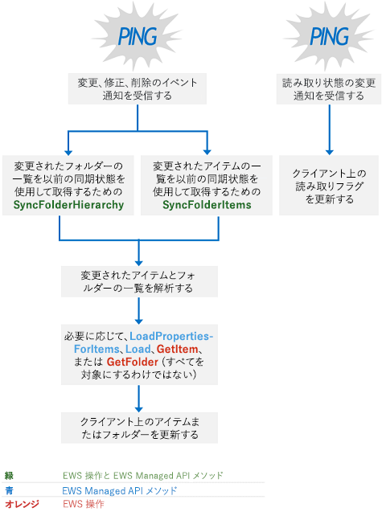

# Exchange のメールボックス同期と EWS

EWS を使用して Exchange にアクセスするときのメールボックスの同期の動作を確認します。
  
Exchange では EWS が次の 2 種類の同期を使用して、メールボックスの内容、およびその内容への変更を取得します。
  
- フォルダーの同期
    
- アイテムの同期
    
この記事では、両方の同期の種類、同期のしくみ、同期の設計パターン、および同期のベスト プラクティスについて説明します。
  
## フォルダーとアイテムの同期

フォルダーの同期では、フォルダー構造、またはフォルダー階層を同期します。アイテムの同期では、フォルダー内のアイテムを同期します。アイテムを同期するときは、メールボックス内の各フォルダーを個別に同期する必要があります。フォルダーおよびアイテムの同期を実装するには、アプリケーションに EWS または EWS マネージ API を使用できます。
  
**表 1 です。EWS 操作し、フォルダーおよびアイテムを同期するマネージ API の EWS メソッド**

|**EWS 操作**|**EWS マネージ API メソッド**|
|:-----|:-----|
|[SyncFolderHierarchy](http://msdn.microsoft.com/library/b31916b1-bc6c-4451-a475-b7c5417f752d%28Office.15%29.aspx)   |[ExchangeService.SyncFolderHierarchy メソッド](http://msdn.microsoft.com/en-us/library/microsoft.exchange.webservices.data.exchangeservice.syncfolderhierarchy%28v=exchg.80%29.aspx)   |
|[SyncFolderItems](http://msdn.microsoft.com/library/7f0de089-8876-47ec-a871-df118ceae75d%28Office.15%29.aspx)   |[ExchangeService.SyncFolderItems メソッド](http://msdn.microsoft.com/en-us/library/microsoft.exchange.webservices.data.exchangeservice.syncfolderitems%28v=exchg.80%29.aspx)   |
   
発生する同期の範囲は、次のように、初期同期か、または継続している同期かによって異なります。
  
- 初期同期は、サーバー上のすべてのフォルダーまたはアイテムをクライアントに同期します。初期同期後、クライアントには、今後の同期のために格納される同期状態があります。同期状態は、サーバーがクライアントに伝えたサーバー上のすべての変更を表します。
    
- 継続的な同期では、前回の同期以降に追加、削除、または変更したアイテムまたはフォルダーを同期します。サーバーは、同期状態を使用して、それぞれの継続的な同期ループ中にクライアントに報告する変更を計算します。
    
各同期メソッドまたは操作は、変更した実際のフォルダーやメッセージではなく、変更の一覧を返します。アイテムとフォルダーへの変更は、次の種類の変更を使用して報告されます。
  
- 作成 — クライアント上で新しく作成する必要のあるアイテムまたはフォルダーを示します。
    
- 更新 — クライアント上で変更する必要のあるアイテムまたはフォルダーを示します。
    
- 削除 — クライアント上で削除する必要のあるアイテムまたはフォルダーを示します。
    
- EWS 用の ReadStateChange、または EWS マネージ API 用のReadFlagChange — アイテムの読み取り状態が未読から開封済み、または開封済みから未読になったことを示します。
    
Exchange Online、Office 365 の一部としての Exchange Online、および Exchange 2010 SP2 以降のバージョンの Exchange では、アイテムおよびフォルダーは最も新しいものから古いものの順で返されます。以前のバージョンの Exchange では、アイテムとフォルダーは最も古いものから新しいものの順で返されます。
  
## EWS の同期のしくみについて

簡単に言うと、図 1 に示すようには、最初のメールボックスの同期をとった場合、プロセスを使用しています。 他の[同期の設計パターン](mailbox-synchronization-and-ews-in-exchange.md#bk_syncpatterns)を使用できますが、拡張性の高いアプリケーションには、この方法お勧めします。
  
**図 1 です。デザイン パターンの初期同期**

  
を使用する既存の同期状態、クライアントでメールボックスを同期する場合は、図 2 に示すように、デザイン パターンを実装することをお勧めします。 
  
**図 2 になります。デザイン パターンの継続的な同期**

  
## 同期の設計パターン

アプリケーションでは、通知ベースの同期、または同期のみの 2 つの方法のうち、いずれかの同期の設計パターンをアプリケーションに使用して、メールボックスを最新に保つことができます。
  
通知ベースの同期では、[図 2](mailbox-synchronization-and-ews-in-exchange.md#bk_howdoesitwork)に示すように依存しています、マネージ API の EWS [SyncFolderItems](http://msdn.microsoft.com/en-us/library/microsoft.exchange.webservices.data.exchangeservice.syncfolderitems%28v=exchg.80%29.aspx)または[SyncFolderHierarchy](http://msdn.microsoft.com/en-us/library/microsoft.exchange.webservices.data.exchangeservice.syncfolderhierarchy%28v=exchg.80%29.aspx)メソッド、または EWS [SyncFolderHierarchy を呼び出すのためにクライアントに警告する通知](http://msdn.microsoft.com/library/b31916b1-bc6c-4451-a475-b7c5417f752d%28Office.15%29.aspx)または[SyncFolderItems](http://msdn.microsoft.com/library/7f0de089-8876-47ec-a871-df118ceae75d%28Office.15%29.aspx)操作します。 一般的に、この種類の同期は、スケーラブルなアプリケーションの推奨は、すべてのユーザーに対して最適なアプローチができない場合があります。 通知ベースの同期には、次の利点があります。 
  
- 通知は、バックエンドの Exchange データベースへの呼び出しを減らすために最適化されています。 キューのイベントとサブスクリプションは、メールボックス サーバー (または Exchange 2010 と Exchange 2007 クライアント アクセス サーバー) によって管理されます。ただし、イベントとサブスクリプションの管理では、代わりに、Exchange データベースの同期呼び出しをより頻繁より少ないリソースを使用します。 さらに、Exchange には、特定の[ポリシーを調整する](ews-throttling-in-exchange.md)通知とサブスクリプションの場合、リソースの消費量を保護します。 
    
ただし、通知ベースの同期を使用する場合にもいくつかの欠点はあります。
  
- 通知は、ほとんどのシナリオには複数の通知の 1 つのユーザーの意図が含まれるので、異音が発生。 これは、特に、予定表フォルダー。 たとえば、1 つの会議出席依頼を受信すると、複数のアイテムおよびフォルダーの通知が作成、アイテムとアイテムを変更するのには別に作成する通知が含むされます。 この欠点を軽減する方法の 1 つでは、[ロード](http://msdn.microsoft.com/en-us/library/microsoft.exchange.webservices.data.serviceobject.load%28v=exchg.80%29.aspx)、 [LoadPropertiesForItems](http://msdn.microsoft.com/en-us/library/microsoft.exchange.webservices.data.exchangeservice.loadpropertiesforitems%28v=exchg.80%29.aspx)、 [GetItem](http://msdn.microsoft.com/en-us/library/exchange/aa565934%28v=exchg.150%29.aspx.aspx)、または[GetFolder](http://msdn.microsoft.com/en-us/library/exchange/aa580274%28v=exchg.150%29.aspx.aspx)の呼び出しにいくつかの秒の遅延を構築します。 、会議出席依頼の場合すぐに、 **GetItem**操作への呼び出しを行った場合と、次のアイテムとアイテムを変更するを作成するための 1 つの呼び出しがあります。 代わりに、呼び出しを遅らせることによって**GetItem**操作を 1 回の呼び出しでき、作成と同時に、項目の変更を包含する変更を取得できます。 
    
- メールボックス サーバー上の通知がキューに置かれ、サブスクリプションは、メールボックス サーバーに保存されます。 サブスクリプションを管理するメールボックス サーバーが使用できない場合は、新しい通知が失われ、メールボックスは同期されません、通知にサブスクライブする必要があります。
    
- 通知が失敗することは、軽減戦略を計画する必要があります。 この方法で 2 つ目のアプローチでは、同期専用のデザイン パターンが同期の通知に基づくより弾力性のあるクライアントが同期状態を維持することのみ必要があるため、メールボックス サーバーへのアフィニティを使用して問題はありませんサブスクリプションを管理します。
    
推奨どおりに実装されている場合、通知ベースのサブスクリプション設計パターンは以下のものに依存します。  
  
- データが変更された*とき*を決定するのには通知します。 
    
- EWS マネージ API **SyncFolderHierarchy** **SyncFolderItems**メソッド、または EWS **SyncFolderHierarchy**または**SyncFolderItems**の操作を*どのような*変更、返された同期イベントの数を最適化します。 新しいアイテムは作成、更新、または削除しますか。 これらの方法を把握する必要があるすべてのプロパティの一覧については変更に依存しません。 (しない、 **GetItem**または**LoadPropertiesForItems**の呼び出しのすべてのアイテムまたはフォルダーが返されます)。 
    
- 変更*方法*データを確認するのには EWS のマネージ API で、または EWS **GetItem**操作の**負荷**または**LoadPropertiesForItems**メソッドを使用して必要に応じて、サーバーからプロパティを取得するために要求のバッチ処理を整理します。返されるデータの量です。 次にプロパティの比較だけで返される、クライアントとのサーバー、および最終的に作成、削除、またはクライアント上のフォルダーまたはアイテムの変更から。 
    
同期のみのアプローチでは、いずれかを呼び出すことができます、操作を**SyncFolderItems**と**SyncFolderHierarchy** EWS のマネージ API のメソッド、または、 **SyncFolderHierarchy**または**SyncFolderItems** EWS に完全に依存します。継続的に、または時間指定イベントです。 このオプションにも一長一短があります。 同期専用より弾力性のあるメールボックス レベルでクライアントの同期状態が格納されているために独特の関係を使用している同期の状態との間、通知のサブスクリプションを保持しているメールボックス サーバーは、必須ではありません。 同期方法には、メールボックス サーバーから独立のため、メールボックスのフェイル オーバーできますも存続します。 ただし、同期の方法はユーザーの待機時間を増加の時間指定、または断続的な単位での項目が同期されるため、アイテムの受信時にリアルタイムではなく。 このアプローチもコストが高く、作成する Exchange データベースの呼び出し可能な場合の変更が発生していないこと。 
  
## 同期のベスト プラクティス

拡張性の高いアプリケーションの場合は、アプリケーション内のメールボックスの同期に次のベスト プラクティスを適用することをお勧めします。
  
- _プロパティ設定_パラメーターには、 _IdOnly_値を使用するマネージ API の EWS **SyncFolderItems**または**SyncFolderHierarchy**メソッドを呼び出すとき、または EWS を使用した**SyncFolderHierarchy**または**SyncFolderItems**操作は、Exchange データベースへの呼び出しを減らすために[BaseShape](http://msdn.microsoft.com/library/42c04f3b-abaa-4197-a3d6-d21677ffb1c0%28Office.15%29.aspx)の**IdOnly**値を使用します。 **SyncFolderItems**または**SyncFolderHierarchy**のプロパティ セットを要求する他のプロパティを呼び出すと、複数のバックエンドの呼び出しを作成します。 レポートへの結果の数に関係なく、要求のすべての**Itemid**を取得する場合にのみ 1 つの RPC 呼び出しが行われたが、プロパティの値が要求されると、すべての新しい RPC 呼び出しが行われました。 件名と送信者のプロパティ バッグの要求は次の 3 つのデータベース呼び出しの結果は、1 つのデータベース呼び出しで、 **IdOnly**の要求の結果、:**件名**のいずれかの**送信者**は、1 つ、**アイテム Id**のいずれかです。
    
- EWS のマネージ API の**負荷**または**LoadPropertiesForItems**メソッドでは、EWS **GetItem**または同期応答内のすべての項目に、 **GetFolder**操作を呼び出しません。 解析結果です。変更を取得するすべてのプロパティを必要としないのと同様に、状態の変更をお読みください。 応答には、読み取りの状態の変更が含まれている場合だけ、クライアント上のフラグを更新しています。すべてのアイテムのプロパティを取得する必要はありません。 同じクライアントから開始された変更を行うことによって作業が重複しないことを確認します。 たとえば、同期応答には、アイテムの削除が含まれる場合は、ローカル クライアント上で発生して、削除に、もう一度メッセージを削除、またはそのアイテムのすべてのプロパティを取得する必要はありません。 
    
- 次のようにして、調整を不要にします。
    
  - EWS のマネージ API の**LoadPropertiesForItems**メソッドまたはバッチ内のアイテムを取得するのには EWS **GetItem**操作を呼び出すことは、ときに、要求内の項目が多すぎますをバッチ処理を行うそれ以外の場合、[スロットル](ews-throttling-in-exchange.md)を取得する可能性があります。 バッチごとに 10 個のアイテムを含めることをお勧めします。
    
  - 非常に短い期間で要求が多すぎるを行わない。 これがも、調整が発生して、応答時間が長くなるではなく短きます。 
    
  - 項目をバッチ処理は場合、は、[フォルダー Id](http://msdn.microsoft.com/library/00d14e3e-4365-4f21-8f88-eaeea73b9bf7%28Office.15%29.aspx)要素の**Id**と**変更キー**の属性に同じ値を持つすべての項目をバッチです。 
    
  - 調整されてしまう場合は、送信要求を停止します。要求を再送信すると、回復作業が長引きます。代わりに、時間切れになるまで待機し、もう一度同期要求を送信します。
    
- によっては、受信した[通知イベント](notification-subscriptions-mailbox-events-and-ews-in-exchange.md#bk_eventtypes)の種類。 
    
  - **NewMail**または**変更**のイベントを呼び出すマネージ API の EWS **SyncFolderItems**メソッドまたは EWS **SyncFolderItems**操作通知の**変更キー**を指定しないし、通知を読み取り状態を呼び出さないでください。変更します。
    
  - **削除された**イベントの通知サブスクリプションの前回の同期の前にアクティブな場合、削除イベントをローカルにします。 **SyncFolderItems**の EWS のマネージ API のメソッド、または削除した後すぐに EWS **SyncFolderItems**オペレーションを呼び出す必要はありません。 
    
  - **変更**イベントの原因が、読み取りの状態の変更である場合はない、EWS のマネージ API の**LoadPropertiesForItems**メソッドまたは EWS **GetItem**操作を呼び出す、アイテムにフラグを変更するだけです。 
    
- 予定表のデータを同期する場合は、次のようにします。
    
  - 通知ベースの同期と同じような方法を使用します。  **SyncFolderItem**にすべての予定表ロジックが含まれていないためにを使用して、EWS のマネージ API の[FindAppointments](http://msdn.microsoft.com/en-us/library/dd633767%28v=exchg.80%29.aspx)メソッド、または EWS [FindItem 操作](http://msdn.microsoft.com/library/ebad6aae-16e7-44de-ae63-a95b24539729%28Office.15%29.aspx)[予定表ビュー](http://msdn.microsoft.com/library/a4a953b8-0710-416c-95ef-59e51eba9982%28Office.15%29.aspx)の要素を使用して 2 つの日付間の予定を表示し、EWS のマネージ API の**LoadPropertiesForItems**メソッド、または予定表アイテムのアイテム プロパティを取得するのには EWS **GetItem**操作を呼び出します。 
    
  - ポーリングが行われない、EWS のマネージ API の**FindAppointments**メソッド、または EWS **FindItem**操作を使用して**予定表ビュー**の要素を使用します。 
    
- 検索フォルダーを同期する場合:
    
  - 通知ベースの同期と同じような方法を使用します。  
    
  - 通知を使用して、データがいつ変更されたかを確認します。
    
  - 検索フォルダーに**SyncFolderItem**を使用することはできませんので、並べ替えやページのマネージ API の EWS [FindItems](http://msdn.microsoft.com/en-us/library/microsoft.exchange.webservices.data.exchangeservice.finditems%28v=exchg.80%29.aspx)メソッドまたは EWS **FindItem**操作を使用[FractionalPageItemView](http://msdn.microsoft.com/library/4111afec-35e7-4c6f-b291-9bbba603f633%28Office.15%29.aspx)と[並べ替え順序](http://msdn.microsoft.com/library/c2413f0b-8c03-46ae-9990-13338b3c53a6%28Office.15%29.aspx)の要素セットを判別何が変更されたとします。 
    
  - データを取得するのにには、EWS のマネージ API の**LoadPropertiesForItems**メソッドまたは EWS **GetItem**操作を使用します。 
    
## フィルターされた同期

**SyncFolderItems**の EWS のマネージ API のメソッドと、EWS **SyncFolderItems**操作を使用すると、EWS のマネージ API または[無視](http://msdn.microsoft.com/library/7789eec5-ceec-43f2-84d5-d0d15b734076%28Office.15%29.aspx)の_ignoreItemIds_パラメーターを設定することによって、その Itemid、に基づいて、特定のアイテムを無視します。EWS の要素です。 個人が、会社内の全員に送信される電子メール メッセージのすべてに返信する開始などの場合、最適です。 
  
特定のプロパティを変更した場合に、通知をフィルター処理 (および同期のみを開始) できるだろうかと思うかもしれません。通知サブスクリプションは変更の種類 (作成、更新、削除) に基づいており、更新されたプロパティには基づいていないため、この方法は妥当なように思われますが、この方法では通知をフィルター処理できません。代わりに、以下の操作を実行できます。
  
- 通知ベースのサブスクリプション設計パターンを使用します。
    
- _IdOnly_に設定すると、現在の同期状態を確認する_プロパティ設定_パラメーターを使用して、マネージ API の EWS **SyncFolderItems**と**SyncFolderHierarchy**メソッドを繰り返し呼び出します。 または EWS を使用している場合、 **SyncFolderHierarchy**と**SyncFolderItems**操作繰り返し**BaseShape**値が**IdOnly**に設定されました。 
    
- 応答を破棄してそれを解析したりしないで、プロパティの比較を行う)。
    
- 関心のあるフィルターを適用したスコープ内の項目を事前に設定するのには、マネージ API の EWS **FindItems**メソッドまたは EWS **FindItem**操作、並べ替えやページを使用します。 
    
- **SyncFolderItems**の EWS のマネージ API のメソッドまたは EWS **SyncFolderItems**操作の呼び出しがのみフィルターが適用された項目のセットの変更を監視するのには、同期状態を使用します。 新しいアイテムを作成する場合は、フィルター選択されたスコープ内ではそれらの新しいアイテムを表示する必要があります。 
    
## このセクションの内容

- [Exchange EWS を使用してフォルダーを同期します。](how-to-synchronize-folders-by-using-ews-in-exchange.md)
    
- [Exchange EWS を使用して項目を同期します。](how-to-synchronize-items-by-using-ews-in-exchange.md)
    
- [Exchange EWS での同期に関連するエラーの処理](handling-synchronization-related-errors-in-ews-in-exchange.md)
    
## 関連項目

- [Exchange の Web サービス クライアントを開発する](develop-web-service-clients-for-exchange.md)
    
- [SyncFolderItems メソッド](http://msdn.microsoft.com/en-us/library/microsoft.exchange.webservices.data.exchangeservice.syncfolderitems%28v=exchg.80%29.aspx)
    
- [SyncFolderHierarchy メソッド](http://msdn.microsoft.com/en-us/library/microsoft.exchange.webservices.data.exchangeservice.syncfolderhierarchy%28v=exchg.80%29.aspx)
    
- [SyncFolderHierarchy 操作](http://msdn.microsoft.com/library/b31916b1-bc6c-4451-a475-b7c5417f752d%28Office.15%29.aspx)
    
- [SyncFolderItems の操作](http://msdn.microsoft.com/library/7f0de089-8876-47ec-a871-df118ceae75d%28Office.15%29.aspx)
    

