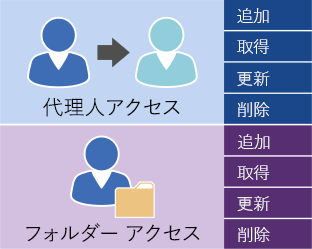

# Exchange において EWS を使用してユーザー アクセスを管理するManaging user access by using EWS in Exchange

Exchange サーバーに対するユーザー アカウントのアクセス権を管理するためのオプションについて説明します。Find out what your options are for managing user account access to your Exchange server.
  
Exchange Web サービス (EWS) と EWS マネージ API には、Exchange Online、Office 365 の一部としての Exchange Online、または Exchange 2013 以降の Exchange バージョンでアカウントを管理するために使用できるいくつかの操作があります。Exchange Web Services (EWS) and the EWS managed API provide a limited number of operations that you can use to manage accounts on Exchange Online, Exchange Online as part of Office 365, or a version of Exchange starting with Exchange 2013. 次の図に示されているこれらの操作を使用すると、デリゲートを管理して、他のアカウントのフォルダー アクセス許可を設定できます。You can use the operations shown in the following figure to manage delegates and to set folder access permissions for other accounts. 
  
**デリゲートおよびフォルダー アクセスのための EWS 操作****EWS operations for delegate and folder access**

  
アプリケーションで、Exchange サーバーにおけるアカウントの制御をさらに必要とする場合は、Exchange 管理シェル コマンドレットを使用してアカウントを管理できます。Exchange 管理シェル コマンドレットは、次のいずれかの方法で呼び出すことができます。If your application needs additional control over the accounts on an Exchange server, you can use Exchange Management Shell cmdlets to manage the accounts. You can call the Exchange Management Shell cmdlets by doing one of the following:
  
- Exchange 管理シェル コマンドレットを呼び出す C# または Visual Basic を使用してアプリケーションを作成します。[Exchange 管理シェル API ドキュメント](../management/exchange-management-shell.md)に記されているサンプル コードを調べて、コマンドレットの呼び出し方法を確認できます。Writing an application using C# or Visual Basic that calls the Exchange Management Shell cmdlets. You can look at the sample code in the [Exchange Management Shell API documentation](../management/exchange-management-shell.md) to learn how to call a cmdlet. 
    
- Windows PowerShell および Windows PowerShell スクリプトを使用して、Exchange 管理シェル コマンドレットを呼び出します。Using Windows PowerShell and Windows PowerShell scripts to call Exchange Management Shell cmdlets. 
  [Exchange Server PowerShell (Exchange 管理シェル)](https://docs.microsoft.com/powershell/exchange/exchange-server/exchange-management-shell?view=exchange-ps) のすべての一覧が、使用法を示す例と共に記載されています。You can find a complete list of the [Exchange Server PowerShell (Exchange Management Shell)](https://docs.microsoft.com/powershell/exchange/exchange-server/exchange-management-shell?view=exchange-ps), along with examples that show how to use them. 
    
## 関連項目See also

- [EWS アプリケーションの設定Setting up your EWS application](setting-up-your-ews-application.md)   
- 
  [Exchange 2013 コマンドレット](https://docs.microsoft.com/powershell/exchange/?view=exchange-ps)[Exchange 2013 Cmdlets](https://docs.microsoft.com/powershell/exchange/?view=exchange-ps)  
    

