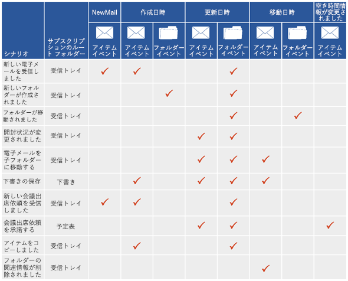
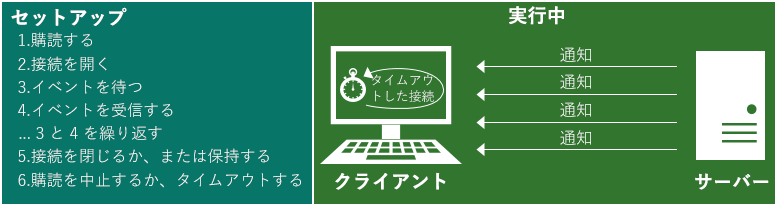
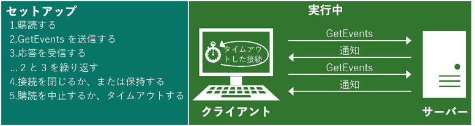

# Exchange の通知サブスクリプション、メールボックス イベント、および EWSNotification subscriptions, mailbox events, and EWS in Exchange

Exchange の通知サブスクリプションと EWS のメールボックス イベントについて説明します。Find out about notification subscriptions and mailbox event in EWS in Exchange.
  
EWS マネージ API と Exchange Web Services (EWS) の両方を使用して、メールボックス、またはメールボックスの 1 つ以上のフォルダーでイベントが発生したときに通知を受信するようサブスクライブできます。ストリーミング通知、プル通知、プッシュ通知の 3 つのサブスクリプションの種類があります。これらのサブスクリプションの種類は、それぞれ異なる手法を使用して通知を受信または取得します。You can use both the EWS Managed API and Exchange Web Services (EWS) to subscribe to receive notifications when events occur in a mailbox, or in one or more of the folders in a mailbox. Three subscription types are available: streaming notifications, pull notifications, and push notifications. Each of these subscription types uses different techniques to receive or retrieve the notifications.
  
## 通知を取得する場合のオプションGetting notifications - what are my options?

EWS には、独立して動作し、クライアントにサーバーの変更を通知する 3 種類のサブスクリプションが含まれています。どのサブスクリプションの種類を選択しても、最終的にすべて同じ通知にアクセスすることになり、取得方法が異なるだけです。EWS includes three subscription types that work independently to notify the client of changes on the server. No matter which subscription type you choose, you'll have access to all the same notification events in the end - it's just a matter of how you get them.
  
**表 1 サブスクリプションの種類****Table 1. Subscription types**

|**オプション****Option**|**説明****Description**|**適切かどうか****Is it right for me?**|
|:-----|:-----|:-----|
|ストリーミング通知Streaming notifications    |特定の期間開いたままの状態の接続を経由した、サーバーから送信される通知。Notifications that are sent by the server through a connection that remains open for a specified period of time.    |ストリーミング通知は通常、ほとんどのアプリケーションで推奨されます。プル通知およびプッシュ通知と同様のもので、両方のメリットを併せ持っています。通知サブスクリプションを確立した後、接続が最大で 30 分間開いたままになり、それによってサーバーがクライアントにプッシュ通知を行えるようになります。プル サブスクリプションのように更新を要求する必要はなく、プッシュ サブスクリプションのように Web サービス リスナー アプリケーションを作成する必要もありません。Streaming notifications are generally recommended for most applications. They're similar to pull and push notifications, and offer the best of both worlds. After you establish your notification subscription, the connection remains open for up to 30 minutes to allow the server to push notifications back to the client. No need to request updates, like you would with a pull subscription, and you don't have to create a web service listener application like you would with a push subscription.    |
|プル通知Pull notifications    |クライアントによって要求 (またはプル) される通知。Notifications that are requested (or pulled) by the client.    |プル通知は通常、クライアントがネットワークに確実に接続されているわけでない疎結合クライアントに最も適しています。プル通知は、クライアントがサーバーに頻繁に要求を送信して通知を受信するため、クライアントとサーバーの間の余分なトラフィックを確立してしまうことがあり、すべての要求が受信通知になるわけではありません。Pull notifications are generally most appropriate for loosely coupled clients, where the client is not reliably connected to the network. Pull notifications can create excess traffic between the client and the server because the client is sending frequent requests to the server to retrieve notifications, and not all requests result in notifications retrieved.    |
|プッシュ通知Push notifications    |コールバック アドレスを経由し、サーバーによってクライアント側の Web サービスに送信 (またはプッシュ) される通知。Notifications that are sent (or pushed) by the server to a client-side web service via a callback address.    |一般的に、プッシュ通知はプル通知よりも通知の遅延が小さく、サーバーのアクセスが信頼性の高いもので、クライアントが IP アドレス指定可能な密結合のクライアントに適しています。ただし、プッシュ通知は Exchange 2010 でストリーミング通知が登場して以来、使用されなくなっています。可能であれば、今後はプッシュ通知ではなく、ストリーミング通知を使用することをお勧めします。プッシュ通知ではリスナー アプリケーションを作成する必要があり、そこに通知がプッシュされます。この点はプル通知に比べて少し利点があり、書き込みのトラフィックが減少しますが、別のアプリケーションを必要とすることでオーバーヘッドが増加します。Generally, push notifications provide for smaller notification latency than pull notifications and are suited for tightly coupled clients to which the server has reliable access and the client is IP addressable. However, push notifications have fallen out of favor since the advent of streaming notifications in Exchange 2010. If possible, we recommend that you use streaming notifications instead of push notifications going forward. Push notifications require that you write a listener application, which is where the notifications are pushed to. This has a slight benefit over pull notifications in that it reduces wire traffic, but it adds overhead by requiring a separate application.    |
   
## サブスクライブできる EWS のイベントWhat EWS events can I subscribe to?

クライアントがサブスクライブする EWS イベントの種類は、EWS マネージ APIの [EventType](http://msdn.microsoft.com/ja-JP/library/microsoft.exchange.webservices.data.eventtype%28v=exchg.80%29.aspx) 列挙型、または EWS の [EventType](http://msdn.microsoft.com/library/04b70f9e-c226-4130-958e-0db0275cf58b%28Office.15%29.aspx) 要素によって定義されます。次の EWS イベントがサブスクリプションに利用できます。The types of EWS events that clients subscribe to are defined by the [EventType](http://msdn.microsoft.com/ja-JP/library/microsoft.exchange.webservices.data.eventtype%28v=exchg.80%29.aspx) enumeration for the EWS Managed API or the [EventType](http://msdn.microsoft.com/library/04b70f9e-c226-4130-958e-0db0275cf58b%28Office.15%29.aspx) element for EWS. The following EWS events are available for subscription: 
  
- NewMail – 受信トレイに新しいメッセージが到着しました。NewMail — A new message arrived in the Inbox.
    
- Deleted - メッセージが受信トレイから物理的に削除されました。削除されたアイテムの通知に関する詳細については、「[Exchange の EWS を使用するアイテムの削除](deleting-items-by-using-ews-in-exchange.md)」 と 「[Exchange での EWS の削除に関連するメールボックス イベントのプル通知](pull-notifications-for-ews-deletion-related-mailbox-events-in-exchange.md)」を参照してください。Deleted — A message was hard deleted from the Inbox. To learn more about deleted item notifications, see [Deleting items by using EWS in Exchange](deleting-items-by-using-ews-in-exchange.md) and [Pull notifications for EWS deletion-related mailbox events in Exchange](pull-notifications-for-ews-deletion-related-mailbox-events-in-exchange.md).
    
- Modified – アイテムまたはフォルダーが変更されました。Modified — An item or folder was changed.
    
- Moved – アイテムまたはフォルダーが移動されました。Moved — An item or folder was moved. 
    
- Copied – アイテムまたはフォルダーがコピーされました。Copied — An item or folder was copied.
    
- Created – アイテムまたはフォルダーが作成されました。Created — An item or folder was created. 
    
- FreeBusyChanged - ユーザーの空き時間情報が変更されました。FreeBusyChanged — A user's free busy information has been changed.
    
EWS イベントの別の種類である Status イベントは、[EventType](http://msdn.microsoft.com/ja-JP/library/microsoft.exchange.webservices.data.eventtype%28v=exchg.80%29.aspx) 要素によって定義されますが、このイベントにはサブスクライブしません。その代わり、ストリーミング通知とプッシュ通知のみに関するクライアントの状態を確認するために、そのイベントはサーバーによって送信されます。クライアントは、このイベントのニーズに応答する必要があり、そうしないとクライアントはタイムアウトになります。Another EWS event type, the Status event, is defined by the [EventType](http://msdn.microsoft.com/ja-JP/library/microsoft.exchange.webservices.data.eventtype%28v=exchg.80%29.aspx) element, but you don't subscribe to this event. Instead, it's sent by the server to check the status of the client for streaming and push notifications only. The client needs to respond to this event needs or the client will time out. 
  
たいていの場合、1 つのユーザー アクションで、複数の通知が作成されます。このことを示すため、次の図では、いくつかの一般的なシナリオとそれぞれに作成された通知を図示しています。クライアントの設定によって受信する通知は変わってくるので、これは構成オプションと結果の通知すべてを網羅したリストではありません。A single user action often results in the creation of multiple notifications. To illustrate this, the following figure shows some common scenarios and the notifications created for each one. Client settings have an impact on the notifications received, so this is not an exhaustive list of all the configuration options and resulting notifications.
  
**図 1 通知サブスクリプションによって返されるイベントの種類****Figure 1. Event types returned by notification subscriptions**

  
図 1 では、通知の処理が簡素化されています。実際には、単一のユーザーのアクションに対して複数の通知 (同じ種類の複数の通知も可) を作成できます。たとえば、フォルダーの移動操作では、変更されたフォルダー用に 1 つ、古い親フォルダー用に 1 つ、新しい親フォルダー用に 1 つ、で合わせて 3 つのフォルダー イベントが作成されます。1 回の操作で多数のイベントが発生する可能性があるため、[同期処理には数秒の待機時間を作成](mailbox-synchronization-and-ews-in-exchange.md#bk_bestpractices)し、操作の途中ではなく、アクションが完了したときにのみ同期するようにします。Figure 1 simplifies the notification process. In reality, multiple notifications (even multiple notifications of the same type) can be created for a single user action. For example, in the case of a folder move operation, three folder events are created: one for the folder being modified, one for the old parent folder, and one for the new parent folder. Because numerous events can be fired for a single operation, we recommend that you [build a wait time of a few seconds into your synchronization operations](mailbox-synchronization-and-ews-in-exchange.md#bk_bestpractices), so that you only synchronize when the action is complete, instead of partway through the operation.
  
また、各ユーザーが選択した構成設定によって、作成される通知が変わってくることを認識しておくことも重要です。たとえば、新しい会議出席依頼を受信した場合、アイテムを読み上げる前でさえ、一部のユーザーの空き時間情報データは自動的に更新され、FreeBusyChanged イベントが作成されます。また、空き時間情報データが更新されず、会議を承諾した後まで FreeBusyChanged イベントが作成されないユーザーもいます。これらの設定は、サーバーによって作成される通知に大きな影響を与える可能性があります。It's also important to realize that the configuration settings that each user chooses will affect which notifications are created. For example, some users' free busy data is updated automatically and the FreeBusyChanged event is created when a new meeting request is received, even before they've read the item. For other users, free busy data isn't updated and the FreeBusyChanged event isn't created until after the meeting has been accepted. These settings can have a considerable impact on the notifications created by the server.
  
## EWS の通知のしくみHow do EWS notifications work?

EWS の通知は、サブスクリプションごとに処理されます。通常、メールボックスあたり 1 つのサブスクリプションがあり、メールボックスのサブスクリプション内で、一部またはすべてのフォルダーをサブスクライブできます。サブスクライブする通知の種類 (ストリーミング、プル、またはプッシュ) を決定し、受信したいイベントの種類 (NewMail、Created、Deleted、Modified など) を決定し、サブスクリプションを作成します。EWS のイベントは、非同期的にメールボックス サーバーからクライアントに送信されます。(以前、Exchange 2007 ではイベントは同期的で、Exchange 2010 ではイベントはクライアント アクセス サーバーに保存されていましたが、現在はそうではありません。)EWS notifications are handled on a subscription basis. Typically there's one subscription per mailbox, and within the mailbox subscription you can subscribe to some or all folders. You decide what kind of notification to subscribe to (streaming, pull, or push) and what kind of events you'd like to receive (NewMail, Created, Deleted, Modified, etc.), and then you create a subscription. The EWS events are then sent asynchronously from the mailbox server to the client. (History lesson: events are synchronous in Exchange 2007 - and events are stored on the Client Access server in Exchange 2010, but no more!).
  
サブスクリプションの種類によって、クライアントに通知が送信される方法が異なります。このセクションでは、サブスクリプションの種類ごとのしくみについて詳細に説明します。Depending on the type of subscription you have, the ways in which the notifications are sent to the client vary. This section describes how each type of subscription works in more detail.
  
### EWS のストリーミング通知EWS streaming notifications

ストリーミング通知は、ストリーミング サブスクリプションの接続を開いているサーバーの分岐 get 要求に依存するため、接続がアクティブな間に発生するイベントは、クライアントにすぐにストリーミングされます。1 つの接続の間に複数の通知を送信でき、接続は一定時間が経過するまで開いている状態が維持されます (最大 30 分)。接続が切断されると、クライアントは分岐 get 要求をもう一度送信します。図 2 では、ストリーミングのサブスクリプションとストリーミング通知のしくみを示します。Streaming notifications rely on a hanging get request on the server to keep a streaming subscription connection open, so that any events that occur while the connection is active are streamed to the client immediately. Multiple notifications can be sent over the course of a single connection, and the connection stays open until the interval expires, or for a maximum of 30 minutes. After the connection expires, the client sends the hanging get request again. Figure 2 shows how streaming subscriptions and streaming notifications work.
  
**図 2 ストリーミング通知の概要****Figure 2. Streaming notification overview**

  
ストリーミングの通知を作成する方法の詳細については、「[Exchange での EWS を使用したメールボックス イベントに関するストリーム通知](how-to-stream-notifications-about-mailbox-events-by-using-ews-in-exchange.md)」を参照してください。For information about creating streaming notifications, see [How to: Stream notifications about mailbox events by using EWS in Exchange](how-to-stream-notifications-about-mailbox-events-by-using-ews-in-exchange.md).
  
### EWS プル通知EWS pull notifications

プル通知は、クライアントが管理する間隔で通知を要求するクライアントに依存します。これにより、通知のない GetEvents 応答が発生することがあります。図 3 は、プル サブスクリプションとプル通知のしくみを示しています。Pull notifications rely on the client asking for the notifications on an interval that the client manages. This can result in GetEvents responses with no notifications. Figure 3 shows how pull subscriptions and pull notifications work.
  
**図 3 プル通知の概要****Figure 3. Pull notification overview**

  
プル通知を作成する方法の詳細については、「[Exchange での EWS を使用したメールボックス イベントに関するプル通知](how-to-pull-notifications-about-mailbox-events-by-using-ews-in-exchange.md)」を参照してください。For information about creating pull notifications, see [How to: Pull notifications about mailbox events by using EWS in Exchange](how-to-pull-notifications-about-mailbox-events-by-using-ews-in-exchange.md).
  
### EWS プッシュ通知EWS push notifications

プッシュ通知は、通知をクライアントにプッシュするサーバーに依存します。通知がある場合にのみトラフィックがあります。図 4 は、プッシュ サブスクリプションとプッシュ通知のしくみを示しています。Push notifications rely on the server pushing notifications back to the client. There's only traffic if there's a notification. Figure 4 shows how push subscriptions and push notifications work.
  
**図 4 プッシュ通知の概要****Figure 4. Push notification overview**

![プッシュ通知の動作方法を示す図。プッシュ通知をセットアップするには、次を実行します。1. リスナーを作成します。2. サブスクライブします。3. イベントを待機します。4. イベントを受信します。5. [OK] 応答を送信し、3、4、および 5 を繰り返します。6. サブスクリプションを解除するか、タイムアウトします。](media/Exchange2013_Notifications_PushSub.png)
  
[Exchange 2010 を使用したプッシュ通知](http://msdn.microsoft.com/library/db1f8523-fa44-483f-bdb6-ab5939b52eee%28Office.15%29.aspx)を利用している場合、[ストリーミング通知を利用する](http://code.msdn.microsoft.com/exchange/Exchange-2013-Set-push-82738cc5)ようアプリケーションをアップグレードすることを検討してください。こうすると、イベントを受信する別のアプリケーションが必要ありません。If you are using [push notifications with Exchange 2010](http://msdn.microsoft.com/library/db1f8523-fa44-483f-bdb6-ab5939b52eee%28Office.15%29.aspx), consider upgrading your application to [use streaming notifications](http://code.msdn.microsoft.com/exchange/Exchange-2013-Set-push-82738cc5), so that you don't need a separate application to receive the events.
  
## 通知をサブスクライブする方法How do I subscribe to notifications?

作成するサブスクリプションの種類に応じて、通知のサブスクライブのために選択する様々なオプションがあります。Depending on the type of subscription you'd like to create, you have a number of options to choose from for subscribing to notifications.
  
**表 2 通知をサブスクライブするための操作とメソッド****Table 2. Operations and methods for subscribing to notifications**

|**サブスクリプションの種類****Subscription type**|**EWS 操作****EWS operation**|**EWS マネージ API メソッド****EWS Managed API methods**|**目的****What it does**|
|:-----|:-----|:-----|:-----|
|ストリーミングStreaming    |[サブスクライブ操作Subscribe operation](http://msdn.microsoft.com/library/f17c3d08-c79e-41f1-ba31-6e41e7aafd87%28Office.15%29.aspx)   |[ExchangeService.BeginSubscribeToStreamingNotifications メソッドExchangeService.BeginSubscribeToStreamingNotifications method](http://msdn.microsoft.com/ja-JP/library/microsoft.exchange.webservices.data.exchangeservice.beginsubscribetostreamingnotifications%28v=exchg.80%29.aspx)   [ExchangeService.BeginSubscribeToStreamingNotificationsOnAllFolders メソッドExchangeService.BeginSubscribeToStreamingNotificationsOnAllFolders method](http://msdn.microsoft.com/ja-JP/library/microsoft.exchange.webservices.data.exchangeservice.beginsubscribetostreamingnotificationsonallfolders%28v=exchg.80%29.aspx)   [ExchangeService.SubscribeToStreamingNotificationsOnAllFolders メソッドExchangeService.SubscribeToStreamingNotificationsOnAllFolders method](http://msdn.microsoft.com/ja-JP/library/microsoft.exchange.webservices.data.exchangeservice.subscribetostreamingnotifications%28v=exchg.80%29.aspx)   |ストリーミング通知をサブスクライブする要求を作成します。Creates a request to subscribe to streaming notifications.    |
|プルPull    |[サブスクライブ操作Subscribe operation](http://msdn.microsoft.com/library/f17c3d08-c79e-41f1-ba31-6e41e7aafd87%28Office.15%29.aspx)   |[ExchangeService.BeginSubscribeToPullNotifications メソッドExchangeService.BeginSubscribeToPullNotifications method](http://msdn.microsoft.com/ja-JP/library/microsoft.exchange.webservices.data.exchangeservice.beginsubscribetopullnotifications%28v=exchg.80%29.aspx)   [ExchangeService.BeginSubscribeToPullNotificationsOnAllFolders メソッドExchangeService.BeginSubscribeToPullNotificationsOnAllFolders method](http://msdn.microsoft.com/ja-JP/library/microsoft.exchange.webservices.data.exchangeservice.beginsubscribetopullnotificationsonallfolders%28v=exchg.80%29.aspx)   [ExchangeService.SubscribeToPullNotifications メソッドExchangeService.SubscribeToPullNotifications method](http://msdn.microsoft.com/ja-JP/library/microsoft.exchange.webservices.data.exchangeservice.subscribetopullnotifications%28v=exchg.80%29.aspx)   [ExchangeService.SubscribeToPullNotificationsOnAllFolders メソッドExchangeService.SubscribeToPullNotificationsOnAllFolders method](http://msdn.microsoft.com/ja-JP/library/microsoft.exchange.webservices.data.exchangeservice.subscribetopullnotificationsonallfolders%28v=exchg.80%29.aspx)   |プル通知をサブスクライブする要求を作成します。Creates a request to subscribe to pull notifications.    |
|プッシュPush    |[サブスクライブ操作Subscribe operation](http://msdn.microsoft.com/library/f17c3d08-c79e-41f1-ba31-6e41e7aafd87%28Office.15%29.aspx)   |[ExchangeService.BeginSubscribeToPushNotifications overloaded メドッドExchangeService.BeginSubscribeToPushNotifications overloaded method](http://msdn.microsoft.com/ja-JP/library/microsoft.exchange.webservices.data.exchangeservice.beginsubscribetopushnotifications%28v=exchg.80%29.aspx)   [ExchangeService.BeginSubscribeToPushNotificationsOnAllFolders overload メソッドExchangeService.BeginSubscribeToPushNotificationsOnAllFolders overload method](http://msdn.microsoft.com/ja-JP/library/microsoft.exchange.webservices.data.exchangeservice.beginsubscribetopushnotificationsonallfolders%28v=exchg.80%29.aspx)   [ExchangeService.SubscribeToPushNotifications overloaded メソッドExchangeService.SubscribeToPushNotifications overloaded method](http://msdn.microsoft.com/ja-JP/library/microsoft.exchange.webservices.data.exchangeservice.subscribetopushnotifications%28v=exchg.80%29.aspx)   [ExchangeService.SubscribeToPushNotificationsOnAllFolders overloaded メソッドExchangeService.SubscribeToPushNotificationsOnAllFolders overloaded method](http://msdn.microsoft.com/ja-JP/library/microsoft.exchange.webservices.data.exchangeservice.subscribetopushnotificationsonallfolders%28v=exchg.80%29.aspx)   |プッシュ通知をサブスクライブする要求を作成します。Creates a request to subscribe to push notifications.    |
   
## EWS のイベントを取得する方法How do I get EWS events?

サブスクリプションが作成されると、実際のイベントがクライアントに送信される方法は、サブスクリプションの種類によって異なります。After the subscription is created, the way in which the actual events are sent to the client depends on the subscription type. 
  
ストリーミング通知を行うためにはストリーミング サブスクリプション接続を作成する必要があり、作成するとサブスクリプションが接続に追加されます。For streaming notifications, a streaming subscription connection must be created, and then the subscription is added to the connection. このプロセスの詳細は、「[Exchange での EWS を使用したメールボックス イベントに関するストリーム通知](how-to-stream-notifications-about-mailbox-events-by-using-ews-in-exchange.md)」で確認できます。You can read more about this process in [How to: Stream notifications about mailbox events by using EWS in Exchange](how-to-stream-notifications-about-mailbox-events-by-using-ews-in-exchange.md). 
  
プル通知では、サブスクリプションが作成されたときにサブスクリプション オブジェクトが初期化されるため、 **GetEvent** メソッドまたは操作を呼び出してサーバーからイベントを取得するだけで十分です。For pull notifications, the subscription object was initialized when the subscription was created, so you just have to call the **GetEvent** method or operation to retrieve the events from the server. この詳細は、「[Exchange での EWS を使用したメールボックス イベントに関するプル通知](how-to-pull-notifications-about-mailbox-events-by-using-ews-in-exchange.md)」で確認できます。You can read more about this in [How to: Pull notifications about mailbox events by using EWS in Exchange](how-to-pull-notifications-about-mailbox-events-by-using-ews-in-exchange.md). 
  
以下の表には、イベントを取得するために必要な操作とクラスが一覧表示されています。The following table lists the operations and classes required to retrieve events. 
  
**表 3 接続を作成してイベントを取得するための要素とクラス****Table 3. Elements and classes for creating a connection and getting events**

|**サブスクリプションの種類****Subscription type**|**EWS 操作****EWS operation**|**EWS マネージ API メソッド****EWS Managed API method**|**目的****What it does**|
|:-----|:-----|:-----|:-----|
|ストリーミングStreaming    |[GetStreamingEvents の操作GetStreamingEvents operation](http://msdn.microsoft.com/library/8da95423-72bc-4034-90a8-162eedcd059b%28Office.15%29.aspx)   |[StreamingSubscriptionConnection.AddSubscription メソッドStreamingSubscriptionConnection.AddSubscription method](http://msdn.microsoft.com/ja-JP/library/microsoft.exchange.webservices.data.streamingsubscriptionconnection.addsubscription%28v=exchg.80%29.aspx)   |イベントが発生したときに応答する分岐 get 要求をサーバーで作成します。Creates a hanging get request on the server, which is responded to when events occur.    |
|プルPull    |[GetEvents 操作GetEvents operation](http://msdn.microsoft.com/library/f268efe5-9a1a-41a2-b6a6-51fcde7720a1%28Office.15%29.aspx)   |[PullSubscription.GetEvents メソッドPullSubscription.GetEvents method](http://msdn.microsoft.com/ja-JP/library/microsoft.exchange.webservices.data.pullsubscription.getevents%28v=exchg.80%29.aspx)   |サーバーからプル通知イベントを取得します。Gets pull notification events from the server.    |
|プッシュPush    |該当なし。Not applicable.    |該当なし。Not applicable.    |プッシュ通知は、Web サービスのリスナー (サブスクリプション要求で指定されたコールバック URL) に自動的に送信されます。追加のメソッドまたは操作を呼び出す必要はありません。Push notifications are automatically sent to the web service listener (the callback URL specified in the subscription request). No additional methods or operations need to be called.    |
   
## 通知をアンサブスクライブする方法How do I unsubscribe to notifications?

次の表は、サブスクリプションの種類ごとにアンサブスクライブする方法を示しています。The following table lists the ways in which you can unsubscribe to each type of subscription.
  
**表 4 通知をアンサブスクライブするための操作とメソッド****Table 4. Operations and methods for unsubscribing to notifications**

|**サブスクリプションの種類****Subscription type**|**EWS****EWS**|**EWS Managed API****EWS Managed API**||
|:-----|:-----|:-----|:-----|
|ストリーミングStreaming    |[Unsubscribe 操作Unsubscribe operation](http://msdn.microsoft.com/library/994a9d2b-1501-4804-90f0-12bd914496ec%28Office.15%29.aspx)   |[StreamingSubscription.BeginUnsubscribe メソッドStreamingSubscription.BeginUnsubscribe method](http://msdn.microsoft.com/ja-JP/library/microsoft.exchange.webservices.data.streamingsubscription.beginunsubscribe%28v=exchg.80%29.aspx)   [StreamingSubscription.EndUnsubscribe メソッドStreamingSubscription.EndUnsubscribe method](http://msdn.microsoft.com/ja-JP/library/microsoft.exchange.webservices.data.streamingsubscription.endunsubscribe%28v=exchg.80%29.aspx)   [StreamingSubscription.Unsubscribe メソッドStreamingSubscription.Unsubscribe method](http://msdn.microsoft.com/ja-JP/library/microsoft.exchange.webservices.data.streamingsubscription.unsubscribe%28v=exchg.80%29.aspx)   ||
|プルPull    |[Unsubscribe 操作Unsubscribe operation](http://msdn.microsoft.com/library/994a9d2b-1501-4804-90f0-12bd914496ec%28Office.15%29.aspx)   |[PullSubscription.BeginUnsubscribe メソッドPullSubscription.BeginUnsubscribe method](http://msdn.microsoft.com/ja-JP/library/microsoft.exchange.webservices.data.pullsubscription.beginunsubscribe%28v=exchg.80%29.aspx)   [PullSubscription.EndUnsubscribe メソッドPullSubscription.EndUnsubscribe method](http://msdn.microsoft.com/ja-JP/library/microsoft.exchange.webservices.data.pullsubscription.endunsubscribe%28v=exchg.80%29.aspx)   [PullSubscription.Unsubscribe メソッドPullSubscription.Unsubscribe method](http://msdn.microsoft.com/ja-JP/library/microsoft.exchange.webservices.data.pullsubscription.unsubscribe%28v=exchg.80%29.aspx)   ||
|プッシュPush    |**SendNotificationResponseMessage** の [StatusFrequency](http://msdn.microsoft.com/library/917474e2-a426-4166-b825-53783a41dad4%28Office.15%29.aspx) 要素で [Unsubscribe](http://msdn.microsoft.com/library/2c6d681b-67ac-4331-bc6b-a2e709b638e3%28Office.15%29.aspx) を返しますReturn **Unsubscribe** in the [StatusFrequency](http://msdn.microsoft.com/library/917474e2-a426-4166-b825-53783a41dad4%28Office.15%29.aspx) element of the [SendNotificationResponseMessage](http://msdn.microsoft.com/library/2c6d681b-67ac-4331-bc6b-a2e709b638e3%28Office.15%29.aspx)   |該当なし。代わりにサブスクリプションをタイムアウトさせることができます。Not applicable. Let the subscription time out instead.    ||
   
または、各サブスクリプションをタイムアウトさせることができます。Alternatively, you can let each of the subscriptions time out. 
  
**表 5 サブスクリプションのタイムアウト****Table 5. Subscription time-outs**

|**サブスクリプションの種類****Subscription type**|**EWS でのタイムアウトの値****Timeout value in EWS**|**EWS マネージ API でのタイムアウトの値****Timeout value in the EWS Managed API**|**タイムアウトの処理****Timeout handling**|
|:-----|:-----|:-----|:-----|
|ストリーミングStreaming    |[ConnectionTimeout](http://msdn.microsoft.com/library/14da68a0-bcca-4281-a774-47644baa4ee9%28Office.15%29.aspx) 要素[ConnectionTimeout](http://msdn.microsoft.com/library/14da68a0-bcca-4281-a774-47644baa4ee9%28Office.15%29.aspx) element    | *StreamingSubscriptionConnection* コンストラクターの  [lifetime](http://msdn.microsoft.com/ja-JP/library/microsoft.exchange.webservices.data.streamingsubscriptionconnection.streamingsubscriptionconnection%28v=exchg.80%29.aspx)  パラメーター*lifetime*  parameter of the [StreamingSubscriptionConnection](http://msdn.microsoft.com/ja-JP/library/microsoft.exchange.webservices.data.streamingsubscriptionconnection.streamingsubscriptionconnection%28v=exchg.80%29.aspx) constructor    |EWS マネージ API では、タイムアウト値が経過した後に、[OnDisconnect](http://msdn.microsoft.com/ja-JP/library/microsoft.exchange.webservices.data.streamingsubscriptionconnection.ondisconnect%28v=exchg.80%29.aspx) イベントが発生します。 [StreamingSubscriptionConnection.Open](http://msdn.microsoft.com/ja-JP/library/microsoft.exchange.webservices.data.streamingsubscriptionconnection.open%28v=exchg.80%29.aspx) メソッドが呼び出されないと、接続は終了します。  For the EWS Managed API, after the timeout value elapses, the [OnDisconnect](http://msdn.microsoft.com/ja-JP/library/microsoft.exchange.webservices.data.streamingsubscriptionconnection.ondisconnect%28v=exchg.80%29.aspx) event is raised. If the [StreamingSubscriptionConnection.Open](http://msdn.microsoft.com/ja-JP/library/microsoft.exchange.webservices.data.streamingsubscriptionconnection.open%28v=exchg.80%29.aspx) method is not called, the connection is closed.    EWS では、タイムアウト値が経過した後に、[GetUserConfigurationResponse](http://msdn.microsoft.com/library/5e418c91-c836-4de0-a80d-f0dad0c684d7%28Office.15%29.aspx) メッセージが Closed の [ConnectionStatus](http://msdn.microsoft.com/library/4300f9d6-8bf9-48c2-9f07-d80197864e17%28Office.15%29.aspx) 値を返します。For EWS, after the timeout value elapses, the [GetUserConfigurationResponse](http://msdn.microsoft.com/library/5e418c91-c836-4de0-a80d-f0dad0c684d7%28Office.15%29.aspx) message returns a [ConnectionStatus](http://msdn.microsoft.com/library/4300f9d6-8bf9-48c2-9f07-d80197864e17%28Office.15%29.aspx) value of Closed.    |
|プルPull    |[Timeout](http://msdn.microsoft.com/library/c2e1ca5a-6667-4f6f-aac4-89de33bddc54%28Office.15%29.aspx) 要素[Timeout](http://msdn.microsoft.com/library/c2e1ca5a-6667-4f6f-aac4-89de33bddc54%28Office.15%29.aspx) element    | *SubscribeToPullNotification* メソッドの  [timeout](http://msdn.microsoft.com/ja-JP/library/microsoft.exchange.webservices.data.exchangeservice.subscribetopullnotifications%28v=exchg.80%29.aspx)  パラメーター*timeout*  parameter of the [SubscribeToPullNotification](http://msdn.microsoft.com/ja-JP/library/microsoft.exchange.webservices.data.exchangeservice.subscribetopullnotifications%28v=exchg.80%29.aspx) method    |タイムアウト値が経過した後、サーバーはサブスクリプションを削除します。After the timeout value elapses, the server deletes the subscription.    |
|プッシュPush    |[StatusFrequency](http://msdn.microsoft.com/library/917474e2-a426-4166-b825-53783a41dad4%28Office.15%29.aspx) 要素[StatusFrequency](http://msdn.microsoft.com/library/917474e2-a426-4166-b825-53783a41dad4%28Office.15%29.aspx) element    | *SubscribeToPushNotification* メソッドの  [frequency](http://msdn.microsoft.com/ja-JP/library/microsoft.exchange.webservices.data.exchangeservice.subscribetopushnotifications%28v=exchg.80%29.aspx)  パラメーター*frequency*  parameter of the [SubscribeToPushNotification](http://msdn.microsoft.com/ja-JP/library/microsoft.exchange.webservices.data.exchangeservice.subscribetopushnotifications%28v=exchg.80%29.aspx) method    |サーバーがプッシュ通知または状態の ping への応答を受信しない場合は、通知の送信を数回再試行してから、通知の送信を停止します。詳細については、「[StatusFrequency](http://msdn.microsoft.com/library/917474e2-a426-4166-b825-53783a41dad4%28Office.15%29.aspx)」をご覧ください。  If the server does not receive a response to a push notification or status ping, it retries sending the notification several times before it stops sending the notifications. For more information, see [StatusFrequency](http://msdn.microsoft.com/library/917474e2-a426-4166-b825-53783a41dad4%28Office.15%29.aspx).    |
   
## サブスクリプションの制限についてCan I limit subscriptions?

社内展開では、調整ポリシーの [EwsMaxSubscriptions 調整パラメーター](ews-throttling-in-exchange.md)を使用して、ユーザーごとのサブスクリプションの数を制限することができます。このポリシーは、すべてのユーザー、または特定のユーザーに適用できます。 **EwsMaxSubscriptions** 調整ポリシーは、Exchange Online では構成できません。In an on-premises deployment, you can limit the number of subscriptions per user with the [EwsMaxSubscriptions throttling parameter](ews-throttling-in-exchange.md) of the throttling policy. That policy can be applied to all users or just specific users. The **EwsMaxSubscriptions** throttling policy is not configurable for Exchange Online. 
  
## このセクションの内容In this section

- [Exchange での EWS を使用したメールボックス イベントに関するストリーム通知How to: Stream notifications about mailbox events by using EWS in Exchange](how-to-stream-notifications-about-mailbox-events-by-using-ews-in-exchange.md)
    
- [Exchange での EWS を使用したメールボックス イベントに関するプル通知How to: Pull notifications about mailbox events by using EWS in Exchange](how-to-pull-notifications-about-mailbox-events-by-using-ews-in-exchange.md)
    
- [Exchange の購読グループとメールボックス サーバー間のアフィニティを維持するHow to: Maintain affinity between a group of subscriptions and the Mailbox server in Exchange](how-to-maintain-affinity-between-group-of-subscriptions-and-mailbox-server.md)
    
- [Exchange における EWS での通知関連エラーの処理Handling notification-related errors in EWS in Exchange](handling-notification-related-errors-in-ews-in-exchange.md)
    
## 関連項目See also

- [Exchange 用の Web サービス クライアントの開発Develop web service clients for Exchange](develop-web-service-clients-for-exchange.md)
- [Exchange web サービスの参照Web services reference for Exchange](../web-service-reference/web-services-reference-for-exchange.md)
- [Exchange で Web サービスの使用を開始するStart using web services in Exchange](start-using-web-services-in-exchange.md)
- [Exchange のメールボックス同期と EWSMailbox synchronization and EWS in Exchange](mailbox-synchronization-and-ews-in-exchange.md)
- [プッシュ通知のサンプル アプリケーションPush Notification Sample Application](http://msdn.microsoft.com/library/db1f8523-fa44-483f-bdb6-ab5939b52eee%28Office.15%29.aspx)
    

