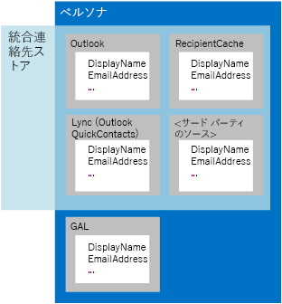

# Exchange 内の EWS のユーザーと連絡先People and contacts in EWS in Exchange

ペルソナと統合連絡先ストアについて説明し、Exchange で EWS マネージ API または EWS を使用した連絡先の操作方法について説明します。Learn about personas, the Unified Contact Store, and how to work with contacts by using the EWS Managed API or EWS in Exchange. 
  
連絡先は、個人、グループ、または組織に関する情報を格納している Exchange 内のアイテムです。連絡先には、名前と電子メール アドレスに加えて、IM アドレス、住所、生年月日、家族情報、連絡先を示す写真やイメージを含むその他の情報を含めることができます。Contacts are items in Exchange that store information about an individual, group, or organization. Contacts can include names and email addresses, and other information, including IM addresses, physical addresses, birthdays, family information, and a photo or image that represents the contact.
  
連絡先情報は、2 つの場所のいずれかに格納されます。Contact information is stored in one of two places:
  
- 連絡先が組織内である場合は Active Directory ドメイン サービス (AD DS)。Active Directory Domain Services (AD DS), if the contact is within the organization.
    
- 連絡先が組織外である場合は、ユーザーのメールボックス内の連絡先フォルダーまたはその他のフォルダー。The Contacts folder or another folder in a user's mailbox, if the contact is outside the organization.
    
複数の連絡先アイテムで、1 人のユーザーを表すこともあります。Multiple contact items can represent a single individual. Exchange では、これらの複数の連絡先アイテムをまとめるためにペルソナを使用します。Exchange uses personas to help bring these different contact items together. *ペルソナ*は、さまざまなソースから同じ個人の連絡先情報を集約したものです。A  *persona*  is an aggregation of contact information for the same individual from different sources. ペルソナは、Exchange 内の連絡先情報のほかに、メールボックスの受信者キャッシュ内の情報、QuickContacts と呼ばれる IM 連絡先用の隠しフォルダーの情報、およびサードパーティのデータ ソースからの情報から集約することもできます。In addition to contact information in Exchange, personas can also be aggregated from information in the recipient cache for the mailbox, a hidden folder for IM contacts called QuickContacts, and from third-party data sources. Exchange の統合連絡先ストアにより、IM クライアントはこの集約機能を使用することができますが、唯一の違いは、図 1 に示すように、統合連絡先ストアが AD DS からの情報を集約しないことです。The Unified Contact Store in Exchange enables IM clients to use this aggregation; the only difference is that the Unified Contact Store does not aggregate information from AD DS, as shown in Figure 1. 
  
**図 1. ペルソナおよび統合連絡先ストアの連絡先情報のソース****Figure 1.  Contact information sources for personas and for the Unified Contact Store**

  
**表 1. 連絡先を処理するための EWS マネージ API メソッドと EWS 操作****Table 1.  EWS Managed API methods and EWS operations for working with contacts**

|**目的…****If you want to…**|**使用する EWS マネージ API メソッド****Use this EWS Managed API method**|**使用する EWS 操作****Use this EWS operation**|
|:-----|:-----|:-----|
|新しい連絡先の作成Create a new contact    |新しい[連絡先](http://msdn.microsoft.com/ja-JP/library/office/microsoft.exchange.webservices.data.contact%28v=exchg.80%29.aspx)オブジェクトをインスタンス化し、[Contact.Save](http://msdn.microsoft.com/ja-JP/library/office/microsoft.exchange.webservices.data.contact.save%28v=exchg.80%29.aspx) を使用するInstantiate a new [Contact](http://msdn.microsoft.com/ja-JP/library/office/microsoft.exchange.webservices.data.contact%28v=exchg.80%29.aspx) object, and use [Contact.Save](http://msdn.microsoft.com/ja-JP/library/office/microsoft.exchange.webservices.data.contact.save%28v=exchg.80%29.aspx)   |[CreateItemCreateItem](http://msdn.microsoft.com/library/417e994b-0a17-4c24-9527-04796b80b029%28Office.15%29.aspx)   |
|連絡先をコピーするCopy a contact    |[Contact.CopyContact.Copy](http://msdn.microsoft.com/ja-JP/library/office/microsoft.exchange.webservices.data.contact.copy%28v=exchg.80%29.aspx)   |[CopyItemCopyItem](http://msdn.microsoft.com/library/bcc68f9e-d511-4c29-bba6-ed535524624a%28Office.15%29.aspx)   |
|連絡先を移動するMove a contact    |[Contact.MoveContact.Move](http://msdn.microsoft.com/ja-JP/library/office/microsoft.exchange.webservices.data.contact.move%28v=exchg.80%29.aspx)   |[MoveItemMoveItem](http://msdn.microsoft.com/library/dcf40fa7-7796-4a5c-bf5b-7a509a18d208%28Office.15%29.aspx)   |
|既存の連絡先を更新するUpdate an existing contact    |[Contact.Bind](http://msdn.microsoft.com/ja-JP/library/office/microsoft.exchange.webservices.data.contact.bind%28v=exchg.80%29.aspx) および [Contact.Update](http://msdn.microsoft.com/ja-JP/library/office/microsoft.exchange.webservices.data.contact.update%28v=exchg.80%29.aspx)[Contact.Bind](http://msdn.microsoft.com/ja-JP/library/office/microsoft.exchange.webservices.data.contact.bind%28v=exchg.80%29.aspx) and [Contact.Update](http://msdn.microsoft.com/ja-JP/library/office/microsoft.exchange.webservices.data.contact.update%28v=exchg.80%29.aspx)   |[UpdateItemUpdateItem](http://msdn.microsoft.com/library/298fdd71-a83d-4407-9728-4f0a8e2d857c%28Office.15%29.aspx)   |
|連絡先を削除するDelete a contact    |[Contact.Bind](http://msdn.microsoft.com/ja-JP/library/office/microsoft.exchange.webservices.data.contact.bind%28v=exchg.80%29.aspx) および [Contact.Delete](http://msdn.microsoft.com/ja-JP/library/office/microsoft.exchange.webservices.data.contact.delete%28v=exchg.80%29.aspx)[Contact.Bind](http://msdn.microsoft.com/ja-JP/library/office/microsoft.exchange.webservices.data.contact.bind%28v=exchg.80%29.aspx) and [Contact.Delete](http://msdn.microsoft.com/ja-JP/library/office/microsoft.exchange.webservices.data.contact.delete%28v=exchg.80%29.aspx)   |[DeleteItemDeleteItem](../web-service-reference/deleteitem-operation.md)   |
|連絡先を検索するSearch for a contact    |[ExchangeService.FindItemsExchangeService.FindItems](http://msdn.microsoft.com/ja-JP/library/office/microsoft.exchange.webservices.data.exchangeservice.finditems%28v=exchg.80%29.aspx)   |[FindItemFindItem](http://msdn.microsoft.com/library/ebad6aae-16e7-44de-ae63-a95b24539729%28Office.15%29.aspx)   |
|ユーザーを検索するSearch for people    |該当なしN/A    |[FindPeopleFindPeople](http://msdn.microsoft.com/library/446106b7-ff2d-4107-90c1-29f4d38ba128%28Office.15%29.aspx)   |
|配布グループを展開するExpand a distribution group    |[ExchangeService.ExpandGroupExchangeService.ExpandGroup](http://msdn.microsoft.com/ja-JP/library/office/microsoft.exchange.webservices.data.exchangeservice.expandgroup%28v=exchg.80%29.aspx)   |[ExpandDLExpandDL](http://msdn.microsoft.com/library/1f7837e7-9eff-4e10-9577-c40f7ed6af94%28Office.15%29.aspx)   |
|あいまいな名前を解決するResolve an ambiguous name    |[ExchangeService.ResolveNameExchangeService.ResolveName](http://msdn.microsoft.com/ja-JP/library/office/microsoft.exchange.webservices.data.exchangeservice.resolvename%28v=exchg.80%29.aspx)   |[ResolveNamesResolveNames](http://msdn.microsoft.com/library/6b4eb4b3-9ad6-4804-a09f-7e20cfea4dbb%28Office.15%29.aspx)   |
|ペルソナを取得するGet a persona    |該当なしN/A    |[GetPersonaGetPersona](http://msdn.microsoft.com/library/e2146df0-53d0-4caf-9758-b600bbc14b6a%28Office.15%29.aspx)   |
|連絡先の写真を操作するWork with contact photos    |[Contact.SetContactPicture](http://msdn.microsoft.com/ja-JP/library/office/microsoft.exchange.webservices.data.contact.setcontactpicture%28v=exchg.80%29.aspx)、[Contact.GetContactPictureAttachment](http://msdn.microsoft.com/ja-JP/library/office/microsoft.exchange.webservices.data.contact.getcontactpictureattachment%28v=exchg.80%29.aspx)、または [Contact.RemoveContactPicture](http://msdn.microsoft.com/ja-JP/library/office/microsoft.exchange.webservices.data.contact.setcontactpicture%28v=exchg.80%29.aspx)[Contact.SetContactPicture](http://msdn.microsoft.com/ja-JP/library/office/microsoft.exchange.webservices.data.contact.setcontactpicture%28v=exchg.80%29.aspx), [Contact.GetContactPictureAttachment](http://msdn.microsoft.com/ja-JP/library/office/microsoft.exchange.webservices.data.contact.getcontactpictureattachment%28v=exchg.80%29.aspx), or [Contact.RemoveContactPicture](http://msdn.microsoft.com/ja-JP/library/office/microsoft.exchange.webservices.data.contact.setcontactpicture%28v=exchg.80%29.aspx)   |[GetUserPhoto](http://msdn.microsoft.com/library/f6e8143d-4235-428e-8f9c-ab6e9b1cfa6e%28Office.15%29.aspx) または [GetAttachment](http://msdn.microsoft.com/library/24d10a15-b942-415e-9024-a6375708f326%28Office.15%29.aspx)[GetUserPhoto](http://msdn.microsoft.com/library/f6e8143d-4235-428e-8f9c-ab6e9b1cfa6e%28Office.15%29.aspx) or [GetAttachment](http://msdn.microsoft.com/library/24d10a15-b942-415e-9024-a6375708f326%28Office.15%29.aspx)   |
   
## ペルソナPersonas

最近まで、連絡先は通常、電子メール クライアントだけに格納されていました。今日では、電話、ソーシャル ネットワーク サイト、Exchange メールボックスの連絡先フォルダー、組織のディレクトリ サービスなど、さまざまな場所に格納することが一般的になってきました。連絡先情報の普及により、同一人物を表す複数の連絡先に、それぞれ異なる情報が含まれている場合があり、たとえば、1 つの連絡先には会社の電話番号、別の連絡先には個人の電話番号が含まれ、連絡先フォルダーに格納されている連絡先には、電話に格納されている同じ人物に関する連絡先とは別の名前が含まれている場合があります。Until recently, contacts were commonly stored in a single location — typically, on an email client. Today, it is becoming more common to store contacts in many different locations, such as on a phone, on a social networking site, in a Contacts folder in an Exchange mailbox, or in an organization's directory service. With the proliferation of contact information, it's possible that multiple contacts that represent the same person contain different information; for example, one contact might include a business phone number and another a personal phone number, or a contact stored in a Contacts folder might have a different name than the contact for the same person that is stored on your phone.
  
Exchange Online、Office 365 の一部としての Exchange Online、および Exchange 2013 以降のオンプレミス型 Exchange では、同じ人物を表すさまざまなソースからの連絡先が、相互に関連付けられます。これは、共通のリンク ID によって、電子メール メッセージを会話に集約する方法に似ています。In Exchange Online, Exchange Online as part of Office 365, and on-premises versions of Exchange starting with exchange15short, contacts from different sources that represent the same person are associated with one another, similar to the way that email messages are aggregated into conversations, by means of a common link ID. When aggregated contact information is returned by an Exchange server, it includes a set of attributes for each contact, such as a source folder, a display name, an ID, and a source ID. The sum of the properties and attributes returned is known as a persona, and the set of properties returned is referred to as the persona's shape. 集約された連絡先情報が Exchange サーバーによって返されるとき、その情報には、ソース フォルダー、表示名、ID、ソース ID など、それぞれの連絡先の属性一式が含まれています。When aggregated contact information is returned by an Exchange server, it includes a set of attributes for each contact, such as a source folder, a display name, an ID, and a source ID. 返されたプロパティと属性をまとめたものは、ペルソナと呼ばれ、返された一連のプロパティは[ペルソナの図形](http://msdn.microsoft.com/library/61d87cd5-3270-40d1-bab7-d0d5bf938607%28Office.15%29.aspx)と呼ばれます。The sum of the properties and attributes returned is known as a persona, and the set of properties returned is referred to as the [persona's shape](http://msdn.microsoft.com/library/61d87cd5-3270-40d1-bab7-d0d5bf938607%28Office.15%29.aspx).
  
ペルソナを構成する情報の格納場所は 1 つではなく、その情報は随時変更されるため、ペルソナは Exchange サーバーに要求するときにのみ作成されます。[FindPeople](http://msdn.microsoft.com/library/446106b7-ff2d-4107-90c1-29f4d38ba128%28Office.15%29.aspx) EWS 操作を使用して、ペルソナの検索を要求します。要求には並べ替え順序を含めることができ、クエリ文字列に従ってフィルター処理できます。結果を並べ替え、フィルター処理することによって、適切なペルソナを見つける助けが得られます。たとえば、連絡先フォルダー、Hotmail アカウント、LinkedIn アカウント、および会社のディレクトリ サービスに関連付けられている表示名とすべての電子メール アドレスのセットを取得できます。あるいは、IM アドレスのあるすべてのペルソナのセットを取得できます。ペルソナへの連絡先のリンクは、さまざまなデバイスに格納されている連絡先の関係を認識するアルゴリズムに基づいて自動的に行われます。Because the information that makes up a persona is not stored in a single location, and because that information can change at any time, a persona is created only when you make a request to an Exchange server. You use the [FindPeople](http://msdn.microsoft.com/library/446106b7-ff2d-4107-90c1-29f4d38ba128%28Office.15%29.aspx) EWS operation to make a persona search request. Your request can include a sort order, and can be filtered according to a query string to help you find the correct persona by ordering and filtering the results. For example, you can retrieve the display name and a set of all email addresses that are associated with a specific contact from the Contacts folder, a Hotmail account, a LinkedIn account, and a company's directory service, or you can retrieve a set of all personas that have IM addresses. The linking of contacts into personas is automatic based on an algorithm that recognizes a relationship between contacts stored on various devices. 
  
> [!NOTE]
> EWS マネージ API はこの機能を実装していません。The EWS Managed API does not implement this functionality. 
  
**表 2. ペルソナを操作するための EWS 操作****Table 2.  EWS operations for working with personas**

|**操作名****Operation name**|**説明****Description**|
|:-----|:-----|
|[FindPeopleFindPeople](http://msdn.microsoft.com/library/446106b7-ff2d-4107-90c1-29f4d38ba128%28Office.15%29.aspx)   |指定した連絡先フォルダーからすべての利用可能なペルソナを取得するか、指定したクエリ文字列に一致する連絡先を取得します。Returns all available personas from a specified contacts folder or retrieves contacts that match a specified query string.    |
|[GetPersonaGetPersona](http://msdn.microsoft.com/library/e2146df0-53d0-4caf-9758-b600bbc14b6a%28Office.15%29.aspx)   |指定したペルソナ ID のすべての IM アドレスや表示名など、指定したペルソナに関連付けられているプロパティのセットを返します。Returns a set of properties associated with a specific persona, such as all the IM addresses or display names for a specified persona ID.    |
   
**GetPersona** と **FindPeople** 操作を使用して、複数のソースから連絡先情報を効率的に取得できます。ペルソナに関連するすべてのアイテムは、リンク ID に関連付けられているため、これらの操作は連絡先データを使用するさまざまなアプリケーションで使用できます。以下はその例です。You can use the **GetPersona** and **FindPeople** operations to efficiently retrieve contact information from multiple sources. Because all items related to a persona are associated with a link ID, you can use these operations in a wide variety of applications that use contact data. The following are some examples: 
  
- ユーザーが連絡先に電話し、その応答がない場合に別の電話番号を表示する **GetPersona** 操作を使用する携帯電話アプリ。A mobile phone app that uses the **GetPersona** operation when a user calls a contact, and then offers additional phone numbers to call if no one answers. 
    
- 受信ボックス メッセージをスキャンして電子メール アドレスを探し、既存のペルソナにあるかどうかを確認する **FindPeople** 操作を使用するアプリケーション。まだペルソナに関連付けられていないアドレスは、潜在顧客の作成、またはそのペルソナが表す人物に関連する最近の通信の一覧表示に使用できます。An application that uses the **FindPeople** operation to scan Inbox messages for email addresses to determine whether they are found in an existing persona. Addresses that are not already associated with a persona can be used to create sales leads or list all recent communications with the person represented by that persona. 
    
- 通信が公式なものか非公式なものかに基づき、別のあいさつ文を提供する [Outlook 用メールのアプリ](mail-apps-for-outlook-and-ews-in-exchange.md)。公式のあいさつ文は、ディレクトリ サービスから表示名によって指定され、非公式のあいさつ文は、ソーシャル ネットワークの連絡先から生じた表示名から指定されます。[A mail app for Outlook](mail-apps-for-outlook-and-ews-in-exchange.md) that offers different salutations based on whether correspondence is formal or informal. Formal salutations are supplied by the display names from the directory service and informal salutations come from the display name that originates in social network contacts. 
    
## 統合連絡先ストアUnified Contact Store

ペルソナは、電子メール クライアントだけのものではありません。IM クライアントを開発する場合、次の一部またはすべてを確認する必要があります。Personas aren't just limited to an email client. If you're developing an IM client, you might ask yourself any or all of the following:
  
- IM 連絡先アイテムの既定のセットで Lync クライアント アプリケーションをどのようにプロビジョニングしますか。How can I provision nm-oc-no-version client applications with a default set of IM contact items?
    
- IM 連絡先とグループの一覧はどのように管理しますか。How do I manage IM contact and group lists?
    
- カスタム Lync クライアントからの IM 連絡先と IM グループへのアクセスはどのように管理しますか。How do I manage custom Lync client access to IM contacts and IM groups?
    
統合連絡先ストアは Exchange の背後で動作し、Exchange やその他のソースから連絡先情報を単一のエンティティ、つまりペルソナに集約します。統合連絡先ストアへのアクセスに使用する EWS 操作は IM 連絡先に固有のものですが、Exchange の統合連絡先ストアは、あらゆる種類のアプリケーションのペルソナで使用できます。統合連絡先ストアでは、連絡先データ AD DS にアクセスできないことに注意してください。The Unified Contact Store works behind the scenes in Exchange to aggregate contact data from Exchange and other sources into a single entity, or persona. Although the EWS operations that you use to access the Unified Contact Store are specific to IM contacts, You can use the Unified Contact Store in Exchange to work with personas in all types of applications. Keep in mind that the Unified Contact Store cannot access contact data AD DS.
  
IM の連絡先は、QuickContacts と呼ばれる隠しフォルダーに格納されます。**AddNewImContactToGroup** と **AddImContactToGroup** 操作は、この隠しフォルダーに格納されているグループに連絡先を追加できます。また、統合連絡先ストアを使用して IM 連絡先をグループ化できるため、連絡先のグループへのアクセスと更新がさらに容易になります。IM contacts are stored in a hidden folder called QuickContacts. You can use the **AddNewImContactToGroup** and **AddImContactToGroup** operations to add contacts to groups that are stored in this hidden folder. And because you can use the Unified Contact Store to group IM contacts, you can access and update groups of contacts more easily. 
  
> [!NOTE]
> EWS マネージ API はこの機能を実装していません。The EWS Managed API does not implement this functionality. 
  
**表 3. 統合連絡先ストアにアクセスするための EWS 操作****Table 3.  EWS operations for accessing the Unified Contact Store**

|**操作名****Operation name**|**説明****Description**|
|:-----|:-----|
|[AddNewImContactToGroupAddNewImContactToGroup](http://msdn.microsoft.com/library/0cb5525f-faa3-48f1-9551-df55ffc26f46%28Office.15%29.aspx)   |新しい IM 連絡先を、最大 1000 件まで IM グループに追加します。Adds a new IM contact to an IM group, up to a maximum of 1000 contacts.    |
|[AddImContactToGroupAddImContactToGroup](http://msdn.microsoft.com/library/376acc42-2684-4596-aca1-82a4a10865c9%28Office.15%29.aspx)   |既存の IM 連絡先を、最大 1000 件まで IM グループに追加します。Adds an existing IM contact to an IM group, up to a maximum of 1000 contacts.    |
|[AddImGroupAddImGroup](http://msdn.microsoft.com/library/6df6e504-b7c8-4773-b10f-ffa5defac229%28Office.15%29.aspx)   |新しい IM グループを、最大 64 個まで追加します。Adds a new IM group, up to a maximum of 64 groups.    |
|[AddDistributionGroupToImListAddDistributionGroupToImList](http://msdn.microsoft.com/library/5aa9bec8-71cf-4a6e-8ec8-b4965b40fd4a%28Office.15%29.aspx)   |新しい配布グループを、最大 64 個まで IM グループに追加します。Adds a new distribution group to an IM group, up to a maximum of 64 groups.    |
|[GetImItemListGetImItemList](http://msdn.microsoft.com/library/e31d14e1-0c1f-4b69-98b7-157d59c13698%28Office.15%29.aspx)   |IM グループと IM 連絡先のペルソナの一覧を取得します。Retrieves a list of IM groups and IM contact personas.    |
|[GetImItemsGetImItems](http://msdn.microsoft.com/library/51186691-46d2-4d5c-b8bc-4ee2bb20fbe7%28Office.15%29.aspx)   |特定の IM グループと IM 連絡先のペルソナの情報を取得します。Retrieves information about specific IM groups and IM contact personas.    |
|[RemoveContactFromImListRemoveContactFromImList](http://msdn.microsoft.com/library/28ec96c3-45af-48ff-9f17-718a527dc0ad%28Office.15%29.aspx)   |IM グループから連絡先を削除します。Removes a contact from an IM group.    |
|[RemoveImContactFromGroupRemoveImContactFromGroup](http://msdn.microsoft.com/library/a190bbec-c71b-4e6a-880b-55854c724d8c%28Office.15%29.aspx)   |IM グループから IM 連絡先を削除します。Removes an IM contact from an IM group.    |
|[RemoveDistributionGroupFromImListRemoveDistributionGroupFromImList](http://msdn.microsoft.com/library/252bddf2-98b6-4824-b548-2fba2bda5384%28Office.15%29.aspx)   |IM グループから配布グループを削除します。Removes a distribution group from an IM group.    |
|[RemoveImGroupRemoveImGroup](http://msdn.microsoft.com/library/5e788016-68e0-4a3f-9243-03f6b6c6b389%28Office.15%29.aspx)   |IM グループを削除します。Removes an IM group.    |
|[SetImGroupSetImGroup](http://msdn.microsoft.com/library/2d48aa07-8152-4c3d-a519-061253e80174%28Office.15%29.aspx)   |IM グループの表示名を変更します。Changes the display name of an IM group.    |
   
## このセクションの内容In this section

- [Exchange において EWS を使用してバッチ処理で連絡先を処理するHow to: Process contacts in batches by using EWS in Exchange](how-to-process-contacts-in-batches-by-using-ews-in-exchange.md)
    
- [Exchange 2013 の EWS を使用して、あいまいな名前を解決するHow to: Resolve ambiguous names by using EWS in Exchange 2013](how-to-resolve-ambiguous-names-by-using-ews-in-exchange-2013.md)
    
- [Exchange で EWS を使用してユーザーの写真を取得するHow to: Get user photos by using EWS in Exchange](how-to-get-user-photos-by-using-ews-in-exchange.md)
    
## 関連項目See also

- [Exchange の Web サービス クライアントを開発するDevelop web service clients for Exchange](develop-web-service-clients-for-exchange.md)
    
- [Exchange で Web サービスの使用を開始するStart using web services in Exchange](start-using-web-services-in-exchange.md)
    
- [Exchange の EWS クライアントの設計の概要EWS client design overview for Exchange](ews-client-design-overview-for-exchange.md)
    

