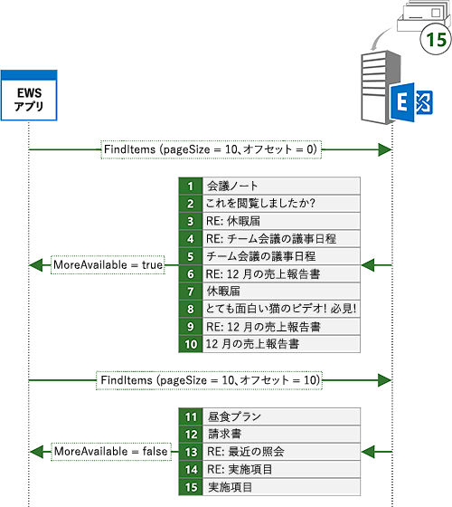
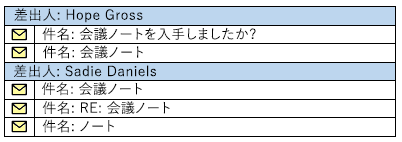

# <a name="search-and-ews-in-exchange"></a>Exchange の検索と EWS

EWS マネージ API または EWS を使用して、Exchange でアイテムを検索する方法を確認します。
  
次のような流れを経験したことはないでしょうか。数週間先延ばしにしていたあるプロジェクトをやっと開始しようとしたときに、上司から数週間前にメールで受け取った、プロジェクトに関する情報が必要になりました。受信トレイには数百またはおそらく数千ものメッセージがあります。どうしますか。その情報が見つかるまで、メールをスクロールして各件名と送信者のスキャンしますか。または、好みのメール クライアント検索機能を使用して、必要な情報に的を絞りますか。
  
検索は、ほぼ間違いなくすべてのメール クライアントに備わっている機能です。しかし、検索はユーザーがただ自分のメールボックスを検索できるようにするためのものではありません。特定の期間に含まれる予定をアプリで処理する必要がありますか。特定のステータスのすべてのタスク アイテムについてレポートしたり、特定の会社名を含むすべての連絡先を別のフォルダーに移動したりする必要があるかもしれません。検索によって、これらのすべての要件を満たすことができます。
  
## <a name="search-basics"></a>検索の基本
<a name="bk_SearchBasics"> </a>

EWS のマネージ API と EWS は、検索を指定するための 2 つの基本的な方法を提供します。 [検索フィルター](how-to-use-search-filters-with-ews-in-exchange.md)または[クエリ文字列](how-to-perform-an-aqs-search-by-using-ews-in-exchange.md)を使用することができます。 使用する方法は、検索の背後にある意図によって異なります。
  
**表 1 です。検索フィルターと検索クエリのシナリオ**

|**目的…**|**使用する.**|**メモ**|
|:-----|:-----|:-----|
|検索を特定のプロパティまたはプロパティのセットに限定する  <br/> |検索フィルター  <br/> |検索フィルターは、プロパティの検索を最も良く制御できます。クエリ文字列では、高度な検索テクニック (AQS) を使用して限定されたプロパティのセットをターゲットにすることができます。検索フィルターでは任意のプロパティをターゲットにすることができます。  <br/> |
|複数の条件で検索を作成する  <br/> |検索フィルター  <br/> |検索フィルターでは、論理 AND または OR を使用して複数の検索条件を結合でき、「件名に '会議ノート' が含まれる、および送信者が 'Sadie Daniels' に等しい」のような検索が可能になります。クエリ文字列では複数の検索条件を結合することもできますが、検索はクエリ文字列でサポートされているプロパティのセットに限定されます。  <br/> |
|カスタム プロパティの検索  <br/> |検索フィルター  <br/> |検索フィルターは、カスタム プロパティをターゲットにすることができます。クエリ文字列は、カスタム プロパティを検索しません。  <br/> |
|文字列プロパティの大文字と小文字を区別する検索を実行する  <br/> |検索フィルター  <br/> |クエリ文字列では大文字と小文字は区別されません。  <br/> |
|文字列プロパティを検索するときに含有モードを制御する  <br/> |検索フィルター  <br/> |クエリ文字列の検索は常に、部分文字列の検索になります。特定のプレフィックスを検索する場合や、完全一致が必要な場合は、検索フィルターを使用することをお勧めします。  <br/> |
|フォルダーを検索する  <br/> |検索フィルター  <br/> |EWS では、クエリ文字列によるフォルダーの検索はサポートされていません。  <br/> |
|検索フォルダーを作成する  <br/> |検索フィルター  <br/> |EWS では、クエリ文字列による検索フォルダーの作成はサポートされていません。  <br/> |
|一般的に使用されるすべてのプロパティを検索する  <br/> |クエリ文字列  <br/> |AQS が含まれていないクエリ文字列は、一般的に使用されるすべてのプロパティを検索します。たとえば、クエリ文字列値が「Mack Chaves」である場合、Mack Chaves によって送信されたすべてのメッセージ、および本文または件名に「Mack Chaves」が含まれるすべてのメッセージが返されます。  <br/> |
|単純なユーザー入力に基づいた検索を作成する  <br/> |クエリ文字列  <br/> |クエリ文字列は、エンド ユーザーが単純な文字列を入力してクイック検索を実行するための最適な選択肢です。クエリ文字列の検索には、一般的に使用されるすべてのプロパティが含まれるため、ユーザーの検索語句を含むすべてのアイテムが結果に含まれます。  <br/> |
   
### <a name="using-a-search-filter"></a>検索フィルターの使用

検索フィルターでは、さまざまな検索オプションを使用し、検索の実行方法を最高度に制御できます。検索フィルターを使用して、基本的な等値検索と比較検索を実行できますが、さらに、文字列プロパティの内容を検索したりビットマスクの比較を実行することも可能です。
  
たとえば、EWS のマネージ API で[SearchFilter.ContainsSubstring](http://msdn.microsoft.com/en-us/library/microsoft.exchange.webservices.data.searchfilter.containssubstring%28v=exchg.80%29.aspx)クラスを使用して、アイテムの件名の内容を検索できます。 この例では、大文字と小文字を無視して、部分文字列「会議メモ」の件名を検索する検索フィルターが作成されます。 
  
```cs
SearchFilter.ContainsSubstring subjectFilter = new SearchFilter.ContainsSubstring(ItemSchema.Subject,
    "meeting notes", ContainmentMode.Substring, ComparisonMode.IgnoreCase);
```

カスタム プロパティに対して検索することもできます。 この例では、3 より大きい値は**ItemIndex**のユーザー設定のプロパティが検索されます。 
  
```cs
Guid MyAppGuid = new Guid("{AA3DF801-4FC7-401F-BBC1-7C93D6498C2E}");
ExtendedPropertyDefinition customPropDefinition =
    new ExtendedPropertyDefinition(MyAppGuid, "ItemIndex", MapiPropertyType.Integer); 
SearchFilter.IsGreaterThan customPropFilter =
    new SearchFilter.IsGreaterThan(customPropDefinition, 3);
```

複雑な検索を作成するのには複数の検索フィルターを組み合わせることもできます。 たとえば、 [SearchFilter.SearchFilterCollection](http://msdn.microsoft.com/en-us/library/microsoft.exchange.webservices.data.searchfilter.searchfiltercollection%28v=exchg.80%29.aspx)クラスを使用して論理 AND で前の 2 つのフィルターを組み合わせることができます。 
  
```cs
SearchFilter.SearchFilterCollection compoundFilter =
    new SearchFilter.SearchFilterCollection(LogicalOperator.And, subjectFilter, customPropFilter);
```

### <a name="using-a-query-string"></a>クエリ文字列の使用

クエリ文字列を検索する別の方法を提供します。 検索されるフィールドとクエリ文字列の検索を使用する場合に、検索を実行する方法があります。 ありませんが悪いことである! 場合によっては、幅の広いネットワークでは、ためのいわばキャストすることがあります。
  
たとえば、「会議ノート」の[ExchangeService.FindItems](http://msdn.microsoft.com/en-us/library/jj223808%28v=exchg.80%29.aspx) EWS 管理 API メソッドを使用して検索できます。 
  
```cs
FindItemsResults<Item> results = service.FindItems(folder, "meeting notes", view);
```

**SearchFilter.ContainsSubstring**検索の例を前の結果には、この検索の結果を比較すると、この検索によりより多くの結果が含まれます。 検索フィルター検索はこの検索は、件名、本文、およびその他のフィールドに「会議ノート」の項目を返すときに、件名に「会議ノート」を持っているアイテムのみを返します。 
  
クエリ文字列を調整して、検索フィルターの結果に近くなる、絞り込み方法を見てみましょう。AQS を使用すると、検索を件名に制限することができます。
  
```cs
FindItemsResults<Item> results = service.FindItems(folder, "subject:meeting notes", view);
```

これでかなり近くなりますが、結果はまだ同じではありません。複数の文字が含まれるクエリ文字列を使用すると、それらの単語が指定した順序どおりでない場合や、それらの単語が隣接していない場合でも、一致となります。クエリ文字列「subject:meeting notes」を使用すると、「meeting notes」、「notes from the meeting」が一致となります。さらに絞り込むには、検索用語を二重引用符で囲み、その語句だけを指定することができます。
  
```cs
FindItemsResults<Item> results = service.FindItems(folder, "subject:\"meeting notes\"", view);
```

## <a name="requesting-specific-properties-in-search-results"></a>検索結果で特定のプロパティを要求する
<a name="bk_RequestSpecific"> </a>

既定では、検索結果に検索条件に一致する項目のすべてのプロパティが含まれます。 いくつかの場合がありますたいが、ほとんどの場合アプリケーションだけで必要なプロパティの個別のセットです。 この例では、アプリケーションのプロパティだけに返されるプロパティのセットを制限する必要があります必要があります。 、件名に返されるプロパティを制限するのには次の例では、 [ItemView](http://msdn.microsoft.com/en-us/library/microsoft.exchange.webservices.data.itemview%28v=exchg.80%29.aspx)クラスが使用される日付と時刻を受信すると、およびアイテムの ID です。 
  
```cs
ItemView view = new ItemView(10);
// Creating a new PropertySet with this constructor includes 
// ItemSchema.Id.
view.PropertySet = new PropertySet(ItemSchema.Subject, ItemSchema.DateTimeReceived);
```

## <a name="controlling-search-depth"></a>検索の深さの制御
<a name="bk_SearchDepth"> </a>

ビュー上で走査の設定をすることによって、検索の範囲と深さを制御します。  
  
**表 2 になります。検査値の検索**

|**検査値**|**適用されます。**|**説明**|
|:-----|:-----|:-----|
|浅い  <br/> |アイテムとフォルダー  <br/> |浅い検索は、検索対象フォルダーの直接の子に制限されます。  <br/> |
|深い  <br/> |アイテム (検索フォルダーのみ) とフォルダー  <br/> |深い検索は、検索対象のフォルダーとサブフォルダーを再帰的に検索します。  <br/> |
|関連  <br/> |アイテム  <br/> |関連検索には、検索対象のフォルダーの関連アイテムだけが含まれます。関連アイテムは、フォルダー内にある非表示のアイテムです。  <br/> |
|削除済み (回復可能)  <br/> |アイテムとフォルダー  <br/> |この走査型の使用は推奨されていません。 SoftDeleted の検索に含まれる項目にはのみが含まれます、ごみ箱をあさる。 ごみ箱をあさる、Office 365 の一部のバージョンの Exchange が Exchange 2010 で始まると、Exchange Online では、[回復可能なアイテム] フォルダー](http://technet.microsoft.com/en-us/library/ee364755%28v=exchg.150%29.aspx(Office.15).aspx)を Exchange Online に置き換えられました。  <br/> |
   
## <a name="managing-search-results"></a>検索結果の管理
<a name="bk_ManageSearchResults"> </a>

EWS マネージ API および EWS では、検索結果が返される方法を変更することもできます。ビューを使用することによって、結果に含めるプロパティを指定し、結果を並べ替え、結果をページングして応答ごとに取得する結果を設定した数だけにできます。特定のフィールド値で結果をグループ化したり、走査の種類を指定して検索の深さを制御したりすることもできます。最後に、検索フォルダーを使用して、新しいアイテムが到着したときに動的に更新される永続的な検索を作成することができます。
  
### <a name="sorting"></a>並べ替え

並べ替えられた結果を返すようにサーバーを設定できます。これによって、より簡単にアイテムを順番に表示または処理することができます。この例では、結果は、受信した日時に基づいて最新のアイテムが最初になるように並べ替えられます。
  
```cs
view.OrderBy.Add(ItemSchema.DateTimeReceived, SortDirection.Descending);
```

### <a name="paging"></a>ページング

EWS のマネージ API または EWS を使用して、検索要求を送信すると、返されるアイテムの最大数を制御する、ビューのサイズを指定します。 ただし、サーバー上の検索条件に一致するアイテムの数は、ビューのサイズを超える可能性があります。 この例では、サーバーでは、他のアイテムがあることを示します。 [検索を繰り返すにページングを使用](how-to-perform-paged-searches-by-using-ews-in-exchange.md)することができ、次の結果セットを取得します。 
  
たとえば、表示サイズが 10 の検索要求を送信できます。 、検索条件に一致するサーバー上の 15 の項目がある可能性がありますが、のみが表示されます戻ると共に、最初の 10 ( [FindItemsResults\<TItem\>。MoreAvailable](http://msdn.microsoft.com/en-us/library/dd635477%28v=exchg.80%29.aspx)プロパティは、EWS のマネージ API を使用している場合)、サーバー上でより多くの結果があること。 検索条件に一致する次の 10 項目を要求する 10 のオフセットと同じ検索を送信できます。 残りの 5 つの項目が返されます。 
  
**図 1 です。ページ単位の検索の例**


  
### <a name="grouping"></a>グループ化

  Exchange では、特定のフィールドで検索結果をグループ化できます。これにより、検索結果を管理可能なセットに分割することができます。たとえば、「meeting notes」を検索した結果を、送信者別にグループ化できます。次の図に示されているように、返されたアイテムは複数のグループに分けられます。条件に一致するアイテムで同じ送信者からのものはすべて 1 つのグループに、条件に一致するアイテムで別の送信者からのものはすべて別のグループに、というように分けられます。 
  
**図 2 になります。送信者によってグループ化された検索結果**


  
## <a name="search-folders"></a>検索フォルダー
<a name="bk_SearchFolders"> </a>

通常の検索では、検索が実行されると、結果は処理用にアプリケーションに返され、検索は存在しなくなります。検索フォルダーは、検索を永続的なものにする方法を提供します。これは、検索を複数回実行することがわかっている場合の優れたオプションです。同じ検索を繰り返し実行してサーバーで毎回最初から検索を評価するのではなく、検索フォルダーでは検索を常にオンにします。これにより、アイテムが検索範囲に追加されたり、検索範囲から削除されたりしたときに、サーバーは既存の結果セットを更新できます。検索フォルダーは、アイテムが含まれるフォルダーとして表示されるという意味で、通常のフォルダーと同じように動作します。違いは、フォルダーに含まれるアイテムだけが、フォルダーに関連付けられている検索条件に一致するということです。検索フォルダーが作成されると、アプリケーションは、フォルダーの内容を確認するだけで検索の最新結果を取得できます。
  
検索フィルターの作成方法をすでに習得していれば、検索フォルダーを作成するのは簡単です。次の例では、件名に「meeting notes」が含まれるすべてのメールを表示する検索フォルダーが作成されます。
  
```cs
static void CreateSearchFolder(ExchangeService service)
{
    SearchFilter.ContainsSubstring subjectFilter = new SearchFilter.ContainsSubstring(ItemSchema.Subject,
        "meeting notes", ContainmentMode.Substring, ComparisonMode.IgnoreCase);
    SearchFolder searchFolder = new SearchFolder(service);
    searchFolder.DisplayName = "Meeting Notes";
    searchFolder.SearchParameters.RootFolderIds.Add(WellKnownFolderName.Inbox);
    searchFolder.SearchParameters.Traversal = SearchFolderTraversal.Deep;
    searchFolder.SearchParameters.SearchFilter = subjectFilter;
    searchFolder.Save(WellKnownFolderName.SearchFolders);
}
```

## <a name="in-this-section"></a>このセクションの内容
<a name="bk_InThisSection"> </a>

- [EWS を使って Exchange 検索フィルターを使用します。](how-to-use-search-filters-with-ews-in-exchange.md)
    
- [EWS を使用して Exchange、AQS 検索を実行します。](how-to-perform-an-aqs-search-by-using-ews-in-exchange.md)
    
- [Exchange EWS を使用してページ検索を実行します。](how-to-perform-paged-searches-by-using-ews-in-exchange.md)
    
- [EWS を使用して Exchange によってグループ化された検索を実行します。](how-to-perform-grouped-searches-by-using-ews-in-exchange.md)
    
- [EWS を使用して Exchange で検索フォルダーを使用します。](how-to-work-with-search-folders-by-using-ews-in-exchange.md)
    
## <a name="see-also"></a>関連項目


- [Exchange の Web サービス クライアントを開発する](develop-web-service-clients-for-exchange.md)
    
- [回復可能な項目] フォルダー](http://technet.microsoft.com/en-us/library/ee364755%28v=exchg.150%29.aspx(Office.15).aspx)
    
- [ExchangeService.FindItems](http://msdn.microsoft.com/en-us/library/microsoft.exchange.webservices.data.exchangeservice.finditems%28v=exchg.80%29.aspx)
    
- [EWS に影響するスロットルのポリシー パラメーターの操作を検索します。](ews-throttling-in-exchange.md#bk_ThrottlingSearch)
    

