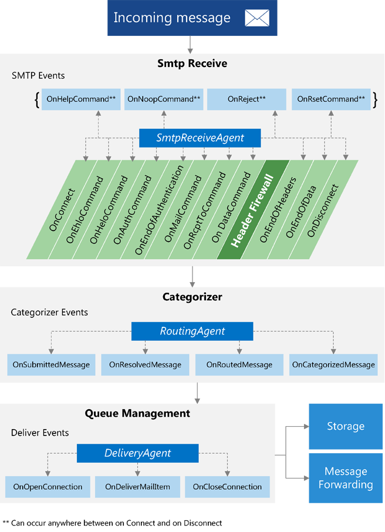
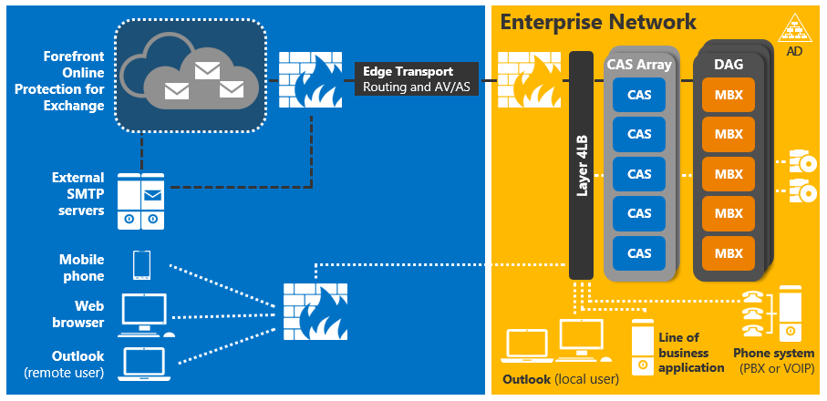
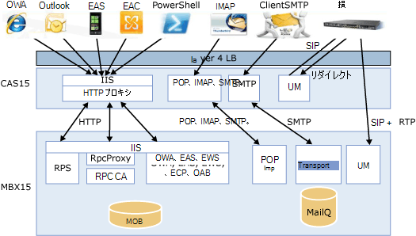

# Exchange 2013 におけるトランスポート エージェントの概念

トランスポート エージェントのパイプラインとサーバーの役割のアーキテクチャでは、Exchange 2013 に与える影響について、トランスポート エージェントの開発とトランスポート エージェントの開発に使用できるクラスについての情報を検索します。 
  
**に適用されます:** Exchange Server 2013 
  
イベントを登録して、トランスポート パイプラインを通過するときに、メッセージに対してアクションを実行するトランスポート エージェントを実装するために Exchange Server 2013 で提供されるクラス ライブラリを使用できます。 トランスポート エージェントは、メッセージを変更し、コンテンツの変換にも使用できます。 
  
この資料では、トランスポート エージェントについての情報とトランスポート パイプラインのアーキテクチャを提供します。 組織のニーズに対応するトランスポートの動作を変更するように、トランスポート パイプラインのアーキテクチャを理解する重要です。 この資料では、トランスポート エージェントに影響を及ぼす Exchange 2013 のアーキテクチャやトランスポート エージェントの開発に使用できるクラスの変更に関する情報も提供します。 
  
## トランスポート パイプライン内のトランスポート エージェント

トランスポート エージェントは、次に示す 3 つのクラスのいずれかから派生します。
  
- [SmtpReceiveAgent](https://msdn.microsoft.com/library/Microsoft.Exchange.Data.Transport.Smtp.SmtpReceiveAgent.aspx)
- [RoutingAgent](https://msdn.microsoft.com/library/Microsoft.Exchange.Data.Transport.Routing.RoutingAgent.aspx)
- [DeliveryAgent](https://msdn.microsoft.com/library/Microsoft.Exchange.Data.Transport.Delivery.DeliveryAgent.aspx)
    
トランスポート パイプラインとは、Exchange 2013 組織の境界内でのメッセージ データの流れのことを意味します。パイプラインは、次の表に示したサービスによって成立します。
  
**表 1 です。トランスポート パイプライン サービス**

|**サービス**|**説明**|**サポートされているクラス**|
|:-----|:-----|:-----|
|フロント エンド トランスポート     |すべての[クライアント アクセス サーバー](http://technet.microsoft.com/en-us/library/dd298114%28v=exchg.150%29.aspx)上で実行し、すべて受信および送信外部 SMTP トラフィックを Exchange 2013 組織のステートレス プロキシとして機能します。 フロント エンド トランスポート サービスは、メッセージ コンテンツを検査またはキューにメッセージをローカルでは。 これは、[メールボックス サーバー](http://technet.microsoft.com/en-us/library/jj150491%28v=exchg.150%29.aspx)上のトランスポート サービスと通信します。    |[SmtpReceiveAgent](https://msdn.microsoft.com/library/Microsoft.Exchange.Data.Transport.Smtp.SmtpReceiveAgent.aspx)   |
|Transport    |すべてのメールボックス サーバーで実行し、Exchange Server 2010 の[ハブ トランスポート サーバー](http://technet.microsoft.com/en-us/library/bb123494%28v=exchg.141%29.aspx)の役割に似ています。 トランスポート サービスは、それ自体と、メールボックス トランスポート サービスとフロント エンド トランスポート サービス間のメッセージをルーティングします。 このサービスはメールボックス データベースと直接通信しません。    |[SmtpReceiveAgent](https://msdn.microsoft.com/library/Microsoft.Exchange.Data.Transport.Smtp.SmtpReceiveAgent.aspx)   [RoutingAgent](https://msdn.microsoft.com/library/Microsoft.Exchange.Data.Transport.Routing.RoutingAgent.aspx)   [DeliveryAgent](https://msdn.microsoft.com/library/Microsoft.Exchange.Data.Transport.Delivery.DeliveryAgent.aspx)   |
|メールボックス トランスポート    |すべてのメールボックス サーバー上で実行され、2 つの独立したサービスで構成されています: メールボックス トランスポートの送信およびメールボックス トランスポート配信します。 メールボックス トランスポート配信では、トランスポート サービスから SMTP メッセージを受信し、メッセージを配信するのには、Exchange リモート プロシージャ コール (RPC) を使用してメールボックス データベースに接続します。 メールボックス トランスポートの送信は、メッセージを取得するために RPC を使用してメールボックス データベースに接続し、SMTP 経由でトランスポート サービスにメッセージを送信します。    |なし    |
   
### トランスポート イベント

トランスポート エージェントは、まずイベントを登録して、そのイベントが発生したときにアクションを起こすことで実装します。3 種類のそれぞれのエージェントで、異なるイベントのセットを登録できます。
  
次の図は、トランスポート エージェントがトランスポート パイプラインのどの部分でイベントを登録できるかを示しています。
  
**図 1 です。トランスポート イベント**

  
メッセージがトランスポート パイプラインに入る、 [SmtpReceiveAgent](https://msdn.microsoft.com/library/Microsoft.Exchange.Data.Transport.Smtp.SmtpReceiveAgent.aspx)クラスから派生したトランスポート エージェントは、任意のエージェントが登録されている SMTP イベントの中にメッセージで動作できます。 [RoutingAgent](https://msdn.microsoft.com/library/Microsoft.Exchange.Data.Transport.Routing.RoutingAgent.aspx)クラスから派生したエージェントの登録されている 4 つのカテゴライザー イベントのいずれかで動作します。 [DeliveryAgent](https://msdn.microsoft.com/library/Microsoft.Exchange.Data.Transport.Delivery.DeliveryAgent.aspx)クラスから派生したエージェントは、メッセージの配信イベントを登録したことのいずれかの中に動作できます。 
  
## トランスポート エージェントとサーバーの役割

サーバーの役割のアーキテクチャを変更 Exchange 2013 に影響を与えるトランスポート エージェントおよびトランスポート エージェントが行うことができます。 Exchange 2013 には、次のサーバーの役割が含まれています。
  
- メールボックス サーバーなどを含むクライアント アクセス プロトコル、トランスポート サービス、メールボックス データベース、およびユニファイド メッセージングのコンポーネントです。 メールボックス サーバーは、Active Directory ドメイン サービス (AD DS)、クライアント アクセス サーバー、および Outlook などのメール クライアントと直接通信します。
    
- クライアント アクセス サーバー: 認証、制限付きリダイレクト、プロキシ サービス、およびクライアント アクセス プロトコル (HTTP、POP、IMAP、SMTP など) を提供します。
    
- エッジ トランスポート サーバー: 電子メールを組織の内外にルーティングします。エッジ トランスポート サーバーは、通常、Exchange トポロジの境界に配置されます。
    
この統合の構造体には、Exchange 2013 環境内に展開する必要のあるサーバーの数が減少します。 管理者が不要になったが、メールボックス サーバーを含むすべての Active Directory サイト内のハブ トランスポート サーバーとクライアント アクセス サーバーを展開して、新しい機能を利用するためにすべてのサーバー ロールを更新する必要がなくなりました。
  
これらの変更をサーバーの役割のアーキテクチャに影響を与える可能性、パイプライン内のエージェント イベントに応答できます。 Exchange 2013 より前のバージョンの Exchange のトランスポート エージェントを作成した場合、エージェントを変更する必要があるかどうかを判断するのにはアーキテクチャの変更を確認することを確認します。
  
次の図は、Exchange 2013 のアーキテクチャ上の変更点が、どのようにトランスポート パイプラインを合理化および統合化しているかについて示しています。この図では、クライアント アクセス サーバーに「CAS」というラベルが付けられています。また、メールボックス サーバーには「MBX」というラベルが付けられています。
  
**図 2 になります。Exchange 2013 サーバーの役割のアーキテクチャ**

  
次の図では、Exchange 2013 サーバーの役割間の相互作用を示します。
  
**図 3 です。メールボックスおよびクライアント アクセス サーバー間のやり取り**

  
Exchange 2013 サーバーの役割のアーキテクチャの変更の詳細については、 [what ' s New Exchange 2013](http://technet.microsoft.com/en-us/library/jj150540%28v=exchg.150%29.aspx)では、 [Exchange 2013 のアーキテクチャ](http://technet.microsoft.com/en-us/library/jj150540%28v=exchg.150%29.aspx#BKMK_Arch)を参照してください。 
  
## トランスポート エージェントのクラス

カスタムのトランスポート エージェントの派生元クラスにより、そのエージェントで登録できるイベントが決まります。通常、カスタムのエージェントには、1 つのエージェント クラス、1 つのエージェント ファクトリ、1 つ以上のイベント ハンドラー、およびエージェントで処理するアクションを実行するコードが含まれています。
  
次の表は、それぞれのエージェントの種類の派生元になるクラスを示しています。
  
**表 2 になります。エージェント クラス**

||||
|:-----|:-----|:-----|
|エージェントの種類    |ファクトリの基底クラス    |エージェントの基底クラス    |
|SMTP の受信    |[SmtpReceiveAgentFactory](https://msdn.microsoft.com/library/Microsoft.Exchange.Data.Transport.Smtp.SmtpReceiveAgentFactory.aspx)   |[SmtpReceiveAgent](https://msdn.microsoft.com/library/Microsoft.Exchange.Data.Transport.Smtp.SmtpReceiveAgent.aspx)   |
|ルーティング    |[RoutingAgentFactory](https://msdn.microsoft.com/library/Microsoft.Exchange.Data.Transport.Routing.RoutingAgentFactory.aspx)   |[RoutingAgent](https://msdn.microsoft.com/library/Microsoft.Exchange.Data.Transport.Routing.RoutingAgent.aspx)   |
|配信    |[DeliveryAgentFactory\<マネージャー\>](https://msdn.microsoft.com/library/Microsoft.Exchange.Data.Transport.Delivery.DeliveryAgentFactory`1.aspx)   |[DeliveryAgent](https://msdn.microsoft.com/library/Microsoft.Exchange.Data.Transport.Delivery.DeliveryAgent.aspx)   |
   
これらのファクトリとエージェントの基本クラスは、プロパティとイベントのトランスポートとメッセージにアクセスするために使用できるメソッドを提供します。 これらのクラスから継承する、エージェントでは、クラスを実装します。 エージェント ファクトリの派生クラスで、エージェント クラスの新しいインスタンスを返すことができるように、 **CreateAgent**メソッドをオーバーライドします。 
  
イベントに渡される引数は、プロパティと、基になるメッセージの内容を変更するのにを使用することができる[なか](https://msdn.microsoft.com/library/Microsoft.Exchange.Data.Transport.Email.EmailMessage.aspx)クラスのインスタンスを含めることができます。 メッセージのすべての情報は、各イベントで使用できます。 どのエージェントを決定する必要があり、どのイベントが実行するタスクに最適です。 
  
次に示す名前空間には、トランスポート パイプライン内のメッセージを読み取り、書き込み、および変更するために使用できる型が含まれています。
  
- [Microsoft.Exchange.Data.Mime.Encoders](https://msdn.microsoft.com/library/Microsoft.Exchange.Data.Mime.Encoders.aspx)
    
- [Microsoft.Exchange.Data.ContentTypes.iCalendar](https://msdn.microsoft.com/library/Microsoft.Exchange.Data.ContentTypes.iCalendar.aspx)
    
- [Microsoft.Exchange.Data.Mime](https://msdn.microsoft.com/library/Microsoft.Exchange.Data.Mime.aspx)
    
- [Microsoft.Exchange.Data.ContentTypes.Tnef](https://msdn.microsoft.com/library/Microsoft.Exchange.Data.ContentTypes.Tnef.aspx)
    
- [Microsoft.Exchange.Data.ContentTypes.vCard](https://msdn.microsoft.com/library/Microsoft.Exchange.Data.ContentTypes.vCard.aspx)
    
後[インストールしエージェントを管理する](http://technet.microsoft.com/en-us/library/bb125175%28v=exchg.150%29.aspx)Exchange 管理シェルを使用して、トランスポート エージェントを作成します。 詳細については、 [Exchange 2013 のトランスポート エージェントを作成する](creating-transport-agents-for-exchange-2013.md)を参照してください。 
  
## 関連項目

- [Exchange のトランスポート エージェント](transport-agents-in-exchange-2013.md)    
- [Exchange 2013 のトランスポート エージェントのリファレンス](transport-agent-reference-for-exchange-2013.md)   
- [読み取りおよび Exchange 2013 のトランスポート パイプライン内のメッセージを変更します。](reading-and-modifying-messages-in-the-exchange-2013-transport-pipeline.md)    
- [Exchange 2013 の新機能](http://technet.microsoft.com/en-us/library/jj150540%28v=exchg.150%29.aspx)   
- [Exchange 2013 サーバーの役割のアーキテクチャ](http://blogs.technet.com/b/exchange/archive/2013/01/23/exchange-2013-server-role-architecture.aspx)    
- [メールボックスおよびクライアント アクセス サーバー](http://technet.microsoft.com/en-us/library/jj150519%28v=exchg.150%29.aspx)   
- [Exchange Server 2013 のメールの流れ](http://technet.microsoft.com/en-us/library/aa996349.aspx)
- [Exchange Server 2013年のメールのルーティング](http://technet.microsoft.com/en-us/library/aa998825%28v=exchg.150%29.aspx)   
- [Exchange Server PowerShell (Exchange 管理シェル)](https://docs.microsoft.com/en-us/powershell/exchange/exchange-server/exchange-management-shell?view=exchange-ps)
    

